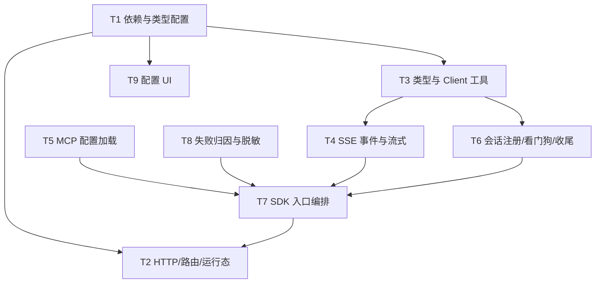

# OpenCode SDK 执行引擎接入 - 任务分解

> **来源**：`/kb-plan`（基于 `01-proposal.md`、`02-design.md`）
> **任务数**：9（T1、T5、T8、T3、T4、T6、T7、T2、T9）
> **依赖图与分组调度**：见「一、执行计划」；每条 `T{n}` 自包含，子 agent 只读该 `T{n}` + 上下文文件即可开工，不应回读 `02-design.md`。

## 一、执行计划

### （一）依赖图

**依赖说明**：

- T1（依赖 + 类型/配置）为地基，被 T2/T3/T9 依赖。
- T5、T8 独立无前置，第一轮并行，供 T7 直接 import。
- T3 → T4 / T3 → T6 为同层并行，文件集无交集。
- T7 汇聚 T3/T4/T5/T6/T8 后，T2 才能注册 HTTP handler 与路由。
- T9 仅依赖 T1，与 T3 第二轮可并行。

### （二）分组调度

- **第一轮（并行）**：T1、T5、T8
  - T1：`package.json` + `channel-types.ts`/`preload.ts`/`env.d.ts`/`config-store.ts`（rebase Codex 先行落点注释处）。
  - T5：`opencode-mcp-loader.ts`（全新文件）。
  - T8：`opencode-failure-messages.ts`（全新文件）。
- **第二轮（并行）**：T3、T9
  - T3：`agent-opencode-types.ts` + `agent-opencode-utils.ts`（依赖 T1）。
  - T9：UI 四文件（依赖 T1）；与 T3 无文件交集。
- **第三轮（并行）**：T4、T6
  - T4：`agent-opencode-events.ts` + `agent-opencode-stream.ts`（依赖 T3）。
  - T6：`agent-opencode-session-registry.ts` + `agent-opencode-watchdog.ts` + `agent-opencode-complete.ts`（依赖 T3）。
- **第四轮**：T7
  - `agent-opencode-sdk.ts` 入口编排 + handler 注册 + 共享生命周期复用（依赖 T3/T4/T5/T6/T8）。
- **第五轮**：T2
  - `agent-opencode-http.ts` + `session-dispatcher.ts` + `agent-sdk.ts` + `initSessionDispatcher`/`daemon-manager.ts` + 内嵌 server 退出清理（依赖 T1、T7）。

**串行约束（冲突文件唯一写入者）**：

- T3 → T4 / T3 → T6：无共写；T7 独占 `agent-opencode-sdk.ts`。
- T7 → T2：T2 的 handler 注册须 T7 的 `launchOpencodeAgent`/`dispatchToOpencodeAgent` 就绪。
- `session-dispatcher.ts`/`agent-sdk.ts` 仅 T2 写入 opencode 分支；T1 已写入 type/config 区域。

## 二、任务清单

## T1: 依赖与类型配置扩展

### 背景

为 OpenCode SDK 引擎接入打地基：在 `package.json` 引入 `@opencode-ai/sdk`，扩展 `AgentResource.type` 联合类型纳入 `"opencode"` 及 OpenCode Profile 专用字段，同步 `engineType`，并在 `config-store` 增加 `newOpencodeResourceId`/`isOpencodeResourceId` 与 `findFirstRunnableResource` 的 opencode 兜底。本任务是整个变更的类型与配置前置，须在 Codex 已标注的 rebase 注释处按同模式扩展。

### 上下文文件

- CodeGraph: `AgentResource` / `findFirstRunnableResource` / `newCodexResourceId` — 定位资源模型 SSOT 与配置兜底模板（CodeGraph 已核实：`channel-types.ts:5`、`config-store.ts:136/170`）。
- 必读: `package.json` — 新增 `@opencode-ai/sdk` 依赖。
- 必读: `src/shared/channel-types.ts:5` — 资源模型 SSOT；注释「待 OpenCodeSDK 接入」处扩 type 与 OpenCode 字段。
- 必读: `electron/preload.ts:6` — type 联合与 engineType 同步点。
- 必读: `src/renderer/env.d.ts:13` — type 联合与 `getSessionAgents` engineType 同步点。
- 必读: `electron/config-store.ts:135` — `findFirstRunnableResource` 兜底链；仿 `newCodexResourceId`/`isCodexResourceId`。
- 参考: [OpenCode SDK 官方文档](https://opencode.ai/docs/sdk/) — 安装与 Client API 概览。

### 实现范围

- 修改: `package.json` — 添加 `@opencode-ai/sdk` 依赖（回溯 S19）。
- 修改: `src/shared/channel-types.ts` — `type` 扩 `"opencode"`；`id` 注释加 `opencode_<hex>`；新增仅 `type==="opencode"` 使用的可选字段：`deployMode`（`"embedded"|"external"`）、`opencodeHostname?`、`opencodePort?`、`baseUrl?`、`providerId`、`model?`（`providerID/modelID` 或拆分约定与 02 §五一致）。
- 修改: `electron/preload.ts` — type 联合与 `engineType`（含 `getSessionAgents` 回调类型）扩 `"opencode"`。
- 修改: `src/renderer/env.d.ts` — 同上两处同步。
- 修改: `electron/config-store.ts` — 新增 `newOpencodeResourceId(): string`（返回 `"opencode_<hex>"`）、`isOpencodeResourceId(id): boolean`；`findFirstRunnableResource` 链式兜底加 opencode（sdk → claude-code → codex → opencode）；`launchAgent` 绑定校验仿 codex：`isOpencodeResourceId(boundId)` 且 Profile 已删时返回明确错误文案。
- **可能冲突文件**: 上述四文件为本变更先行落点；与 Codex 变更已合并处按注释扩展，勿删 codex 分支。

### 接口契约

- `AgentResource.type: "sdk" | "claude-code" | "codex" | "opencode"` — 三处 type + 两处 engineType 同步。
- OpenCode Profile 字段（仅 `type==="opencode"`）：`deployMode`、`opencodeHostname?`、`opencodePort?`、`baseUrl?`、`providerId`、`apiKey`、`model?`、`name`。
- `newOpencodeResourceId(): string` — 返回 `"opencode_<hex>"`。
- `isOpencodeResourceId(id: string): boolean` — 删除拦截与绑定校验。
- `findFirstRunnableResource(): AgentResource | null` — 兜底链含 opencode。

### 验收标准

- [ ] `package.json` 含 `@opencode-ai/sdk`，`npm install` 可解析（01 §F1；02 步骤 1）。
- [ ] `AgentResource.type` 联合含 `"opencode"`，channel-types/preload/env.d 三处 type 与两处 engineType 全部同步（01 验收 7、8）。
- [ ] OpenCode Profile 字段可持久化读写（deployMode/providerId/apiKey/model 等）（01 验收 7、8）。
- [ ] `newOpencodeResourceId` 生成 `opencode_<hex>` 唯一 id（01 验收 8）。
- [ ] `findFirstRunnableResource` 在无 sdk/cc/codex 时回退 opencode（01 验收 4 切换回退不破坏）。
- [ ] 现有 sdk/claude-code/codex 路径不受影响，TS 编译通过（01 验收 4）。
- [ ] 无 `02`/`03` 未要求的抽象层、trait/mixin 中间层或未批准的新依赖（Ponytail 口径）。

### 依赖

- 前置任务: 无
- 后续任务: T2、T3、T9

## T5: MCP 配置加载

### 背景

为 OpenCode 引擎加载 MCP 工具配置，与 Codex/CC 路径对等。读 `opencode.json` 与项目级配置，仿 `codex-mcp-loader.ts`，供 T7 入口在 `session.create`/`session.prompt` 前注入 inline config。承担 F2 MCP 对等（02 S12）。

### 上下文文件

- CodeGraph: `readCodexMcpServers` / `codex-mcp-loader` — MCP 加载模板（`electron/codex-mcp-loader.ts`）。
- 必读: `electron/codex-mcp-loader.ts` — 结构模板。
- 必读: `electron/cc-mcp-loader.ts` — 合并/注入模式参考。
- 参考: [OpenCode SDK 文档](https://opencode.ai/docs/sdk/) — config 与 MCP 配置形态。
- 参考: T7 将调用 `loadOpencodeMcpServers` 注入会话。

### 实现范围

- 新建: `electron/opencode-mcp-loader.ts` — `readOpencodeMcpServers`（读用户级 `opencode.json` + 项目级配置）、`mergeMcpJsonEntries`、`appendInlineMcpToOpencodeConfig`；输出供 `launchOpencodeAgent` 注入 `createOpencode`/`session.create` body。
- **可能冲突文件**: 无（全新文件）。

### 接口契约

- `readOpencodeMcpServers(workspaceDir?: string): McpServerEntry[]` — 读 OpenCode MCP 配置。
- `mergeMcpJsonEntries(...entries): McpServerEntry[]` — 多源合并。
- `appendInlineMcpToOpencodeConfig(config, servers): OpencodeInlineConfig` — 注入 inline MCP。

### 验收标准

- [ ] 正确读取 `opencode.json` 与项目级 MCP 并合并（01 验收 1 F2 对等含工具调用）。
- [ ] 与 `codex-mcp-loader` 行为对等，不引入 `EngineAdapter` 等新抽象（Ponytail 口径）。
- [ ] 文件 <300 行，代码含中文注释。
- [ ] 无 `02`/`03` 未批准的新依赖。

### 依赖

- 前置任务: 无
- 后续任务: T7

## T8: 失败归因与脱敏

### 背景

为 OpenCode 引擎提供失败归因与用户可见文案，仿 `codex-failure-messages.ts`/`sdk-failure-messages.ts`，覆盖内嵌启动失败、外部 health 失败、超时、上下文耗尽等场景，并确保 `apiKey`/Provider 凭证不走文案/日志/归档。承担 F5 用户可见错误（01 验收 10；02 八·（二）脱敏项）。

### 上下文文件

- CodeGraph: `formatCodexFailureMessage` / `codex-failure-messages` — 失败归因模板。
- 必读: `electron/codex-failure-messages.ts` — 归因链与脱敏模板。
- 必读: `electron/sdk-failure-messages.ts:101` `formatUserSdkFailureMessage` — 双引擎归因参考。
- 参考: T3 `maskOpencodeApiKey`（若 T8 内置脱敏须与 T3 命名对齐，避免重复实现）。

### 实现范围

- 新建: `electron/opencode-failure-messages.ts` — `formatOpencodeFailureMessage(error): string`（归因链：embedded_start_failed → external_health_failed → timeout → context_exhausted → session_abnormal → safe_message → fallback_actionable）；`maskOpencodeApiKey(key): string` 或与 T3 utils  re-export 约定。
- **可能冲突文件**: 无（被 T7/T4 调用）。

### 接口契约

- `formatOpencodeFailureMessage(error: unknown): string` — 用户可见失败文案；内嵌 `createOpencode` 失败返回「OpenCode 服务启动失败…」类文案，不抛 stack 到 IM（02 八·（二）第 1 条）。
- `formatOpencodeFailureMessage` 对外部 `global.health()` 失败返回「无法连接 OpenCode 服务，请检查地址」（02 八·（二）第 2 条）。
- `maskOpencodeApiKey(key: string): string` — 日志/归档脱敏（02 八·（二）第 3 条）。

### 验收标准

- [ ] 内嵌模式启动失败返回用户可见文案，不含原始 stack（02 八·（二）第 1 条）。
- [ ] 外部模式 health 失败返回「无法连接 OpenCode 服务，请检查地址」（02 八·（二）第 2 条）。
- [ ] 文案/日志/归档不含 `apiKey` 明文（02 八·（二）第 3 条；01 验收 10）。
- [ ] 超时/冷却/会话异常归因与双引擎风格对等（01 验收 10）。
- [ ] 文件 <300 行，含中文注释；无未批准新依赖（Ponytail 口径）。

### 依赖

- 前置任务: 无
- 后续任务: T7

## T3: 类型定义与 Client 解析工具

### 背景

定义 OpenCode 会话状态 `OpencodeSessionAgent`、启动入参 `OpencodeLaunchOptions`、`OPENCODE_DEFAULT_MODEL`，并实现 `resolveOpencodeClient`（内嵌 `createOpencode` / 外部 `createOpencodeClient`）、`parseModelRef`、`maskOpencodeApiKey`、`f41Eligible` 复用等工具。为 T4/T6/T7 提供类型与 Client 解析基础。承担 02 S4、S6 前半。

### 上下文文件

- CodeGraph: `CodexSessionAgent` / `agent-codex-types` / `agent-codex-utils` — 会话状态与工具模板（`agent-codex-types.ts:43`、`agent-codex-utils.ts`）。
- 必读: `electron/agent-codex-types.ts` — `CodexSessionAgent`/`CodexLaunchOptions` 字段模板。
- 必读: `electron/agent-codex-utils.ts` — 脱敏与工具函数模板。
- 必读: T1 产出的 `AgentResource` OpenCode 字段 — Profile 驱动 Client 解析。
- 参考: `@opencode-ai/sdk` 类型 — `createOpencode`/`createOpencodeClient`/`client.global.health`/`client.auth.set`。

### 实现范围

- 新建: `electron/agent-opencode-types.ts` — `OpencodeSessionAgent`（含 `sessionKey`、`opencodeSessionId`、`activeClient`、`deployMode`/`providerId`/`apiKey`/`model` 及与 CC/Codex 对齐的 presentation/context/runGuard/watchdog 字段）、`OpencodeLaunchOptions`、`OpencodeClientBundle`、`OPENCODE_DEFAULT_MODEL`（示例 `anthropic/claude-3-5-sonnet-20241022`）。
- 新建: `electron/agent-opencode-utils.ts` — `resolveOpencodeClient(profile): Promise<OpencodeClientBundle>`（embedded：懒启动并按 Profile 缓存 `{server, client}`；external：`createOpencodeClient({ baseUrl })`；启动前 `client.global.health()`）；`parseModelRef(model): { providerID, modelID }`；`maskOpencodeApiKey`；`f41Eligible` 复用 SDK 逻辑。
- **可能冲突文件**: 无（T7 只 import，不共写）。

### 接口契约

- `OpencodeSessionAgent` — 会话状态 SSOT（字段清单见上文；对齐 02 §五 `OpencodeSessionAgent`）。
- `OpencodeLaunchOptions` — `sessionKey`/`chatType`/`workspaceDir`/`taskMessage?`/`providerId`/`apiKey`/`model?`/`deployMode`/连接字段等；出参 `{ ok: boolean; error?: string }` 由 T7 实现。
- `OPENCODE_DEFAULT_MODEL: string` — Profile `model` 空时默认。
- `resolveOpencodeClient(profile: AgentResource): Promise<OpencodeClientBundle>` — 含 embedded server 生命周期句柄。
- `parseModelRef(model: string): { providerID: string; modelID: string }` — 解析 `providerID/modelID`。
- `maskOpencodeApiKey(key: string): string` — 供 T8/日志复用。

### 验收标准

- [ ] `OpencodeSessionAgent`/`OpencodeLaunchOptions` 字段满足续接、流式、生命周期扩展需求（01 验收 5、6、10 基础）。
- [ ] `resolveOpencodeClient` embedded 模式调用 `createOpencode({ hostname, port, config, signal })`；external 调用 `createOpencodeClient({ baseUrl })`（01 验收 7 部署模式）。
- [ ] health 探活失败返回结构化错误供 T8 格式化（02 八·（二）第 2 条）。
- [ ] 内嵌启动失败（端口占用/超时）返回结构化错误，不抛未捕获异常（02 八·（二）第 1 条）。
- [ ] `maskOpencodeApiKey` 可用于日志脱敏（02 八·（二）第 3 条）。
- [ ] 每文件 <300 行，含中文注释；无 `EngineAdapter` 抽象（Ponytail 口径）。

### 依赖

- 前置任务: T1
- 后续任务: T4、T6、T7

## T4: SSE 事件映射与流式出站

### 背景

实现 OpenCode SSE `client.event.subscribe()` 事件到 `PresentationEvent`（`tool`/`thinking`/`assistant`）的映射，以及流式缓冲/节流/串行链与 daemon presentation 出站。OpenCode 事件形态与 Codex JSONL 不同，须独立 `agent-opencode-events.ts` + `agent-opencode-stream.ts`。承担 F2 流式呈现（01 验收 5）。

### 上下文文件

- CodeGraph: `agent-codex-events` / `agent-codex-stream` / `postPresentationEvent` — 事件映射与流式模板。
- 必读: `electron/agent-codex-events.ts` — 事件→PresentationEvent 映射模板。
- 必读: `electron/agent-codex-stream.ts` — 流式缓冲/节流/f41 模板。
- 必读: T3 产出的 `OpencodeSessionAgent` — 会话状态字段。
- 参考: `@opencode-ai/sdk` 事件类型（message/part 增量、tool、reasoning、permission 等）；未知类型 WARN 降级。

### 实现范围

- 新建: `electron/agent-opencode-events.ts` — SSE 事件处理：text part 增量→`assistant`；reasoning/thinking part→`thinking`；tool started/completed→`tool`；permission 请求→UI 日志 WARN（自动 deny/skip，不实现审批 UI）；session 完成/错误→终态回调钩子。
- 新建: `electron/agent-opencode-stream.ts` — 流式增量缓冲、`scheduleStreamPost`/`doFlushStreamPost`（复用 f41 与 PRESENTATION_ORDERING 门控）；`completeOpencodeRun` 骨架（代际校验由 T7 补齐）。
- **可能冲突文件**: `agent-opencode-stream.ts`（T7 可能扩展 `completeOpencodeRun` 调用，T4 先建骨架、T7 串行补编排）。

### 接口契约

- `handleOpencodeSseEvent(session: OpencodeSessionAgent, event: unknown): void` — 单事件映射入口。
- `initOpencodeStreamState(session: OpencodeSessionAgent): void` / `resetOpencodeStreamState(session): void` — 流式状态初始化。
- `completeOpencodeRun(session: OpencodeSessionAgent, expectedRunToken?: string): Promise<void>` — Run 收尾（含 final flush）；须预留 run 代际校验参数。
- 事件映射表（初版）：text→assistant 增量；reasoning→thinking；tool→tool；未知→WARN 不崩溃（02 八·（一）风险 ③）。

### 验收标准

- [ ] SSE 驱动 thinking/tool/assistant 等价形态，daemon presentation 出站正常（01 验收 5）。
- [ ] 飞书 process 门控与 Codex/CC 对等（`isFeishuProcessPresentationSuppressed`）。
- [ ] 未识别 OpenCode 事件类型 WARN 降级，不阻断流（02 八·（一）风险 ③）。
- [ ] permission 事件不弹审批 UI，仅日志（02 §四 流式映射表）。
- [ ] 每文件 <300 行，含中文注释；无未批准抽象（Ponytail 口径）。

### 依赖

- 前置任务: T3
- 后续任务: T7

## T6: 会话注册、看门狗与 Run 收尾

### 背景

仿 Codex 拆分实现 OpenCode 会话表、超时看门狗与 Run 收尾模块，供 T7 入口编排调用。导出 `stopOpencodeSession`/`isOpencodeSessionRunning`/`getOpencodeSessionList` 等 API，供 T2 写入 `session-dispatcher` 对称分支。承担 F5 生命周期支撑（02 S10）。

### 上下文文件

- CodeGraph: `agent-codex-session-registry` / `agent-codex-watchdog` / `agent-codex-complete` / `stopCodexSession` — 拆分模板。
- 必读: `electron/agent-codex-session-registry.ts` — 会话 Map 与 stop API。
- 必读: `electron/agent-codex-watchdog.ts` — `watchRunGuard` 协同。
- 必读: `electron/agent-codex-complete.ts` — Run 收尾与代际校验模板。
- 必读: `electron/agent-run-guard.ts` / `electron/finalize-sdk-run.ts` `PLATFORM_RUN_LIMIT_MS` — 超时阈值复用。

### 实现范围

- 新建: `electron/agent-opencode-session-registry.ts` — `OPENCODE_SESSIONS` Map；`getOpencodeSession`/`registerOpencodeSession`/`deleteOpencodeSession`；导出 `stopOpencodeSession`/`stopAllOpencodeSessions`/`isOpencodeSessionRunning`/`getOpencodeSessionList`。
- 新建: `electron/agent-opencode-watchdog.ts` — `watchOpencodeRunGuard` 封装 `watchRunGuard` + `PLATFORM_RUN_LIMIT_MS`。
- 新建: `electron/agent-opencode-complete.ts` — `finalizeOpencodeRun`/`completeOpencodeRun` 与 T4 stream 协同；失败调 T8；`archiveAgentFailureLogs` 快照脱敏。
- **可能冲突文件**: 无（T7 import 调用）。

### 接口契约

- `stopOpencodeSession(sessionKey: string): void` — abort 当前 prompt/subscribe，释放 runGuard。
- `stopAllOpencodeSessions(): void` — 应用退出或全局 stop 时调用。
- `isOpencodeSessionRunning(sessionKey: string): boolean` — processing 判定（含 pendingDispatch）。
- `getOpencodeSessionList(): Array<{ sessionKey: string; startedAt?: number; chatType?: string; workspaceDir?: string; chatName?: string }>` — Dashboard 列表。
- `watchOpencodeRunGuard(session: OpencodeSessionAgent): void` — 7min 平台长时超时。

### 验收标准

- [ ] stop/isRunning/list API 可被 `session-dispatcher` 对称调用（02 八·（二）第 6 条；为 T2 验收铺垫）。
- [ ] watchdog 超时触发失败归因路径（01 验收 10）。
- [ ] `archiveAgentFailureLogs` 快照对 apiKey 脱敏（02 八·（二）第 3 条）。
- [ ] 每文件 <300 行，含中文注释；无未批准抽象（Ponytail 口径）。

### 依赖

- 前置任务: T3
- 后续任务: T7、T2

## T7: SDK 入口编排与生命周期

### 背景

编写 `agent-opencode-sdk.ts` 入口：实现 `launchOpencodeAgent`/`dispatchToOpencodeAgent`，编排 `client.auth.set` → `session.create`/`session.prompt` → 并行 `event.subscribe`，复用 `acquireRunGuard`/`maybeRotateContext`/`PLATFORM_RUN_LIMIT_MS`，集成 T4 流式、T5 MCP、T6 注册/看门狗、T8 失败文案；末尾 `registerOpencodeLaunchHandler`/`registerOpencodeDispatchHandler` 注入 HTTP 层。新建 `OPENCODE_RESIDENT_AGENT` 环境变量（默认跟随 SDK）。承担 F2/F3/F4/F5 执行主体（02 S9、S11）。

### 上下文文件

- CodeGraph: `launchCodexAgent` / `dispatchToCodexAgent` — 入口编排模板（`agent-codex-sdk.ts:120`）。
- 必读: `electron/agent-codex-sdk.ts` — launch/dispatch/resident/冷却模板。
- 必读: `electron/agent-claude-sdk.ts` — 会话续接与 resident 参考。
- 必读: `electron/context-rotation-lite.ts:33` `maybeRotateContext` — 上下文轮转（轮转清 `opencodeSessionId` 并 `session.create` 新会话）。
- 必读: T3/T4/T5/T6/T8 产出文件 — 本任务集成点。
- 参考: `@opencode-ai/sdk` — `session.create`、`session.prompt`、`event.subscribe`、`auth.set`。

### 实现范围

- 新建: `electron/agent-opencode-sdk.ts` — `launchOpencodeAgent(opts)` 首条：`resolveOpencodeClient` → `auth.set` → `session.create` → `prompt` + 并行 subscribe；`dispatchToOpencodeAgent` 连发复用 `opencodeSessionId`；`OPENCODE_RESIDENT_AGENT` 长驻；失败冷却 `OPENCODE_FAILED_COOLDOWNS`；复用共享生命周期模块；文件末尾 `registerOpencodeLaunchHandler(launchOpencodeAgent)` + `registerOpencodeDispatchHandler(dispatchToOpencodeAgent)`；re-export `ensureOpencodeHttpServer`/`getOpencodeAgentApiPort`（由 T2 新建 http 模块提供实现）。
- 修改: 无其他文件（编排集中本文件；**<300 行**，复杂逻辑已在 T4/T6）。
- **可能冲突文件**: 仅 `agent-opencode-sdk.ts` 本任务独占。

### 接口契约

- `launchOpencodeAgent(opts: OpencodeLaunchOptions): Promise<{ ok: boolean; error?: string }>` — 首条启动。
- `dispatchToOpencodeAgent(sessionKey: string, taskText: string, messageIds?: string[]): Promise<{ ok: boolean; error?: string }>` — 同 sessionKey 续跑（01 验收 1、F5 会话续接）。
- Run 前：`client.auth.set({ path: { id: providerId }, body: { type: "api", key: apiKey } })`；`session.prompt` body 带 `model: { providerID, modelID }`。
- 上下文轮转：`maybeRotateContext` 触发后清 `opencodeSessionId` 并新建 session（01 验收 6）。
- 失败：调 `formatOpencodeFailureMessage` + `archiveAgentFailureLogs`（01 验收 10）。
- `registerOpencodeLaunchHandler` / `registerOpencodeDispatchHandler` — 供 `agent-opencode-http.ts` 依赖注入。

### 验收标准

- [ ] IM/任务/工作流经 HTTP launch 可完成 OpenCode 执行并回复（01 验收 1、2、3）。
- [ ] 同 sessionKey 连发复用 `opencodeSessionId` 续跑，长驻体验与双引擎一致（01 F5；验收 1）。
- [ ] 流式 progress（thinking/tool/text）经 T4 正常展示（01 验收 5）。
- [ ] 上下文超限 `maybeRotateContext` 正常触发（01 验收 6）。
- [ ] Run 超时、失败冷却与用户可见错误与双引擎一致（01 验收 10；02 八·（二）第 1、2 条经 T8）。
- [ ] MCP 经 T5 注入会话（01 验收 1 工具对等）。
- [ ] 入口 <300 行，含中文注释；不引入 `EngineAdapter`（Ponytail 口径）。

### 依赖

- 前置任务: T3、T4、T5、T6、T8
- 后续任务: T2

## T2: HTTP Server、路由与运行态注册

### 背景

搭建 OpenCode 独立 HTTP server（`agent-opencode-http.ts`），在 `session-dispatcher.launchAgent` 加 `opencode` 分支，在 `agent-sdk` 的 `resolveBoundAgentResourceType` 加 `opencode`/`opencode-missing` 与 launch/dispatch 转发（吸取 Codex 变更 T-FIX-01 教训，首轮即纳入 IM 路径），扩展 stop/isRunning/list/getSessionAgentList 对称覆盖，合并 `daemon-manager` 运行态计数，并在应用退出时 best-effort 关闭内嵌 server。承担 F2/F3/F4 路由与 F6 缺失 Profile 拦截（02 S7、S8、S13、S14、S19）。

### 上下文文件

- CodeGraph: `launchAgent` / `ensureCodexHttpServer` / `resolveBoundAgentResourceType` — 路由与 HTTP 模板（`session-dispatcher.ts:252`、`agent-codex-http.ts:173`、`agent-sdk.ts:1430`）。
- 必读: `electron/agent-codex-http.ts` — HTTP server/handler/端口文件模板。
- 必读: `electron/session-dispatcher.ts:59-73` `isSessionAgentRunning`/`stopSessionAgent`/`stopAllSessionAgents`；`:252` `launchAgent`；`:410` `getSessionAgentList`；`:616` `initSessionDispatcher`。
- 必读: `electron/agent-sdk.ts:1427-1488` `resolveBoundAgentResourceType`/`dispatchAgentFromHttp`/`launchSdkAgentFromHttp` — 加 opencode 分支。
- 必读: `electron/daemon-manager.ts:56-86` — 运行态计数合并模板。
- 必读: T7 产出的 `launchOpencodeAgent`/`dispatchToOpencodeAgent`/stop 系列导出。
- 参考: `knowledge/变更/归档/20260630104714-CodexSDK执行引擎接入/03-tasks.md` T-FIX-01/03 — IM 路由与 stop/list 遗漏修复先例。

### 实现范围

- 新建: `electron/agent-opencode-http.ts` — `ensureOpencodeHttpServer`/`getOpencodeAgentApiPort`（端口文件 `opencode-agent-api-port.json`）；`registerOpencodeLaunchHandler`/`registerOpencodeDispatchHandler`；`launchOpencodeAgentFromHttp`；路由 `POST /api/opencode/agent/launch|dispatch`（400/405/404/500）。
- 修改: `electron/session-dispatcher.ts` — `launchAgent` 加 `resource.type === "opencode"` 分支 POST 本地 OpenCode HTTP；行 255 类型校验放行 opencode；`isOpencodeResourceId` 删除拦截文案；`isSessionAgentRunning`/`stopSessionAgent`/`stopAllSessionAgents`/`getSessionAgentList` 加 opencode 对称分支。
- 修改: `electron/agent-sdk.ts` — `BoundAgentRoute` 扩 `"opencode"|"opencode-missing"`；`resolveBoundAgentResourceType` 仿 codex 显式拦截已删 Profile；`dispatchAgentFromHttp`/`launchSdkAgentFromHttp` 转发至 `launchOpencodeAgentFromHttp`/`dispatchToOpencodeAgent`。
- 修改: `electron/session-dispatcher.ts` `initSessionDispatcher` — 调用 `ensureOpencodeHttpServer()`（仿 codex 行 619）。
- 修改: `electron/daemon-manager.ts` — `hasActiveSessionAgents`/`getActiveSessionAgentCount`/`getIndependentAgentRuntimeList` 合并 `getOpencodeSessionList()`。
- 修改: 应用退出钩子（`app.on("before-quit")` 或现有集中退出逻辑）— 内嵌 OpenCode server `server.close()` best-effort（02 八·（二）第 8 条）。
- **可能冲突文件**: `session-dispatcher.ts`、`agent-sdk.ts` 仅 T2 写入 opencode 区域。

### 接口契约

- `ensureOpencodeHttpServer(): void` / `getOpencodeAgentApiPort(): number` — HTTP server 与端口文件。
- `launchOpencodeAgentFromHttp(body: Record<string, unknown>): Promise<{ ok: boolean; error?: string }>` — IM/任务 launch 转发。
- HTTP: `POST /api/opencode/agent/launch`、`POST /api/opencode/agent/dispatch`。
- `launchAgent` opencode 分支：`resource.type === "opencode"` → `getOpencodeAgentApiPort()` + POST launch。
- `resolveBoundAgentResourceType` → `"opencode"` | `"opencode-missing"`；missing 错误文案「通道绑定的 OpenCode Profile 已删除，请在设置中重新选择」（02 八·（二）第 4 条；01 §F6）。
- `getSessionAgentList` 条目 `engineType: "opencode"`（02 八·（二）第 7 条）。

### 验收标准

- [ ] IM 消息经 Daemon → `agent-sdk` → OpenCode HTTP → 执行并回复（01 验收 1）。
- [ ] 任务面板、工作流经 `launchAgent` opencode 分支正常（01 验收 2、3）。
- [ ] 切换回 sdk/claude-code/codex 全部路径正常（01 验收 4；02 八·（二）第 5 条）。
- [ ] `opencode-missing` 不自动降级其他 Profile（01 §F6；02 八·（二）第 4 条）。
- [ ] stop/isRunning/list/getSessionAgentList 四引擎对称（02 八·（二）第 6 条）。
- [ ] Dashboard `engineType=opencode` 可辨识（02 八·（二）第 7 条；与 T9 MCP 策略配合）。
- [ ] `opencode-agent-api-port.json` 写入失败 WARN 不阻断（仿 codex 容错）。
- [ ] 应用退出内嵌 server `close()` best-effort（02 八·（二）第 8 条）。
- [ ] 无未批准抽象或新依赖（Ponytail 口径）。

### 依赖

- 前置任务: T1、T7
- 后续任务: 无

## T9: 配置 UI 与 MCP 展示策略

### 背景

为 OpenCode 引擎提供配置 UI：新增 `OpenCodeEditModal`（部署模式、内嵌 hostname/port、外部 baseUrl、Provider 凭证、默认模型），扩展 `ChannelModelSection`（`RESOURCE_GROUP_LABELS.opencode`/`groupedTypes`/`isProfileResource` 纳入 opencode）、`AgentProfilePanels` OpenCode 资源 CRUD，以及 `mcp-view-strategy` 的 `opencode` 展示策略。承担 F1 Profile 管理、F6 通道绑定（02 S1、S2、S15）。

### 上下文文件

- CodeGraph: `CodexEditModal` / `isProfileResource` / `AgentProfilePanels` / `getMcpViewConfig` — UI 模板（`AgentResourceModals.tsx`、`ChannelModelSection.tsx:19`、`mcp-view-strategy.ts:17`）。
- 必读: `src/renderer/components/AgentResourceModals.tsx` — `CodexEditModal` 模板，新增 `OpenCodeEditModal`。
- 必读: `src/renderer/components/ChannelModelSection.tsx:19` `RESOURCE_GROUP_LABELS`、`:97` `groupedTypes`、`:40` `isProfileResource` — 扩 opencode。
- 必读: `src/renderer/components/AgentProfilePanels.tsx` — Codex 区块模板，扩 OpenCode CRUD。
- 必读: `src/renderer/lib/mcp-view-strategy.ts` — `McpEngineType` 扩 `"opencode"`，`getMcpViewConfig` 加 opencode 分支（与 codex 对等：disk 读盘或占位文案）。
- 必读: T1 `newOpencodeResourceId` 与 OpenCode Profile 字段。

### 实现范围

- 修改: `src/renderer/components/AgentResourceModals.tsx` — 新增 `OpenCodeEditModal`（字段：name、deployMode、opencodeHostname、opencodePort、baseUrl、providerId、apiKey、model）。
- 修改: `src/renderer/components/ChannelModelSection.tsx` — `RESOURCE_GROUP_LABELS.opencode = "OpenCode Profile"`；`groupedTypes` 加 `"opencode"`；`isProfileResource` 纳入 `opencode`（不拉模型列表，与 CC/Codex 对等）。
- 修改: `src/renderer/components/AgentProfilePanels.tsx` — OpenCode 资源新建/编辑/删除（调用 `newOpencodeResourceId`）。
- 修改: `src/renderer/lib/mcp-view-strategy.ts` — `McpEngineType` 含 `"opencode"`；`getMcpViewConfig("opencode")` 返回可辨识标题与 emptyHint（02 八·（二）第 7 条）。
- **可能冲突文件**: `ChannelModelSection.tsx` 仅 T9 写入 opencode UI 区域。

### 接口契约

- `OpenCodeEditModal` component — props 仿 `CodexEditModal`（resource/onSave/onDelete）。
- `RESOURCE_GROUP_LABELS.opencode: "OpenCode Profile"`。
- `isProfileResource(type)` 对 `"opencode"` 返回 true。
- `getMcpViewConfig("opencode"): McpViewConfig` — Dashboard MCP 面板可辨识。

### 验收标准

- [ ] 配置界面支持内嵌/外部部署模式、Provider 凭证、模型，保存生效（01 验收 7）。
- [ ] 可新建多个 OpenCode Profile，各 Profile 配置独立互不干扰（01 验收 8）。
- [ ] 两 IM 通道可绑定不同 OpenCode Profile（01 验收 9）。
- [ ] 绑定 Profile 删除后通道编辑提示重选，不自动降级（01 §F6；02 八·（二）第 4 条，与 T2 `opencode-missing` 配合）。
- [ ] Dashboard `engineType=opencode` 会话与 MCP 面板策略可辨识（02 八·（二）第 7 条）。
- [ ] UI 文件 <300 行（若超限按现有拆分风格再拆），含中文注释。
- [ ] 无未批准抽象（Ponytail 口径）。

### 依赖

- 前置任务: T1
- 后续任务: 无
