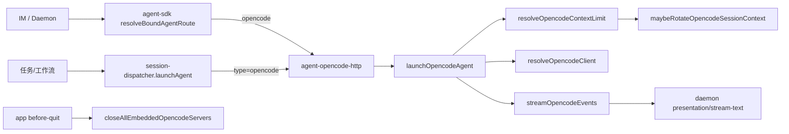

# OpenCode SDK 执行引擎接入 - 代码评审报告

## 1、审查范围

- **变更类型**: apply 产出的未提交变更（含 T-FIX-01/02 修复）
- **评审等级**: full-review（跨 electron 主进程 HTTP 路由、四引擎对称、renderer 配置 UI、Profile 凭证与 MCP）
- **涉及文件**: 32 个（manifest 登记 code/agents 29 + 变更文档 4；含 `electron/main.ts` T-FIX-02）
- **设计文档**: `02-design.md`（对照基准）
- **CodeGraph**: 首轮 `codegraph_context`（`launchOpencodeAgent` / 路由链）、`codegraph_impact`（`launchAgent`）；**重审**复核 `resolveOpencodeContextLimit` → `resolveContextLimitForSession` → `maybeRotateOpencodeSessionContext` 链及 `before-quit` → `closeAllEmbeddedOpencodeServers`

## 2、严重（必须处理）

无

## 3、警告（建议处理）

### 首轮（已修复，重审复核通过）

1. **~~未调用 `resolveContextLimitForSession`，上下文轮转阈值永不生效~~**（R1 / T-FIX-01 ✅）
   - 位置: `electron/agent-opencode-sdk.ts:51-58`（`resolveOpencodeContextLimit`）；`:194` launch、`:228` dispatch 调用；`agent-opencode-stream.ts:193-201` guard 现已可触发
   - 复核: `resolveOpencodeContextLimit` 仿 Codex 异步调用 `resolveContextLimitForSession`，回调写入 `session.contextLimitTokens`；launch/dispatch 均在 `maybeRotateOpencodeSessionContext` 前调用
   - 发现方式: CodeGraph 调用链 + 源码阅读

2. **~~应用退出未挂钩内嵌 OpenCode server 清理~~**（R2 / T-FIX-02 ✅）
   - 位置: `electron/main.ts:22` import；`:385-389` `before-quit` 调用 `closeAllEmbeddedOpencodeServers()`
   - 复核: best-effort `server.close()` 与 `embeddedByProfileId` 清理；与 `stopAllOpencodeSessions` 内同函数复用
   - 发现方式: CodeGraph + grep 调用链

### 遗留（info，不阻断归档）

3. **Ponytail — `presentationOrderingEligible` 导出但未接入流式路径**（R3）
   - 位置: `electron/agent-opencode-utils.ts:100-102`；`agent-opencode-stream.ts` 未引用
   - 说明: `shrink:` 可选删除或后续对齐 SDK ordering；与 Codex 同样未接 ordering，YAGNI 残留
   - net: -3 lines possible（若删未用导出）

## 4、设计偏差

1. **外部探活 API 与 02 §四 表不一致（已文档化降级）**
   - 设计预期: `client.global.health()` 探活
   - 实际实现: `agent-opencode-utils.ts:28-37` 使用 `client.config.get()`，注释说明 SDK 无 `global.health`
   - 影响: 行为等价性依赖 config 端点可用性；T8 文案链仍通过 `external_health_failed` 覆盖，风险可控

2. **02 §六 步骤 14 写 `main.ts` init，实际落点 `initSessionDispatcher`**
   - 设计预期: `electron/main.ts` 注册 `ensureOpencodeHttpServer`
   - 实际实现: `session-dispatcher.ts:646-650` 与 Codex/CC 一致；T-FIX-02 退出清理确在 `main.ts`
   - 影响: 无功能差异，文档落点需 archive 时 kb-librarian 同步

## 5、验收标准检查

### 01-proposal 十条

| # | 验收条件 | 状态 | 说明 |
|---|---------|------|------|
| 1 | IM 消息 OpenCode 执行并回复 | ✅ | `agent-sdk` → `launchOpencodeAgentFromHttp` → HTTP → `launchOpencodeAgent` 链路完整 |
| 2 | 任务面板触发 | ✅ | `session-dispatcher.launchAgent` opencode 分支 POST `/api/opencode/agent/launch` |
| 3 | 工作流多节点流转 | ✅ | 同 launchAgent 路由，workflow 不改 |
| 4 | 切回 SDK/CC/Codex 正常 | ✅ | 四引擎分支独立，type 校验已扩 |
| 5 | 事件流 progress 展示 | ✅ | `agent-opencode-events` + stream-text/presentation-event |
| 6 | 上下文超限压缩/轮转 | ✅ | **重审**: `resolveOpencodeContextLimit` 写入 `contextLimitTokens`，`maybeRotateOpencodeSessionContext` guard 可触发 |
| 7 | UI 部署模式/Provider/模型 | ✅ | `OpenCodeEditModal` + `AgentOpencodeProfileSection` |
| 8 | 多 Profile 独立保存 | ✅ | CRUD + `newOpencodeResourceId` |
| 9 | 两通道绑定不同 Profile | ✅ | `ChannelModelSection` Profile 分组 + 通道 `agentResourceId` |
| 10 | 超时/冷却/错误提示 | ✅ | watchdog + `opencode-failure-messages` + `completeOpencodeRun` notify |

**01 验收覆盖**: 10/10 条代码层满足（#6 经 T-FIX-01 修复；运行时 E2E 仍待人工验证）。

### 03-tasks T1~T9 + T-FIX

| 任务 | 关键验收 | 状态 |
|------|---------|------|
| T1 | type/engineType/config-store 兜底 | ✅ |
| T2 | HTTP/路由/stop/list/daemon 合并 + 退出清理 | ✅ |
| T3 | Client 解析/脱敏 | ✅ |
| T4 | SSE → Presentation | ✅ |
| T5 | MCP loader | ✅ |
| T6 | 注册表/看门狗/收尾 | ✅ |
| T7 | launch/dispatch 编排 + context limit | ✅ |
| T8 | 失败脱敏文案 | ✅ |
| T9 | UI + MCP 策略 | ✅ |
| T-FIX-01 | contextLimitTokens 解析 | ✅ |
| T-FIX-02 | before-quit 内嵌 server 清理 | ✅ |

### 02·八·（二）工程补充验收

| 项 | 状态 |
|----|------|
| 内嵌启动失败用户文案 | ✅ |
| 外部 health 失败文案 | ✅（经 config.get 探活） |
| apiKey 脱敏 | ✅ |
| opencode-missing 不降级 | ✅ |
| 四引擎切换 | ✅（代码路径） |
| stop/isRunning/list 对称 | ✅ |
| Dashboard engineType/MCP | ✅ |
| 退出 close 内嵌 server | ✅ |

## 6、调用链与回归风险

| 回归点 | 风险 | 说明 |
|--------|------|------|
| `launchAgent` 四引擎分支 | 低 | 对称扩 opencode，不改既有三分支 |
| `AgentResource.type` 联合 | 低 | 三处 + engineType 两处已同步 |
| 内嵌多 Profile 同端口 | 中 | 依赖 Profile 级 port；冲突走 `embedded_start_failed` |
| context limit 异步竞态 | 低 | 与 Codex 同模式：limit 未就绪时首轮轮转 skip，后续 dispatch 可触发 |
| rebase Codex 共享落点 | 低 | 注释位扩展，无删 codex |
| OpenCode SSE 类型漂移 | 低 | 未知事件 WARN 降级 |

## 7、遗留债务

- OpenCode 路径 **PRESENTATION_ORDERING** 与 SDK 完全对等未实现（R3 / Codex 亦未接）；非 01 硬性要求，可后续对齐。
- 运行时 E2E（真实 OpenCode 服务 + IM 回复 + 实际上下文超限轮转）本次评审未执行，仅静态 + CodeGraph 验证。

## 8、修复任务建议

| 问题 ID | 建议动作 | 关联任务 | 状态 |
|---------|----------|----------|------|
| R1 | launch/dispatch 调用 `resolveContextLimitForSession` | T-FIX-01 | fixed |
| R2 | `before-quit` 调用 `closeAllEmbeddedOpencodeServers` | T-FIX-02 | fixed |
| R3 | 删除或接入 `presentationOrderingEligible`（可选） | — | open (info) |

## 9、结论

### 首轮（2026-06-30）

**未通过**，需修复后再归档。阻断项：R1（01 验收 #6）、R2（02·八·（二）-8）。

### 重审（2026-06-30，T-FIX-01/02 后）

**通过**，可进入 `/kb-archive`。

- **open 阻断数**: 0（≥warning 级 open 无；R3 为 info 不阻断）
- **01 验收**: 10/10 代码层覆盖
- **CodeGraph 复核**: `resolveOpencodeContextLimit` → `resolveContextLimitForSession` → `maybeRotateOpencodeSessionContext` 链完整；`main.ts` `before-quit` → `closeAllEmbeddedOpencodeServers` 已挂钩
- **文件行数**: 全部 `agent-opencode-*` / `opencode-*` <300 行（最大 `agent-opencode-sdk.ts` 254 行）
