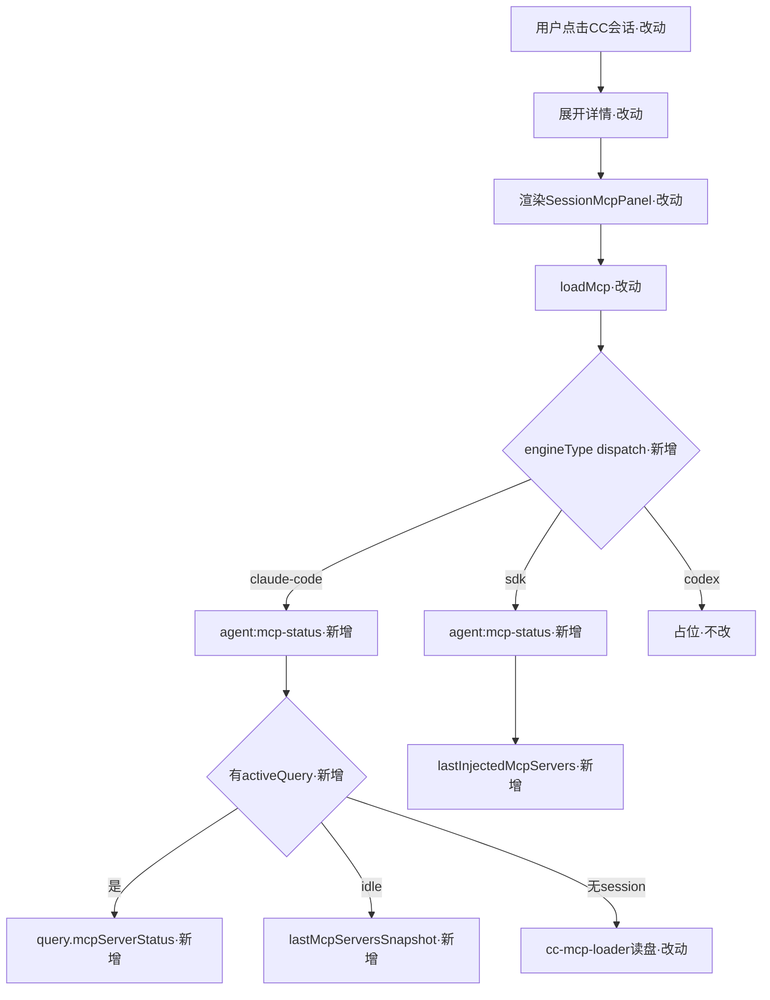

# ClaudeAgent MCP 展示与注入对齐设计

> 回溯 `01-proposal.md`；本设计覆盖 01 全部 7 条验收。段落顺序固定，某段无内容写「无」。

## 一、业务流程与改动范围

### （一）业务流程图

图例：`·不改`/`·改动`/`·新增`/`·删除`（本变更无删除节点）。

### （二）流程步骤与改动对照

| 步骤 | 业务含义 | 改动 | 落点文件 | 01验收 |
|---|---|---|---|---|
| S1 | 展开 CC 会话 MCP 面板 | 改动 | SessionMcpPanel.tsx loadMcp | 1/3/4 |
| S2 | loadMcp 按 engineType dispatch | 改动 | SessionMcpPanel.tsx | 1/3 |
| S3 | CC 调 agent:mcp-status | 新增 | main.ts；session-mcp-status.ts | 1/3/4 |
| S4 | CC activeQuery→mcpServerStatus | 新增 | session-mcp-status.ts；agent-claude-sdk.ts | 3 |
| S5 | CC idle→lastMcpServersSnapshot | 新增 | agent-cc-types.ts；agent-cc-events.ts | 4 |
| S6 | CC 无 session→cc-mcp-loader 读盘 | 改动 | cc-mcp-loader.ts mergeMcpJsonEntries | 1 |
| S7 | CC Run 注入 strictMcpConfig:true | 改动 | agent-claude-sdk.ts buildQueryOptions | 5 |
| S8 | SDK 调 agent:mcp-status | 新增 | session-mcp-status.ts；agent-sdk.ts | 2 |
| S9 | SDK 缓存 lastInjectedMcpServers | 新增 | agent-sdk.ts L696/728/1215 | 2 |
| S10 | CC emptyHint 改指 .mcp.json/~/.claude.json | 改动 | mcp-view-strategy.ts | 1 |
| S11 | IPC/preload/env.d.ts 同步签名 | 新增 | main.ts、preload.ts、env.d.ts | 1/2/3 |
| S12 | mcp-status-map 缓存键加 engineType | 改动 | mcp-status-map.ts resolveWorkspaceKey | 2 |
| S13 | codex 占位不变 | 不改 | mcp-view-strategy.ts | 6 |
| S14 | IM /mcp CRUD 不变 | 不改 | mcp-manager.ts | 7 |

### （三）改动汇总

- **改动**：cc-mcp-loader.ts、agent-claude-sdk.ts、agent-cc-events.ts、agent-cc-types.ts、agent-sdk.ts、SessionMcpPanel.tsx、mcp-view-strategy.ts、mcp-status-map.ts、main.ts、preload.ts、env.d.ts
- **新增**：electron/session-mcp-status.ts（≤200行）；CcSessionAgent.lastMcpServersSnapshot；SdkSessionAgent.lastInjectedMcpServers；IPC agent:mcp-status
- **不改（显式）**：mcp-manager.ts（IM /mcp CRUD）、agent-sdk.ts 注入源（仍 .cursor/mcp.json）、Dashboard.tsx 挂载点、Settings.tsx、Daemon MCP HTTP、mcp-view-strategy.ts codex 分支、session-dispatcher.getSessionAgentList

## 二、整体思路

回溯 01 §现状根因：CC 注入层抄了 Cursor 路径 + 展示层只按 workspace 取列表不绑 session。方案两层：

- **注入层**：cc-mcp-loader 改读 Claude 原生源（.mcp.json + ~/.claude.json）+ strictMcpConfig:true 让 inline 唯一
- **展示层**：新增 agent:mcp-status(sessionKey) IPC，CC 优先 query.mcpServerStatus()，idle 用 session 缓存，SDK 用注入快照；mcp-status-map 缓存键加 engineType 防串台

**最小方案三问**：

1. 复用：cc-mcp-loader 保留 stdio resolve/cwd 只改读路径；mcp-status-map 复用 probe 只改缓存键；SessionMcpPanel props 已含 sessionKey/engineType 无需加字段；mcp-view-strategy 复用 switch 只改 CC emptyHint。不新建通用「Agent MCP 抽象层」。
2. 新增抽象：session-mcp-status.ts 必要——CC(query.mcpServerStatus/init 快照) 与 SDK(注入快照) 取数差异大，inline 进 main.ts 会让 IPC handler 膨胀；独立文件 ≤200 行控行数。lastMcpServersSnapshot/lastInjectedMcpServers 是状态缓存非抽象层。
3. 合并：IPC handler inline 进 main.ts（与现有 mcp:* 同列），取数逻辑独立文件。不预建「多引擎 MCP 注册表」——codex 占位已在 mcp-view-strategy 处理，本变更不扩。

## 三、分层设计

- **端点层**：main.ts 新增 `ipcMain.handle("agent:mcp-status", ...)`；preload.ts/env.d.ts 同步 getAgentMcpStatus 签名
- **服务层**：session-mcp-status.ts 导出 getSessionMcpStatus：查 CC_SESSIONS/SDK_SESSIONS → 按 engineType dispatch → CC: activeQuery?.mcpServerStatus() ?? lastMcpServersSnapshot ?? cc-loader 读盘；SDK: lastInjectedMcpServers + mcp-status-map probe
- **数据层**：CcSessionAgent/SdkSessionAgent 各加一缓存字段（见 §5）；cc-mcp-loader.mergeMcpJsonEntries 改读 ~/.claude.json + {ws}/.mcp.json，project 覆盖 user/local

## 四、接口设计

- IPC `agent:mcp-status(sessionKey: string) => Promise<{ servers: McpServerEntry[]; statusMap: Record<string,string>; source: "runtime"|"snapshot"|"disk" }>`
- `session-mcp-status.getSessionMcpStatus(sessionKey): Promise<AgentMcpStatusResult>`
- CC 暴露 `getCcActiveQuery(sessionKey): Query | null` 供 session-mcp-status 调 mcpServerStatus()
- `cc-mcp-loader.mergeMcpJsonEntries` 签名不变，实现改读路径
- `mcp-status-map.resolveWorkspaceKey(workspaceDir, engineType?)` 缓存键加 engineType 后缀

## 五、数据结构

- `CcSessionAgent.lastMcpServersSnapshot?: Array<{ name: string; status: string; config?: unknown; scope?: string; tools?: unknown[] }>`
- `SdkSessionAgent.lastInjectedMcpServers?: Record<string, McpServerConfig>`
- `AgentMcpStatusResult = { servers: McpServerEntry[]; statusMap: Record<string,string>; source: "runtime"|"snapshot"|"disk" }`
- cc-mcp-loader 新增 `readClaudeJsonMcpServers(workspaceDir)`：读 ~/.claude.json → user scope mcpServers + projects[ws].mcpServers(local)；合并规则 project .mcp.json 覆盖 user/local
- 无 DB/proto 变更

## 六、实现步骤

1. (S6) cc-mcp-loader.ts 新增 readClaudeJsonMcpServers，mergeMcpJsonEntries 改读 .mcp.json+~/.claude.json；stdio resolve/cwd/OAuth 保留（OAuth 暂留 Cursor store，标 known limitation）
2. (S7) agent-claude-sdk.ts buildQueryOptions 设 strictMcpConfig:true；UI 日志打 inline MCP 数量
3. (S5) agent-cc-types.ts 加 lastMcpServersSnapshot；agent-cc-events.ts init 分支缓存 msg.mcp_servers
4. (S9) agent-sdk.ts SdkSessionAgent 加 lastInjectedMcpServers；L696/728/1215 注入点回写
5. (S12) mcp-status-map.ts resolveWorkspaceKey 加 engineType 参数，缓存键 wsKey+"::"+engineType
6. (S3/S4/S8) 新建 electron/session-mcp-status.ts 导出 getSessionMcpStatus；CC 暴露 getCcActiveQuery
7. (S11) main.ts 注册 agent:mcp-status IPC；preload.ts/env.d.ts 同步签名
8. (S1/S2) SessionMcpPanel.tsx loadMcp 按 engineType dispatch：CC/SDK 调 getAgentMcpStatus(sessionKey)，codex 不变
9. (S10) mcp-view-strategy.ts CC emptyHint 改 ~/.claude.json/{ws}/.mcp.json
10. (S13/S14) 不动 codex 与 IM CRUD

## 七、参考实现

- `loadInlineCcMcpServers` (cc-mcp-loader.ts:100) ← `appendInlineMcpToCcOptions` (cc-mcp-loader.ts:112) ← `buildQueryOptions` (agent-claude-sdk.ts:91) ← `startCcQuery` (agent-claude-sdk.ts:101)
- `getMcpServerListForWorkspace` (mcp-manager.ts:111) ← `mcp:list-for-workspace` (main.ts:205) ← `listMcpForWorkspace` (preload.ts:259) ← `SessionMcpPanel.loadMcp` (SessionMcpPanel.tsx:70)
- `readMcpAuthStore` (mcp-project-dir.ts:49) — Cursor OAuth store（CC 改源后不兼容，首版 stdio-only）
- `SDKSystemMessage.mcp_servers` (sdk.d.ts:4089) — init 含 {name,status}[]
- `Query.mcpServerStatus` (sdk.d.ts:2330) — 返回 {name,status,config?,scope?,tools?}[]
- `Options.strictMcpConfig` (sdk.d.ts:1877) — true 忽略 .mcp.json/settings/plugins
- `session-dispatcher.getSessionAgentList` (session-dispatcher.ts:379) — engineType 硬编码 sdk/claude-code

## 八、技术影响

### （一）影响范围

- 模块：见 §1.3；新建 session-mcp-status.ts
- 接口：新增 IPC agent:mcp-status；无 HTTP/proto
- 数据：无 DB；~/.claude.json 只读
- 风险：query.mcpServerStatus() 需 streaming input 模式，query({prompt:string}) 需 builder 实测，不可用则 fallback init 快照+读盘；~/.claude.json schema 随版本变化；idle 缓存过期 UI 提示；OAuth stdio-only

### （二）工程补充验收项

- [ ] cc-mcp-loader 改读后，/Users/suwenguang/work/code CC 会话 codegraph args 为 ["serve","--mcp"]（无 --path）
- [ ] strictMcpConfig:true 后 UI 日志含 [mcp] inline N servers
- [ ] CC activeQuery 时 agent:mcp-status 返回 source:"runtime"；idle 返回 source:"snapshot"
- [ ] SDK 会话 agent:mcp-status 返回 source:"runtime" 且 servers 与 loadInlineMcpServers(ws) 一致
- [ ] 同 workspace 切 SDK/CC 会话，mcp-status-map 缓存不串台（键含 engineType）
- [ ] CC emptyHint 显示 ~/.claude.json/.mcp.json，不含 .cursor
- [ ] npm run build 通过

## 九、知识库影响

- 业务域/Agent调度/07-ClaudeCodeSDK执行引擎.md — CC MCP 源 + strictMcpConfig + session 缓存
- 业务域/Agent调度/06-CursorSDK执行引擎.md — SDK 注入点回写（可选对比）
- 业务域/Agent调度/02-多会话模型.md、03-启动与自动重连.md — MCP 分源/一行修正
- 工程平台/Electron桌面应用/02-主进程与IPC.md、03-渲染端界面.md — 新 IPC + dispatch + emptyHint
- electron/AGENTS.md — CC MCP 段（builder 沉淀）
- 两级索引：领域 README 引用不变则不更新

## 十、知识库更新计划

### （一）必须更新

- knowledge/业务域/Agent调度/07-ClaudeCodeSDK执行引擎.md
- knowledge/工程平台/Electron桌面应用/02-主进程与IPC.md
- knowledge/工程平台/Electron桌面应用/03-渲染端界面.md
- electron/AGENTS.md

### （二）可能更新（视实现结果）

- knowledge/业务域/Agent调度/02-多会话模型.md（若补 MCP 段）
- knowledge/业务域/Agent调度/06-CursorSDK执行引擎.md（若加对比）
- knowledge/业务域/Agent调度/03-启动与自动重连.md

### （三）不需要更新

- knowledge/工程平台/Daemon守护进程/**（Daemon MCP HTTP 不变）
- knowledge/工程平台/Electron桌面应用/01-概览.md（无结构变化）
- knowledge/知识索引.md（领域 README 引用不变）
