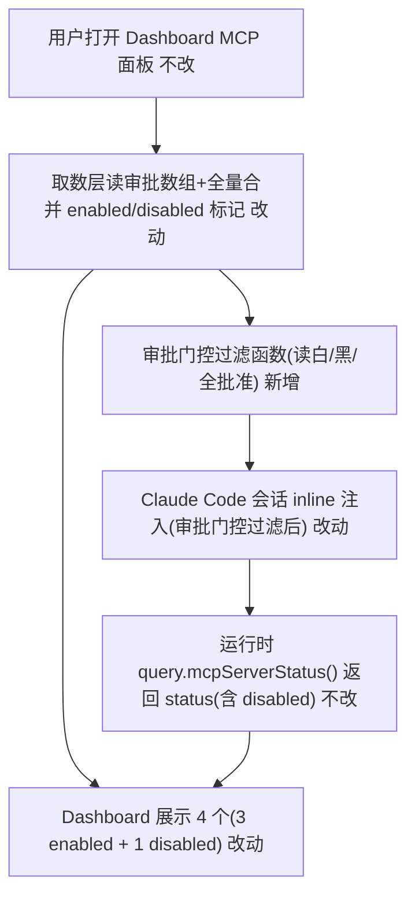

# ClaudeAgent MCP 审批门控与启用展示 - 实现设计

> **业务 PRD**：见同目录 `01-proposal.md`（验收标准以 01 为准）
> 01 无显式 §业务流程，下图基于 G1/G2/G3 与验收标准构建。

## 一、业务流程与改动范围

### （一）业务流程图

**图例**：`不改` 行为与现网一致；`改动` 需改代码；`新增` 新节点；`删除` 移除路径（本次无）。

### （二）流程步骤与改动对照

| 步骤 ID | 业务含义 | 改动 | 落点（模块/文件） | 01 验收关联 |
|---------|----------|------|-------------------|-------------|
| S1 | Dashboard 打开 MCP 面板 | 不改 | `src/renderer/components/SessionMcpPanel.tsx` | 01 §五.2 |
| S2 | 取数层读审批数组+全量合并标记 enabled/disabled | 改动 | `electron/session-mcp-status.ts`、`electron/cc-mcp-loader.ts` | 01 §五.2/3 |
| S3 | 审批门控过滤函数（读 enabled/disabled/enableAll） | 新增 | `electron/cc-mcp-loader.ts` | 01 §五.1/4 |
| S4 | inline 注入经审批门控过滤（只传 enabled） | 改动 | `electron/agent-claude-sdk.ts`、`cc-mcp-loader.ts`(`appendInlineMcpToCcOptions`) | 01 §五.1/4 |
| S5 | 运行时 `mcpServerStatus()` 返回 status（含 disabled） | 不改 | `electron/agent-claude-sdk.ts`(query 调用) | 01 §五.1 |
| S6 | Dashboard 展示全量 4 个，3 enabled + 1 disabled | 改动 | `SessionMcpPanel.tsx`、`src/renderer/types/mcp.d.ts`、`electron/mcp-types.ts` | 01 §五.2 |
| S7 | 切换 workspace 刷新审批集合（无串台） | 不改 | `electron/mcp-status-map.ts`、`session-mcp-status.ts` | 01 §五.3 |

### （三）改动汇总

- **改动**：`cc-mcp-loader.ts`、`session-mcp-status.ts`、`agent-claude-sdk.ts`、`SessionMcpPanel.tsx`、`mcp.d.ts`、`mcp-types.ts`
- **新增**：审批状态读取函数、审批门控过滤函数、过滤后 inline 加载函数（均并入 `cc-mcp-loader.ts`）
- **不改（显式列出）**：`mcp-view-strategy.ts`、`mcp-status-map.ts`、`agent-cc-session-registry.ts`、`strictMcpConfig: true`、user/local scope 加载语义、SDK（Cursor）路径 MCP

## 二、整体思路

根因（01 §二）：inline 注入（`cc-mcp-loader`）与展示取数（`session-mcp-status`）均全量，未对齐 Claude Code project scope 审批门控；`toEntry` 硬编码 `enabled:true`。方案：在 `cc-mcp-loader` 复刻审批门控（读 `~/.claude.json` `projects[ws]` 两数组 + `enableAllProjectMcpServers`），inline 注入只传审批启用项（G1）；取数层读审批数组对全量条目标记 enabled/disabled（G2/G3）；展示层据标记加 enable/disable 标签。

**Ponytail 最小方案三问**：

1. **复用现有模块？** 是。审批过滤复用 `cc-mcp-loader` 的 `readClaudeJsonMcpServers` 读盘路径与 `mergeMcpJsonEntries` 全量合并，不新建文件。
2. **新增抽象是否被 01 要求？** 否，不抽「审批过滤策略」接口或「状态映射器」类（YAGNI）。审批过滤为 inline 纯函数，01 G1 仅要求过滤行为，三处调用点直接 inline 复用同一函数。
3. **合并到已有文件？** 是。审批读+过滤并入 `cc-mcp-loader.ts`(161→≈196)；disabled 标记并入 `session-mcp-status.ts`(186→≈211)；标签并入 `SessionMcpPanel.tsx`(208→≈223)。均 <300，无需新建。

## 三、分层设计

- **端点层(renderer)**：`SessionMcpPanel.tsx` 据 `entry.enabled`/`statusMap` 加 enable/disable 标签与色阶；`mcp.d.ts` 扩展注释。
- **服务层(electron)**：`cc-mcp-loader.ts` 新增审批读+过滤；`session-mcp-status.ts` `toEntry` 接审批状态置 `enabled`；`agent-claude-sdk.ts` 注入入口接过滤后集合。
- **数据层**：`~/.claude.json` `projects[ws].enabledMcpjsonServers`/`disabledMcpjsonServers`/`enableAllProjectMcpServers`（交互审批落地）+ `{ws}/.mcp.json`(project scope)。

## 四、接口设计

- `readCcProjectApproval(workspaceDir): { enabled: string[]; disabled: string[]; enableAll: boolean }`（新增，`cc-mcp-loader.ts`，读 `~/.claude.json` projects[ws]，缺失容错为空/false）
- `filterApprovedProjectMcp(merged, approval, workspaceDir): Record<string, RawMcpEntry>`（新增，按白/黑/全批准过滤 project scope；user/local 不过滤）
  - **设计偏差记录**（archive 回填）：原设计签名为 `filterApprovedProjectMcp(merged, approval)` 两参数，实际实现新增第三参数 `workspaceDir`。原因：须读 `{ws}/.mcp.json` servers 键集合区分 project scope（`mergeMcpJsonEntries` 中 project 覆盖 user/local，project 条目即 `.mcp.json` 键集合），否则无法满足 §六步骤2「project scope 均未命中弃 + user/local 不过滤」验收。属合理设计修正，已在 `electron/AGENTS.md` `## CC MCP 审批门控函数` 沉淀「须传 `workspaceDir` 第三参数用于读 `{ws}/.mcp.json` servers 键集合区分 project scope」。
- `loadApprovedInlineCcMcpServers(workspaceDir): Record<string, McpServerConfig>`（新增，过滤后供注入；`loadInlineCcMcpServers` 保留全量供展示）
- `appendInlineMcpToCcOptions` 改用 `loadApprovedInlineCcMcpServers`
- `toEntry(name, cfg, source, approved?): McpServerEntry`（签名增可选 `approved`，置 `enabled`；向后兼容）

## 五、数据结构

`McpServerEntry.enabled?: boolean` 语义扩展：`false`=审批未启用/被禁用（project scope），`true`=审批启用或 user/local scope（不经审批）。不新增枚举字段——disabled 展示由 `enabled:false` + `statusMap["disabled"]` 双通道表达（最小改动）。
`~/.claude.json` `projects[ws]`：`enabledMcpjsonServers: string[]`(白名单)、`disabledMcpjsonServers: string[]`(黑名单)、`enableAllProjectMcpServers: boolean`(全批准)。

## 六、实现步骤

1. [S3] `cc-mcp-loader.ts` 新增 `readCcProjectApproval` 读 `~/.claude.json` projects[ws] 三字段（容错：缺失=空数组/false）。
2. [S3] 新增 `filterApprovedProjectMcp`：project scope 条目按 `enableAll`→全留；否则 `disabled` 命中→弃、`enabled` 命中→留、均未命中→弃（Pending approval 不加载）；user/local scope 不过滤。
3. [S4] 新增 `loadApprovedInlineCcMcpServers`=过滤后转 `McpServerConfig`；`appendInlineMcpToCcOptions` 改用它；`loadInlineCcMcpServers` 保留全量供展示。
4. [S2] `session-mcp-status.ts` 三态路径（disk/snapshot/runtime）读 `readCcProjectApproval`，`toEntry` 增 `approved` 入参置 `enabled`；runtime 路径 `mcpServerStatus()` 已返 `disabled` status，`statusMap` 透传。
5. [S6] `mcp-types.ts`/`mcp.d.ts` 注释明确 `enabled` 语义；`SessionMcpPanel.tsx` 据 `s.enabled===false` 加「未启用」标签与灰色色阶（现 `statusLabel` 已处理 `disabled`，补 `enabled:false` 分支）。

## 七、参考实现

- `electron/cc-mcp-loader.ts:40` `readClaudeJsonMcpServers`（user+local，**未读审批数组**——本变更新增读取）
- `electron/cc-mcp-loader.ts:66` `mergeMcpJsonEntries`（全量合并，无过滤）
- `electron/cc-mcp-loader.ts:143` `loadInlineCcMcpServers`、`:155` `appendInlineMcpToCcOptions`（注入入口）
- `electron/session-mcp-status.ts:68` `toEntry`（硬编码 `enabled:true`）、`:46` `mapCcStatusToUi`（已含 disabled 分支）、`:125` `getSessionMcpStatus`（三态 dispatch）
- `electron/agent-claude-sdk.ts:79` `buildQueryOptions`（`strictMcpConfig:true`、调 `appendInlineMcpToCcOptions`）
- `node_modules/@anthropic-ai/claude-agent-sdk/sdk.d.ts:1022` `McpServerStatus.status: 'connected'|'failed'|'needs-auth'|'pending'|'disabled'`（枚举**含 disabled**，docstring 漏列）
- `sdk.d.ts:4723-4731` `Settings.enableAllProjectMcpServers`/`enabledMcpjsonServers`/`disabledMcpjsonServers`

## 八、技术影响

### （一）影响范围

- **涉及模块**：`cc-mcp-loader`、`session-mcp-status`、`agent-claude-sdk`、`SessionMcpPanel`、`mcp-types`/`mcp.d.ts`
- **接口/proto 变更**：`toEntry` 增可选入参（向后兼容）；新增 3 个内部函数（不跨进程，无 IPC/proto）
- **数据变更**：只读 `~/.claude.json` `projects[ws]` 三字段，不写
- **风险**：
  1. **审批数组多源归并（待确认）**：d.ts 归 `Settings`（可来自 `~/.claude/settings.json`/project `.claude/settings.json`/managed），本设计只读 `~/.claude.json` projects[ws]（交互审批落地）。若用户经 `.claude/settings.json` 显式配置 `enabledMcpjsonServers` 则本设计漏读——是否需并读 settings 源（待确认）。
  2. `strictMcpConfig:true` 下 SDK 不过滤 inline（已核实 d.ts），本设计复刻过滤为必需，非冗余。
  3. **跨 workspace 串台**：审批数组按 `projects[ws]` 区分，`mcp-status-map` 缓存键含 workspaceDir，需验证 disabled 标记不跨 ws 泄漏。

### （二）工程补充验收项

- [ ] **300 行**：`cc-mcp-loader.ts`(161→≈196)、`session-mcp-status.ts`(186→≈211)、`SessionMcpPanel.tsx`(208→≈223) 均 <300，**无需**抽取设计模式。
- [ ] **审批数组多源**：核实 cursor-claw 场景下交互审批是否只落 `~/.claude.json` projects[ws]；若 `.claude/settings.json` 亦需读则补读（待确认）。
- [ ] **缺省默认**：未在两数组且未 `enableAll` 的 project server 标 `disabled`（Pending approval 语义），验证与 Claude Code 原生 `claude mcp list` 一致。
- [ ] **跨 ws 串台**：`mcp-status-map` 缓存键含 workspaceDir，验证切换 ws 后 disabled 集合刷新无串台（01 §五.3）。
- [ ] **user/local scope** 不受审批门控，验证始终 `enabled:true`。

## 九、知识库影响

- `knowledge/业务域/Agent调度/07-ClaudeCodeSDK执行引擎.md` §二（MCP inline）、§五（`getSessionMcpStatus`）、§七（三态取数）、§九（审批门控限制，line 65「未实现 project scope 审批门控」）需更新——本变更消除该限制。
- `knowledge/业务域/Agent调度/00-README.md` 变更记录追加一条。
- 两级索引：`知识索引.md` 无需更新（仅目录入口变化；Agent调度 README 未列叶子，索引不展开）；Agent调度 README 文件清单不变。

## 十、知识库更新计划

### （一）必须更新

- `07-ClaudeCodeSDK执行引擎.md` §九 移除「未实现 project scope 审批门控」限制；§二/§五/§七 补审批门控过滤与 disabled 标记语义。

### （二）可能更新（视实现结果）

- `07-ClaudeCodeSDK执行引擎.md` §十 变更记录追加；`00-README.md` 变更记录追加。
- 若实现确认审批数组多源归并行为，补 §二 设计决策注记。

### （三）不需要更新

- `知识索引.md`、Agent调度 README 文件清单、`mcp-view-strategy.ts` 展示策略（CC emptyHint 不变）。
