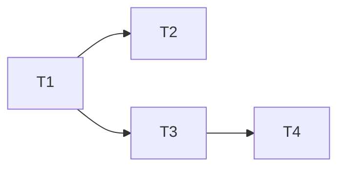

# ClaudeAgent MCP 审批门控与启用展示

> **来源**：`/kb-plan`（基于 01/02）

## 一、执行计划

### （一）依赖图

### （二）分组调度

- 第一轮：T1（独立）
- 第二轮（并行）：T2、T3（依赖 T1，无文件冲突）
- 第三轮：T4（依赖 T3）

## 二、任务清单

## T1: 注入层审批门控函数

### 背景

inline 注入全量未对齐审批门控；新增三函数供 T2/T3 共用（02 步骤1-3前半、S3）。

### 上下文文件

CodeGraph: `readClaudeJsonMcpServers`/`mergeMcpJsonEntries`/`loadInlineCcMcpServers`；必读 `electron/cc-mcp-loader.ts`；参考 `sdk.d.ts:4723-4731`

### 实现范围

修改: `electron/cc-mcp-loader.ts` — 新增三函数；`loadInlineCcMcpServers` 保留全量供展示
### 接口契约

- `readCcProjectApproval(workspaceDir): {enabled:string[];disabled:string[];enableAll:boolean}` — 读 projects[ws]，缺失容错
- `filterApprovedProjectMcp(merged, approval): Record<string, RawMcpEntry>` — project scope 按 enableAll/黑白名单过滤；user/local 不过滤
- `loadApprovedInlineCcMcpServers(workspaceDir): Record<string, McpServerConfig>` — 过滤后供注入

### 验收标准

- [ ] 缺失 projects[ws] 容错空/false（02 §八·（二）缺省默认）
- [ ] enableAll 全留；disabled 弃、enabled 留、均未命中弃；user/local 不过滤（02 §八·（二）user/local）
- [ ] <300 行，无未要求抽象/新依赖（Ponytail）

### 依赖

无 → T2, T3

> **状态**：✅ 已实现 — `cc-mcp-loader.ts` 新增 `readCcProjectApproval`/`filterApprovedProjectMcp`/`loadApprovedInlineCcMcpServers` 三函数（161→256 行），`filterApprovedProjectMcp` 新增 `workspaceDir` 第三参数用于读 `.mcp.json` 区分 project scope；`loadInlineCcMcpServers` 全量保留供展示。

## T2: 注入入口对接

### 背景

全量注入致注入数≠实际加载数；改用 T1 过滤后加载函数（02 步骤3后半、S4）。

### 上下文文件

CodeGraph: `appendInlineMcpToCcOptions`/`buildQueryOptions`；必读 `electron/agent-claude-sdk.ts`；参考 `cc-mcp-loader.ts:155`

### 实现范围

修改: `electron/agent-claude-sdk.ts` — `appendInlineMcpToCcOptions` 改用 `loadApprovedInlineCcMcpServers`
### 接口契约

- `appendInlineMcpToCcOptions` 改调 `loadApprovedInlineCcMcpServers(workspaceDir)`，签名不变

### 验收标准

- [ ] inline 注入数 = Dashboard enabled 数 = Claude Code 实际加载数（01 §五.1/4）
- [ ] `strictMcpConfig: true` 不变，SDK 路径不受影响
- [ ] <300 行，无未要求抽象/新依赖（Ponytail）

### 依赖

T1 → 无

> **状态**：✅ 已实现（方案 A 修正，死代码消除） — `agent-claude-sdk.ts` `buildQueryOptions` 仍调 `appendInlineMcpToCcOptions`（仅加注释），`cc-mcp-loader.ts:250-258` `appendInlineMcpToCcOptions` 函数体改调 `loadApprovedInlineCcMcpServers`（方案 A 内部改调，签名不变），注入数对齐审批后实际加载数；292 行，tsc 通过。注：apply 阶段首版曾按硬约束「不改 cc-mcp-loader.ts」改在 `buildQueryOptions` 调用方绕过 `appendInlineMcpToCcOptions` 致死代码，后续切换为方案 A 在 `cc-mcp-loader.ts` 内部改调，死代码已消除。

## T3: 取数层 disabled 标记

### 背景

toEntry 硬编码 enabled:true、三态未区分；读审批数组标记 enabled/disabled（02 步骤4、S2）。

### 上下文文件

CodeGraph: `toEntry`/`getSessionMcpStatus`/`mapCcStatusToUi`；必读 `electron/session-mcp-status.ts`；参考 `mcp-status-map.ts`

### 实现范围

修改: `electron/session-mcp-status.ts` — 三态读 `readCcProjectApproval`；`toEntry` 增 `approved` 入参置 `enabled`；runtime `statusMap` 透传 disabled
### 接口契约

- `toEntry(name, cfg, source, approved?): McpServerEntry` — `approved=false` 置 `enabled:false`；未参向后兼容

### 验收标准

- [ ] disk/snapshot 补全 disabled 条目（01 §五.2、02 §八·（二）缺省默认）
- [ ] runtime 透传 disabled；user/local 始终 `enabled:true`（02 §八·（二）user/local）
- [ ] 切换 ws 无串台（01 §五.3、02 §八·（二）跨 ws）；<300 行（Ponytail）

### 依赖

T1 → T4

> **状态**：✅ 已实现 — `session-mcp-status.ts`（186→296 行）`toEntry` 增 `approved?` 入参置 `enabled`；新增 `readProjectMcpNames`/`buildApprovedMap`/`appendDisabledPending`/`buildDiskStatusMap`，CC 三态路径读 `readCcProjectApproval` 标记 project scope，runtime/snapshot 补全 Pending approval 的 disabled 条目，SDK 路径不变。

## T4: 展示层 enable/disable 标签

### 背景

据 enabled:false 加「未启用」标签与灰色色阶，让用户一眼可见未审批启用项（02 步骤5、S6）。

### 上下文文件

CodeGraph: `SessionMcpPanel`/`statusLabel`；必读 `SessionMcpPanel.tsx`、`src/renderer/types/mcp.d.ts`、`electron/mcp-types.ts`

### 实现范围

修改: `electron/mcp-types.ts`、`src/renderer/types/mcp.d.ts` — 注释明确 `enabled` 语义（false=审批未启用/被禁用，true=审批启用或 user/local）；`SessionMcpPanel.tsx` 据 `s.enabled===false` 加「未启用」标签与灰色色阶
### 接口契约

- 无新接口；`McpServerEntry.enabled?: boolean` 语义扩展注释

### 验收标准

- [ ] Dashboard 展示 4 个含 1 个 disabled 标签（01 §五.2）
- [ ] 切换 ws 刷新无串台（01 §五.3、02 §八·（二）跨 ws）
- [ ] 三文件 <300 行，无未要求抽象/新依赖（Ponytail）

### 依赖

T3 → 无

> **状态**：✅ 已实现 — `mcp-types.ts`/`mcp.d.ts` 的 `McpServerEntry.enabled` 加三态语义中文注释（false=审批未启用/被禁用，true=审批启用或 user/local，undefined 向后兼容）；`SessionMcpPanel.tsx`（208→215 行）据 `s.enabled===false` 加容器 `opacity-60` 灰化、名字色阶降级、与 statusLabel 协同去重的「未启用」标签；tsc 通过，三文件 26/27/215 行均 <300。
