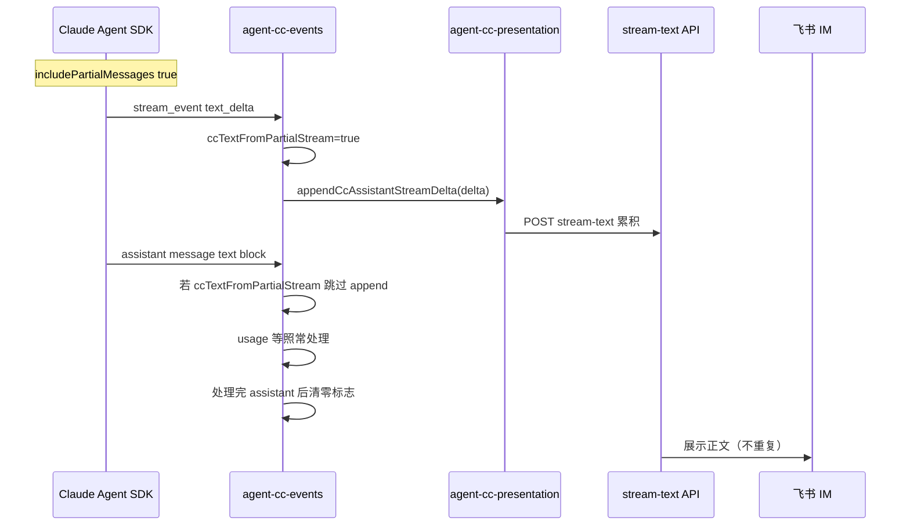

# 修复 CC SDK 飞书消息正文重复 — 实现设计（lite 五段式精简版）

> **业务 PRD**：见同目录 `01-proposal.md`（验收标准以 01 为准）

## 一、业务流程与改动范围

### （一）业务流程图



**图例**：`改动` 为本次新增去重分支；SDK 出站、Daemon、飞书展示链路 `不改`。

### （二）流程步骤与改动对照

| 步骤 ID | 业务含义 | 改动 | 落点（模块/文件） | 01 验收关联 |
|---------|----------|------|-------------------|-------------|
| E-1 | SDK 推送 text_delta 增量 | 改动 | `agent-cc-events.ts` `handleStreamEvent` | AC-1、AC-2 |
| E-2 | 首条 text_delta 置位标志 | 新增 | 同上，`session.ccTextFromPartialStream = true` | AC-1 |
| E-3 | SDK 推送 assistant text block | 改动 | `handleContentBlocks` 条件跳过 append | AC-1、AC-3 |
| E-4 | assistant 消息收尾清零标志 | 新增 | `handleSdkMessage` `msg.type === "assistant"` 分支末尾 | AC-5 |
| E-5 | 新 Run 重置 presentation 状态 | 改动 | `agent-cc-utils.ts` `resetCcRunPresentationState` | AC-5 |
| E-6 | session 类型扩展 | 新增 | `agent-cc-types.ts` `CcSessionAgent` | AC-4（编译） |
| E-7 | 主进程约定文档 | 可选 | `electron/AGENTS.md` 一句 | — |

### （三）改动汇总

- **改动**：`agent-cc-events.ts`、`agent-cc-utils.ts`
- **新增字段**：`CcSessionAgent.ccTextFromPartialStream?: boolean`
- **可选**：`electron/AGENTS.md` 补充去重语义
- **不改**：`agent-claude-sdk.ts` 的 `includePartialMessages: true`（保留增量流式体验）、`appendCcAssistantStreamDelta` / `agent-cc-stream.ts` 节流逻辑、thinking/tool 分支、Daemon `/api/stream-text` 契约

## 二、整体思路

根因见 `01-proposal.md`：`includePartialMessages: true` 时 SDK 对同一条 assistant 回复双路投递文本，`agent-cc-events.ts` 两路均 append 至 `streamBuffer`，导致飞书展示重复。

**方案要点**：以「本轮是否已从 partial 流写入正文」为闩，优先信任 `text_delta` 增量路径；当标志为真时，`assistant` message 的 `text` block **不再** append（usage、`closeThinkingIfOpen`、`maybeReleaseDeferredAssistant` 等保持现网）。每轮 `assistant` 处理完毕及 `resetCcRunPresentationState` 时清零，避免污染下一轮。

**最小方案三问**：

1. **能否复用现有模块？** 是。仅扩展 `CcSessionAgent` 布尔字段，在既有 handler 内加条件，不新建文件。
2. **是否引入新抽象？** 否。
3. **能否合并到已有文件？** 是。3 个必改文件 + 1 个可选 AGENTS 文档。

## 三、分层设计

- **SDK 配置层**：`agent-claude-sdk.ts` `buildQueryOptions` — `不改`，继续 `includePartialMessages: true`
- **事件映射层**：`agent-cc-events.ts` — `改动`，partial/assistant 去重闩
- **Presentation 层**：`agent-cc-presentation.ts` `appendCcAssistantStreamDelta` — `不改`，调用方减少重复 append 即可
- **状态重置层**：`agent-cc-utils.ts` `resetCcRunPresentationState` — `改动`，Run 边界清零

## 四、接口设计

无对外 HTTP/IPC/proto 签名变更。

**内部 session 字段**（`CcSessionAgent`）：

```ts
/** 本轮 assistant 正文是否已由 stream_event text_delta 写入；为 true 时跳过 assistant text block 的 append */
ccTextFromPartialStream?: boolean
```

**内部行为契约**：

| 函数 | 变更 |
|------|------|
| `handleStreamEvent` | 收到 `text_delta` 且将 append 时，先 `session.ccTextFromPartialStream = true` |
| `handleContentBlocks` | `text` block + `f41Stream`：仅当 `!session.ccTextFromPartialStream` 时 `appendCcAssistantStreamDelta` |
| `handleSdkMessage` | 处理完 `assistant` 分支后 `session.ccTextFromPartialStream = false` |
| `resetCcRunPresentationState` | 增加 `session.ccTextFromPartialStream = false`（或 `undefined`） |

非 `f41Stream` 路径仍走 `appendCcLog`，本次不改动。

## 五、数据结构

- **新增**：`CcSessionAgent.ccTextFromPartialStream?: boolean`，仅内存、单 Run 生命周期，不持久化。
- **无**数据库、proto、配置文件字段变更。
