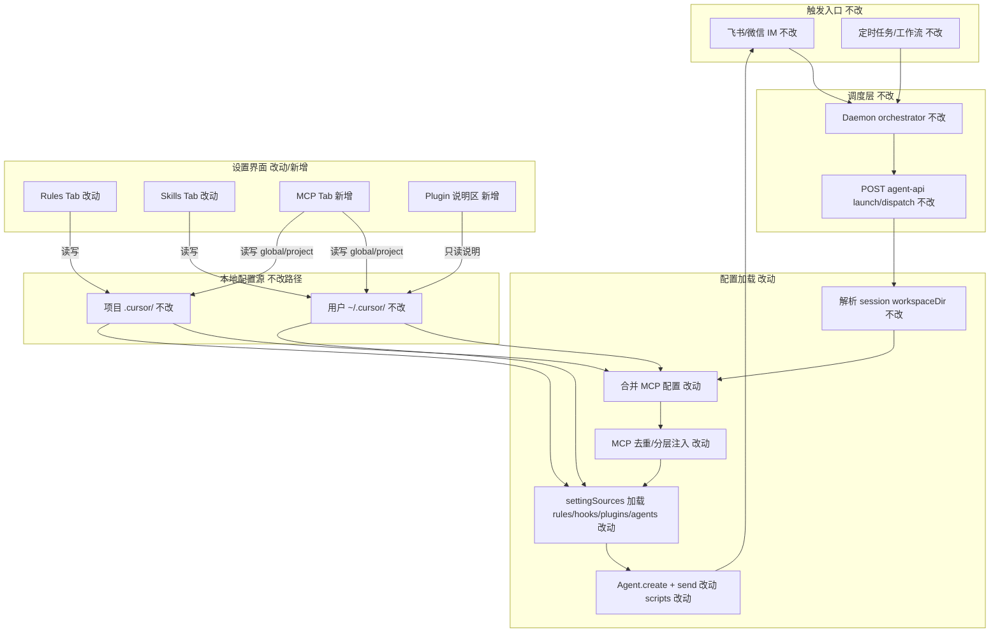
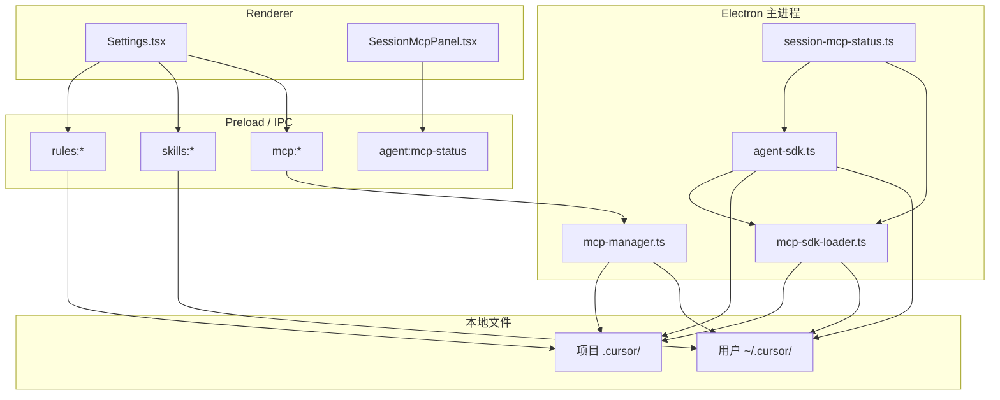

# Cursor SDK 本地配置来源对齐 - 实现设计

> **业务 PRD**：见同目录 `01-proposal.md`（验收标准以 01 为准）

## 一、业务流程与改动范围

> 业务口径以 `01-proposal.md` 用户故事与验收标准为准；下图覆盖 IM/任务/工作流触发 Cursor SDK 会话时的配置加载与设置维护两条主链路。

### （一）业务流程图

**图例**：`不改` 行为与现网一致；`改动` 需改代码/配置口径；`新增` 新 Tab/说明区/分支逻辑。

### （二）流程步骤与改动对照

| 步骤 ID | 业务含义 | 改动 | 落点（模块/文件） | 01 验收关联 |
|---------|----------|------|-------------------|-------------|
| S1 | 用户经 IM/任务/工作流触发 Cursor SDK 执行 | 不改 | `src/daemon.ts`、`electron/session-dispatcher.ts` | 8 |
| S2 | Daemon 转发 launch/dispatch 至 agent-api | 不改 | `electron/agent-sdk.ts`（HTTP handler） | 8 |
| S3 | 解析会话 `workspaceDir`（通道/任务绑定） | 不改 | `electron/config-store.ts` `effectiveWorkspaceDir` | 1、3、6、9 |
| S4 | 合并项目级与用户级 `.cursor/mcp.json`（project 覆盖 global） | 改动 | `electron/mcp-sdk-loader.ts` `mergeMcpJsonEntries`；对齐 `electron/mcp-manager.ts` `getMcpServerListForWorkspace` | 1、2、7、9、10 |
| S5 | 按官方优先级注入 MCP：inline 优先，settingSources 补全插件层；避免双份注册 | 改动 | `electron/mcp-sdk-loader.ts` `loadInlineMcpServers`；`electron/agent-sdk.ts` `launchSdkAgent` / `buildSendOptions` / `maybeRotateSessionForPressure` | 1、2、5、7、10 |
| S6 | 经 `settingSources` 加载 rules / hooks / plugins / agents（项目+用户） | 改动 | `electron/agent-sdk.ts` `Agent.create` `local.settingSources`；`local.cwd` 绑定 S3 工作区 | 3、4、5、6 |
| S7 | resident 模式每次 send 重传 inline MCP（SDK 不持久化） | 改动 | `electron/mcp-sdk-loader.ts` `appendInlineMcpToSendOptions`；快照回写 `lastInjectedMcpServers` | 1、2、7、8 |
| S8 | 设置 Rules 增删改落盘项目 `.cursor/rules/` | 改动 | `electron/main.ts` `rules:*`；`src/renderer/pages/Settings.tsx` Rules Tab | 11 |
| S9 | 设置 Skills 增删改落盘用户 `~/.cursor/skills/` | 改动 | `electron/main.ts` `skills:*`；`Settings.tsx` Skills Tab | 12 |
| S10 | 设置 MCP 区分 global/project 维护与展示 | 新增 | `src/renderer/pages/Settings.tsx`（或拆 `SettingsMcpPanel.tsx`）；复用 `electron/mcp-manager.ts` CRUD IPC | 13 |
| S11 | Plugin 能力说明：插件层 MCP/工具生效边界与 IM 验证方式 | 新增 | `Settings.tsx` Plugin 小节；`src/renderer/lib/mcp-view-strategy.ts` 补充 plugin 文案 | 14 |
| S12 | Dashboard 会话 MCP 只读面板与运行时状态 | 改动 | `electron/session-mcp-status.ts`；`src/renderer/components/SessionMcpPanel.tsx` | 1、2、13 |
| S13 | 配置加载可观测：启动/send 日志标注来源与条数 | 新增 | `electron/agent-sdk.ts` `pushUiLog`；可选 `mcp-sdk-loader.ts` | 4、7、14 |
| S14 | Claude/Codex/OpenCode 引擎配置加载 | 不改 | `electron/cc-mcp-loader.ts`、`electron/codex-mcp-loader.ts` 等 | 01 非目标 |
| S15 | 历史 workspace-injector 自动写盘 | 不改（保持 no-op） | `electron/workspace-injector.ts` | 01 非目标 |

### （三）改动汇总

- **改动**：Cursor SDK 路径 MCP 合并/去重策略；`settingSources` 与 inline MCP 分工；Rules/Skills Tab 口径与工作区绑定说明；Dashboard MCP 展示与 SDK 加载一致；配置加载日志。
- **新增**：Settings MCP Tab（global/project）；Plugin 说明区；工程补充验收项（§八·（二））。
- **不改（显式列出）**：Daemon 队列与 IM 路由；Claude/Codex/OpenCode 引擎；`workspace-injector` 自动注入；飞书 Presentation 规则；AgentPanel SDK Key 管理。

## 二、整体思路

**根因（回代码核实）**：

1. **MCP 双路径**：`agent-sdk.ts` 在 `Agent.create` 同时设 `settingSources: ["project", "user"]` 与 inline `mcpServers`（`mcp-sdk-loader.loadInlineMcpServers`）。注释表明 inline 是为弥补 settingSources 对 HTTP MCP 加载不足（`mcp-sdk-loader.ts:115`），但现网对**全部** mcp.json 条目 inline，存在与 settingSources 重复注册风险（01 验收 7）。
2. **Rules 工作区口径**：Settings `rules:*` IPC 固定读写 `getConfig().workspaceDir`（`main.ts:146-174`），而 SDK 会话 `cwd` 来自通道/任务 `effectiveWorkspaceDir`（`agent-sdk.ts:1235-1237`）。非主工作区通道可能出现「设置已改、IM 会话 rules 路径不一致」。
3. **MCP 设置缺口**：历史变更已将 MCP Tab 从 Settings 迁至 Dashboard `SessionMcpPanel`（archive `20260630104251`）；Rev1 要求 Settings 恢复 MCP 维护且区分 project/user，并补充 Plugin 说明（01 验收 11–14）。
4. **插件层**：OAuth 解析已考虑 `plugin-*` 别名（`mcp-sdk-loader.ts:37-44`），但无面向用户的 Plugin 生效说明；插件 MCP 是否仅经 settingSources 加载需与 SDK 行为对齐（01 验收 5、14）。

**方案要点**：

- 以官方 SDK「内联 > 项目 > 用户」为 SSOT；文件系统路径固定为 `{workspaceDir}/.cursor/` 与 `~/.cursor/`。
- **MCP 分层**：stdio/command 类优先依赖 `settingSources` + 本地文件；HTTP/sse/OAuth 类保留 inline 注入；同名 server inline 覆盖 settingSources，send 级不重复合并。
- **非 MCP 配置**（rules、hooks、plugins、agents）：统一靠 `local.settingSources` + 正确 `cwd`，不再经 `workspace-injector` 写盘。
- **设置界面**：Rules 绑定「主工作区」并明示；Skills 绑定用户目录；新增 MCP Tab 复用既有 `mcp-manager` IPC；Plugin 区只读说明 + 链到官方文档/验证步骤。

**与 01 追溯**：目标 1–4、用户故事 4.1–4.6、验收 1–14 均映射至 S4–S13。

**最小方案三问**：

1. **复用现有模块？** 是。MCP 合并复用 `mcp-sdk-loader.mergeMcpJsonEntries` 与 `mcp-manager.getMcpServerListForWorkspace`；Settings MCP 复用 `mcp:save/delete/toggle/login` IPC；展示复用 `session-mcp-status.getSessionMcpStatus`。
2. **新增抽象是否必要？** 首版不新建独立「配置中心」服务；仅在 `mcp-sdk-loader.ts` 内拆分「需 inline 的 MCP 条目」函数（如 `loadInlineMcpServersForSdk`），避免重复读盘。若单文件超 300 行再拆 `sdk-config-loader.ts`（YAGNI：实现阶段评估行数）。
3. **能否合并到已有文件？** 是。执行引擎改动集中在 `agent-sdk.ts`、`mcp-sdk-loader.ts`；Settings 改动在 `Settings.tsx` 或拆出 `SettingsMcpPanel.tsx`（>300 行时）。

## 三、分层设计

- **端点层**：Settings 四 Tab（Rules/Skills/MCP/Plugin）；Dashboard 会话 MCP 只读面板（改动文案与 source 语义）。
- **服务层**：`agent-sdk` 统一 `Agent.create`/`send` 配置；`mcp-sdk-loader` 负责 SDK 路径 MCP 合并与 inline 筛选；`mcp-manager` 负责 Settings/IM CRUD（不改 CC 路径）。
- **数据层**：项目 `{ws}/.cursor/{rules,mcp.json,agents,hooks.json,...}`；用户 `~/.cursor/{skills,mcp.json,...}`；OAuth `mcp-auth.json`（`mcp-project-dir.ts`）。

## 四、接口设计

无新增 HTTP/proto 契约。沿用并扩展以下 IPC（签名不变，行为对齐）：

| IPC | 用途 | 变更 |
|-----|------|------|
| `rules:list/save/delete` | 项目 rules CRUD | 响应/错误文案补充「主工作区」提示；可选增 `workspaceDir?`（待确认，见风险） |
| `skills:*` | 用户 skills CRUD | 文案对齐 `~/.cursor/skills` |
| `mcp:list-for-workspace` | 合并列表 | Settings MCP Tab 消费；`source: global\|project` 展示 |
| `mcp:save/delete/toggle/login` | MCP 维护 | Settings 恢复调用；与 SDK 加载同源 |
| `agent:mcp-status` | 运行时 MCP | SDK 路径展示与 `lastInjectedMcpServers` + probe 一致 |

## 五、数据结构

无数据库/schema 变更。文件形态沿用官方格式：

| 配置项 | 项目路径 | 用户路径 | 优先级 |
|--------|----------|----------|--------|
| MCP | `.cursor/mcp.json` | `~/.cursor/mcp.json` | inline > project > user |
| Rules | `.cursor/rules/*` | （官方用户 rules，经 settingSources） | project > user |
| Skills | — | `~/.cursor/skills/<name>/SKILL.md` | 用户级 |
| Hooks | `.cursor/hooks.json` | `~/.cursor/hooks.json` | project > user |
| Agents | `.cursor/agents/*` | `~/.cursor/agents/*` | project > user |
| Plugins | 插件层（经 SDK settingSources） | 同左 | 插件层 + 内联覆盖 |

`McpServerEntry.source` 继续用 `"global" \| "project"`（`mcp-types.ts`），UI 文案映射为「用户级 / 项目级」。

## 六、实现步骤

1. **S4/S5**：在 `mcp-sdk-loader.ts` 拆分「全量合并」与「需 inline 条目」（HTTP/sse/OAuth 或 settingSources 实测缺失项）；stdio 条目默认不 inline（依赖 settingSources），保留开关便于回滚。
2. **S5/S6/S7**：调整 `agent-sdk.ts` 三处注入点（create、send、rotate）使用新 loader；启动/send 打 `[config] settingSources=project,user cwd=… inlineMcp=N` 日志（S13）。
3. **S6**：核实 `settingSources` 是否需扩展以覆盖 plugins（对照 `@cursor/sdk` 类型与官方文档）；若需则仅增枚举项，不改 CC 引擎。
4. **S8**：Rules Tab 展示当前主工作区路径；无 `workspaceDir` 时禁用编辑并提示。
5. **S9**：Skills Tab 补充「用户级，全工作区生效」说明；保存后无需重启，下轮 send 由 SDK 加载。
6. **S10**：Settings 新增 MCP Tab（列表分 source、增删改、toggle、OAuth login）；单文件超 300 行则拆 `SettingsMcpPanel.tsx`。
7. **S11**：Settings Agent 区或 MCP Tab 下增 Plugin 说明（插件 MCP 生效条件、IM 验证步骤、与 IDE 差异）。
8. **S12**：`SessionMcpPanel` / `mcp-view-strategy` 文案与 SDK 加载口径一致；plugin 来源 server 标注「插件层」且不误标为已 inline。
9. **回归**：验收 1–14 对照实验（含 priority 9、dedup 7、HTTP/stdio 10）。

## 七、参考实现

CodeGraph / 源码命中关键符号与路径：

| 符号 / 路径 | 职责 |
|-------------|------|
| `electron/agent-sdk.ts` — `launchSdkAgent`、`buildSendOptions`、`maybeRotateSessionForPressure` | `Agent.create` + `settingSources: ["project","user"]` + inline MCP |
| `electron/mcp-sdk-loader.ts` — `mergeMcpJsonEntries`、`loadInlineMcpServers`、`appendInlineMcpToSendOptions` | 合并 `~/.cursor/mcp.json` 与 `{ws}/.cursor/mcp.json` |
| `electron/mcp-manager.ts` — `getMcpServerListForWorkspace`、`saveMcpServer`、`toggleMcpServer` | Settings/IM MCP CRUD |
| `electron/session-mcp-status.ts` — `getSessionMcpStatus` | 运行时 MCP 三态 source |
| `electron/main.ts` — `rules:*`、`skills:*`、`mcp:*`、`agent:mcp-status` | IPC 注册 |
| `electron/mcp-project-dir.ts` — `findCursorProjectDir`、`readMcpAuthStore` | OAuth / projects 目录 |
| `electron/workspace-injector.ts` | 已废弃自动注入（no-op） |
| `src/renderer/pages/Settings.tsx` | Rules/Skills Tab；无 MCP Tab（待新增） |
| `src/renderer/components/SessionMcpPanel.tsx` | Dashboard MCP 只读 |
| `src/renderer/lib/mcp-view-strategy.ts` | 按 engineType 空态文案 |
| `knowledge/业务域/Agent调度/06-CursorSDK执行引擎.md` | 领域文档（archive 后须更新） |

## 八、技术影响

### （一）影响范围

- **涉及模块**：`agent-sdk.ts`、`mcp-sdk-loader.ts`、`main.ts`（rules 文案/可选参数）、`Settings.tsx`（+可选 `SettingsMcpPanel.tsx`）、`SessionMcpPanel.tsx`、`mcp-view-strategy.ts`。
- **接口/proto 变更**：无；IPC 行为与文案对齐。
- **数据变更**：仅本地 `.cursor/` 文件读写口径；无 store 新字段。
- **风险**：
  - 收敛 inline 范围后，部分 stdio MCP 若 settingSources 加载失败可能短期不可用 → 需验收 10 回归与快速回滚开关。
  - 插件层 MCP 在 headless/SDK 场景可能与 IDE 行为有官方已知边界 → Plugin 说明区须写清。
  - Rules 主工作区 vs 通道工作区不一致 → S8 明示或扩展 IPC（见待确认）。

### （二）工程补充验收项

- [ ] **E1**：SDK 会话启动日志含 `cwd`、`settingSources`、inline MCP 名称列表；与磁盘配置可对照。
- [ ] **E2**：同一 MCP 名称在 tool 列表仅出现一次（01 验收 7 自动化/手工均可）。
- [ ] **E3**：项目级 MCP 覆盖用户级同名 server（改 project 条目后 IM 会话工具行为跟随，01 验收 9）。
- [ ] **E4**：Settings Rules 保存后，主工作区 `.cursor/rules/` 文件内容与 UI 一致（01 验收 11）。
- [ ] **E5**：Settings Skills 保存后，`~/.cursor/skills/` 与 UI 一致（01 验收 12）。
- [ ] **E6**：Settings MCP Tab 增删改 global/project 后，`mcp:list-for-workspace` 与下轮 SDK `lastInjectedMcpServers` 一致（01 验收 13）。
- [ ] **E7**：Plugin 说明区可见且含 IM 路径验证步骤；plugin 来源 MCP 在 SessionMcpPanel 有「插件层」标识（01 验收 14）。
- [ ] **E8**：`launchSdkAgent` 短任务路径耗时不劣于变更前基线（01 验收 8；对比 UI 日志 `[SDK] 正在创建` 至首 token 间隔）。

## 九、知识库影响

- `knowledge/业务域/Agent调度/06-CursorSDK执行引擎.md` — MCP inline 与 settingSources 分工、配置路径、Settings 对齐（**必须**，archive 更新）。
- `knowledge/工程平台/Electron桌面应用/02-主进程与IPC.md` — Settings MCP Tab 恢复、`rules:*` 工作区说明（**可能**）。
- `knowledge/业务域/Agent调度/01-概览.md` — 配置来源一句摘要（**可能**）。
- `knowledge/知识索引.md` — 通常无需改（无新领域文件）。

## 十、知识库更新计划

### （一）必须更新

- `knowledge/业务域/Agent调度/06-CursorSDK执行引擎.md`：补充官方配置来源表、MCP 分层注入、Settings 四 Tab 与执行引擎关系、验收 11–14 行为描述。

### （二）可能更新（视实现结果）

- `knowledge/工程平台/Electron桌面应用/02-主进程与IPC.md`：若新增 `rules:list(workspaceDir?)` 或 Settings MCP Tab IPC 调用关系变化。
- `knowledge/业务域/Agent调度/00-README.md`：若 06 子模块阅读路径需强调「配置来源对齐」。

### （三）不需要更新

- Claude/Codex/OpenCode 执行引擎文档（01 非目标）。
- Daemon/IM/Presentation 域文档（无直接行为变更）。
- `workspace-injector` 相关归档说明（保持 no-op，仅引用）。
