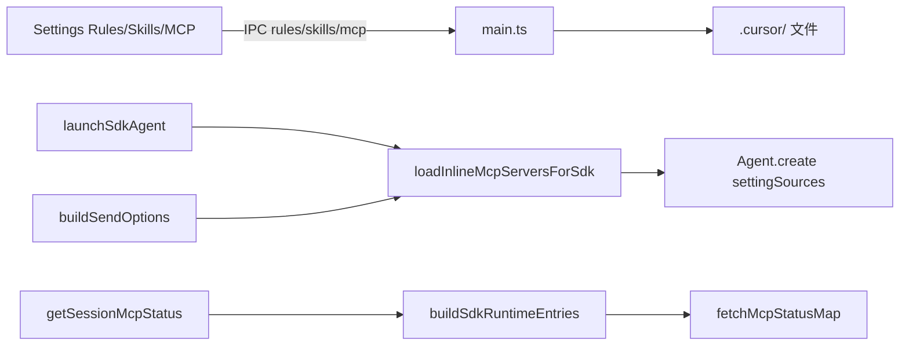

# Cursor SDK 本地配置来源对齐 - 代码评审报告（复评）

> **复评日期**：2026-07-02 · **前置**：T-FIX-01 done（剥离 agent-sdk 越界 persistence/续接；精简 AGENTS.md）

## 1、审查范围

- **变更类型**：apply 产出 + T-FIX-01 范围修复后的复评
- **评审等级**：focused-review（复评关闭 R1/R2，确认 in-scope 完整）
- **涉及文件**：manifest 白名单 11 个代码文件 + 变更文档；`agent-sdk.ts` 已拆分为入口编排（271 行），T2 注入逻辑落 `sdk-run-dispatch.ts`
- **设计文档**：`02-design.md`；验收以 `01-proposal.md` 1–14 与 `03-tasks.md` E1–E8 为准
- **核对方式**：源码 grep + `codegraph_context`（MCP 加载链）；对照 T-FIX-01 修复点

## 2、严重（必须处理）

**无**（R1 已关闭，见 §9 复评结论）

## 3、警告（建议处理）

1. **buildSendOptions 每次 send 重复读盘 inline MCP**（W1，非阻断）
   - 位置: `electron/sdk-run-dispatch.ts:39–51` — `logSdkConfigSources` 与 `appendInlineMcpToSendOptions` 各调用一次 `loadInlineMcpServersForSdk`
   - 说明: resident 高频 send 路径多一次磁盘合并；可将 `injected` 提取为单次变量复用（不影响正确性，可后续优化）

2. **Ponytail 精简（in-scope 部分）**
   - `agent-sdk.ts` 拆分为入口 + `sdk-run-dispatch`/`sdk-session-registry` 等，符合 ≤300 行约束 — **Lean already. Ship.**
   - `session-mcp-sdk-path.ts` 拆分为合理 shrink — **Lean already. Ship.**
   - `SDK_MCP_STDIO_INLINE` 回滚开关为 design 批准项，非 bloat
   - `getMcpPluginNotice` SSOT 复用 Settings/Session 脚注，无多余抽象层

## 4、设计偏差

1. **R1 范围混入（已修复）**
   - 初评：`agent-sdk.ts` 含 `sdk-run-persistence`/续接/watchdog 豁免
   - 复评：`agent-sdk.ts` **无** `sdk-run-persistence` import/re-export；`recoverSdkActiveRuns` 等已迁至 `sdk-run-recover.ts`（归属并行变更 `20260701212827`），本变更 scope 已剥离

2. **其余 in-scope 实现与 design 一致**
   - `mcp-sdk-loader.loadInlineMcpServersForSdk` + `needsInlineInjection` 符合 S4/S5
   - `sdk-run-dispatch` 三处注入语义（`buildSendOptions`/`maybeRotateSessionForPressure`）+ `launchSdkAgent` 统一 `loadInlineMcpServersForSdk`、`settingSources`、`[config]` 日志、`lastInjectedMcpServers` 符合 S5–S7/S13
   - Settings Rules/Skills/MCP Tab、Plugin 说明、`mcp-view-strategy` 符合 S8–S11
   - `session-mcp-sdk-path.buildSdkRuntimeEntries` + SessionMcpPanel 来源标签符合 S12

## 5、验收标准检查

| 任务 | 验收条件 | 状态 |
|------|---------|------|
| T1 | project 覆盖 global 合并 | ✅ 静态：`mergeMcpJsonEntries` |
| T1 | HTTP/sse/OAuth 仍 inline | ✅ `needsInlineInjection` |
| T1 | stdio 默认不 inline、可回滚 | ✅ + `SDK_MCP_STDIO_INLINE` |
| T1 | 无未批准抽象 | ✅ |
| T2 | `[config]` 日志含 cwd/settingSources/inlineMcp | ✅ `launchSdkAgent` + `logSdkConfigSources` |
| T2 | 三处注入统一 `loadInlineMcpServersForSdk` | ✅ launch / send / rotate |
| T2 | rules/hooks/plugins/agents 经 settingSources | ⏳ 运行时（`/kb-test`） |
| T2 | 无重复 MCP 注册 | ⏳ 运行时 E2 |
| T2 | resident send 重传 inline 快照 | ✅ `buildSendOptions` 回写 |
| T2 | 短任务耗时不退化 E8 | ⏳ 运行时 |
| T2 | HTTP/stdio 回归 | ⏳ 运行时 |
| T-Rev1-01 | Rules 落盘主工作区 + UI 明示 | ✅ |
| T-Rev1-01 | 无 workspaceDir 禁用编辑 | ✅ |
| T-Rev1-02 | Skills 用户级说明与保存提示 | ✅ |
| T-Rev1-03 | MCP Tab global/project CRUD | ✅ `SettingsMcpPanel` |
| T-Rev1-03 | 插件层不误标为可 CRUD | ✅ 仅只读说明区 |
| T-Rev1-03 | SettingsMcpPanel ≤300 行 | ✅ 218 行 |
| T-Rev1-04 | Plugin 说明 + IM 验证步骤 | ✅ `getMcpPluginNotice` |
| T-Rev1-04 | mcp-view-strategy 插件文案 | ✅ |
| T3 | Dashboard 与 inline 快照 + probe 一致 | ✅ `buildSdkRuntimeEntries` |
| T3 | 插件层标签 | ✅ `__sdkLoadVia` + `formatMcpScopeLabel` |
| T3 | 优先级展示 | ⏳ 运行时 E3/E6 |
| 01 验收 3–6 | rules/hooks/plugins/agents 生效 | ⏳ 运行时 |
| E1–E8 | 工程补充项 | ⏳ `/kb-test` |

## 6、调用链与回归风险

| 风险点 | 说明 | 本变更阻断 |
|--------|------|-----------|
| stdio MCP 依赖 settingSources | 若 SDK headless 未加载某 stdio 服务，需 `SDK_MCP_STDIO_INLINE=1` 回滚；验收 10 须覆盖 | 否（`/kb-test`） |
| Rules 主工作区 vs 通道 cwd | UI 已明示；非主工作区通道 rules 仍可能不一致（design 已知风险） | 否 |
| daemon-manager `recoverSdkActiveRuns` import | `daemon-manager.ts` 仍 `import { recoverSdkActiveRuns } from "./agent-sdk"`，但 `agent-sdk` 已不再 re-export；函数在 `sdk-run-recover.ts` | **否**（见 §7 accepted_debt） |
| plugin 层识别 | `session-mcp-sdk-path` 基于 `plugin-*` 别名启发式，边界依赖 mcp-auth 形态 | 否 |

## 7、遗留债务

- `Settings.tsx` 仍约 1167 行（历史存量，本变更仅增量挂载 MCP Tab，未恶化行数问题）
- `daemon-manager.ts` → `agent-sdk` 的 `recoverSdkActiveRuns` import **已断裂**（`accepted_debt`）：归属并行变更 `20260701212827-CursorSDK执行引擎事件流消费`（进程重启续接），**不在本 manifest 文件清单**；应在该变更中改为 `import from "./sdk-run-recover"` 或恢复 `agent-sdk` re-export。**不阻断本变更 archive**
- plugin/hooks/rules 运行时行为依赖官方 SDK 能力边界，需 `/kb-test` 手工或冒烟证据

## 8、修复任务建议

| 问题 ID | 建议动作 | 关联任务 | 状态 |
|---------|----------|----------|------|
| R1 | 从 `agent-sdk.ts` 剥离 persistence/续接 | T-FIX-01 | ✅ closed |
| R2 | 精简 `electron/AGENTS.md` 越界段落 | T-FIX-01 | ✅ closed |
| W1 | 可选：`buildSendOptions` 单次 `injected` 变量供 log 与 append 复用 | — | open（非阻断） |
| R3 | `daemon-manager` 改 import `sdk-run-recover` | 事件流变更 | accepted_debt |

## 9、结论

**通过**（复评）。R1/R2 经 T-FIX-01 已关闭：`agent-sdk.ts` 无 `sdk-run-persistence` 依赖；`electron/AGENTS.md` 仅保留 in-scope MCP 分层（`loadInlineMcpServersForSdk`）、`[config]` 可观测与 `session-mcp-sdk-path` 取数器段落，无「SDK Run 续接」/ `sdk-run-persistence` 越界文档。in-scope 的 MCP 分层、Settings 四 Tab 对齐与 SessionMcp 展示与 design 一致。

**stage**：`reviewed`（无 open blocking）

**是否可进入 `/kb-test`**：**是**。静态验收已覆盖 T1–T3 与 Rev1 可静态项；E1–E8 及 rules/hooks/plugins 运行时项待在 `06-automation-test.md` 补策略与证据。
