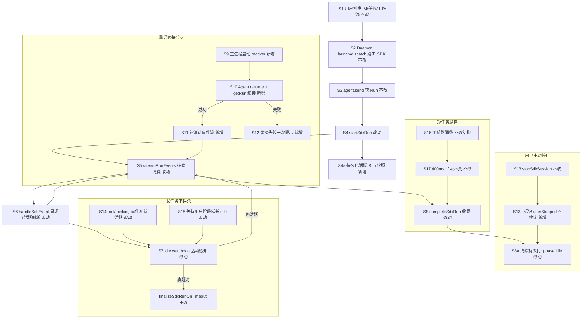
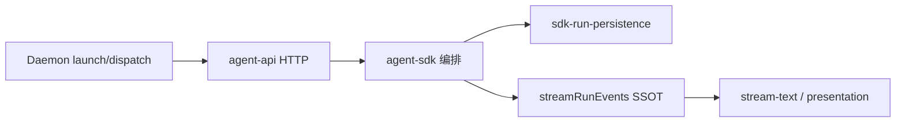

# Cursor SDK 执行引擎事件流消费 - 实现设计

> **业务 PRD**：见同目录 `01-proposal.md`（验收标准以 01 为准）

## 一、业务流程与改动范围

> 业务口径以 `01-proposal.md` 功能需求 F1～F5、边界与例外、验收标准为准；下图覆盖运行启动→持续消费→呈现/状态判断→收尾，及重启续接、长任务保活、短任务、用户停止等关键分支。

### （一）业务流程图



**图例**：`不改` 行为与现网一致；`改动` 需改代码/配置；`新增` 新节点或新分支；`删除` 无（不移除既有 stream 消费主路径）。

### （二）流程步骤与改动对照

| 步骤 ID | 业务含义 | 改动 | 落点（模块/文件） | 01 验收关联 |
|---------|----------|------|-------------------|-------------|
| S1 | IM（飞书/微信）用户发消息入队 | 不改 | `src/daemon.ts` orchestrator；`electron/session-dispatcher.ts` | 验收 1 IM 路径 |
| S1-T | 任务面板触发（`chatType=task/temp`） | 不改 | `electron/session-dispatcher.ts` `launchIndependentAgent` → Daemon `/api/agent/launch` | 验收 1 任务路径 |
| S1-W | 工作流节点触发（`chatType=workflow`） | 不改 | `electron/session-dispatcher.ts` `launchWorkflowAgent` | 验收 1 工作流路径 |
| S2 | Daemon 转发 `POST /api/agent/launch\|dispatch` | 不改 | `src/daemon.ts` `forwardElectronAgentApi`；`electron/agent-sdk.ts` HTTP handler | F1.3 |
| S3 | `agent.send` 获 `Run`，RunGuard 单飞 | 不改 | `electron/agent-sdk.ts` `sendWithRetry` | F5 |
| S4 | `startSdkRun`：processing notify + 挂接消费 | 改动 | `electron/agent-sdk.ts` `startSdkRun` | F2.3 |
| S4a | 启动时写入活跃 Run 持久化记录（agentId/runId/session 呈现态） | 新增 | `electron/sdk-run-persistence.ts`；`electron/agent-sdk.ts` 调用 | F4.1；验收 4 |
| S5 | 运行期间持续 `for await (run.stream())` 消费，禁止仅 `run.wait()` 等终态 | 改动 | `electron/agent-sdk.ts` `streamRunEvents`（或拆出 `sdk-run-stream.ts`） | F1.1；验收 1、2 |
| S6 | 事件驱动呈现：stream-text / presentation-event / UI 日志 | 改动 | `electron/agent-sdk.ts` `handleSdkEvent`；`postStreamText`；`postPresentationEvent` | F1.2、F2.1～F2.3；验收 2 |
| S6a | `onDelta`（压缩/turn-ended）同步刷新 `lastActivityAt` | 改动 | `electron/context-usage.ts` `createAgentSendOptions`；`electron/agent-sdk.ts` 注入 `markSessionActivity` | F3.1、F3.3 |
| S7 | idle watchdog：以事件活跃为准，draining 恢复窗口保留 | 改动 | `electron/agent-sdk.ts` `armRunWatchdog`；`markSessionActivity` | F3.1、F3.3；验收 3 |
| S7a | 工具 running / 等待用户阶段：无新文本事件时仍视为活跃，不进入 cancelling | 改动 | `electron/agent-sdk.ts` `armRunWatchdog.onTick`；`SdkSessionAgent` 扩展 `runPhase` | 验收 3 |
| S8 | Run 结束：`completeSdkRun` 幂等收尾、context footer、phase idle | 改动 | `electron/agent-sdk.ts` `completeSdkRun` | F3.2 |
| S8a | 终态/停止时清除持久化记录 | 新增 | `electron/sdk-run-persistence.ts`；`stopSdkSession` / `completeSdkRun` | F4.4；验收 7 |
| S9 | 主进程启动后扫描未结束 Run 并尝试续接 | 新增 | `electron/daemon-manager.ts` 或 `main.ts` init；`electron/agent-sdk.ts` `recoverSdkActiveRuns` | F4.1；验收 4 |
| S10 | `Agent.resume(agentId)` + `Agent.getRun(runId)` 重建会话 | 新增 | `electron/agent-sdk.ts` `recoverSdkActiveRuns` | F4.1 |
| S11 | 对续接 Run 继续 `run.stream()`/`messages()` 补消费并驱动呈现 | 新增 | `electron/agent-sdk.ts` `streamRunEvents`（复用 SSOT） | F4.2；验收 2 |
| S12 | 续接失败：向原 session 下发**一次**可理解提示 | 新增 | `electron/agent-sdk.ts` `notifyResumeFailure`；`daemon-client` send-text | F4.3；验收 5 |
| S13 | 用户主动停止：abort + cancel run | 不改 | `electron/agent-sdk.ts` `stopSdkSession` | 边界「用户主动停止」 |
| S13a | 停止时写 `userStopped=true`，重启不再续接 | 新增 | `electron/sdk-run-persistence.ts` | F4.4；验收 7 |
| S14 | 多步工具：tool_call/thinking 刷新活跃 | 改动（强化） | `electron/agent-sdk.ts` `handleSdkEvent` | F3.3；验收 2、3 |
| S15 | 长等待用户回复：基于 `lastTool`/`run.status` 延长 idle 容忍 | 改动 | `electron/agent-sdk.ts` `armRunWatchdog` | 验收 3 |
| S16 | 短问答仍走同一消费链，不额外 await 终态 | 不改 | `electron/agent-sdk.ts` `startSdkRun` → `streamRunEvents` | F5.1；验收 6 |
| S17 | stream-text 400ms 节流与 preamble 短窗不变 | 不改 | `electron/agent-sdk.ts` `scheduleStreamPost` | F5.2；验收 6 |
| S18 | 平台侧结束运行（时长上限等） | 不改 | `electron/agent-sdk.ts` `handleSdkEvent` status；`finalize-sdk-run.ts` | 边界表 |

### （三）改动汇总

- **改动**：
  - `electron/agent-sdk.ts`：统一事件流消费 SSOT；`markSessionActivity` 覆盖 stream + onDelta；watchdog 活动感知增强；启动挂接 `recoverSdkActiveRuns`；持久化钩子。
  - `electron/context-usage.ts`：`createAgentSendOptions` 支持可选 `onActivity` 回调。
  - `electron/daemon-manager.ts`（或 `main.ts`）：应用 init 调用恢复逻辑。
- **新增**：
  - `electron/sdk-run-persistence.ts`：活跃 Run 快照读写（`userData/sdk-active-runs.json`）、`userStopped` 标记、恢复清单。
  - `recoverSdkActiveRuns` / `notifyResumeFailure` 续接分支（可置于 `agent-sdk.ts` 或同目录小文件，视行数拆分）。
- **不改（显式列出）**：
  - Claude Code / Codex / OpenCode 执行引擎事件流与续接（`agent-claude-sdk.ts` 等）。
  - Daemon 队列 claim、合并批次、stream-text 出站契约（`src/daemon.ts`）。
  - `finalize-sdk-run.ts` 平台长时超时判定语义（已闭合，本变更不重复改阈值）。
  - Electron 设置 UI、通道凭据配置界面。
  - 非 Cursor SDK 资源路由（`resolveBoundAgentResourceType` 其它引擎分支）。

## 二、整体思路

**根因**（回代码 + 知识库 `06-CursorSDK执行引擎.md` §九）：

1. **F4 缺口**：知识库已注明「无跨进程续接」；`sdkSessions` 纯内存，主进程重启后 `agentId`/`run` 句柄丢失，无法继续 `run.stream()`，用户只能重发。
2. **F3 风险**：watchdog 以 `lastActivityAt` 判 idle（`armRunWatchdog`），仅在 `stream`/`markSessionActivity` 时刷新。长工具执行中若事件稀疏、或 Agent 进入「等待用户回复」而长时间无新 stream 事件，仍可能进入 `draining→cancelling` 误杀（01 验收 3）。
3. **F1 一致性**：IM / 任务 / 工作流三条路径均已收敛到 `launchSdkAgent`/`dispatchToSdkAgent` → `startSdkRun` → `streamRunEvents`（CodeGraph 命中 `session-dispatcher.launchAgent` → Daemon launch → `agent-sdk`）。本变更重点是**强化 SSOT**（禁止旁路 `run.wait()` 作为主路径）与**补齐续接/活跃判定**，而非新建并行引擎。
4. **F5**：现网已在 `streamRunEvents` 并行消费的同时完成呈现；短任务不新增二次等待，保持 `STREAM_POST_INTERVAL_MS=400` 节流。

**方案要点**（见 01 F1～F5）：

1. **事件流 SSOT**：`streamRunEvents` 为唯一运行期消费入口；`handleSdkEvent` 处理 assistant/thinking/tool_call/status；`onDelta` 经 `createAgentSendOptions` 回调刷新活跃；`run.wait()` 仅用于收尾补 `usage` 与 error 详情，不作为主等待路径。
2. **呈现与状态**：沿用 f41 stream-text、presentation-event、三态 phase（`reportSessionAgentPhase`）；事件到达顺序驱动出站，禁止 Run 结束后批量补发过程（01 F2）。
3. **活动感知 watchdog**：保留 `running→draining→cancelling` 状态机与 `NEVER_CANCEL_ON_DURATION` 默认；`onTick` 增加「工具 running / 等待用户 / run 未终态」豁免 idle 取消的条件（S7a、S15）。
4. **重启续接**：Run 启动时持久化 `{ sessionKey, agentId, runId, apiKey, workspaceDir, chatType, streamId?, outboundMessageId?, inboundMessageIds?, runStartedAt, userStopped }`；启动时 `Agent.resume` + `Agent.getRun`（SDK skill §Observing a Run）重挂 `streamRunEvents`；MCP inline 须在 resume 时重传（SDK 不持久化 inline）。失败则一次 IM 提示。
5. **文件拆分**：`agent-sdk.ts` 现约 1700 行，超 AGENTS 300 行约束；实现阶段将**持久化**拆至 `sdk-run-persistence.ts`；若仍超限，将 `streamRunEvents`+`handleSdkEvent` 拆至 `sdk-run-stream.ts`（对称 `agent-cc-events.ts`），`agent-sdk.ts` 保留编排。

**最小方案三问（Ponytail）**：

1. **能否复用 CodeGraph 已定位模块？** 能。核心扩展现有 `streamRunEvents`、`handleSdkEvent`、`armRunWatchdog`、`startSdkRun`、`completeSdkRun`；续接复用 SDK 官方 `Agent.resume` / `Agent.getRun` + 既有 `dispatchToSdkAgent` 呈现链，不新建事件总线或 Presentation 抽象层。
2. **拟新增抽象/依赖是否被 01 明确要求？** 持久化文件 `sdk-run-persistence.ts` 为 F4 所必需（跨进程状态），非 YAGNI；不新增 npm 依赖（沿用 `@cursor/sdk ^1.0.22`）。不引入通用「事件仓库」或 trait 层。
3. **能否合并到已有文件？** 逻辑优先 inline 改动；仅因 **F4 持久化** 与 **300 行硬约束** 允许新建 `sdk-run-persistence.ts`（及必要时 `sdk-run-stream.ts`），理由：单文件继续膨胀将违反仓库 AGENTS 规则且阻碍评审。

## 三、分层设计

- **端点层**：无新增 HTTP 路由；沿用 `POST /api/agent/launch|dispatch`、`/api/stream-text`、`/api/presentation-event`、`/api/send-text`。
- **服务层（Electron）**：
  - `agent-sdk.ts` — 会话编排、launch/dispatch、恢复入口。
  - `sdk-run-persistence.ts` — 活跃 Run 磁盘快照（新增）。
  - `sdk-run-stream.ts`（可选拆分）— `streamRunEvents` + `handleSdkEvent`。
  - `finalize-sdk-run.ts` — 超时终态收尾（挂接不变）。
  - `context-usage.ts` — onDelta 活跃回调注入。
- **Daemon 编排层**：不改；IM/任务/工作流仍经 `forwardElectronAgentApi`。
- **数据层**：`userData/sdk-active-runs.json` 新增；无 config-store schema 变更。



## 四、接口设计

无新增对外 HTTP/IPC 接口。内部新增模块导出（TypeScript，供 `agent-sdk` 调用）：

| 符号 | 入参 | 出参 | 说明 |
|------|------|------|------|
| `persistActiveSdkRun` | `SdkActiveRunRecord` | `void` | Run 启动/进度时 upsert |
| `clearActiveSdkRun` | `sessionKey` | `void` | 终态/用户停止清除 |
| `listRecoverableSdkRuns` | — | `SdkActiveRunRecord[]` | 过滤 `userStopped`、已过期 |
| `recoverSdkActiveRuns` | — | `Promise<RecoverSummary>` | 启动时批量续接 |
| `markSdkRunUserStopped` | `sessionKey` | `void` | `stopSdkSession` 调用 |

沿用 SDK 契约：`run.stream()`（等同 `run.messages()`）、`Agent.resume(agentId, { apiKey, mcpServers, local })`、`Agent.getRun(runId, { runtime, agentId, apiKey })`（以 `@cursor/sdk` 实际签名为准，implement 阶段对照类型定义）。

## 五、数据结构

### SdkActiveRunRecord（`userData/sdk-active-runs.json`）

```typescript
interface SdkActiveRunRecord {
  sessionKey: string
  agentId: string
  runId: string
  apiKey: string          // 与通道资源一致；文件权限随 userData
  workspaceDir: string
  chatType: string
  runStartedAt: number
  /** 呈现续接：stream-text 游标 */
  streamId?: string
  outboundMessageId?: string
  inboundMessageIds?: string[]
  /** 用户主动停止后不再续接 */
  userStopped?: boolean
  /** 最后一次持久化时间 */
  updatedAt: number
}
```

- 写入：S4a `startSdkRun` 后、显著呈现态变化时（`streamId`/`outboundMessageId` 变更）节流写入。
- 清除：S8a `completeSdkRun` 成功收尾、`stopSdkSession`、续接判定 run 已终态。
- 幂等：同 `sessionKey` 仅保留最新一条活跃记录。

### SdkSessionAgent 扩展（内存，可选）

```typescript
/** 运行阶段：供 watchdog 区分等待用户 */
runPhase?: "executing" | "awaiting_user" | "tool_running"
```

- 写入：`handleSdkEvent`（tool running → `tool_running`）；status/工具完成 → `executing`；识别等待用户语义时 → `awaiting_user`（具体判定 implement 阶段对照 SDK status 事件，无法识别时回退 `lastTool.status==="running"` 豁免）。

## 六、实现步骤

1. **S5-S6（F1/F2）**：审计 `agent-sdk.ts`，确认无运行期主路径仅调用 `run.wait()`；强化 `streamRunEvents` 注释与断言；`handleSdkEvent` 全分支调用 `markSessionActivity`。（对应 S5、S6、S14）
2. **S6a（F3）**：`createAgentSendOptions` 增加 `onActivity?`；`buildSendOptions` 传入 `() => markSessionActivity(session, "onDelta")`。（对应 S6a）
3. **S7-S7a-S15（F3）**：扩展 `armRunWatchdog.onTick`：`tool_running`/`awaiting_user`/`lastTool.status==="running"` 时不因 idle 进入 cancelling；保留 draining 宽限期。（对应 S7、S7a、S15）
4. **S4a-S8a（F4 持久化）**：新建 `sdk-run-persistence.ts` 实现读写；在 `startSdkRun`/`completeSdkRun`/`stopSdkSession` 挂接。（对应 S4a、S8a、S13a）
5. **S9-S12（F4 续接）**：实现 `recoverSdkActiveRuns`：`Agent.resume` → `Agent.getRun` → 重建 `SdkSessionAgent` 最小态 → `streamRunEvents`；失败 `notifyResumeFailure` 一次。（对应 S9～S12）
6. **启动挂接**：`daemon-manager` init（`ensureAgentSdkHttpServer` 之后）调用 `recoverSdkActiveRuns`。（对应 S9）
7. **S16-S17（F5）**：回归短任务首包时延；确认无「先 wait 再 stream」双倍等待；跑 IM/任务/工作流各一条典型路径。（对应 S16、S17、验收 6）
8. **行数治理**：若 `agent-sdk.ts` 仍超 300 行，拆分 `sdk-run-stream.ts` 并 re-export。（工程约束）

## 七、参考实现

CodeGraph（`projectPath=/Users/kiki/github/cursor-claw`）命中：

| 符号 | 路径 | 用途 |
|------|------|------|
| `streamRunEvents` | `electron/agent-sdk.ts:915` | 事件流消费 SSOT；`for await (run.stream())` |
| `handleSdkEvent` | `electron/agent-sdk.ts:1053` | assistant/thinking/tool_call/status 映射与呈现 |
| `markSessionActivity` | `electron/agent-sdk.ts:208` | 活跃刷新；draining 恢复 running |
| `armRunWatchdog` | `electron/agent-sdk.ts:812` | idle/draining/cancelling 状态机 |
| `startSdkRun` | `electron/agent-sdk.ts:1040` | 挂接 stream + watchdog + processing notify |
| `completeSdkRun` | `electron/agent-sdk.ts:952` | 幂等收尾、RunGuard 释放 |
| `launchSdkAgent` / `dispatchToSdkAgent` | `electron/agent-sdk.ts:1174/1324` | 三路径统一入口 |
| `launchSdkAgentFromHttp` | `electron/agent-sdk.ts:1479` | task/workflow/IM HTTP 解析 |
| `launchAgent` | `electron/session-dispatcher.ts:258` | 任务/工作流 → Daemon launch |
| `launchWorkflowAgent` | `electron/session-dispatcher.ts:406` | 工作流节点 sessionKey |
| `finalizeSdkRunOnTimeout` | `electron/finalize-sdk-run.ts:110` | 超时收尾（挂接不变） |
| `createAgentSendOptions` | `electron/context-usage.ts:273` | onDelta 压缩/turn-ended |
| `dispatchSessionToAgent` | `src/daemon.ts:1238` | IM orchestrator → launch |

**现网 gap**（对照 01）：

- 已有 `run.stream()` 持续消费（IM/任务/工作流同链路），但**无**跨进程 `Agent.resume`/`getRun` 续接（知识库 §九「无 resume」）。
- watchdog 已有 `markSessionActivity`，但**等待用户/长工具无事件窗口**仍可能触发 idle 取消（待 S7a 加固）。
- `run.wait()` 仅出现在 `finalizeRunContextUsage` 与 `completeSdkRun` error 分支，符合「非主路径」；需保持。

**SDK 续接参考**（`@cursor/sdk` skill）：`Agent.resume(agentId)` 跨进程；`Agent.getRun(runId)` 观察未自启动的 Run；`run.stream()` 别名 `run.messages()`；resume 须重传 `mcpServers`。

## 八、技术影响

### （一）影响范围

- **涉及模块**：`electron/agent-sdk.ts`、`electron/sdk-run-persistence.ts`（新）、`electron/context-usage.ts`、`electron/daemon-manager.ts`；只读依赖 `src/daemon.ts`、`electron/finalize-sdk-run.ts`。
- **接口/proto 变更**：无对外契约变更。
- **数据变更**：新增 `userData/sdk-active-runs.json`；含 apiKey，依赖 Electron userData 目录权限（与 `agent-api-port.json` 同级）。
- **风险**：
  - SDK `Agent.getRun`/`run.stream()` 对**已结束 Run** 的行为需 implement 阶段实测；续接失败须走 S12 兜底。
  - 持久化与内存 `sdkSessions` 不一致时，以单次恢复幂等 + 清除脏记录处理。
  - `agent-sdk.ts` 体量已超 300 行，拆分不当易引入循环 import（持久化模块须单向依赖）。

### （二）工程补充验收项

- [ ] 三条路径（IM 私聊、任务面板 `launchIndependentAgent`、工作流 `launchWorkflowAgent`）运行中 UI 日志可见 `[stream:...]` / `[tool]` / `[status]` 交替出现，非仅 `Agent 运行结束` 一条。
- [ ] `recoverSdkActiveRuns` 启动日志：每条记录 `resumed|failed|skipped` 可检索；失败会话有且仅有一次 IM 提示。
- [ ] 模拟主进程 kill 后重启：进行中 Run 若 SDK 侧仍活跃，用户在原会话收到后续 stream-text；若 Run 已结束，收到续接失败提示而非静默。
- [ ] 用户 `stopSdkSession` 后持久化 `userStopped=true`；重启不再向该 session 推送续接事件。
- [ ] 长工具执行 10min+（或 mock `lastTool.running`）：watchdog 日志不出现 `cancelling`（除非真实超时策略触发）。
- [ ] 短问答人工对比：首段可见反馈相对改造前无明显变慢；无重复「处理中」与「完成」矛盾通知。
- [ ] 新增/拆分文件均 ≤300 行且含中文注释；`sdk-active-runs.json` 写入失败不阻断 Run（WARN + 跳过续接）。

## 九、知识库影响

- `knowledge/业务域/Agent调度/06-CursorSDK执行引擎.md` — §二「无 resume」、§三 规则 2、§四 流程图、§七 watchdog、§九 限制须更新为「支持进程重启续接（有条件）」与事件流 SSOT 描述。
- `knowledge/业务域/Agent调度/01-概览.md` — 若概览图含 SDK 执行链路，补「重启续接」分支（archive 阶段由 kb-librarian 细化）。
- 两级索引：变更 archive 后需更新 `知识索引.md` 或 Agent 调度 `00-README.md` 变更摘要（若用户可见）。

## 十、知识库更新计划

### （一）必须更新

- `knowledge/业务域/Agent调度/06-CursorSDK执行引擎.md` — 续接、事件流消费、watchdog 活动判定、持久化文件说明。

### （二）可能更新（视实现结果）

- `knowledge/业务域/Agent调度/01-概览.md` — 核心状态机补重启分支。
- `electron/AGENTS.md` — SDK 续接与 `sdk-run-persistence` 模块边界（implement/review 登记）。

### （三）不需要更新

- Claude Code / Codex / OpenCode 子模块知识文件（本变更非目标）。
- Daemon 编排、`src/AGENTS.md` 契约（无接口变更）。
- 设置页、通道配置相关知识文件。
