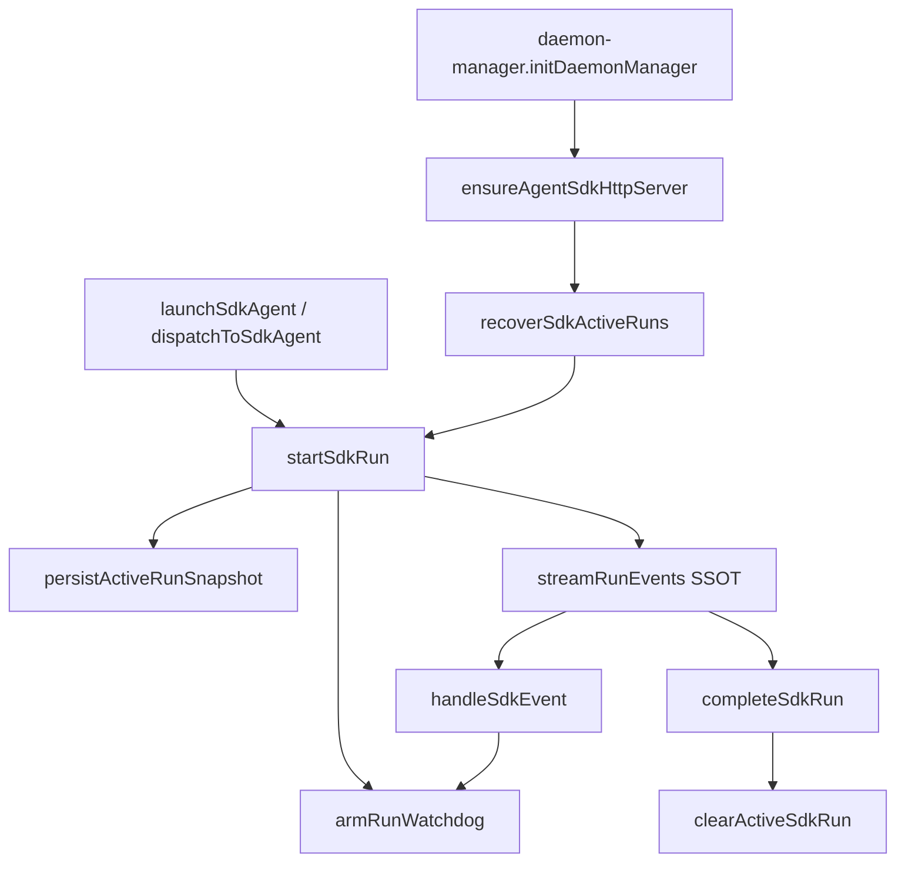

# CursorSDK执行引擎事件流消费 - 代码评审报告

## 1、审查范围

- **变更类型**: apply 产出的未提交变更（3 个修改文件 + 14 个新增拆分模块）
- **评审等级**: focused-review（1 路 CodeGraph + diff 对照设计/任务验收；含 Agent #3 设计偏差与 Ponytail 精简检查）
- **涉及文件**: 17 个归属 code 文件（见 manifest.files）
- **设计文档**: `02-design.md`（对照基准）
- **排除范围**: `main.ts`、MCP Settings、另一变更目录等未归属改动未纳入评分

## 2、严重（必须处理）

无

## 3、警告（建议处理）

无

## 4、设计偏差

1. **`Agent.getRun` 入参与 02 §四 契约略简**
   - 设计预期: `Agent.getRun(runId, { runtime, agentId, apiKey })`
   - 实际实现: `sdk-run-recover.ts` 仅传 `{ runtime: "local", cwd: workspaceDir }`，依赖前置 `Agent.resume` 建立本地上下文
   - 影响: 与 design 文档字面不一致；若未来 SDK 强制要求 `agentId`/`apiKey`，续接需补参。当前实现符合 design §七「以 `@cursor/sdk` 实际签名为准」口径，**不阻断归档**；建议在 `/kb-test` 或 archive 前做一次真实 kill-restart 续接验证

2. **`stopSdkSession` 先 `markSdkRunUserStopped` 再 `clearActiveSdkRun`**
   - 设计预期: 持久化 `userStopped=true` 或清除记录（02 §五、T1 择一）
   - 实际实现: 同函数内标记后立即删除记录，`userStopped` 不会落盘
   - 影响: 功能等价（重启后 `listRecoverableSdkRuns` 为空），与 T5 验收 7 目标一致；仅文档语义与实现路径不同

## 5、验收标准检查

| 任务 | 验收条件 | 状态 |
|------|---------|------|
| T1 | persist/list/clear/mark 读写 `userData/sdk-active-runs.json` | ✅ |
| T1 | 写盘失败 WARN 不 throw | ✅ `sdk-run-persistence.ts:69-81` |
| T1 | 文件 ≤300 行且含中文注释 | ✅ 112 行 |
| T1 | 无未批准抽象/依赖 | ✅ |
| T2 | `createAgentSendOptions` 向后兼容 | ✅ 支持函数第三参与 opts 对象 |
| T2 | `onActivity` 在 summary/turn-ended 触发 | ✅ `context-usage.ts:256-269` |
| T2 | `context-usage.ts` ≤300 行 | ✅ 296 行 |
| T3 | `streamRunEvents` 为 SSOT，`for await (run.stream())` | ✅ `sdk-run-stream.ts:176-182` |
| T3 | `handleSdkEvent` 全分支 `markSessionActivity` | ✅ |
| T3 | `buildSendOptions` 注入 `onActivity` | ✅ `sdk-run-dispatch.ts:45` |
| T3 | `runPhase` 写入 tool/status/request | ✅ |
| T3 | 运行期 consumer 无阻塞 `run.wait()` | ✅ 仅 `finalizeRunContextUsage`/`completeSdkRun` |
| T4 | idle 豁免 `tool_running`/`awaiting_user`/`lastTool.running` | ✅ `sdk-run-watchdog.ts:43-47` |
| T4 | draining 宽限期与 `NEVER_CANCEL_ON_DURATION` 保留 | ✅ |
| T5 | `startSdkRun` 持久化 + 呈现游标节流写盘 | ✅ `sdk-run-lifecycle.ts:41`、`sdk-run-presentation.ts:95` |
| T5 | `completeSdkRun`/`stopSdkSession` 清除活跃记录 | ✅ |
| T5 | `recoverSdkActiveRuns` + `notifyResumeFailure` 一次提示 | ✅ `sdk-run-recover.ts` |
| T5 | 启动日志 `resumed\|failed\|skipped` 可检索 | ✅ |
| T6 | `initDaemonManager` 在 `ensureAgentSdkHttpServer` 后挂接 recover | ✅ `daemon-manager.ts:1263-1267` |
| T6 | `agent-sdk.ts` ≤300 行（272 行） | ✅ |
| T6 | 拆分模块均 ≤300 行、无 persistence→agent-sdk 循环 import | ✅ |
| 02·八·（二） | IM/任务/工作流全路径、kill-restart、长工具不误杀等 | ⚠️ 需 `/kb-test` 人工/集成验证（代码路径已挂接，评审未跑 E2E） |

## 6、调用链与回归风险

| 回归点 | 风险 | 缓解 |
|--------|------|------|
| `agent-sdk.ts` 大拆为多模块 | 外部 import 断裂 | re-export 保持 `daemon-manager`/`session-dispatcher` 路径不变 |
| 续接路径重走 `startSdkRun` | 可能重复下发「Agent 处理中…」 | 低；续接场景可接受；若扰民可后续在 recover 分支跳过 notify |
| `sdk-active-runs.json` 含 apiKey | 本地明文（design 已_ack） | userData 目录权限；非本次新增风险 |
| Watchdog 豁免过宽 | 真卡死 Run 难以及时取消 | 仍保留 absolute timeout（`NEVER_CANCEL_ON_DURATION=false` 时）与 draining 宽限 |

## 7、遗留债务

- **02·八·（二）工程补充验收项**：kill-restart 续接、长工具 10min+、短任务首包对比等须在 `/kb-test` 或上线前人工验证；代码挂接完整，评审未执行运行时测试。
- **Ponytail 精简（Agent #3，非阻断）**：
  1. **shrink:** `sdk-run-persist.ts` 可与 `sdk-run-persistence.ts` 合并（约 -40 行）；当前用于隔离 presentation 写盘节流，**建议保留**。
  2. **yagni:** 12 个 `sdk-run-*` / `sdk-session-*` 模块由 AGENTS ≤300 行与 02 批准，非未授权抽象。
  3. **Lean already. Ship.** — 无新 npm 依赖、无事件总线层。

## 8、修复任务建议

| 问题 ID | 建议动作 | 关联任务 |
|---------|----------|----------|
| — | 无 open 阻断项 | — |

## 9、结论

**通过**，可进入 `/kb-archive`。

依据：T1–T6 代码验收项均满足；无评分 ≥75 的 open 问题；设计偏差两项为文档/契约字面差异且功能等价。归档前建议完成 02·八·（二）运行时验证并同步更新 `knowledge/业务域/Agent调度/06-CursorSDK执行引擎.md`。
