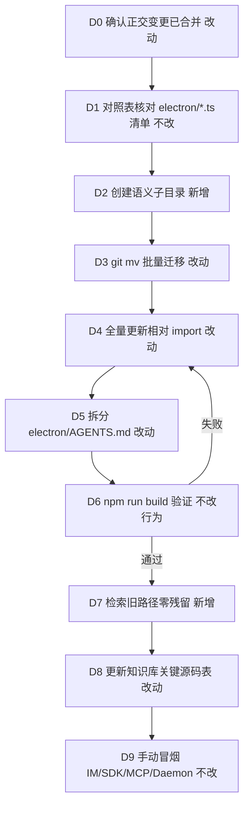
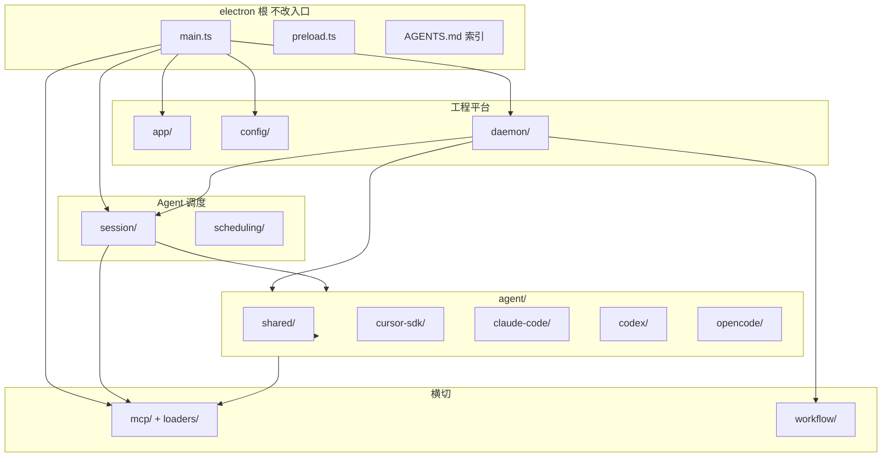

# Electron 主进程目录语义对齐 - 实现设计

> **业务 PRD**：见同目录 `01-proposal.md`（验收标准以 01 为准）

## 一、业务流程与改动范围

> 本变更为纯工程结构重构，无用户可见交互主流程；下图以「开发者执行目录迁移」为业务流，覆盖与现网 IM/SDK/MCP 运行时的关系（运行时链路不改，仅源码落点变）。

### （一）业务流程图

**图例**：`不改` 运行时行为与现网一致；`改动` 需改路径/文档；`新增` 新目录或验收步骤；`删除` 无（不删业务逻辑）。

### （二）流程步骤与改动对照

| 步骤 ID | 业务含义 | 改动 | 落点（模块/文件） | 01 验收关联 |
|---------|----------|------|-------------------|-------------|
| D0 | 与进行中 SDK 变更协调，避免并行改同一文件 | 改动 | 工作流：先 archive/merge `20260701212732`、`20260701212827` 再执行本变更 | 验收 7 |
| D1 | 盘点 `electron/` 全部 `.ts` 与对照表一致 | 不改 | 本 design §一·（二）对照表、`§六` 步骤 1 | 验收 1 |
| D2 | 创建 `app/`、`config/`、`daemon/` 等语义目录 | 新增 | `electron/**/` 子目录树 | 验收 1 |
| D3 | `git mv` 迁移文件，保留 git 历史 | 改动 | 对照表所列 82 个 `.ts` | 验收 1、依赖项迁移方式 |
| D4 | 更新 `electron/` 内全部相对 import；**不**保留旧路径 re-export shim | 改动 | 全部迁移文件；枢纽：`main.ts`、`daemon-manager.ts`、`session-dispatcher.ts`、`agent-sdk.ts` | 验收 2、3 |
| D5 | `electron/AGENTS.md` 升根索引；各子目录 `AGENTS.md` 承接段落 | 改动 | `electron/AGENTS.md` 及 11 个子目录 `AGENTS.md` | 验收 5 |
| D6 | 构建与类型检查通过 | 不改行为 | `electron.vite.config.ts` 入口仍为 `electron/main.ts`、`electron/preload.ts` | 验收 2 |
| D7 | 全仓检索旧扁平路径 import 零命中 | 新增 | `rg 'from \"\\./agent-sdk\"'` 等验收脚本 | 验收 3 |
| D8 | 知识库「关键源码」与工程平台主进程文档路径对齐 | 改动 | `knowledge/业务域/Agent调度/00-README.md`；`knowledge/工程平台/Electron桌面应用/02-主进程与IPC.md` | 验收 4 |
| D9 | IM、任务、工作流、四引擎、MCP、Daemon 冒烟 | 不改 | 运行时模块边界不变 | 验收 6 |

### （三）改动汇总

- **改动**：82 个 `.ts` 文件 `git mv` + 相对 import 全量更新；`electron/AGENTS.md` 分层；知识库路径表。
- **新增**：语义子目录（`app/`、`config/`、`daemon/`、`session/`、`scheduling/`、`agent/{shared,cursor-sdk,claude-code,codex,opencode}/`、`mcp/loaders/`、`workflow/`）；各子目录 `AGENTS.md`；验收检索步骤。
- **不改（显式列出）**：`electron/main.ts`、`electron/preload.ts` **保留根目录**；`electron.vite.config.ts` 入口路径；IPC 通道名与契约；`src/renderer/`、`src/shared/`；Daemon 独立包；业务逻辑与单文件行数（含 `daemon-manager.ts` 1566 行，本变更不拆分）。

#### （二）文件—目录对照表（权威，共 82 个 `.ts`）

**根目录（2，不迁移）**

| 旧路径 | 新路径 |
|--------|--------|
| `electron/main.ts` | `electron/main.ts` |
| `electron/preload.ts` | `electron/preload.ts` |

**`app/`（4）— 工程平台：窗口/托盘/UI 日志/代理**

| 旧路径 | 新路径 |
|--------|--------|
| `electron/main-window.ts` | `electron/app/main-window.ts` |
| `electron/tray.ts` | `electron/app/tray.ts` |
| `electron/ui-logger.ts` | `electron/app/ui-logger.ts` |
| `electron/proxy-env.ts` | `electron/app/proxy-env.ts` |

**`config/`（2）— 工程平台 04-配置与更新**

| 旧路径 | 新路径 |
|--------|--------|
| `electron/config-store.ts` | `electron/config/config-store.ts` |
| `electron/updater.ts` | `electron/config/updater.ts` |

**`daemon/`（3）— Daemon 桥接 + SDK 会话 notify**

| 旧路径 | 新路径 |
|--------|--------|
| `electron/daemon-manager.ts` | `electron/daemon/daemon-manager.ts` |
| `electron/daemon-client.ts` | `electron/daemon/daemon-client.ts` |
| `electron/sdk-daemon-notify.ts` | `electron/daemon/sdk-daemon-notify.ts` |

**`session/`（3）— Agent 调度 02-多会话 + session MCP**

| 旧路径 | 新路径 |
|--------|--------|
| `electron/session-dispatcher.ts` | `electron/session/session-dispatcher.ts` |
| `electron/session-mcp-status.ts` | `electron/session/session-mcp-status.ts` |
| `electron/session-mcp-sdk-path.ts` | `electron/session/session-mcp-sdk-path.ts` |

**`scheduling/`（2）— Agent 调度 04-远程指令 + 05-定时任务**

| 旧路径 | 新路径 |
|--------|--------|
| `electron/command-handler.ts` | `electron/scheduling/command-handler.ts` |
| `electron/cron-scheduler.ts` | `electron/scheduling/cron-scheduler.ts` |

**`agent/shared/`（5）— 跨引擎**

| 旧路径 | 新路径 |
|--------|--------|
| `electron/agent-launcher.ts` | `electron/agent/shared/agent-launcher.ts` |
| `electron/agent-run-guard.ts` | `electron/agent/shared/agent-run-guard.ts` |
| `electron/crash-log-archiver.ts` | `electron/agent/shared/crash-log-archiver.ts` |
| `electron/retry-policy.ts` | `electron/agent/shared/retry-policy.ts` |
| `electron/workspace-injector.ts` | `electron/agent/shared/workspace-injector.ts` |

**`agent/cursor-sdk/`（20）— 06-CursorSDK**

| 旧路径 | 新路径 |
|--------|--------|
| `electron/agent-sdk.ts` | `electron/agent/cursor-sdk/agent-sdk.ts` |
| `electron/agent-sdk-http.ts` | `electron/agent/cursor-sdk/agent-sdk-http.ts` |
| `electron/sdk-api-models.ts` | `electron/agent/cursor-sdk/sdk-api-models.ts` |
| `electron/sdk-session-registry.ts` | `electron/agent/cursor-sdk/sdk-session-registry.ts` |
| `electron/sdk-session-types.ts` | `electron/agent/cursor-sdk/sdk-session-types.ts` |
| `electron/sdk-run-dispatch.ts` | `electron/agent/cursor-sdk/sdk-run-dispatch.ts` |
| `electron/sdk-run-finalize.ts` | `electron/agent/cursor-sdk/sdk-run-finalize.ts` |
| `electron/sdk-run-lifecycle.ts` | `electron/agent/cursor-sdk/sdk-run-lifecycle.ts` |
| `electron/sdk-run-persist.ts` | `electron/agent/cursor-sdk/sdk-run-persist.ts` |
| `electron/sdk-run-persistence.ts` | `electron/agent/cursor-sdk/sdk-run-persistence.ts` |
| `electron/sdk-run-presentation.ts` | `electron/agent/cursor-sdk/sdk-run-presentation.ts` |
| `electron/sdk-run-recover.ts` | `electron/agent/cursor-sdk/sdk-run-recover.ts` |
| `electron/sdk-run-stream.ts` | `electron/agent/cursor-sdk/sdk-run-stream.ts` |
| `electron/sdk-run-watchdog.ts` | `electron/agent/cursor-sdk/sdk-run-watchdog.ts` |
| `electron/finalize-sdk-run.ts` | `electron/agent/cursor-sdk/finalize-sdk-run.ts` |
| `electron/context-usage.ts` | `electron/agent/cursor-sdk/context-usage.ts` |
| `electron/context-usage-pressure.ts` | `electron/agent/cursor-sdk/context-usage-pressure.ts` |
| `electron/context-usage-run-end.ts` | `electron/agent/cursor-sdk/context-usage-run-end.ts` |
| `electron/context-rotation-lite.ts` | `electron/agent/cursor-sdk/context-rotation-lite.ts` |
| `electron/sdk-failure-messages.ts` | `electron/agent/cursor-sdk/sdk-failure-messages.ts` |

**`agent/claude-code/`（10）— 07-ClaudeCodeSDK**

| 旧路径 | 新路径 |
|--------|--------|
| `electron/agent-claude-sdk.ts` | `electron/agent/claude-code/agent-claude-sdk.ts` |
| `electron/agent-cc-stream.ts` | `electron/agent/claude-code/agent-cc-stream.ts` |
| `electron/agent-cc-presentation.ts` | `electron/agent/claude-code/agent-cc-presentation.ts` |
| `electron/agent-cc-types.ts` | `electron/agent/claude-code/agent-cc-types.ts` |
| `electron/agent-cc-utils.ts` | `electron/agent/claude-code/agent-cc-utils.ts` |
| `electron/agent-cc-http.ts` | `electron/agent/claude-code/agent-cc-http.ts` |
| `electron/agent-cc-session-registry.ts` | `electron/agent/claude-code/agent-cc-session-registry.ts` |
| `electron/agent-cc-events.ts` | `electron/agent/claude-code/agent-cc-events.ts` |
| `electron/cc-sdk-hooks.ts` | `electron/agent/claude-code/cc-sdk-hooks.ts` |
| `electron/cc-watchdog-finalize.ts` | `electron/agent/claude-code/cc-watchdog-finalize.ts` |

**`agent/codex/`（10）— 08-CodexSDK**

| 旧路径 | 新路径 |
|--------|--------|
| `electron/agent-codex-sdk.ts` | `electron/agent/codex/agent-codex-sdk.ts` |
| `electron/agent-codex-stream.ts` | `electron/agent/codex/agent-codex-stream.ts` |
| `electron/agent-codex-http.ts` | `electron/agent/codex/agent-codex-http.ts` |
| `electron/agent-codex-watchdog.ts` | `electron/agent/codex/agent-codex-watchdog.ts` |
| `electron/agent-codex-events.ts` | `electron/agent/codex/agent-codex-events.ts` |
| `electron/agent-codex-complete.ts` | `electron/agent/codex/agent-codex-complete.ts` |
| `electron/agent-codex-utils.ts` | `electron/agent/codex/agent-codex-utils.ts` |
| `electron/agent-codex-types.ts` | `electron/agent/codex/agent-codex-types.ts` |
| `electron/agent-codex-session-registry.ts` | `electron/agent/codex/agent-codex-session-registry.ts` |
| `electron/codex-failure-messages.ts` | `electron/agent/codex/codex-failure-messages.ts` |

**`agent/opencode/`（10）— 09-OpenCodeSDK**

| 旧路径 | 新路径 |
|--------|--------|
| `electron/agent-opencode-sdk.ts` | `electron/agent/opencode/agent-opencode-sdk.ts` |
| `electron/agent-opencode-stream.ts` | `electron/agent/opencode/agent-opencode-stream.ts` |
| `electron/agent-opencode-http.ts` | `electron/agent/opencode/agent-opencode-http.ts` |
| `electron/agent-opencode-watchdog.ts` | `electron/agent/opencode/agent-opencode-watchdog.ts` |
| `electron/agent-opencode-events.ts` | `electron/agent/opencode/agent-opencode-events.ts` |
| `electron/agent-opencode-complete.ts` | `electron/agent/opencode/agent-opencode-complete.ts` |
| `electron/agent-opencode-utils.ts` | `electron/agent/opencode/agent-opencode-utils.ts` |
| `electron/agent-opencode-types.ts` | `electron/agent/opencode/agent-opencode-types.ts` |
| `electron/agent-opencode-session-registry.ts` | `electron/agent/opencode/agent-opencode-session-registry.ts` |
| `electron/opencode-failure-messages.ts` | `electron/agent/opencode/opencode-failure-messages.ts` |

**`mcp/`（5）+ `mcp/loaders/`（4）— MCP 管理**

| 旧路径 | 新路径 |
|--------|--------|
| `electron/mcp-manager.ts` | `electron/mcp/mcp-manager.ts` |
| `electron/mcp-types.ts` | `electron/mcp/mcp-types.ts` |
| `electron/mcp-tools-probe.ts` | `electron/mcp/mcp-tools-probe.ts` |
| `electron/mcp-status-map.ts` | `electron/mcp/mcp-status-map.ts` |
| `electron/mcp-project-dir.ts` | `electron/mcp/mcp-project-dir.ts` |
| `electron/mcp-sdk-loader.ts` | `electron/mcp/loaders/mcp-sdk-loader.ts` |
| `electron/cc-mcp-loader.ts` | `electron/mcp/loaders/cc-mcp-loader.ts` |
| `electron/codex-mcp-loader.ts` | `electron/mcp/loaders/codex-mcp-loader.ts` |
| `electron/opencode-mcp-loader.ts` | `electron/mcp/loaders/opencode-mcp-loader.ts` |

**`workflow/`（2）— 工作流域**

| 旧路径 | 新路径 |
|--------|--------|
| `electron/workflow-file.ts` | `electron/workflow/workflow-file.ts` |
| `electron/workflow-runner.ts` | `electron/workflow/workflow-runner.ts` |

## 二、整体思路

**根因**：`electron/` 约 80 个 `.ts` 扁平堆放，文件名前缀与知识库「Agent 调度 / 工程平台 / 工作流」分区语义脱节，定位与 review 成本高。

**方案要点**（追溯 01 §二、§六）：

1. **仅 `git mv` + import 更新**：不合并/拆分业务逻辑，不处理超大文件行数治理。
2. **英文目录名对齐中文子模块**：如 `agent/claude-code/` 对应知识库 `07-ClaudeCodeSDK`（**不用** `cc` 作目录名）。
3. **入口不变**：`main.ts`、`preload.ts` 留根；`electron.vite.config.ts` 不改入口路径。
4. **一次性切换**：electron 无仓外直接 import 主进程模块，**不**在旧路径保留 re-export shim。
5. **MCP loader 统一落点 `mcp/loaders/`**（见下「命名决策」）。

**最小方案三问**：

1. **能否复用现有模块？** 能。仅搬迁路径，符号与文件一一对应，不新建抽象层或 barrel `index.ts`。
2. **新增抽象/依赖是否 PRD 要求？** 否。YAGNI：不引入路径别名（`@electron/*`）、不新增兼容 shim 包。
3. **能否合并到已有文件？** 能且必须——每个逻辑文件保持单体，仅变更物理路径与 import 字符串。

### 命名决策

| 决策项 | 选定方案 | 理由 |
|--------|----------|------|
| Claude 引擎目录 | `agent/claude-code/` | 对齐知识库 `07-ClaudeCodeSDK` 全称语义；`cc` 仅作文件名前缀 |
| Codex / OpenCode | `agent/codex/`、`agent/opencode/` | 与知识库 08/09 编号子模块一致 |
| Cursor SDK 目录 | `agent/cursor-sdk/` | 对应 `06-CursorSDK`；`sdk-run-*`、`context-usage*` 与引擎同目录 |
| MCP loader 四文件 | **`mcp/loaders/`**（单一方案） | loader 均依赖 `mcp/mcp-project-dir`、`mcp/mcp-types`；`session-mcp-status` 同时引用 SDK/CC loader；集中便于 CRUD/探测与引擎执行层解耦。`cc-sdk-hooks` 留在 `agent/claude-code/`（引擎运行时 hook，非配置加载） |
| `sdk-daemon-notify` | `daemon/` | 职责为 Daemon HTTP notify，非 SDK 执行内核 |
| `../src/shared/` 引用 | 迁移后按新深度改写 | 如 `electron/app/main-window.ts` → `../../src/shared/...`；`electron/daemon/daemon-manager.ts` 保持 `../../src/shared/channel-types` |

### import 迁移策略

- **范围**：`electron/` 内所有 `from "./…"` / `from "../…"`；`main.ts` 改为 `from "./config/config-store"` 等。
- **顺序建议**：先 `git mv` 叶节点（`mcp-types`、`retry-policy`），再枢纽（`agent-sdk`、`session-dispatcher`、`daemon-manager`），最后 `main.ts`。
- **跨子树典型路径**（示例）：
  - `agent/cursor-sdk/agent-sdk.ts` → `../../mcp/loaders/mcp-sdk-loader`
  - `session/session-mcp-status.ts` → `../mcp/loaders/cc-mcp-loader`、`../agent/cursor-sdk/agent-sdk`
  - `daemon/daemon-manager.ts` → `../session/session-dispatcher`、`../agent/cursor-sdk/agent-sdk`
- **仓外**：`rg` 确认无 `from ".../electron/agent-sdk"` 类引用（当前为零）；渲染端仅经 IPC，不 import 主进程 TS。

## 三、分层设计

- **端点层**：`main.ts` IPC 注册；各引擎 `*-http.ts` 本地 agent-api（路径随子目录更新，端口契约不变）。
- **服务层**：`session-dispatcher` 调度；`daemon-manager` 生命周期；四引擎 `agent-*-sdk.ts` 执行。
- **数据层**：`config-store`；`workflow-file`；`sdk-run-persistence` 磁盘快照（路径变、文件名不变）。

## 四、接口设计

无变更。IPC 通道名（`config:*`、`daemon:*`、`mcp:*`、`agent:mcp-status`、`sdk:*`、`cc:*` 等）、Daemon HTTP 契约、agent-api 路由与 preload `electronAPI` 签名均保持不变；仅 handler 实现文件的物理路径变化。

## 五、数据结构

无变更。`AppConfig`、`SdkSessionAgent`、`McpServerEntry` 等类型定义随文件迁移，字段与存储键不变。

## 六、实现步骤

1. **D0 — 前置合并**（对应步骤 D0）：确认 `20260701212732`（stage=tested）、`20260701212827`（stage=tested）已 archive 或已 rebase 到本分支；禁止与上述变更并行修改同一 `electron/` 文件。
2. **D1 — 建目录**（D2）：`mkdir -p` 对照表所列子目录（含 `mcp/loaders/`）。
3. **D2 — 分组 git mv**（D3）：按 §一·（二）对照表顺序执行 `git mv`；每组完成后 `git status` 核对无遗漏根目录 `.ts`（除 `main.ts`、`preload.ts`）。
4. **D3 — 更新 import**（D4）：自叶向根批量替换相对路径；优先处理 import 计数高的枢纽：`daemon-manager.ts`（约 22 处）、`agent-sdk.ts`（约 19 处）、`session-dispatcher.ts`（约 9 处）、`main.ts`（约 10 处）。`daemon-manager` 内 `re-export`（如 `export { checkSdkApiKey } from "./agent-sdk"`）同步改路径。
5. **D4 — AGENTS 拆分**（D5）：根 `electron/AGENTS.md` 保留索引表 + 跨模块规矩；将 Claude/CC、Codex、OpenCode、SDK、MCP、Session MCP、归档等段落迁入对应子目录 `AGENTS.md`（`app/`、`config/`、`daemon/`、`session/`、`scheduling/`、`agent/shared/`、`agent/cursor-sdk/`、`agent/claude-code/`、`agent/codex/`、`agent/opencode/`、`mcp/`、`workflow/`）。
6. **D5 — 构建**（D6）：`npm run build`。
7. **D6 — 旧路径检索**（D7）：`rg 'from \"\\./(agent-sdk|daemon-manager|mcp-sdk-loader)' electron/` 等对照表旧名为零命中。
8. **D7 — 知识库**（D8）：按 §十 更新 Agent 调度 README 与工程平台主进程文档。
9. **D8 — 冒烟**（D9）：IM 私聊/群聊、任务、工作流、四引擎 launch/dispatch、Settings MCP、SessionMcpPanel、`daemon` 启停。

## 七、参考实现

> CodeGraph 查询：`projectPath=/Users/kiki/github/cursor-claw`（MCP 默认工作目录未挂载索引，须显式传参）。

### 枢纽符号与调用关系

| 符号 | 路径（迁移前） | 角色 | CodeGraph 命中 |
|------|----------------|------|----------------|
| `registerIpcHandlers` | `electron/main.ts:146` | 应用 IPC 注册入口 | `codegraph_impact`：影响 2 符号，均在 `main.ts` |
| `initDaemonManager` | `electron/daemon-manager.ts:1287` | 启动 Daemon、挂 `initSessionDispatcher`、`recoverSdkActiveRuns` | `codegraph_impact`：定义处 + `main.ts` 调用链 |
| `initSessionDispatcher` | `electron/session-dispatcher.ts:600` | 初始化四引擎 HTTP、调度循环 | `codegraph_impact`：`session-dispatcher` + `daemon-manager.initDaemonManager` |
| `dispatchSessionAgents` | `electron/session-dispatcher.ts:534` | 多会话调度主循环 | `codegraph_context`：与 `daemon-manager` SSE/队列联动 |
| `launchSdkAgent` | `electron/agent-sdk.ts:198` | Cursor SDK 启动 | `codegraph_impact`：**13 符号** — `agent-sdk`、`session-dispatcher`（`launchAgent`/`launchSessionAgent`/`handleChatCommand`/`launchWorkflowAgent`）、`daemon-manager.startDaemon`、`workflow-runner.runWorkflowDefinition` |
| `recoverSdkActiveRuns` | `electron/sdk-run-recover.ts` | 进程重启续接 | `daemon-manager` import（归属 `20260701212827`，迁移后路径 `agent/cursor-sdk/sdk-run-recover.ts`） |
| `getSessionMcpStatus` | `electron/session-mcp-status.ts` | MCP 展示取数 SSOT | `main.ts` IPC `agent:mcp-status`；聚合 `mcp/loaders/*` 与引擎 session |
| `SdkSessionAgent` | `electron/agent-sdk.ts:8` | SDK 会话实体 | `codegraph_context` 多查询入口类型 |

### import 影响面摘要

- **electron 内部**：约 **62/82** 个 `.ts` 含 `from "./` 相对 import（grep 统计），迁移后**全部**需按新深度重写；无仓外 TS 直接 import `electron/*.ts`。
- **最高扇出文件**（迁移前）：`daemon-manager.ts`、`agent-sdk.ts`、`session-dispatcher.ts`、`agent-claude-sdk.ts`、`agent-codex-sdk.ts`、`agent-opencode-sdk.ts`。
- **跨引擎汇聚点**：`session-mcp-status.ts`（SDK + CC + `mcp-status-map`）；`command-handler.ts`（飞书指令）；`main.ts`（IPC 面）。
- **构建入口**：`electron.vite.config.ts` 仅 `resolve("electron/main.ts")` / `preload.ts`，**无需修改**。

### `main.ts` 直接依赖（迁移后目标路径）

`config/config-store`；`daemon/daemon-manager`；`agent/opencode/agent-opencode-utils`；`mcp/mcp-manager`；`session/session-mcp-status`；`agent/shared/workspace-injector`；`app/tray`、`app/updater`、`app/ui-logger`、`app/main-window`。

## 八、技术影响

### （一）影响范围

- **涉及模块**：`electron/` 全部 82 `.ts` + `electron/AGENTS.md` + 11 个子目录 `AGENTS.md`；`knowledge/业务域/Agent调度/00-README.md`；`knowledge/工程平台/Electron桌面应用/02-主进程与IPC.md`。
- **接口/proto 变更**：无。
- **数据变更**：无。
- **风险**：
  - **并行变更冲突**（高）：`20260701212732` 已改 `mcp-sdk-loader`、`agent-sdk`、`session-mcp-*`、`main.ts`；`20260701212827` 已改 `sdk-run-*`、`daemon-manager`、`context-usage`。**实现顺序**：先 archive/merge 上述变更，再执行本变更 `git mv`；禁止并行改同一文件。
  - **import 遗漏**（中）：相对路径层级加深，枢纽 re-export 易漏；以 `npm run build` + `rg` 旧文件名为准。
  - **超大文件**（低）：`daemon-manager.ts` 仅移动不拆分，合并冲突时 diff 面大——依赖 D0 顺序降低概率。

### （二）工程补充验收项

- [ ] `electron/` 根目录除 `main.ts`、`preload.ts`、`AGENTS.md` 外无滞留 `.ts`
- [ ] `rg 'electron/(agent-sdk|daemon-manager|session-dispatcher)\\.ts' --glob '!knowledge/**'` 仅命中知识库历史说明或本变更文档
- [ ] 子目录 `AGENTS.md` 链接在根索引可点击可达
- [ ] `electron.vite.config.ts` 未改入口路径且 build 产物正常
- [ ] 正交变更文件在新路径下逻辑与 merge 前一致（spot check：`sdk-run-recover`、`session-mcp-sdk-path`、`mcp/loaders/mcp-sdk-loader`）

## 九、知识库影响

- `knowledge/业务域/Agent调度/00-README.md` — 「关键源码」表路径全面过时，必须更新。
- `knowledge/工程平台/Electron桌面应用/02-主进程与IPC.md` — 正文引用 `daemon-manager.ts`、`main-window.ts` 等扁平路径，必须更新。
- `knowledge/工程平台/Electron桌面应用/00-README.md` — 可能需补一句「主进程已分子目录」导读（视 02 正文覆盖而定）。
- `knowledge/工程平台/Electron桌面应用/04-配置与更新.md` — 可能引用 `config-store.ts` 扁平路径。
- **两级索引**：`知识索引.md` 无需改（无叶子路径）；Agent 调度 README 为排查主入口。

## 十、知识库更新计划

### （一）必须更新

- `knowledge/业务域/Agent调度/00-README.md` — 「关键源码」表改为 §一·（二）新路径（含 `mcp/loaders/`、`agent/cursor-sdk/sdk-run-*`）。
- `knowledge/工程平台/Electron桌面应用/02-主进程与IPC.md` — 设计决策、IPC 落点、流程表中的文件路径改为子目录形式；补「目录语义与 Agent 调度分区对齐」一句。

### （二）可能更新（视实现结果）

- `knowledge/工程平台/Electron桌面应用/00-README.md` — 阅读路径增加 `electron/AGENTS.md` 根索引说明。
- `knowledge/工程平台/Electron桌面应用/04-配置与更新.md` — 若正文出现 `config-store.ts` 旧路径则改为 `electron/config/config-store.ts`。
- `src/renderer/components/AGENTS.md` — 若仍写 `electron/session-mcp-status` 旧路径则同步。

### （三）不需要更新

- `src/shared/`、`src/renderer/` 业务类型与 IPC 契约文档（无路径绑定）。
- 已归档变更目录内历史 `02-design.md`（保留当时路径作史料）。
- `changelog/` 与 `package.json` version — 纯内部工程结构，archive 阶段按团队规范决定是否记录。
