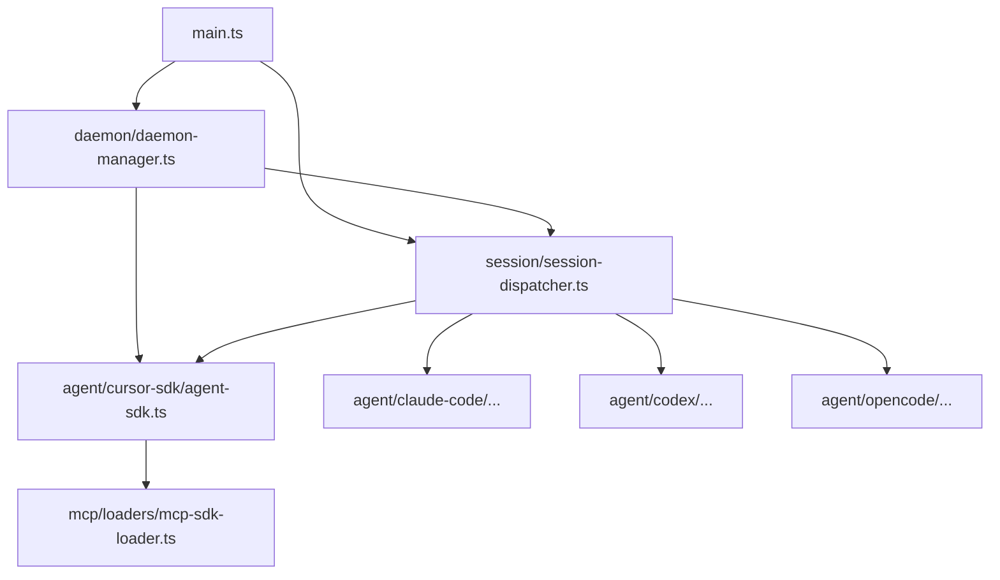

# Electron 主进程目录语义对齐 - 代码评审报告

## 1、审查范围

- **变更类型**: apply 产出的工作区变更（`git mv` + 相对 import 改写 + `AGENTS.md` 分层）
- **评审等级**: focused-review（纯目录重构，无契约/数据/权限变更；枢纽 import 经 CodeGraph + 源码抽查）
- **涉及文件**: 约 86 个 git 变更项（82 个 `electron/**/*.ts` 迁移目标 + 13 个 `AGENTS.md` + 变更文档；不含已删除正交变更目录）
- **设计文档**: `02-design.md` §一·（二）文件—目录对照表（权威，82 `.ts`）
- **评审任务边界**: T0–T10（代码与构建）；T11（知识库路径同步，kb-librarian）单独登记为归档前剩余项

## 2、严重（必须处理）

无

## 3、警告（建议处理）

无（评分 ≥75 项）

**Ponytail 精简（Agent #3）**：Lean already. Ship. — 未引入 barrel `index.ts`、`@electron/*` 别名或旧路径 re-export shim；与 `02` 最小方案三问一致。

## 4、设计偏差

无

对照 `02-design.md` §一·（二）82 文件映射逐项核对：

| 分区 | 设计数量 | 实际 | 状态 |
|------|---------|------|------|
| 根 `main.ts` / `preload.ts` | 2（不迁移） | 2 | ✅ |
| `app/` | 4 | 4 | ✅ |
| `config/` | 2 | 2 | ✅ |
| `daemon/` | 3 | 3 | ✅ |
| `session/` | 3 | 3 | ✅ |
| `scheduling/` | 2 | 2 | ✅ |
| `agent/shared/` | 5 | 5 | ✅ |
| `agent/cursor-sdk/` | 20 | 20 | ✅ |
| `agent/claude-code/` | 10 | 10 | ✅ |
| `agent/codex/` | 10 | 10 | ✅ |
| `agent/opencode/` | 10 | 10 | ✅ |
| `mcp/` + `mcp/loaders/` | 9 | 9 | ✅ |
| `workflow/` | 2 | 2 | ✅ |
| **合计** | **82** | **82** | ✅ |

补充核对：

- `electron/` 根目录除 `main.ts`、`preload.ts`、`AGENTS.md` 外无滞留 `.ts`
- `electron.vite.config.ts` 入口仍为 `electron/main.ts`、`electron/preload.ts`（未改路径）
- 旧扁平路径文件（如 `electron/agent-sdk.ts`）**不存在**；无旧路径 shim 文件

## 5、验收标准检查

| 任务 | 验收条件 | 状态 |
|------|---------|------|
| T0 | 正交变更 `20260701212732`/`20260701212827` 已 archive，无 merge 冲突 | ✅ manifest 登记 done |
| T1 | 15 叶节点 `git mv` + import，根目录无滞留 | ✅ |
| T2 | 9 个 MCP 文件迁至 `mcp/`、`mcp/loaders/` | ✅ |
| T3 | 20 个 Cursor SDK 文件迁至 `agent/cursor-sdk/` | ✅ |
| T4 | 10 个 Claude Code 文件迁至 `agent/claude-code/` | ✅ |
| T5 | 20 个 Codex/OpenCode 文件对称迁移 | ✅ |
| T6 | 3 个 session 文件迁至 `session/` | ✅ |
| T7 | 3 个 daemon 文件迁至 `daemon/`，re-export 新路径 | ✅ |
| T8 | `main.ts` 枢纽 import 全部子目录路径 | ✅ |
| T9 | 根 `AGENTS.md` 索引 + 12 子目录 `AGENTS.md` | ✅（13 个文件：根 + 12 子目录） |
| T10 | `npm run build` 通过；旧扁平 import `rg` 零命中 | ✅ builder 已验收；`rg` 抽查 `electron/` 无 `./agent-sdk` 等旧名 |
| T10 | 01 验收 6 手动冒烟 | ⚪ 未在本评审复测（依赖 builder 验收记录） |
| T11 | 01 验收 4 知识库「关键源码」表同步 | ⏳ pending（kb-librarian，非本评审代码阻断） |

**01 提案验收（代码相关子集）**

| # | 条件 | 状态 |
|---|------|------|
| 1 | 目录树与对照表一致 | ✅ |
| 2 | `npm run build` 通过 | ✅（builder 验收） |
| 3 | 无旧路径 import 残留 | ✅ |
| 4 | 知识库路径同步 | ⏳ T11 |
| 5 | AGENTS 分层 | ✅ |
| 6 | 行为回归冒烟 | ⚪ 未复测 |
| 7 | 正交变更协调 | ✅ T0 done |

## 6、调用链与回归风险

### 枢纽 import 抽查（源码 + CodeGraph）

CodeGraph 索引对迁移后路径存在滞后（仍显示 `electron/agent-sdk.ts` 等旧路径）；以下以仓库实际文件为准。

| 符号 | 新路径 | import 抽查结论 |
|------|--------|----------------|
| `launchSdkAgent` | `electron/agent/cursor-sdk/agent-sdk.ts:88` | `../shared/agent-launcher`、`../../mcp/loaders/mcp-sdk-loader`、`../../app/ui-logger` 等跨树路径正确 |
| `initSessionDispatcher` | `electron/session/session-dispatcher.ts:646` | 四引擎 HTTP、`../daemon/daemon-client`、`../config/config-store` 正确；`daemon-manager.ts:1262` 调用链 intact |
| `initDaemonManager` | `electron/daemon/daemon-manager.ts` | `../session/session-dispatcher`、`../agent/cursor-sdk/agent-sdk` 等约 22 处 import 已更新；re-export 指向新子目录（如 `../agent/cursor-sdk/agent-sdk`） |
| `getSessionMcpStatus` | `electron/session/session-mcp-status.ts` | `../mcp/loaders/cc-mcp-loader`、`../agent/cursor-sdk/agent-sdk` 正确 |
| `main.ts` IPC 注册 | `electron/main.ts` | `./config/config-store`、`./daemon/daemon-manager`、`./session/session-mcp-status` 等无扁平旧路径 |

### 回归风险（低）

| 风险 | 等级 | 说明 |
|------|------|------|
| 相对 import 遗漏 | 低 | `npm run build` 已通过；`electron/` 内旧扁平名 `rg` 零命中 |
| 运行时行为变化 | 低 | diff 为路径/import/`AGENTS.md`；`daemon-manager` 抽样无非 import 逻辑变更 |
| 知识库文档过时 | 中 | T11 未完成时，读者仍可能看到旧扁平路径（不影响编译） |
| CodeGraph 索引滞后 | 低 | 不影响构建；后续索引同步即可 |

## 7、遗留债务

1. **T11 知识库路径同步**（`01` 验收 4）：`knowledge/业务域/Agent调度/00-README.md`、`knowledge/工程平台/Electron桌面应用/02-主进程与IPC.md` 等待 kb-librarian 更新；**归档前须完成**，但不构成 T0–T10 代码评审阻断。
2. **注释级旧路径**：`src/renderer/types/mcp.d.ts:22` 注释仍写 `electron/session-mcp-status`（无 import 绑定）；建议 T11 一并改为 `electron/session/session-mcp-status`。
3. **手动冒烟**（`01` 验收 6）：本评审未复测 IM/SDK/MCP/Daemon 路径；建议 archive 前由负责人做一次轻量冒烟。

## 8、修复任务建议

| 问题 ID | 建议动作 | 关联任务 |
|---------|----------|----------|
| — | 无 open 阻断项 | — |
| D1 | 派发 kb-librarian 执行知识库路径表同步 | T11 |
| D2 | archive 前可选：更新 `mcp.d.ts` 注释路径 | T11 |

## 9、结论

**通过**（T0–T10 代码重构无阻断项），`stage` 可置 `reviewed`。

- **blocking 数**: 0
- **可 archive 条件**: 代码与构建已就绪；**完整归档**须在 T11（知识库同步）完成后以满足 `01` 验收 4，并建议补做 `01` 验收 6 冒烟。
