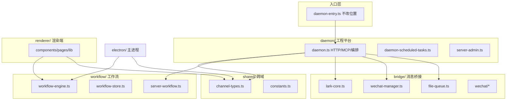

# 渲染端与 Daemon 目录语义对齐 - 实现设计

> **业务 PRD**：见同目录 `01-proposal.md`（验收标准以 01 为准）

## 1、业务流程与改动范围

> 本变更为纯工程结构重构，无用户可见交互主流程。下图含两条并行视角：（A）开发者迁移工作流；（B）现网 IM→Daemon→Electron 运行时链路（行为不改，仅源码落点变）。

### 1.1 业务流程图

```mermaid
flowchart TD
  subgraph migrate ["A 目录迁移工作流"]
    D0["D0 确认 electron 变更已归档/合并 改动"]
    D1["D1 对照表核对 src 文件清单 不改"]
    D2["D2 创建 bridge/workflow/daemon 等目录 新增"]
    D3["D3 git mv 批量迁移 改动"]
    D4["D4 更新 src 内相对 import 改动"]
    D5["D5 更新 electron 对 src 的 import 改动"]
    D6["D6 拆分 src/AGENTS.md 分层 改动"]
    D7["D7 npm run build 验证 不改行为"]
    D8["D8 检索旧路径零残留 新增"]
    D9["D9 更新知识库源码锚点 改动"]
    D10["D10 手动冒烟 不改"]
    D0 --> D1 --> D2 --> D3 --> D4 --> D5 --> D6 --> D7
    D7 -->|通过| D8 --> D9 --> D10
    D7 -->|失败| D4
  end

  subgraph runtime ["B 现网运行时主链路 全部不改"]
    R1["R1 IM 入站 飞书/微信 不改"]
    R2["R2 入队 file-queue 不改"]
    R3["R3 合并批次 MergeBatch 不改"]
    R4["R4 编排 dispatch launch 不改"]
    R5["R5 Electron Agent 执行 不改"]
    R6["R6 Presentation 出站 stream-text 不改"]
    R7["R7 工作流 MCP 触发 不改"]
    R8["R8 渲染端 Dashboard/Settings 不改"]
    R1 --> R2 --> R3 --> R4 --> R5 --> R6
    R4 --> R7
    R8 -.配置/启停.-> R1
  end
```

**图例**：`不改` 运行时行为与现网一致；`改动` 需改路径/文档/import；`新增` 新目录或验收步骤；`删除` 无（不删业务逻辑）。

### 1.2 流程步骤与改动对照

| 步骤 ID | 业务含义 | 改动 | 落点（模块/文件） | 01 验收关联 |
|---------|----------|------|-------------------|-------------|
| D0 | 与 `20260702112559` electron 变更协调，避免并行改同一引用链 | 改动 | 工作流：electron 已归档后执行；`electron/` 对 `src/` 的 import 在本变更 D5 一并更新 | 验收 7 |
| D1 | 盘点 `src/` 全部待迁移文件与对照表一致 | 不改 | 本 design §1.2 后「文件—目录对照表」 | 验收 1 |
| D2 | 创建 `bridge/`、`workflow/`、`daemon/` 语义目录 | 新增 | `src/bridge/`、`src/workflow/`、`src/daemon/` | 验收 1 |
| D3 | `git mv` 迁移文件，保留 git 历史 | 改动 | 对照表 20 个根级/ shared 迁移 `.ts` + `wechat/` 子树 | 验收 1 |
| D4 | 更新 `src/` 内全部相对 import；**不**保留旧路径 re-export shim | 改动 | 枢纽：`daemon/daemon.ts`、`daemon-entry.ts`、`bridge/wechat-manager.ts`、`workflow/workflow-store.ts` | 验收 2、3 |
| D5 | 更新 `electron/` 对 `src/` 的 import（约 16 处） | 改动 | `electron/workflow/workflow-*.ts`、`electron/config/config-store.ts`、`electron/daemon/daemon-client.ts`、`electron/agent/*/` 等 | 验收 2、3、7 |
| D6 | `src/AGENTS.md` 升根索引；Daemon 编排约定下沉 `daemon/AGENTS.md` | 改动 | `src/AGENTS.md`、`src/bridge/AGENTS.md`、`src/workflow/AGENTS.md`、`src/daemon/AGENTS.md`、`src/shared/AGENTS.md`；`renderer/components/AGENTS.md` 保留 | 验收 5 |
| D7 | `npm run build`（含 `build:mcp` + `build:bundle` + electron-vite） | 不改行为 | `tsconfig.json` `rootDir=src` 不变；`daemon-entry.ts` 仍留根 | 验收 2 |
| D8 | 全仓检索旧扁平路径 import 零命中 | 新增 | `rg 'from \"\\./daemon\\.js\"'`、`rg 'src/file-queue'` 等 | 验收 3 |
| D9 | 知识库「源码锚点」表路径对齐 | 改动 | 见 §10.1 清单 | 验收 4 |
| D10 | IM/合并/dispatch/工作流 MCP/渲染端/Daemon HTTP 冒烟 | 不改 | 运行时模块边界不变 | 验收 6 |
| R1–R8 | 现网用户侧主流程 | 不改 | 见上图 B  subgraph | 验收 6 |

#### 文件—目录对照表（权威）

**根目录（2，不迁移逻辑文件）**

| 旧路径 | 新路径 |
|--------|--------|
| `src/daemon-entry.ts` | `src/daemon-entry.ts` |
| `src/AGENTS.md` | `src/AGENTS.md`（内容改为根索引） |

**`bridge/`（11）— 业务域：消息桥接**

| 旧路径 | 新路径 |
|--------|--------|
| `src/file-queue.ts` | `src/bridge/file-queue.ts` |
| `src/wechat-manager.ts` | `src/bridge/wechat-manager.ts` |
| `src/shared/lark-core.ts` | `src/bridge/lark-core.ts` |
| `src/wechat/api.ts` | `src/bridge/wechat/api.ts` |
| `src/wechat/cdn.ts` | `src/bridge/wechat/cdn.ts` |
| `src/wechat/client.ts` | `src/bridge/wechat/client.ts` |
| `src/wechat/crypto.ts` | `src/bridge/wechat/crypto.ts` |
| `src/wechat/index.ts` | `src/bridge/wechat/index.ts` |
| `src/wechat/types.ts` | `src/bridge/wechat/types.ts` |

**`workflow/`（8）— 业务域：工作流**

| 旧路径 | 新路径 |
|--------|--------|
| `src/workflow-engine.ts` | `src/workflow/workflow-engine.ts` |
| `src/workflow-store.ts` | `src/workflow/workflow-store.ts` |
| `src/server-workflow.ts` | `src/workflow/server-workflow.ts` |
| `src/builtin-workflows.ts` | `src/workflow/builtin-workflows.ts` |
| `src/shared/workflow-types.ts` | `src/workflow/workflow-types.ts` |
| `src/shared/workflow-parse.ts` | `src/workflow/workflow-parse.ts` |
| `src/shared/workflow-definition-store.ts` | `src/workflow/workflow-definition-store.ts` |
| `src/shared/template-utils.ts` | `src/workflow/template-utils.ts` |

**`daemon/`（3）— 工程平台：Daemon 守护进程**

| 旧路径 | 新路径 |
|--------|--------|
| `src/daemon.ts` | `src/daemon/daemon.ts` |
| `src/daemon-scheduled-tasks.ts` | `src/daemon/daemon-scheduled-tasks.ts` |
| `src/server-admin.ts` | `src/daemon/server-admin.ts` |

**`shared/`（4）— 跨域共享（≥2 语义子目录引用）**

| 旧路径 | 新路径 | 保留理由 |
|--------|--------|----------|
| `src/shared/channel-types.ts` | `src/shared/channel-types.ts` | bridge + electron + renderer 类型契约 |
| `src/shared/constants.ts` | `src/shared/constants.ts` | daemon + electron（`LOCK_FILE_NAME`） |
| `src/shared/tool-presentation.ts` | `src/shared/tool-presentation.ts` | bridge(`lark-core`) + electron SDK |
| `src/shared/feishu-presentation-gate.ts` | `src/shared/feishu-presentation-gate.ts` | daemon Presentation + 四引擎 electron stream |

**`renderer/`（28 文件）— 工程平台：渲染端**

| 旧路径 | 新路径 |
|--------|--------|
| `src/renderer/**` | `src/renderer/**`（**目录树不迁移**） |

渲染端仅更新 import：`../shared/workflow-types` → `../workflow/workflow-types`；`../../shared/workflow-types` → `../../workflow/workflow-types`（`env.d.ts`、`WorkflowPanel.tsx`）。

### 1.3 改动汇总

- **改动**：20 个 `.ts` 文件 `git mv` + `wechat/` 子树归位 `bridge/wechat/`；`src/` 与 `electron/` 相对 import 全量更新；5 处 `AGENTS.md` 分层；知识库 5+ 处源码锚点。
- **新增**：`bridge/`、`workflow/`、`daemon/` 目录及子目录 `AGENTS.md`；验收检索步骤 D8。
- **不改（显式列出）**：`src/daemon-entry.ts` 留根；`src/renderer/` 目录树不重组；HTTP API 路径与语义；IPC 契约；`electron/` 主进程目录；业务逻辑；`daemon/daemon.ts` 3444 行（本变更不拆分）。

## 2、整体思路

**根因**：`src/` 根目录扁平混合消息桥接、工作流、Daemon 与渲染端，与知识库「消息桥接 / 工作流 / Daemon / 渲染端」分区脱节。

**方案要点**（追溯 01 §二、§六）：

1. **仅 `git mv` + import 更新**：不合并/拆分业务逻辑。
2. **英文目录名对齐中文子模块**：`bridge/`↔消息桥接、`workflow/`↔工作流、`daemon/`↔Daemon 工程平台。
3. **入口不变**：`daemon-entry.ts` 留根；`tsconfig` `rootDir=src` 产出 `dist/daemon-entry.js` → `bundle-daemon.cjs` 链路不变。
4. **一次性切换**：**不**在旧路径保留 re-export shim。
5. **`shared/` 收敛**：仅保留被 bridge+electron、daemon+electron、bridge+electron SDK 等多域引用的 4 个模块；原 `shared/` 中工作流专属 4 文件迁入 `workflow/`。

**最小方案三问**：

1. **能否复用现有模块？** 能。一文件一符号，仅变更物理路径与 import 字符串。
2. **新增抽象/依赖是否 PRD 要求？** 否。YAGNI：不引入 `@src/*` 路径别名、不新增 barrel `index.ts`。
3. **能否合并到已有文件？** 能且必须——每个逻辑文件保持单体，禁止借迁移「顺手」拆 `daemon.ts`。

### 命名决策

| 决策项 | 选定方案 | 理由 |
|--------|----------|------|
| 消息桥接目录 | `bridge/` | 对齐业务域「消息桥接」；`wechat/` 作子目录 |
| 飞书核心 | `bridge/lark-core.ts` | 仅消息桥接域使用（`wechat-manager` 引用媒体缓存常量） |
| 工作流类型 | `workflow/workflow-types.ts` | 工作流域 SSOT；electron/renderer 跨域 import 显式路径 |
| 编排主文件 | `daemon/daemon.ts` | 对齐 Daemon 工程平台；含 HTTP/MCP/编排（Agent调度 Daemon 侧锚点） |
| `server-workflow` | `workflow/server-workflow.ts` | MCP 工作流工具注册，归属工作流域 |
| `server-admin` | `daemon/server-admin.ts` | Daemon 管理 MCP 工具，归属 Daemon 平台 |

### import 迁移策略

| 引用方 | 典型旧路径 | 典型新路径 |
|--------|-----------|-----------|
| `daemon-entry.ts` | `./daemon.js` | `./daemon/daemon.js` |
| `daemon/daemon.ts` | `./file-queue.js` | `../bridge/file-queue.js` |
| `daemon/daemon.ts` | `./shared/lark-core.js` | `../bridge/lark-core.js` |
| `electron/workflow/workflow-runner.ts` | `../../src/workflow-engine` | `../../src/workflow/workflow-engine` |
| `electron/preload.ts` | `../src/shared/workflow-types` | `../src/workflow/workflow-types` |
| `src/renderer/env.d.ts` | `../shared/workflow-types` | `../workflow/workflow-types` |

迁移顺序：**先** `shared/` 工作流文件 → `workflow/`（无外部依赖），**再** `bridge/`、`workflow/` 根级文件，**再** `daemon/`，**最后** `daemon-entry.ts` 与 `electron/` 外部引用。

## 3、分层设计

- **端点层**：`daemon/daemon.ts` HTTP 路由不变；`daemon-entry.ts` 启动入口不变。
- **服务层**：`bridge/` 收发与队列；`workflow/` 引擎与存储；`daemon/` 编排调度与定时任务。
- **数据层**：`file-queue` 磁盘队列路径逻辑不变；`workflow-store` 实例存储不变。

## 4、接口设计

无。沿用现有 Daemon HTTP API（`/api/send-text`、`/api/stream-text`、`/api/agent/launch|dispatch`、`/api/merge-batch/action` 等）与 Electron IPC 契约；本变更不增删路由或通道名。

## 5、数据结构

无。`channel-types`、`workflow-types` 等类型定义仅变更文件路径，字段与 union 不变。

## 6、实现步骤

1. **步骤 1（D0）**：确认 `20260702112559` 已归档；`git pull`/rebase 工作区。
2. **步骤 2（D2）**：`mkdir -p src/bridge/wechat src/workflow src/daemon`。
3. **步骤 3（D3-a）**：`git mv` `shared/workflow-*.ts`、`template-utils.ts` → `workflow/`。
4. **步骤 4（D3-b）**：`git mv` `file-queue.ts`、`wechat-manager.ts`、`shared/lark-core.ts`、`wechat/` → `bridge/`。
5. **步骤 5（D3-c）**：`git mv` `daemon.ts`、`daemon-scheduled-tasks.ts`、`server-admin.ts` → `daemon/`；`git mv` `workflow-*.ts`、`server-workflow.ts`、`builtin-workflows.ts` → `workflow/`。
6. **步骤 6（D4）**：批量更新 `src/` 内 `.js` 后缀相对 import（Node16 ESM）。
7. **步骤 7（D5）**：更新 `electron/` 约 16 处 `src/` 引用（见 §7）。
8. **步骤 8（D6）**：拆分 `AGENTS.md`；根索引链到子目录。
9. **步骤 9（D7–D8）**：`npm run build`；`rg` 旧路径验收。
10. **步骤 10（D9–D10）**：知识库锚点 + 冒烟。

## 7、参考实现

| 符号 | 现路径 | 迁移后 | 说明 |
|------|--------|--------|------|
| `daemonMain` | `src/daemon.ts` | `src/daemon/daemon.ts` | Daemon 主入口，`daemon-entry` 唯一 caller |
| `initFileQueue` | `src/file-queue.ts` | `src/bridge/file-queue.ts` | 消息桥接 04-消息队列与路由 |
| `runAgentDispatchLoop` | `src/daemon.ts` | `src/daemon/daemon.ts` | Agent调度 Daemon 侧编排 |
| `createInstance` | `src/workflow-engine.ts` | `src/workflow/workflow-engine.ts` | electron `workflow-runner` 调用 |
| `parseChatKey` | `src/shared/channel-types.ts` | `src/shared/channel-types.ts` | electron 多模块共享 |
| `getMcpViewConfig` | `src/renderer/lib/mcp-view-strategy.ts` | 不变 | 渲染端 MCP dispatch |

平行参照：`knowledge/变更/归档/20260702112559-Electron主进程目录语义对齐/02-design.md`（同模式 `git mv` + import 切换）。

## 8、技术影响

### 8.1 影响范围

- **涉及模块**：`src/` 全量 29 个非 renderer `.ts` 中 20 个迁移；`src/renderer` 2 文件 import 更新；`electron/` 约 16 文件 import 更新；5 处知识库 README。
- **接口/proto 变更**：无。
- **数据变更**：无。
- **风险**：
  - `daemon.ts` 枢纽 import 遗漏 → 构建或运行时失败（D4 须逐文件核对）。
  - `electron` 深度变化后 `../../../src/shared/` 层数可能变化——当前 electron 已分区，多数为 `../../src/` 或 `../../../src/`，仅 workflow 路径变长一级。
  - `daemon.ts` 3444 行：本变更不拆分，review 时关注纯路径 diff。

### 8.2 工程补充验收项

- [ ] `rg 'from \"\\./daemon\\.js\"' src/daemon-entry.ts` 仅命中新路径 `./daemon/daemon.js`
- [ ] `rg 'src/file-queue|src/wechat-manager|src/workflow-engine' --glob '!knowledge/**'` 零命中（归档目录除外）
- [ ] `dist/daemon-entry.js` 与 `dist-bundle/daemon-entry.mjs` 均成功产出
- [ ] `electron.vite.config.ts` `root: src/renderer` 无需变更
- [ ] `src/renderer/components/AGENTS.md` MCP emptyHint 约定仍有效

## 9、知识库影响

- `knowledge/业务域/消息桥接/00-README.md` — 「源码锚点」表 5 行路径变更
- `knowledge/业务域/工作流/00-README.md` — 「关键源码」表 7 行路径变更
- `knowledge/业务域/Agent调度/00-README.md` — 补充 Daemon 侧编排锚点 `src/daemon/daemon.ts`
- `knowledge/工程平台/Daemon守护进程/00-README.md` — 源码入口改为 `daemon-entry.ts` → `daemon/daemon.ts`
- `knowledge/工程平台/Electron桌面应用/03-渲染端界面.md` — 若正文硬编码 `src/shared/workflow-types` 则更新
- **两级索引**：路径为叶子正文更新，**不**触发 `知识索引.md` 变更

## 10、知识库更新计划

### 10.1 必须更新

- `knowledge/业务域/消息桥接/00-README.md` — 源码锚点表
- `knowledge/业务域/工作流/00-README.md` — 关键源码表
- `knowledge/业务域/Agent调度/00-README.md` — 增补 Daemon orchestrator 行
- `knowledge/工程平台/Daemon守护进程/00-README.md` — 源码入口
- `knowledge/工程平台/Electron桌面应用/03-渲染端界面.md` — 渲染端 workflow 类型引用（若有）

### 10.2 可能更新（视实现结果）

- `knowledge/工程平台/Daemon守护进程/02-HTTP与MCP服务.md` — 若正文列举 `server-workflow.ts` 旧路径
- `electron/config/AGENTS.md` — `channel-types` 路径说明（仍为 `src/shared/channel-types`）

### 10.3 不需要更新

- `knowledge/知识索引.md` — 无领域入口增删
- `knowledge/知识地图.md` — 无产品定位变化
- `electron/` 工程平台文档 — 本变更非目标
