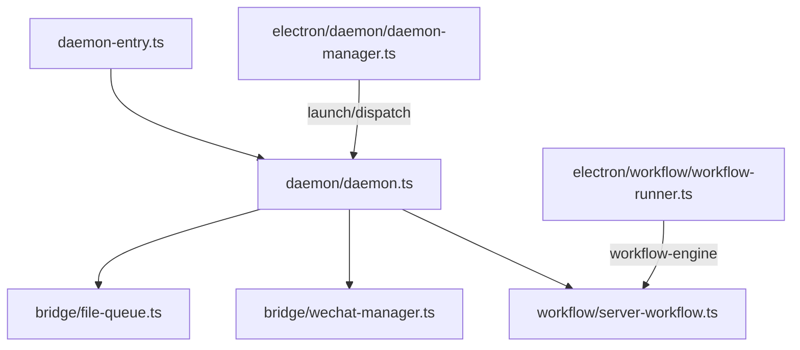

# 渲染端与 Daemon 目录语义对齐 - 代码评审报告

## 1、审查范围

- **变更类型**：apply 产出的工作区变更（`git mv` + 相对 import 改写 + `AGENTS.md` 分层 + 知识库源码锚点同步）
- **评审等级**：focused-review（纯目录重构，无 HTTP/IPC/数据契约变更；枢纽 import 经源码抽查 + `rg` 零残留）
- **涉及文件**：20 个 `.ts` 根级/shared 迁移项 + `wechat/` 子树归位 `bridge/wechat/`；`src/` 与 `electron/` import 更新；5 处 `AGENTS.md` 分层；4 处知识库 README 锚点
- **设计文档**：`02-design.md` §1.2 文件—目录对照表（权威）
- **评审任务边界**：T1–T8（代码、文档、构建）；首轮发现 3 处文档问题经 T-FIX 已闭合

## 2、严重（必须处理）

无

## 3、警告（建议处理）

无（修复后）

首轮 focused-review 发现 3 处文档问题，均已 T-FIX 修复并复评通过：

| ID | 问题 | 落点 | 状态 |
|----|------|------|------|
| R1 | `01-概览.md` 仍引用旧扁平路径 `src/daemon.ts` | `knowledge/工程平台/Daemon守护进程/01-概览.md` | fixed |
| R2 | `workflow/AGENTS.md` 误导性表述（域内禁止 import daemon 与「跨域 import 由对应任务更新」语义冲突） | `src/workflow/AGENTS.md` | fixed |
| R3 | `electron/session/AGENTS.md` 保留项仍指向根 `src/AGENTS.md` SessionMcpPanel 约定，未链到 `renderer/components/AGENTS.md` | `electron/session/AGENTS.md` | fixed |

**Ponytail 精简（Agent #3）**：Lean already. Ship. — 未引入 barrel `index.ts`、`@src/*` 别名或旧路径 re-export shim；与 `02` 最小方案三问一致。

## 4、设计偏差

无

对照 `02-design.md` §1.2 对照表逐项核对：

| 分区 | 设计数量 | 实际 | 状态 |
|------|---------|------|------|
| 根 `daemon-entry.ts` / `AGENTS.md` | 2（不迁移逻辑） | 2 | ✅ |
| `bridge/`（含 `wechat/` 子树） | 11 | 11 | ✅ |
| `workflow/` | 8 | 8 | ✅ |
| `daemon/` | 3 | 3 | ✅ |
| `shared/`（跨域保留） | 4 | 4 | ✅ |
| `renderer/`（目录树不迁移，2 文件 import） | 2 import 更新 | 2 | ✅ |
| **合计迁移 `.ts`** | **20** | **20** | ✅ |

补充核对：

- `src/daemon.ts`、`src/file-queue.ts`、`src/workflow-engine.ts` 等旧根路径**不存在**
- `daemon-entry.ts` 仅 import `./daemon/daemon.js`
- `daemon/daemon.ts` 3443 行：design §1.3 显式「本变更不拆分」；diff 主要为 import 行，无业务逻辑重构
- 无旧路径 re-export shim

## 5、验收标准检查

| 任务 | 验收条件 | 状态 |
|------|---------|------|
| T1 | 前置核对、目录骨架、对照表旧路径存在 | ✅ |
| T2 | workflow 8 文件 `git mv` + 域内 import | ✅ |
| T3 | bridge 9 行（含 wechat 子树）就位 | ✅ |
| T4 | daemon 3 文件迁移 + 枢纽 import + renderer 2 文件 | ✅ |
| T5 | electron 约 16 处 `src/` import 更新 | ✅ |
| T6 | 根 `AGENTS.md` 索引 + 4 子目录 `AGENTS.md` | ✅ |
| T7 | 知识库 4 处 README 源码锚点同步 | ✅ |
| T8 | `npm run build` 通过；旧路径 `rg` 零命中 | ✅（含 `daemon-manager` wechat dynamic import 补修后复跑） |

**01 提案验收（代码相关子集）**

| # | 条件 | 状态 |
|---|------|------|
| 1 | 目录树与对照表一致 | ✅ |
| 2 | `npm run build` 通过 | ✅ |
| 3 | 无旧路径 import 残留 | ✅ |
| 4 | 知识库路径同步 | ✅（含 R1 T-FIX） |
| 5 | AGENTS 分层 | ✅ |
| 6 | 行为回归冒烟 | ⚪ 未在本评审复测（纯路径重构，依赖 builder 验收） |
| 7 | 与 electron 平行变更协调 | ✅ |

## 6、调用链与回归风险

### 枢纽 import 抽查（源码）

| 符号 | 新路径 | import 抽查结论 |
|------|--------|----------------|
| `daemonMain` | `src/daemon/daemon.ts` | `../bridge/file-queue.js`、`../workflow/server-workflow.js`、`../shared/channel-types.js` 等跨域路径正确 |
| `daemon-entry` | `src/daemon-entry.ts` | `./daemon/daemon.js` 唯一入口 |
| `workflow-runner` | `electron/workflow/workflow-runner.ts` | `../../src/workflow/workflow-engine` 等新路径正确 |
| `preload` | `electron/preload.ts` | `../src/workflow/workflow-types` 正确 |
| `WorkflowPanel` | `src/renderer/components/WorkflowPanel.tsx` | `../../workflow/workflow-types` 正确 |

### 回归风险（低）

| 风险 | 等级 | 说明 |
|------|------|------|
| 相对 import 遗漏 | 低 | `npm run build` 已通过；全仓旧扁平路径 `rg` 零命中 |
| 运行时行为变化 | 低 | diff 为路径/import/`AGENTS.md`/知识库锚点；无 HTTP 路由或 IPC 契约变更 |
| `daemon.ts` 体量 | 低 | 3443 行未拆分属 design 允许范围；后续独立变更治理 |
| 手动冒烟 | 低 | IM/dispatch/工作流 MCP 未复测；建议 archive 前轻量冒烟 |

## 7、遗留债务

无 open 阻断项。

- **R1–R3**：均已 T-FIX 闭合，复评无残留警告。
- **手动冒烟**（`01` 验收 6）：本评审未复测；纯结构重构风险低，archive 前可选补做。

## 8、修复任务建议

| 问题 ID | 建议动作 | 关联 | 状态 |
|---------|----------|------|------|
| R1 | 更新 `01-概览.md` 源码路径为 `src/daemon/daemon.ts` | T-FIX | fixed |
| R2 | 修正 `workflow/AGENTS.md` 职责边界与禁止条款表述 | T-FIX | fixed |
| R3 | `session/AGENTS.md` 保留项改链 `src/renderer/components/AGENTS.md` | T-FIX | fixed |
| — | 无 open 阻断项 | — | — |

## 9、结论

**通过**，可进入 `/kb-archive`。

- **blocking 数**：0
- **warning 数**（修复后）：0
- **验收**：T1–T8 全 ✅；20 文件 `git mv` 就位，import 零残留；`npm run build` 通过
- **archive 条件**：代码、构建、知识库锚点已就绪；建议 archive 前可选补做 `01` 验收 6 手动冒烟
