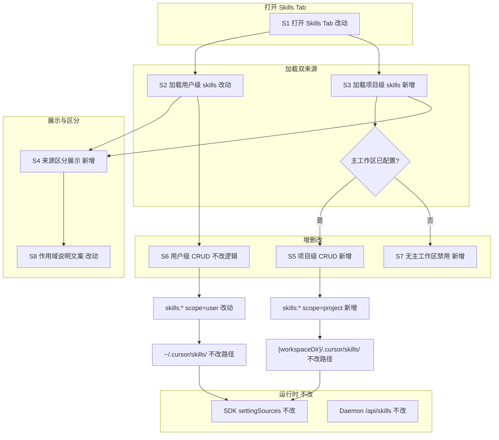
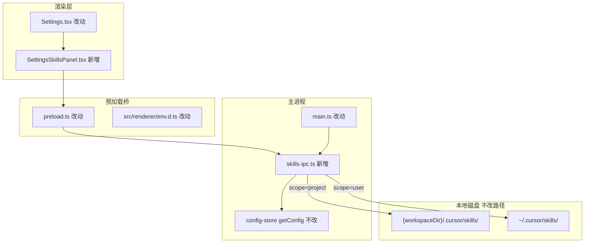

# 项目级 Skills 显示与管理 - 实现设计

> **业务 PRD**：见同目录 `01-proposal.md`

## 1、业务流程与改动范围

### 1.1 业务流程图



**图例**：`不改` 行为与现网一致；`改动` 扩展现有逻辑或文案；`新增` 新分支/UI/模块；`删除` 本变更无删除项。

### 1.2 流程步骤与改动对照

| 步骤 ID | 业务含义 | 改动 | 落点文件 | 01 验收关联 |
|---------|----------|------|----------|-------------|
| S1 | 打开 Settings **Skills** 标签页 | 改动 | `Settings.tsx` 挂载 `SettingsSkillsPanel`；`SettingsSkillsPanel.tsx` 新增 | 1、2、3 |
| S2 | 加载用户级 skills 列表与目录树 | 改动 | `skills-ipc.ts` `resolveSkillsDir("user")`；`preload.ts`/`env.d.ts` 带 `scope`；`SettingsSkillsPanel` 下区块 | 2、3、6 |
| S3 | 加载项目级 skills（依赖主工作区） | 新增 | 同上 `scope="project"`；路径 `{workspaceDir}/.cursor/skills/` | 1、3、4、5 |
| S4 | 双区块 + 标题区分「项目级 / 用户级」 | 新增 | `SettingsSkillsPanel.tsx` 上项目、下用户；expand key `${scope}/${skillName}` | 3、8 |
| S5 | 项目级新建/编辑/重命名/删除及目录内文件维护 | 新增 | `skills-ipc.ts` 写操作 `scope==="project"` + 工作区校验；面板 CRUD 传 `scope` | 4、5 |
| S6 | 用户级增删改（逻辑与现网一致） | 不改逻辑 | 默认 `scope="user"`；自 `Settings.tsx` 迁入面板 | 2、6 |
| S7 | 无主工作区：项目操作禁用 + 琥珀色提示 | 新增 | 对齐 Rules info box（`Settings.tsx` L608-620）；`disabled={!workspaceDir}` | 6、8 |
| S8 | 作用域说明：双来源 + 主工作区绑定口径 | 改动 | 项目区复用 Rules 文案结构；用户区保留 `~/.cursor/skills` 与 `settingSources` 说明 | 7、8 |

### 1.3 改动汇总

- **新增**：`electron/skills-ipc.ts`（`registerSkillsIpcHandlers`、`resolveSkillsDir`、`buildSkillTree`）；`src/renderer/components/SettingsSkillsPanel.tsx`（双区块 UI）；`SkillScope` 类型与 IPC `scope` 末位可选参数。
- **改动**：`electron/main.ts` 删除内联 `skills:*`，改为调用注册函数；`preload.ts`、`env.d.ts` API 签名；`Settings.tsx` Skills Tab 替换为面板组件并传入 `workspaceDir`。
- **不改**：`agent-sdk` `settingSources: ["project","user"]`；`workspace-injector`；Daemon `src/daemon/daemon.ts` `/api/skills`（仅用户级）；用户级存储路径语义。

## 2、整体思路

**根因**：`electron/main.ts` L180-281 全部 `skills:*` handler 硬编码 `path.join(os.homedir(), ".cursor", "skills")`，渲染层 `Settings.tsx` Skills Tab 仅调用无 `scope` 的 preload API，且文案将 Skills 整体描述为用户级。SDK 运行时经 `settingSources` 已可加载项目 skills，形成「后台可加载、前台不可见不可管」断层。

**方案**：为 `skills:*` IPC 增加末位可选参数 `scope: SkillScope = "user"`；`project` 时解析 `getConfig().workspaceDir/.cursor/skills/`，写操作在无主工作区时返回与 `rules:save` 一致的错误契约；渲染层拆出 `SettingsSkillsPanel`，上项目下用户双区块，交互对齐 Rules Tab。

**边界（01 非目标）**：不改 Daemon/IM Skills 管理；不改 CC/Codex 引擎配置源；不改用户级目录语义；不引入插件级等其他来源展示。

**Ponytail 最小方案三问**：

1. **复用现有模块？** 是。复用 `rules:*` 工作区校验模式（`getConfig().workspaceDir` + 固定中文错误文案）；复用现网 Skills 树渲染与 CRUD 交互逻辑（自 `Settings.tsx` 迁入面板）；不新建配置中心服务。
2. **新增抽象是否必要？** 否。仅新增 `SkillScope` 联合类型与 `resolveSkillsDir(scope)` 纯函数；无 trait、无新 npm 依赖。
3. **能否合并到已有文件？** 否，须拆分：`main.ts` 已 349 行（超 300 行规范），内联 `skills:*` 约 100 行须迁至 `skills-ipc.ts`；`Settings.tsx` 已 1167 行，Skills Tab 约 370 行须迁至 `SettingsSkillsPanel.tsx`（目标 ≤300 行）。

## 3、分层设计



| 层级 | 职责 | 本变更落点 |
|------|------|------------|
| 端点（Renderer） | 双来源展示、禁用态、文案 | `SettingsSkillsPanel.tsx` |
| 桥接（Preload） | 类型安全的 `scope` 透传 | `preload.ts`、`env.d.ts` |
| 服务（Main IPC） | 路径解析、树构建、CRUD | `skills-ipc.ts` |
| 数据（FS） | 按 scope 读写目录 | 项目/用户 `.cursor/skills/` |

## 4、接口设计

### 4.1 主进程 `skills:*` IPC

公共约定：

- `SkillScope = "user" | "project"`，各 handler **末位**可选参数，省略时默认 `"user"`（向后兼容）。
- `resolveSkillsDir(scope)`：`user` → `path.join(os.homedir(), ".cursor", "skills")`；`project` → `path.join(workspaceDir, ".cursor", "skills")`（`workspaceDir` 来自 `getConfig().workspaceDir`）。
- **写操作**（`save`/`save-file`/`create-dir`/`delete*`/`rename`）当 `scope==="project"` 且 `!workspaceDir`：返回 `{ ok: false, error: "未配置主工作区，无法保存规则。请先在「通用」中设置主工作区。" }`（与 `rules:save` L161-162 文案一致；实现时可抽共享常量 `WORKSPACE_REQUIRED_ERROR`）。

| Channel | 签名（扩展后） | 读/写 | project 无工作区行为 |
|---------|----------------|-------|----------------------|
| `skills:list` | `(_, scope?: SkillScope)` → `{ name, content }[]` | 读 | 返回 `[]` |
| `skills:tree` | `(_, scope?: SkillScope)` → `SkillTreeNode[]` | 读 | 返回 `[]` |
| `skills:read-file` | `(_, skillName, relativePath, scope?)` → `{ ok, content?, error? }` | 读 | `{ ok: false, error }` 或空内容 |
| `skills:save-file` | `(_, skillName, relativePath, content, scope?)` | 写 | `{ ok: false, error }` |
| `skills:create-dir` | `(_, skillName, relativePath, scope?)` | 写 | `{ ok: false, error }` |
| `skills:delete-file` | `(_, skillName, relativePath, scope?)` | 写 | `{ ok: false, error }` |
| `skills:save` | `(_, name, content, scope?)` → `{ ok, skillsDir?, error? }` | 写 | `{ ok: false, error }`；成功时 `skillsDir` 为实际根目录 |
| `skills:rename` | `(_, oldName, newName, scope?)` | 写 | `{ ok: false, error }` |
| `skills:delete` | `(_, name, scope?)` | 写 | `{ ok: false, error }` |

`skills:save` 成功返回：`user` 保持现网 `skillsDir: ~/.cursor/skills`；`project` 返回 `skillsDir: {workspaceDir}/.cursor/skills`（供保存提示）。

### 4.2 Preload `ElectronAPI`

```typescript
type SkillScope = "user" | "project"

getSkills: (scope?: SkillScope) => Promise<SkillFile[]>
getSkillTree: (scope?: SkillScope) => Promise<SkillTreeNode[]>
readSkillFile: (skillName: string, relativePath: string, scope?: SkillScope) => Promise<...>
saveSkillFile: (skillName: string, relativePath: string, content: string, scope?: SkillScope) => Promise<...>
createSkillDir: (skillName: string, relativePath: string, scope?: SkillScope) => Promise<...>
deleteSkillFile: (skillName: string, relativePath: string, scope?: SkillScope) => Promise<...>
saveSkill: (name: string, content: string, scope?: SkillScope) => Promise<...>
renameSkill: (oldName: string, newName: string, scope?: SkillScope) => Promise<...>
deleteSkill: (name: string, scope?: SkillScope) => Promise<...>
```

`preload.ts` 与 `src/renderer/env.d.ts` 须同步导出/声明 `SkillScope`。

### 4.3 错误契约（对齐 rules）

| 场景 | 返回 |
|------|------|
| 未配置主工作区（project 写） | `{ ok: false, error: "未配置主工作区，无法保存规则。请先在「通用」中设置主工作区。" }` |
| 文件不存在（读/删） | `{ ok: false, error: "文件不存在" }` |
| 重命名目标已存在 | `{ ok: false, error: "目标目录已存在" }` |
| 重命名源不存在 | `{ ok: false, error: "原目录不存在" }` |

## 5、数据结构

```typescript
/** Skills 存储作用域 */
type SkillScope = "user" | "project"

/** 列表项（可选扩展，渲染层本地使用） */
interface SkillFile {
  name: string
  content: string
  scope?: SkillScope  // 面板合并列表时标注来源，非 IPC 强制字段
}

/** 目录树节点（现网不变） */
interface SkillTreeNode {
  name: string
  type: "file" | "directory"
  children?: SkillTreeNode[]
}
```

- **expand 状态 key**：`${scope}/${skillName}` 或 `${scope}/${skillName}/${relativePath}`，防止同名 skill 在用户级与项目级展开冲突。
- **面板 props**：`SettingsSkillsPanel({ workspaceDir: string })`，由 `Settings.tsx` 传入（与 Rules/MCP 一致）。

## 6、实现步骤

| 序号 | 步骤 | 回溯步骤 ID | 要点 |
|------|------|-------------|------|
| 1 | 新建 `electron/skills-ipc.ts`：`SkillScope`、`resolveSkillsDir`、`buildSkillTree`、`registerSkillsIpcHandlers` | S2-S5 | 自 `main.ts` L180-281 迁移并加 scope |
| 2 | `main.ts` 删除内联 skills handler，调用 `registerSkillsIpcHandlers()` | S2-S5 | 缩减 main 行数 |
| 3 | 更新 `preload.ts`、`env.d.ts` API 签名与 `SkillScope` | S2-S6 | 默认参数保持兼容 |
| 4 | 新建 `SettingsSkillsPanel.tsx`：双区块 UI、双 `refresh`、`scope` 透传、expand key 前缀 | S1、S4、S7、S8 | 上项目下用户；对齐 Rules info box |
| 5 | `Settings.tsx` Skills Tab 替换为 `<SettingsSkillsPanel workspaceDir={workspaceDir} />`，删除已迁出 state/handler | S1、S6 | 减少 Settings 体积 |
| 6 | 保存成功提示按 scope 区分目录文案 | S5、S6、S8 | 用户级保持绿色 hint；项目级指向工作区路径 |
| 7 | 手工验收 01 §五 八条 + §8.2 工程项 | 全部 | 见下节 |

## 7、参考实现

| 符号/区域 | 路径 | 说明 |
|-----------|------|------|
| `rules:list/save/delete` | `electron/main.ts` L146-178 | 项目级工作区校验与路径模板 |
| `skills:*`（现网） | `electron/main.ts` L180-281 | 待迁移的用户级实现与 `buildTree` |
| `getSkills` 等 preload | `electron/preload.ts` L290-298 | 待扩展 scope |
| Rules info box + 禁用 | `src/renderer/pages/Settings.tsx` L605-642 | UI 对齐模板 |
| Skills Tab（现网） | `src/renderer/pages/Settings.tsx` L400-771、L686-769 | 待迁入面板 |
| `settingSources` | `electron/agent/cursor-sdk/agent-sdk.ts` L142 | `["project","user"]`，本变更不改 |
| Daemon skills | `src/daemon/daemon.ts` `/api/skills` | 仅用户级，本变更不改 |

## 8、技术影响

### 8.1 影响范围

- **用户可见**：Settings Skills Tab 新增项目级区块与管理能力；文案从「仅用户级」改为双来源。
- **IPC 兼容**：`scope` 省略时行为与现网一致，无破坏性变更。
- **文件行数**：`main.ts`、`Settings.tsx` 减负；新增两文件须各自 ≤300 行。
- **风险**：低。不涉及 Daemon 协议、SDK 注入或会话调度；仅主进程 FS 路径分支与渲染层 UI。

### 8.2 工程补充验收项

| ID | 验收项 |
|----|--------|
| E1 | `electron/main.ts` 行数 ≤300（skills 逻辑迁出后） |
| E2 | `SettingsSkillsPanel.tsx` 行数 ≤300 |
| E3 | 所有 `skills:*` handler 经 `resolveSkillsDir` 单点解析，无散落 `homedir` 硬编码 |
| E4 | `preload.ts` 与 `env.d.ts` 中 Skills API 签名一致 |
| E5 | 未配置主工作区时 `getSkills("project")`/`getSkillTree("project")` 不抛错（空列表） |
| E6 | 同名 skill 存在于 user/project 时，展开/编辑互不干扰（expand key 含 scope） |

## 9、知识库影响

- **Agent 调度**：`knowledge/业务域/Agent调度/06-CursorSDK执行引擎.md` Skills 行仍将 Skills 描述为仅用户级，与代码/SDK 双来源不一致。
- **Electron IPC 文档**：`knowledge/工程平台/Electron桌面应用/02-主进程与IPC.md` Skills 行未记载 `scope` 与项目路径。
- **设置界面知识**：若存在将 Skills Tab 记为单来源的归档/进行中变更文档，归档时需交叉核对。

## 10、知识库更新计划

### 10.1 必须更新

| 文件 | 更新要点 |
|------|----------|
| `knowledge/业务域/Agent调度/06-CursorSDK执行引擎.md` | Skills：用户级 `~/.cursor/skills` + 项目级 `{workspaceDir}/.cursor/skills`；设置界面双来源管理；运行时经 `settingSources` 加载 |
| `knowledge/工程平台/Electron桌面应用/02-主进程与IPC.md` | `skills:*` 增加 `SkillScope` 末位参数；`skills-ipc.ts` 模块；project 路径与 rules 同级错误契约 |

### 10.2 可能更新

| 文件 | 条件 |
|------|------|
| `knowledge/工程平台/Electron桌面应用/01-概览.md` | 若 Settings 子模块清单仍写 Skills 仅用户级 |
| `src/renderer/AGENTS.md` 或 `electron/AGENTS.md` | 若实现阶段沉淀 SettingsSkillsPanel / skills-ipc 边界约定 |

### 10.3 不需要更新

- Daemon `/api/skills` 相关文档（本变更不改）。
- `workspace-injector`、`agent-sdk` settingSources 实现文档（行为不变）。
- CC/Codex Skills 配置源文档（01 非目标）。
