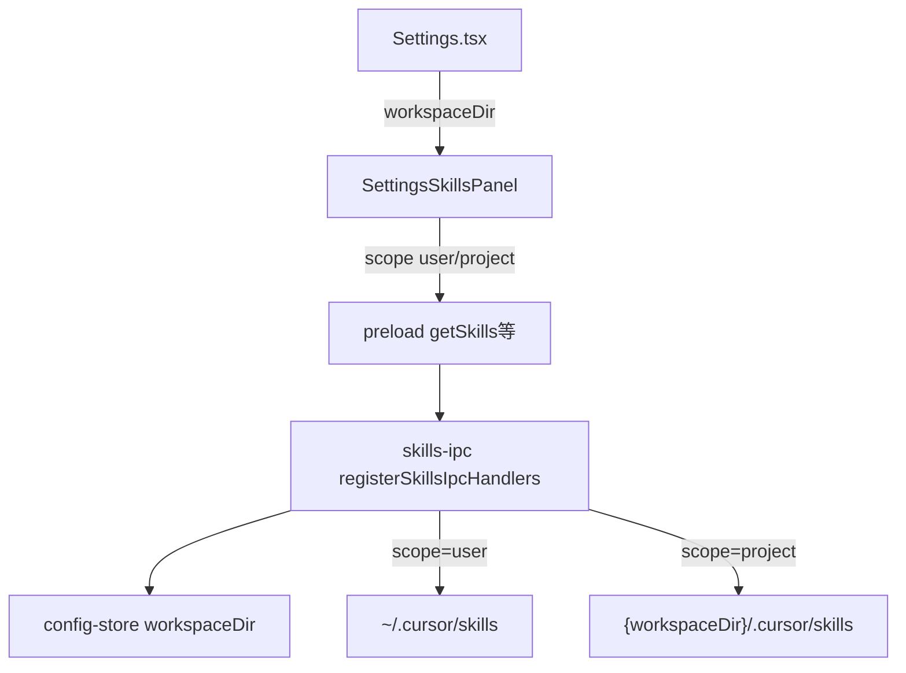

# 项目级 Skills 显示与管理 - 代码评审报告

## 1、审查范围

- **变更类型**: apply 产出的工作区变更（主进程 IPC 模块拆分 + Preload/类型扩展 + Settings Skills 双区块 UI）
- **评审等级**: focused-review（本地 IPC + Settings UI，非跨端/资金/安全全量）
- **涉及文件**:
  - 新建: `electron/skills-ipc.ts`、`src/renderer/components/SettingsSkillsPanel.tsx`、`src/renderer/components/SkillTreeBlock.tsx`、`src/renderer/components/SkillEditModals.tsx`
  - 修改: `electron/main.ts`、`electron/preload.ts`、`src/renderer/env.d.ts`、`src/renderer/pages/Settings.tsx`、`src/renderer/components/AGENTS.md`、`electron/AGENTS.md`
- **设计文档**: `02-design.md`（对照基准）；任务: `03-tasks.md` T1–T4
- **评审任务边界**: T1–T4（代码与 UI）；知识库同步（KB-01）登记为归档前剩余项，不阻断本评审通过

## 2、严重（必须处理）

无

## 3、警告（建议处理）

首轮评审发现 6 项警告，均已 **T-FIX 内联修复**（无单独 T-FIX 任务落盘）：

| ID | 问题 | 修复 | 状态 |
|----|------|------|------|
| R1 SKILL-001 | 首进 Skills tab 时 `workspaceDir` 未加载，项目级区块误禁用 | `Settings.tsx` 在 `tab === "skills"` 时 `getConfig()` 加载 `workspaceDir` | ✅ fixed |
| R2 SKILL-002 | `workspaceDir` 变更后项目级列表未刷新 | `SettingsSkillsPanel` `useEffect` 监听 `workspaceDir`，未配置时清空列表 | ✅ fixed |
| R3 SKILL-003 | IPC 失败仍调用 `showSaveHint` | 各 CRUD handler 检查 `ok`/`error`，失败时 `useInlineModal.showAlert` | ✅ fixed |
| R4 SKILL-004 | 路径穿越风险 | `skills-ipc.ts` 新增 `assertSkillPath`，写/读路径均经边界校验 | ✅ fixed |
| R5 IPC-01 | `read-file` 无工作区时误报「文件不存在」 | 无工作区返回 `PROJECT_WRITE_NO_WORKSPACE` 统一文案 | ✅ fixed |
| R6 UX-01 | 刷新按钮未随禁用态 `disabled` | `SkillTreeBlock` 刷新/新建等按钮统一 `disabled={disabled}` | ✅ fixed |

## 4、设计偏差

无

对照 `02-design.md` 核心落点：

| 设计项 | 预期 | 实际 | 状态 |
|--------|------|------|------|
| S1 Skills Tab 挂载 `SettingsSkillsPanel` | 父组件传入 `workspaceDir` | `Settings.tsx` L613 挂载，L214-216 skills tab 加载工作区 | ✅ |
| S2-S3 双 scope IPC | `resolveSkillsDir` 单点解析；project 无工作区读空、写报错 | `skills-ipc.ts` 实现；9 个 channel 末位 `scope?` | ✅ |
| S4 双区块 UI | 上项目下用户；expand key 含 scope | `SettingsSkillsPanel` + `SkillTreeBlock` | ✅ |
| S5-S6 CRUD 透传 scope | 用户级默认 `user` 向后兼容 | preload/env.d.ts 末位可选参数 | ✅ |
| S7 无主工作区禁用 | 琥珀色 info box + `disabled` | `projectDisabled = !workspaceDir.trim()` | ✅ |
| S8 作用域文案 | 双来源 + 主工作区绑定说明 | 项目区/用户区分别说明 | ✅ |
| E1 main.ts ≤300 行 | skills 逻辑迁出 | `main.ts` 248 行 | ✅ |
| E2 面板 ≤300 行 | 可拆 `SkillEditModals` | `SettingsSkillsPanel.tsx` 289 行 | ✅ |
| E3 无散落 homedir 硬编码 | 经 `resolveSkillsDir` | 已核实 | ✅ |

## 5、验收标准检查

| 任务 | 验收条件 | 状态 |
|------|---------|------|
| T1 | 主进程 `skills-ipc.ts` + `registerSkillsIpcHandlers`；project 路径与写守卫 | ✅ |
| T2 | preload/env.d.ts 9 个 API 末位 `scope?` 签名一致 | ✅ |
| T3 | 双区块 UI、expand key、CRUD 透传 scope、保存 hint 区分 | ✅ |
| T4 | Settings 挂载面板并清理残留 skills 逻辑 | ✅ |
| 构建 | `npx tsc --noEmit` 通过 | ✅ |

**01 提案验收（§五 1–8）**

| # | 条件 | 状态 |
|---|------|------|
| 1 | 项目级可见，名称/内容与磁盘一致 | ✅ |
| 2 | 用户级仍可见，行为与变更前一致 | ✅ |
| 3 | 来源可区分（双区块标题/布局） | ✅ |
| 4 | 项目级可编辑保存 | ✅ |
| 5 | 项目级可删除 | ✅ |
| 6 | 无主工作区禁用 + 提示 | ✅ |
| 7 | 作用域文案涵盖双来源 | ✅ |
| 8 | 与 Rules Tab 项目级心智一致 | ✅ |

**02 工程补充验收（E1–E6）**

| ID | 条件 | 状态 |
|----|------|------|
| E1 | `main.ts` ≤300 行 | ✅ 248 行 |
| E2 | 面板主文件 ≤300 行 | ✅ 289 行 |
| E3 | `resolveSkillsDir` 单点解析 | ✅ |
| E4 | preload 与 env.d.ts 签名一致 | ✅ |
| E5 | project 无工作区 list/tree 不抛错 | ✅ |
| E6 | 同名 skill expand key 含 scope | ✅ |

## 6、调用链与回归风险

| 风险 | 等级 | 说明 |
|------|------|------|
| scope 省略向后兼容 | 低 | 默认 `user`，现网调用路径不变 |
| 路径穿越 | 低 | `assertSkillPath` 已覆盖 skillName/relativePath |
| workspaceDir 竞态 | 低 | R1/R2 已修复首进与变更刷新 |
| Daemon/SDK 行为 | 低 | 本变更不改 `settingSources` 与 Daemon `/api/skills` |
| 知识库文档过时 | 中 | KB-01 待 archive 同步（见 §7） |

## 7、遗留债务

1. **KB-01 知识库同步**（`02` §10.1）：`knowledge/业务域/Agent调度/06-CursorSDK执行引擎.md`、`knowledge/工程平台/Electron桌面应用/02-主进程与IPC.md` 待 archive 阶段由 kb-librarian 更新 Skills 双来源与 `skills-ipc`/`SkillScope` 契约；**不阻断**本评审通过，**须在完整 archive 前完成**以满足设计知识库更新计划。

## 8、修复任务建议

| 问题 ID | 建议动作 | 状态 |
|---------|----------|------|
| R1–R6 | 首轮 T-FIX 内联修复 | ✅ 已完成 |
| KB-01 | archive 时派发 kb-librarian 同步 §10.1 两篇知识文件 | ⏳ accepted_debt |

## 9、结论

**通过**，可进入 `/kb-archive`。

- **blocking 数**: 0
- **首轮警告**: 6 项均已内联修复（R1–R6）
- **可 archive 条件**: T1–T4 与 01 验收 1–8、tsc 均已满足；**完整归档**须在 KB-01 知识库同步完成后以满足 `02` §10.1
