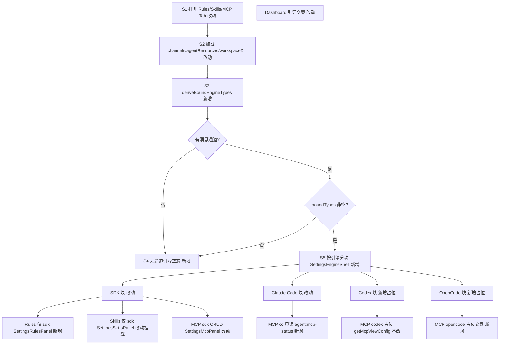
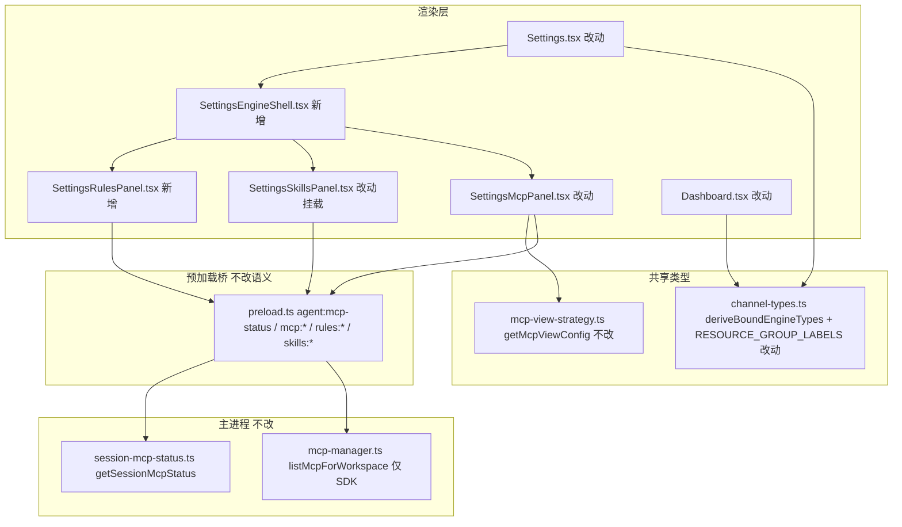

# 设置页按通道引擎动态展示 - 实现设计

> **业务 PRD**：见同目录 `01-proposal.md`（验收标准以 01 为准）

## 1、业务流程与改动范围

### 1.1 业务流程图



**图例**：`不改` 行为与现网一致；`改动` 扩展现有逻辑或文案；`新增` 新分支/UI/模块；`删除` 本变更无删除项（Rules 内联 JSX 迁入面板视为重构非删功能）。

### 1.2 流程步骤与改动对照

| 步骤 ID | 业务含义 | 改动 | 落点文件 | 01 验收关联 |
|---------|----------|------|----------|-------------|
| S1 | 用户打开 Settings **Rules / Skills / MCP** 标签页 | 改动 | `Settings.tsx` — tab 切换时触发配置加载与子面板挂载 | 1、2、3、6 |
| S2 | 加载 `channels`、`agentResources`、`workspaceDir` | 改动 | `Settings.tsx` — `rules`/`skills`/`mcp` tab 与 `tasks` 同级调用 `getConfig()`；不再仅 tasks tab 加载 | 3、4、6 |
| S3 | 由通道绑定推导应展示引擎集合 | 新增 | `src/shared/channel-types.ts` — `deriveBoundEngineTypes(channels, agentResources)` | 3、5、6 |
| S4 | 无通道或无法解析绑定 → 引导空态 | 新增 | `SettingsEngineShell.tsx` — 琥珀色 info box，引导先配置通道并绑定 Agent 资源 | 4、5 |
| S5 | 多引擎并存时按引擎分块展示 | 新增 | `SettingsEngineShell.tsx` — 复用 `AgentPanel`/`AgentProfilePanels` 分块视觉（`rounded-lg border` + 标题 + 说明） | 3、9 |
| S6 | 上移引擎分组标题 SSOT | 改动 | `channel-types.ts` 导出 `RESOURCE_GROUP_LABELS`；`ChannelModelSection.tsx` 改 import | 9 |
| S7 | **Rules** 仅 `sdk ∈ boundTypes` 时展示 Cursor Rules CRUD | 新增 | `SettingsRulesPanel.tsx`（自 `Settings.tsx` L529-565 抽出）；外壳由 `SettingsEngineShell` 控制显隐 | 1、2、5、8 |
| S8 | **Skills** 仅 `sdk ∈ boundTypes` 时挂载 | 改动 | `Settings.tsx` — `<SettingsSkillsPanel>` 外包引擎壳；并行变更 `20260702120631` 负责双来源 CRUD 本体 | 1、2、5、8 |
| S9 | **MCP · SDK** — global/project CRUD + 动态标题/路径 | 改动 | `SettingsMcpPanel.tsx` — 移除 L158 硬编码「Cursor SDK 执行引擎」；标题/说明取自 `getMcpViewConfig("sdk")`；仍用 `listMcpForWorkspace`/`mcp:*` IPC | 1、7、8 |
| S10 | **MCP · Claude Code** — 只读列表 + 路径说明 | 新增 | `SettingsMcpPanel.tsx` 或 `SettingsMcpEngineSection.tsx` — `getAgentMcpStatus("", false, "claude-code", workspaceDir)`；无 CRUD 按钮 | 2、3、7、8 |
| S11 | **MCP · Codex** — 不支持占位 | 新增 | `getMcpViewConfig("codex").unsupportedMessage` 渲染；不调用 list/status IPC | 2、5、7 |
| S12 | **MCP · OpenCode** — 首版占位/只读文案 | 新增 | `getMcpViewConfig("opencode").emptyHint` 展示配置源路径；`session-mcp-status` 尚无 opencode 读盘分支，列表区显示策略 emptyHint，不提供 CRUD | 2、5、7、8 |
| S13 | **Dashboard** onboarding 多引擎友好 | 改动 | `Dashboard.tsx` L63-67 `agentReady` 纳入 codex/opencode；L455 等文案去「仅 Cursor SDK」假设 | 10 |

### 1.3 改动汇总

- **新增**：`deriveBoundEngineTypes`、`RESOURCE_GROUP_LABELS`（上移共享）、`SettingsEngineShell.tsx`（~80 行）、`SettingsRulesPanel.tsx`（自 Settings 抽出 Rules CRUD）。
- **改动**：`Settings.tsx`（配置加载范围、三 Tab 引擎壳挂载）、`SettingsMcpPanel.tsx`（多引擎分块 + 动态文案 + CC 只读）、`SettingsSkillsPanel` 挂载方式、`ChannelModelSection.tsx`（labels import）、`Dashboard.tsx`（onboarding）。
- **不改**：`rules:*`/`skills:*`/`mcp:*` IPC 语义与存储路径；`listMcpForWorkspace` 仍仅 `.cursor/mcp.json`；不为非 SDK 新增 electron IPC（CC 只读复用既有 `agent:mcp-status`）；`getMcpViewConfig` 策略表本体。

## 2、整体思路

**根因**（代码调研可追溯）：

1. `Settings.tsx` Rules/Skills/MCP 硬编码 Cursor SDK 文案与 IPC：`rules:*`、`skills:*`、`listMcpForWorkspace` 均仅 `.cursor/*` 口径；Rules Tab 内联于 L529-565。
2. `SettingsMcpPanel.tsx` L158 固定「MCP 配置 · Cursor SDK 执行引擎」。
3. `tab === rules/skills/mcp` 时未加载 `channels`/`agentResources`（仅 `tasks` tab 在 L217-220 加载）。
4. 尚无 `deriveBoundEngineTypes`；`mcp-view-strategy.ts` 已有 `getMcpViewConfig` 四引擎差异化配置（`SessionMcpPanel` 已用，Settings 未复用）。
5. `ChannelModelSection.tsx` L24-29 `RESOURCE_GROUP_LABELS` 可上移为引擎标题 SSOT。
6. `SettingsSkillsPanel.tsx` 已存在（并行变更）；本变更负责引擎外壳与 `sdk` 显隐。
7. `session-mcp-status.ts` L285-294 支持 CC 无 session 读盘 fallback；Codex `supported=false`；OpenCode 策略有 `emptyHint` 但 session-mcp-status 无 opencode 读盘分支。
8. `Dashboard.tsx` L63-67 `agentReady` 仅 `sdk|cc`；L455 文案偏 Cursor。

**方案要点**：进入 Rules/Skills/MCP Tab 时加载通道与资源 → `deriveBoundEngineTypes` 得有序引擎列表 → `SettingsEngineShell` 按引擎分块 → 子面板按引擎 dispatch（SDK 完整 CRUD；CC MCP 只读；Codex/OpenCode 占位）；Rules/Skills 仅 SDK 块；Dashboard 引导多引擎化。

**与并行变更边界**：`20260702120631-项目级Skills未显示` 负责 Skills user/project 双来源；本变更仅外包「`sdk ∈ boundTypes` 才展示 Skills 块」。**合并顺序**：先完成 Skills 变更 T4 挂载 `SettingsSkillsPanel`，再合入本变更引擎壳。

**Ponytail 最小方案三问**：

1. **复用现有模块？** 是。复用 `getMcpViewConfig`、`RESOURCE_GROUP_LABELS`（上移）、`AgentPanel` 分块视觉、`SettingsSkillsPanel`（并行已建）、`getAgentMcpStatus` CC 无 session 读盘路径。
2. **新增抽象是否必要？** 否。不建通用 CRUD 抽象层；不为非 SDK 新增 electron IPC；仅新增 `deriveBoundEngineTypes` 纯函数与 ~80 行 `SettingsEngineShell` 布局壳。
3. **能否合并到已有文件？** 部分否。`Settings.tsx` 已臃肿，Rules 须抽出 `SettingsRulesPanel.tsx`；引擎分块壳独立 `SettingsEngineShell.tsx` 避免 MCP/Rules/Skills 三 Tab 重复分块逻辑；`deriveBoundEngineTypes` 放 `channel-types.ts`（~40 行）与通道类型 SSOT 同文件。

## 3、分层设计



| 层级 | 职责 | 本变更落点 |
|------|------|------------|
| 渲染层 | 引擎感知、分块、子面板 dispatch、空态引导 | `Settings.tsx`、`SettingsEngineShell.tsx`、`SettingsRulesPanel.tsx`、`SettingsMcpPanel.tsx`、`Dashboard.tsx` |
| 共享类型 | 绑定引擎推导、分组标题 SSOT | `channel-types.ts` |
| 展示策略 | 各引擎 MCP 标题/空态/占位 | `mcp-view-strategy.ts`（只读复用） |
| 预加载/主进程 | 既有 IPC | `agent:mcp-status`（CC 只读）；`mcp:*`/`rules:*`/`skills:*`（SDK CRUD） |

## 4、接口设计

本变更**主要为渲染层**；主进程 IPC **不改语义**。

### 4.1 复用 `agent:mcp-status`（CC Settings 只读）

| 调用方 | 签名 | 用途 |
|--------|------|------|
| Settings MCP · CC 块 | `getAgentMcpStatus("", false, "claude-code", workspaceDir)` | 无活跃 session 时走 `session-mcp-status.ts` L285-294 读盘 fallback |
| Session 面板（现网） | `getAgentMcpStatus(sessionKey, force, engineType, effectiveWs)` | 不改 |

返回 `AgentMcpStatusResult`：`{ servers, statusMap, source }`；Settings CC 块只展示列表与 `source` 标签，不提供编辑/删除/login（OAuth 引导文案可链 Dashboard 会话）。

### 4.2 保持不变的 SDK IPC

| Channel | Settings 使用场景 |
|---------|-------------------|
| `rules:*` | `SettingsRulesPanel` — 仅 `sdk` 块 |
| `skills:*` | `SettingsSkillsPanel` — 仅 `sdk` 块（并行变更 scope） |
| `mcp:list-for-workspace` / `mcp:save` / `mcp:delete` / `mcp:login` | `SettingsMcpPanel` SDK 块 CRUD |
| `mcp:status-map` | SDK 块状态探测（若面板保留 status 展示） |

Codex/OpenCode Settings MCP：**不调用**上述 CRUD IPC。

## 5、数据结构

```typescript
/** 与 AgentResource.type 一致，Settings 引擎分块键 */
export type AgentEngineType = AgentResource["type"]

/** optgroup / Settings 引擎块标题 SSOT（自 ChannelModelSection 上移） */
export const RESOURCE_GROUP_LABELS: Record<AgentEngineType, string> = {
  sdk: "Cursor SDK",
  "claude-code": "Claude Code Profile",
  codex: "Codex Profile",
  opencode: "OpenCode Profile",
}

/** 引擎块副标题（Settings 专用，可选与 RESOURCE_GROUP_LABELS 组合） */
export const ENGINE_BLOCK_SUBTITLES: Partial<Record<AgentEngineType, string>> = {
  sdk: "规则 / Skills / MCP 配置入口",
  "claude-code": "Claude Agent MCP 配置（只读查看）",
  codex: "Codex MCP（暂不支持在设置中管理）",
  opencode: "OpenCode MCP 配置（首版只读说明）",
}

/**
 * 从已配置通道及其绑定的 Agent 资源推导应展示的引擎类型集合。
 * - 仅统计存在且可解析 `agentResourceId` 的通道（enabled 与否均计入，与「实例实际绑定」口径一致）
 * - 去重后按固定顺序返回：sdk → claude-code → codex → opencode
 * - 无通道或全部绑定失效 → []
 */
export function deriveBoundEngineTypes(
  channels: MessageChannel[],
  agentResources: AgentResource[],
): AgentEngineType[]

/** SettingsEngineShell 入参 */
interface SettingsEngineShellProps {
  tab: "rules" | "skills" | "mcp"
  boundTypes: AgentEngineType[]
  channels: MessageChannel[]
  workspaceDir: string
  /** 按引擎渲染 Tab 专属子面板；外壳负责标题/边框/未绑定引擎不调用 */
  renderEnginePanel: (engineType: AgentEngineType) => React.ReactNode
}
```

- **Tab 与引擎矩阵**：

| Tab | sdk | claude-code | codex | opencode |
|-----|-----|-------------|-------|----------|
| Rules | `SettingsRulesPanel` CRUD | 不展示 | 不展示 | 不展示 |
| Skills | `SettingsSkillsPanel` | 不展示 | 不展示 | 不展示 |
| MCP | `SettingsMcpPanel` SDK 段 CRUD | 只读 `agent:mcp-status` | 占位 | 占位 emptyHint |

## 6、实现步骤

| 序号 | 步骤 | 回溯步骤 ID | 要点 |
|------|------|-------------|------|
| 1 | `channel-types.ts` 新增 `deriveBoundEngineTypes`、上移 `RESOURCE_GROUP_LABELS`（及可选 `ENGINE_BLOCK_SUBTITLES`） | S3、S6 | `ChannelModelSection.tsx` 改 import，行为不变 |
| 2 | 新建 `SettingsEngineShell.tsx`：无通道/无绑定空态；`boundTypes.map` 分块渲染；块标题用 `RESOURCE_GROUP_LABELS` | S4、S5 | ~80 行；视觉对齐 `AgentPanel` section |
| 3 | 新建 `SettingsRulesPanel.tsx`：迁入 `Settings.tsx` Rules state/handler/JSX | S7 | 接收 `workspaceDir`；`rules:*` IPC 不变 |
| 4 | `Settings.tsx`：`rules`/`skills`/`mcp` tab `useEffect` 加载 `channels`+`agentResources`；计算 `boundTypes` | S1、S2 | 与 `tasks` tab 加载逻辑合并或抽 `loadChannelContext()` |
| 5 | Rules Tab：`SettingsEngineShell` + 仅 `sdk` 时 `renderEnginePanel` 返回 `SettingsRulesPanel` | S7 | 非 sdk 绑定不出现 Rules 块 |
| 6 | Skills Tab：并行变更合入后，`sdk ∈ boundTypes` 时壳内挂载 `SettingsSkillsPanel` | S8 | **依赖** `20260702120631` T4 先落地 |
| 7 | 重构 `SettingsMcpPanel.tsx`：接收 `engineType` 或拆为壳内多段；SDK 段用 `getMcpViewConfig("sdk")` 动态标题 | S9 | 删除 L158 硬编码 |
| 8 | MCP CC 段：`getAgentMcpStatus("", false, "claude-code", ws)` 只读列表 + `formatMcpScopeLabel` | S10 | 无新增 IPC |
| 9 | MCP Codex/OpenCode 段：`getMcpViewConfig` 占位与 emptyHint 文案 | S11、S12 | OpenCode 首版不扩 session-mcp-status |
| 10 | `Dashboard.tsx`：`agentReady` 纳入四引擎资源存在性；onboarding 文案多引擎化 | S13 | L455 等 |
| 11 | 手工验收 01 §七 十条 + §8.2 工程项 | 全部 | — |

## 7、参考实现

| 符号/区域 | 路径 | 说明 |
|-----------|------|------|
| Rules Tab 内联（待迁出） | `src/renderer/pages/Settings.tsx` L529-565 | `SettingsRulesPanel` 来源 |
| tasks tab 加载 channels | `Settings.tsx` L217-220 | 扩展至 rules/skills/mcp |
| MCP 硬编码标题 | `SettingsMcpPanel.tsx` L158 | 待替换为 `getMcpViewConfig` |
| `getMcpViewConfig` | `src/renderer/lib/mcp-view-strategy.ts` L75-119 | 四引擎 title/supported/emptyHint |
| CC 无 session 读盘 | `electron/session/session-mcp-status.ts` L285-294 | Settings CC 只读复用 |
| Session MCP dispatch | `src/renderer/components/SessionMcpPanel.tsx` L52-71 | Settings MCP 对齐模式 |
| `RESOURCE_GROUP_LABELS` | `ChannelModelSection.tsx` L24-29 | 上移 SSOT |
| Agent 分块视觉 | `AgentPanel.tsx`、`AgentProfilePanels.tsx` | 边框/标题/间距模板 |
| `SettingsSkillsPanel` | `src/renderer/components/SettingsSkillsPanel.tsx` | 并行变更；本变更仅外壳 |
| Dashboard onboarding | `Dashboard.tsx` L63-67、L455 | `agentReady` 与文案 |
| `listMcpForWorkspace` | `electron/mcp-manager.ts` | 仅 SDK `.cursor/mcp.json` |

## 8、技术影响

### 8.1 影响范围

- **用户可见**：Settings Rules/Skills/MCP 与 Dashboard 引导随通道绑定引擎动态变化；多引擎并存时分块展示。
- **IPC**：无新 handler；`agent:mcp-status` 复用；`mcp:*`/`rules:*`/`skills:*` 语义不变。
- **文件行数**：`Settings.tsx` 减负；新增 `SettingsEngineShell`/`SettingsRulesPanel` 各 ≤300 行；`channel-types.ts` 增量 ~40 行。
- **并行合并**：与 `20260702120631` 触达 `Settings.tsx` Skills 挂载 — 须先 Skills 后引擎壳。
- **风险**：低～中。主要风险为并行合并冲突与 OpenCode 首版无读盘列表（仅文案占位，须在 UI 标明）。

### 8.2 工程补充验收项

| ID | 验收项 |
|----|--------|
| E1 | `Settings.tsx` 行数较现网减少（Rules 迁出后目标 ≤900 行，持续向 ≤300 拆分） |
| E2 | `SettingsEngineShell.tsx`、`SettingsRulesPanel.tsx` 各 ≤300 行 |
| E3 | `rules`/`skills`/`mcp` tab 进入时均加载 `channels`+`agentResources`，改绑后重进 Tab 可见变化 |
| E4 | 仅绑定 CC 时 MCP Tab 不出现「Cursor SDK 执行引擎」主标题；Rules/Skills Tab 无 Cursor 专属块 |
| E5 | 仅绑定 SDK 时三 Tab 无其他引擎空白占位块 |
| E6 | 多引擎绑定时每块标题与 `RESOURCE_GROUP_LABELS` 一致，与 Agent Tab 四类分块心智对齐 |
| E7 | CC MCP 块只读：无保存/删除按钮；数据来自 `getAgentMcpStatus` 而非 `listMcpForWorkspace` |
| E8 | Codex MCP 块展示 `getMcpViewConfig("codex").unsupportedMessage`，不 crash、不调 list API |
| E9 | OpenCode MCP 块展示策略 `emptyHint` 路径文案；首版列表可为空并注明「会话 Dashboard 查看运行时」 |
| E10 | 与 `20260702120631` 合并后 Skills 仍仅在 `sdk ∈ boundTypes` 时可见 |
| E11 | `ChannelModelSection` 改 import 后通道编辑 optgroup 文案与改前一致 |
| E12 | `Dashboard` `agentReady` 在仅配置 Codex/OpenCode 资源时为 true |

## 9、知识库影响

- **渲染端界面**：`knowledge/工程平台/Electron桌面应用/03-渲染端界面.md` — Settings Rules/Skills/MCP 仍记为 Cursor 单一视角，与本变更不符。
- **组件约定**：`src/renderer/components/AGENTS.md` — 未记载 `SettingsEngineShell`、引擎感知挂载规则。
- **主进程 IPC 文档**：`02-主进程与IPC.md` — `agent:mcp-status` 已记载 CC 无 session fallback，可补充 Settings 只读消费场景。
- **Agent 调度业务域**：不涉及引擎配置存储语义变更，无需改 `06-CursorSDK执行引擎.md` 等路径说明正文（仅 Settings 展示口径）。

## 10、知识库更新计划

### 10.1 必须更新

| 文件 | 更新要点 |
|------|----------|
| `knowledge/工程平台/Electron桌面应用/03-渲染端界面.md` | Settings Rules/Skills/MCP 按 `deriveBoundEngineTypes` 分块；SDK CRUD vs CC 只读 vs Codex/OpenCode 占位；与 Agent Tab 分块对齐 |
| `src/renderer/components/AGENTS.md` | 新增 `SettingsEngineShell`/`SettingsRulesPanel` 边界；`RESOURCE_GROUP_LABELS` SSOT 位置；Skills 须 `sdk` 绑定才挂载 |

### 10.2 可能更新（视实现结果）

| 文件 | 条件 |
|------|------|
| `knowledge/工程平台/Electron桌面应用/02-主进程与IPC.md` | 若归档时补充 Settings 复用 `agent:mcp-status` 无 sessionKey 场景 |
| `knowledge/工程平台/Electron桌面应用/01-概览.md` | 若 Settings 子模块清单仍写单一 Cursor 口径 |
| `src/renderer/pages/AGENTS.md`（若存在） | Settings tab 加载 channels 约定 |

### 10.3 不需要更新

- 各引擎配置存储路径与 loader 实现（`mcp-sdk-loader`、`cc-mcp-loader`、`codex-mcp-loader` 等）— 01 非目标。
- Daemon / IM 协议文档。
- `20260702120631` 变更目录内 Skills IPC 设计（并行负责，本变更不重复）。
