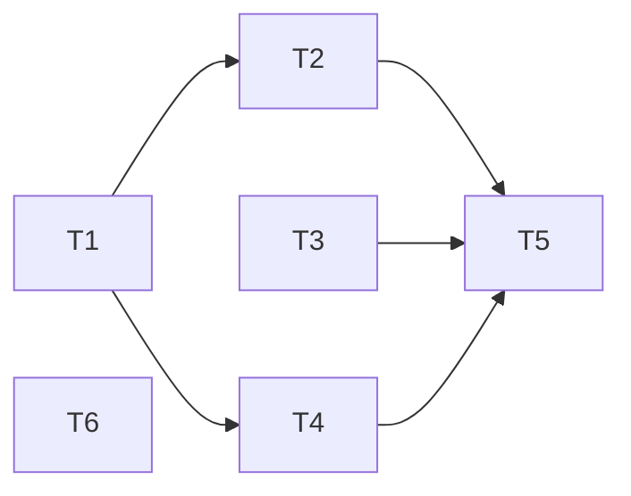

# 设置页按通道引擎动态展示 - 任务分解

> **来源**：`/kb-plan`（基于 `01-proposal.md`、`02-design.md`）

## 1、执行计划

### 1.1 依赖图

```
T1 ──┬──→ T2 ──┐
     └──→ T4 ──┼──→ T5
T3 ────────────┘
T6（独立，可与 T5 并行）
```



### 1.2 分组调度

| 轮次 | 任务 | 说明 |
|------|------|------|
| 第一轮（并行） | T1、T3、T6 | T1 为引擎推导 SSOT；T3 Rules 抽出与 T1 无依赖；T6 Dashboard 独立 |
| 第二轮（并行） | T2、T4 | 均依赖 T1 的 `deriveBoundEngineTypes` / `RESOURCE_GROUP_LABELS` |
| 第三轮 | T5 | 依赖 T1–T4；**前置**：并行变更 `20260702120631` T4 已挂载 `SettingsSkillsPanel` |

## 2、任务清单

## T1: 通道绑定引擎推导与标签 SSOT

### 背景

现网设置页无「由通道绑定推导引擎集合」能力；`ChannelModelSection.tsx` L24-29 本地定义 `RESOURCE_GROUP_LABELS`，与即将新增的 Settings 引擎分块标题重复。本任务在 `channel-types.ts` 集中导出推导函数与分组标签 SSOT，供 Settings 外壳、通道编辑、Dashboard 复用。

### 上下文文件

| 文件 | 关注点 |
|------|--------|
| `src/shared/channel-types.ts` | `AgentResource.type`、`MessageChannel.agentResourceId` 类型定义 |
| `src/renderer/components/ChannelModelSection.tsx` L24-29 | 待删除的本地 `RESOURCE_GROUP_LABELS` |
| `src/renderer/components/AGENTS.md` | 通道模型区块约定 |

### 实现范围

1. **`src/shared/channel-types.ts` 新增/导出**：
   - `export type AgentEngineType = AgentResource["type"]`
   - `export const RESOURCE_GROUP_LABELS: Record<AgentEngineType, string>` — 自 `ChannelModelSection` 上移，文案保持一致：
     - `sdk` → `"Cursor SDK"`
     - `claude-code` → `"Claude Code Profile"`
     - `codex` → `"Codex Profile"`
     - `opencode` → `"OpenCode Profile"`
   - `export const ENGINE_BLOCK_SUBTITLES: Partial<Record<AgentEngineType, string>>` — Settings 引擎块说明（可与 `RESOURCE_GROUP_LABELS` 组合）：
     - `sdk`: `"规则 / Skills / MCP 配置入口"`
     - `claude-code`: `"Claude Agent MCP 配置（只读查看）"`
     - `codex`: `"Codex MCP（暂不支持在设置中管理）"`
     - `opencode`: `"OpenCode MCP 配置（首版只读说明）"`
   - `deriveBoundEngineTypes(channels, agentResources): AgentEngineType[]`：
     - 遍历 `channels`，解析 `agentResourceId` 在 `agentResources` 中的 `type`
     - `enabled` 与否均计入（与「实例实际绑定」口径一致）
     - 绑定失效（id 不存在）跳过
     - 去重后按固定顺序返回：`sdk` → `claude-code` → `codex` → `opencode`
     - 无通道或全部失效 → `[]`
   - `channelsBoundToEngineType(engineType, channels, agentResources): MessageChannel[]` — 返回绑定该引擎类型的通道列表，供 Settings 引擎块副标题展示通道名（如「适用于：飞书 Bot、微信客服」）
2. **`ChannelModelSection.tsx`**：删除本地 `RESOURCE_GROUP_LABELS`；改 `import { RESOURCE_GROUP_LABELS } from "../../shared/channel-types"`（或项目既有 shared 导入路径）；`optgroup` 行为与改前一致。

### 接口契约

```typescript
export type AgentEngineType = AgentResource["type"]

export const RESOURCE_GROUP_LABELS: Record<AgentEngineType, string>
export const ENGINE_BLOCK_SUBTITLES: Partial<Record<AgentEngineType, string>>

export function deriveBoundEngineTypes(
  channels: MessageChannel[],
  agentResources: AgentResource[],
): AgentEngineType[]

/** 副标题用：列出绑定指定引擎的通道（按 channels 数组顺序） */
export function channelsBoundToEngineType(
  engineType: AgentEngineType,
  channels: MessageChannel[],
  agentResources: AgentResource[],
): MessageChannel[]
```

| 场景 | 期望 |
|------|------|
| 单通道绑 sdk | `deriveBoundEngineTypes` → `["sdk"]` |
| 双通道绑 sdk + codex | → `["sdk", "codex"]` |
| 通道 id 指向已删资源 | 该通道不计入 |
| `channelsBoundToEngineType("sdk", ...)` | 仅返回 agentResource.type === "sdk" 的通道 |

### 验收标准

- [ ] **01-3**：多通道多引擎时 `deriveBoundEngineTypes` 返回有序去重列表，可供后续分块
- [ ] **01-5**：未绑定引擎类型不出现在 `deriveBoundEngineTypes` 结果中
- [ ] **01-6**：改绑通道资源后重算结果与新区绑定一致（纯函数可单测或手工构造 channels/resources 验证）
- [ ] **01-9**：`RESOURCE_GROUP_LABELS` 与 Agent 标签页四类资源命名一致
- [ ] **E11**：`ChannelModelSection` 改 import 后通道编辑 optgroup 文案与改前逐字一致
- [ ] **Ponytail**：仅纯函数 + 常量上移；无新 npm 依赖；`channel-types.ts` 增量约 ≤60 行

### 依赖

无（第一轮并行）。

---

## T2: SettingsEngineShell 分块外壳

### 背景

Rules/Skills/MCP 三 Tab 需按通道绑定引擎分块展示，并在无通道或无有效绑定时给出引导空态。本任务新建通用布局壳 `SettingsEngineShell.tsx`，复用 `AgentPanel`/`AgentProfilePanels` 的 `rounded-lg border` + 标题 + 说明视觉，避免三 Tab 重复分块逻辑。

### 上下文文件

| 文件 | 关注点 |
|------|--------|
| `src/renderer/components/AgentPanel.tsx` | 分块边框/标题/间距模板 |
| `src/renderer/components/AgentProfilePanels.tsx` | 多引擎分块视觉参考 |
| 本文 T1「接口契约」 | `RESOURCE_GROUP_LABELS`、`ENGINE_BLOCK_SUBTITLES`、`channelsBoundToEngineType` |

### 实现范围

1. **新建** `src/renderer/components/SettingsEngineShell.tsx`（≤300 行）。
2. **Props**：

```typescript
interface SettingsEngineShellProps {
  tab: "rules" | "skills" | "mcp"
  boundTypes: AgentEngineType[]
  channels: MessageChannel[]
  agentResources: AgentResource[]
  workspaceDir: string
  /** 外壳仅对 boundTypes 内引擎调用；未绑定引擎不渲染块 */
  renderEnginePanel: (engineType: AgentEngineType) => React.ReactNode
}
```

3. **空态**（琥珀色 info box，`border-amber-500/30 bg-amber-500/5` 或项目既有琥珀引导样式）：
   - `channels.length === 0`：引导先创建消息通道并绑定 Agent 资源
   - `channels.length > 0 && boundTypes.length === 0`：引导检查通道 Agent 资源绑定是否有效
   - 文案不得默认铺满 Cursor SDK 路径说明
4. **有绑定时**：`boundTypes.map(engineType => ...)` 渲染引擎块：
   - 块标题：`RESOURCE_GROUP_LABELS[engineType]`
   - 块说明：`ENGINE_BLOCK_SUBTITLES[engineType]`（若有）
   - 副标题：`channelsBoundToEngineType(engineType, channels, agentResources)` 映射 `channel.name`，逗号拼接（如「适用于：飞书、微信」）；无通道绑定时省略
   - 块内：`renderEnginePanel(engineType)`
5. 本任务**不**接入 `Settings.tsx`（由 T5 挂载）；可导出组件供 Story/单测或 T5 直接使用。

### 接口契约

- 输入 `boundTypes=[]` 或 `channels=[]` → 仅渲染引导空态，不调用 `renderEnginePanel`
- 输入 `boundTypes=["sdk","codex"]` → 渲染两块，各调用一次 `renderEnginePanel`
- `renderEnginePanel` 返回值允许 `null`（外壳仍显示块标题，块体为空）

### 验收标准

- [ ] **01-4**：无消息通道时展示明确引导，非 Cursor 默认满屏
- [ ] **01-5**：有通道但绑定全部失效时展示引导，不渲染引擎块
- [ ] **01-3**：多引擎 `boundTypes` 时分块展示，块标题与 `RESOURCE_GROUP_LABELS` 一致
- [ ] **01-9**：分块视觉与 Agent 标签页四类资源分块心智对齐（边框/标题层级）
- [ ] **E2**：`SettingsEngineShell.tsx` ≤300 行
- [ ] **Ponytail**：仅布局壳 + map 渲染；不内嵌 Rules/Skills/MCP 业务逻辑；无新抽象层

### 依赖

- **T1**（`deriveBoundEngineTypes` 由 T5 计算；本组件消费 `boundTypes` + `channelsBoundToEngineType` + labels）

---

## T3: SettingsRulesPanel 抽出

### 背景

`Settings.tsx` L529-565 内联 Rules CRUD，L365-376 handlers、L100-102 state、L782+ modal，导致页面臃肿且无法被引擎外壳包裹。本任务将 Rules 完整迁入独立面板，IPC 语义不变，为 T5 引擎感知挂载做准备。

### 上下文文件

| 文件 | 关注点 |
|------|--------|
| `src/renderer/pages/Settings.tsx` L100-102 | `rules` / `ruleEditing` / `ruleEditOriginalName` state |
| `Settings.tsx` L117 | `refreshRules` |
| `Settings.tsx` L365-376 | Rules handlers |
| `Settings.tsx` L529-565 | Rules Tab JSX |
| `Settings.tsx` L782+ | Rule 编辑 modal |
| `electron/preload.ts` | `rules:*` IPC（不改语义） |

### 实现范围

1. **新建** `src/renderer/components/SettingsRulesPanel.tsx`（≤300 行）。
2. **Props**：`{ workspaceDir: string }`。
3. **迁入内容**（自 `Settings.tsx`）：
   - state：`rules`、`ruleEditing`、`ruleEditOriginalName`
   - `refreshRules`（`useEffect` 挂载时调用 + 刷新按钮）
   - handlers：`openRuleAdd`、`openRuleEdit`、`handleRuleDelete`、`handleRuleSave`
   - JSX：说明区（主工作区 `.cursor/rules/`）、列表、空态、刷新/新增按钮
   - modal：新增/编辑 Rule 弹窗
4. **IPC 不变**：`getRules` / `saveRule` / `deleteRule`。
5. **本任务阶段**：`Settings.tsx` 可暂保留内联 Rules（T5 再删除）；或若已删须保证 Rules Tab 仍可渲染（T5 前可临时双写——**推荐**本任务仅新建面板，T5 统一切换）。

### 接口契约

```typescript
interface SettingsRulesPanelProps {
  workspaceDir: string
}
```

| 场景 | 行为 |
|------|------|
| `!workspaceDir.trim()` | 琥珀提示先配置主工作区；禁用新增/刷新 |
| 有工作区 | 完整 CRUD，路径说明指向 `.cursor/rules/` |

### 验收标准

- [ ] **01-1**：仅 SDK 场景下面板展示 Cursor Rules CRUD 与 `.cursor/rules/` 说明（由 T5 控制显隐，本任务面板本体正确）
- [ ] **01-8**：路径说明与 Cursor SDK 口径一致，不出现其他引擎目录
- [ ] **E1**：迁出后 `Settings.tsx` 行数减少（若本任务已删内联则立即生效；否则 T5 合并验收）
- [ ] **E2**：`SettingsRulesPanel.tsx` ≤300 行
- [ ] **Ponytail**：原样搬迁，不新增 rules IPC；不建通用 CRUD 抽象

### 依赖

无（第一轮并行；与 T1 无耦合）。

---

## T4: MCP 多引擎分块面板

### 背景

`SettingsMcpPanel.tsx` L158 硬编码「MCP 配置 · Cursor SDK 执行引擎」，且整面板仅 SDK CRUD。本任务按引擎拆分为 `SettingsMcpEngineBlock.tsx`，SDK 保留完整 CRUD 并动态标题；Claude Code 只读；Codex/OpenCode 占位，对齐 `SessionMcpPanel` dispatch 模式。

### 上下文文件

| 文件 | 关注点 |
|------|--------|
| `src/renderer/components/SettingsMcpPanel.tsx` | 现网 SDK CRUD（218 行）；L158 硬编码标题 |
| `src/renderer/lib/mcp-view-strategy.ts` L75-119 | `getMcpViewConfig` 四引擎 title/supported/emptyHint/unsupportedMessage |
| `src/renderer/components/SessionMcpPanel.tsx` L52-71 | engineType dispatch 参考 |
| `electron/session/session-mcp-status.ts` L285-294 | CC 无 session 读盘 fallback |
| `src/renderer/env.d.ts` | `getAgentMcpStatus` 签名 |

### 实现范围

1. **新建** `src/renderer/components/SettingsMcpEngineBlock.tsx`（≤300 行）。
2. **Props**：`{ engineType: AgentEngineType; workspaceDir: string }`。
3. **分引擎实现**：

| engineType | 行为 |
|------------|------|
| `sdk` | 自 `SettingsMcpPanel` 迁入 global/project CRUD；标题与说明取自 `getMcpViewConfig("sdk")`；保留 `pluginFootnote` 仅 sdk；IPC：`listMcpForWorkspace` / `mcp:save` / `mcp:delete` / `mcp:login` / `mcp:status-map` |
| `claude-code` | 只读：`getAgentMcpStatus("", false, "claude-code", workspaceDir)`；展示 servers + `formatMcpScopeLabel`；**无**保存/删除/login 按钮 |
| `codex` | 渲染 `getMcpViewConfig("codex").unsupportedMessage`；**不**调用 list/status CRUD IPC |
| `opencode` | 展示 `getMcpViewConfig("opencode").emptyHint` 路径文案；列表区可为空并注明「运行时状态请在会话 Dashboard 查看」；**不**调用 list CRUD IPC |

4. **`SettingsMcpPanel.tsx` 处理**：删除或瘦身为 re-export `SettingsMcpEngineBlock`（`engineType="sdk"`）供过渡；最终由 T5 经 `SettingsEngineShell` 直接挂载 `SettingsMcpEngineBlock`。
5. 不为非 SDK 新增 electron IPC。

### 接口契约

```typescript
interface SettingsMcpEngineBlockProps {
  engineType: AgentEngineType
  workspaceDir: string
}
```

| engineType | 禁止调用 |
|------------|----------|
| `codex` / `opencode` | `listMcpForWorkspace`、`mcp:save`、`mcp:delete`、`mcp:login` |
| `claude-code` | 上述 CRUD；仅 `getAgentMcpStatus` |

### 验收标准

- [ ] **01-1**：仅 SDK 绑定时 MCP 块为 SDK CRUD + 动态标题，无其他引擎空白占位（外壳 T5 控制，本块 sdk 路径正确）
- [ ] **01-2**：仅 CC 绑定时不出现「Cursor SDK 执行引擎」主标题
- [ ] **01-7**：MCP 标题取自 `getMcpViewConfig`，无 L158 硬编码
- [ ] **01-8**：CC 块路径说明为 `~/.claude.json` / `.mcp.json`，不串 `.cursor`
- [ ] **E4**：仅 CC 时 SDK 主标题不出现
- [ ] **E7**：CC 块无保存/删除；数据来自 `getAgentMcpStatus`
- [ ] **E8**：Codex 块展示 `unsupportedMessage`，不 crash、不调 list API
- [ ] **E9**：OpenCode 块展示 `emptyHint` 路径文案
- [ ] **Ponytail**：按 engineType switch，不建 MCP CRUD 抽象层；单文件 ≤300 行

### 依赖

- **T1**（`AgentEngineType`、`RESOURCE_GROUP_LABELS` 类型引用）

---

## T5: Settings.tsx 三 Tab 引擎感知接入

### 背景

现网 `Settings.tsx` 仅在 `tasks` tab（L214-220）加载 `channels`/`agentResources`；Rules/Skills/MCP 硬编码 Cursor 视角。本任务扩展 tab 加载、计算 `boundTypes`、三 Tab 挂载 `SettingsEngineShell` + 子面板，并清理 Rules 内联代码。**前置**：并行变更 `20260702120631` T4 已挂载 `SettingsSkillsPanel`（L610）。

### 上下文文件

| 文件 | 关注点 |
|------|--------|
| `src/renderer/pages/Settings.tsx` L213-222 | tab `useEffect`；待扩展 rules/skills/mcp |
| `Settings.tsx` L529-565、L610、L613 | 三 Tab 现网挂载 |
| `Settings.tsx` L619+ `setup` tab | 帮助引导文案（L626 等）待多引擎化 |
| `src/renderer/components/SettingsSkillsPanel.tsx` | 并行变更已挂载；本任务仅 `sdk` 时外包引擎壳 |
| 本文 T1–T4 产出 | Shell / RulesPanel / McpEngineBlock |

### 实现范围

1. **扩展 tab `useEffect`**：`tab === "rules" | "skills" | "mcp"` 时调用 `getConfig()`，设置 `channels`、`agentResources`（与 tasks tab L217-220 逻辑合并或抽 `loadChannelContext()`）。
2. **计算**：`boundTypes = deriveBoundEngineTypes(channels, agentResources)`。
3. **Rules Tab**：
   - `<SettingsEngineShell tab="rules" boundTypes={boundTypes.includes("sdk") ? ["sdk"] : []} ...>`
   - `renderEnginePanel`: `engineType === "sdk"` → `<SettingsRulesPanel workspaceDir={workspaceDir} />`；否则 `null`
4. **Skills Tab**：
   - 同上，仅 `sdk ∈ boundTypes` 时 `renderEnginePanel` → `<SettingsSkillsPanel workspaceDir={workspaceDir} />`
5. **MCP Tab**：
   - `<SettingsEngineShell tab="mcp" boundTypes={boundTypes} ...>`
   - `renderEnginePanel` → `<SettingsMcpEngineBlock engineType={engineType} workspaceDir={workspaceDir} />`
6. **删除** `Settings.tsx` 内 Rules state/handlers/JSX/modal（L100-102、L365-376、L529-565、L782+ 相关）。
7. **删除** 直接 `<SettingsMcpPanel>` 挂载，改经 Shell。
8. **`src/renderer/components/AGENTS.md`**：补充 `SettingsEngineShell`、`SettingsRulesPanel`、`SettingsMcpEngineBlock` 职责边界；`RESOURCE_GROUP_LABELS` SSOT 在 `channel-types.ts`；Skills/Rules 仅 `sdk ∈ boundTypes` 挂载。
9. **`setup` 引导**（若存在 L626「添加 Cursor SDK Key 或 Claude Agent Profile」类文案）：改为四引擎友好表述（与 Agent 标签页一致）。

### 接口契约

| Tab | visibleTypes | renderEnginePanel |
|-----|--------------|-------------------|
| rules | `boundTypes` 含 sdk → `["sdk"]`，否则 `[]` | sdk → `SettingsRulesPanel` |
| skills | 同上 | sdk → `SettingsSkillsPanel` |
| mcp | `boundTypes` 全量 | 各引擎 → `SettingsMcpEngineBlock` |

- 改绑通道后重进 Tab（或 Tab 内切换触发 useEffect）须重新 `getConfig` 并更新 `boundTypes`。

### 验收标准

- [ ] **01-1**：仅 SDK 时三 Tab 仅 SDK 块，无其他引擎空白占位
- [ ] **01-2**：仅非 Cursor 引擎时 Rules/Skills 无 Cursor 块；MCP 主展示对应该引擎
- [ ] **01-3**：多引擎并存时分块可区分，副标题含通道名
- [ ] **01-4**：无通道时三 Tab 引导空态
- [ ] **01-5**：未绑定引擎类型不展示对应块
- [ ] **01-6**：改绑后重进 Tab 展示与新区绑定一致
- [ ] **01-7**、**01-8**、**01-9**：MCP 标题、路径说明、与 Agent Tab 分块心智一致
- [ ] **E1**：`Settings.tsx` 行数较现网减少（Rules 迁出后目标 ≤900 行）
- [ ] **E3**：rules/skills/mcp tab 均加载 channels+agentResources
- [ ] **E4**、**E5**、**E6**：与 §8.2 单项一致
- [ ] **E10**：合并 `20260702120631` 后 Skills 仍仅 `sdk ∈ boundTypes` 可见
- [ ] **Ponytail**：不新增 IPC；加载逻辑抽函数避免三处复制即可，勿过度抽象

### 依赖

- **T1**、**T2**、**T3**、**T4**
- **外部**：`20260702120631` T4（`SettingsSkillsPanel` 已挂载）

---

## T6: Dashboard 多引擎引导

### 背景

`Dashboard.tsx` L63-67 `agentReady` 仅检测 `sdk | claude-code` 资源；L455 onboarding 文案写「添加 Cursor SDK Key 或 Claude Code Profile」，与四引擎产品能力不符。本任务独立改造 Dashboard 引导，不依赖 Settings 外壳。

### 上下文文件

| 文件 | 关注点 |
|------|--------|
| `src/renderer/pages/Dashboard.tsx` L56-69 | `refreshOnboard` / `agentReady` 计算 |
| `Dashboard.tsx` L441-455 | onboarding checklist 文案 |
| `src/shared/channel-types.ts` | `AgentResource.type` 四引擎枚举 |

### 实现范围

1. **`agentReady`**：在 `resources` 中检测四引擎任一有效配置：
   - `sdk`：`apiKey?.trim()`
   - `claude-code` / `codex` / `opencode`：`apiKey?.trim()`（与现网 CC 判定一致）
   - 仅配置 Codex 或 OpenCode 时 `agentReady === true`
2. **L455 及同类文案**：改为多引擎友好，例如「配置 Agent 资源（Cursor SDK / Claude Code / Codex / OpenCode）」；不得默认「只有 Cursor SDK」。
3. 不改动通道/工作区 onboarding 其他项逻辑。

### 接口契约

```typescript
// refreshOnboard 内
agentReady: boolean // 四引擎任一有效 Profile/Key
```

| 场景 | agentReady |
|------|------------|
| 仅 Codex Profile 有效 | `true` |
| 仅 OpenCode Profile 有效 | `true` |
| 无任何 agentResources | `false` |

### 验收标准

- [ ] **01-10**：Dashboard Agent 相关引导不再默认假设仅 Cursor SDK（至少 L455 一处可手工抽查）
- [ ] **E12**：仅配置 Codex/OpenCode 资源时 `agentReady` 为 `true`，onboarding 该项显示完成
- [ ] **Ponytail**：仅扩展 `some()` 条件与文案；不改 onboarding 结构

### 依赖

无（第一轮并行；可与 T5 并行）。
