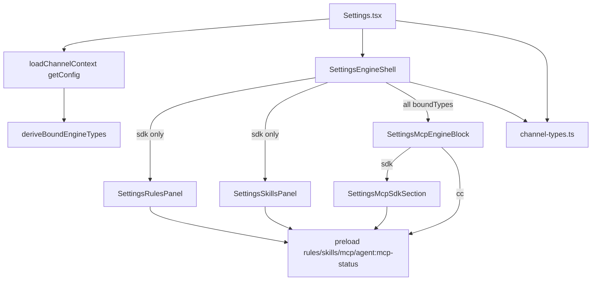

# 设置页按通道引擎动态展示 - 代码评审报告

## 1、审查范围

- **变更类型**: apply 产出的工作区变更（渲染层引擎感知分块 + 共享类型 SSOT + Dashboard 引导）
- **评审等级**: focused-review（渲染层局部实现，无 proto/DB/权限）
- **涉及文件**:
  - 新建: `src/renderer/components/SettingsEngineShell.tsx`、`SettingsRulesPanel.tsx`、`SettingsMcpEngineBlock.tsx`、`SettingsMcpSdkSection.tsx`
  - 修改: `src/shared/channel-types.ts`、`src/renderer/components/ChannelModelSection.tsx`、`SettingsMcpPanel.tsx`、`src/renderer/pages/Settings.tsx`、`src/renderer/pages/Dashboard.tsx`、`src/renderer/components/AGENTS.md`
- **设计文档**: `02-design.md`（对照基准）；任务: `03-tasks.md` T1–T6
- **评审轮次**: 首轮 focused 发现 4 项 score≥75 → 内联修复 → 复评通过

## 2、严重（必须处理）

无

## 3、警告（建议处理）

首轮评审发现 4 项警告（score≥75），均已内联修复；复评无剩余 score≥75 问题。

| ID | 分数 | 问题 | 修复 | 状态 |
|----|------|------|------|------|
| R1 | 90 | Rules/Skills 仅非 SDK 绑定时误报「绑定无效」空态（`boundTypes` 为 Tab 子集导致 `effectiveAllBound` 误判） | `SettingsEngineShell` 新增 `allBoundTypes` 区分全量绑定与 Tab 可见子集；三档空态（无通道 / 绑定失效 / 无适用引擎） | ✅ fixed |
| R2 | 78 | 首次进入 Rules/Skills/MCP Tab 时 `channels` 未加载即渲染空态，产生闪烁 | `Settings.tsx` 引入 `channelContextLoaded`；`SettingsEngineShell` 加载完成前不渲染空态 | ✅ fixed |
| R3 | 75 | `AGENTS.md` 中 `SettingsMcpPanel` 描述与 T4 拆分后实际职责矛盾 | 更新为 `SettingsMcpEngineBlock` dispatch + `SettingsMcpSdkSection` SDK CRUD 边界说明 | ✅ fixed |
| R4 | 75 | `SettingsMcpSdkSection.tsx` 关键业务逻辑中文注释不足 | 补充 scope 分组、IPC 调用与 `getMcpViewConfig` 复用说明 | ✅ fixed |

## 4、设计偏差

无

对照 `02-design.md` 核心落点：

| 设计项 | 预期 | 实际 | 状态 |
|--------|------|------|------|
| S3 `deriveBoundEngineTypes` + `RESOURCE_GROUP_LABELS` SSOT | `channel-types.ts` 导出；`ChannelModelSection` 改 import | 已实现；optgroup 文案与改前一致 | ✅ |
| S4/S5 `SettingsEngineShell` 空态 + 分块 | 琥珀引导 + `boundTypes.map` 分块 | 三档空态 + `allBoundTypes`/`channelContextLoaded` 增强 | ✅ |
| S7 Rules 仅 sdk 块 | `SettingsRulesPanel` 抽出 | 223 行；经 Shell 控制显隐 | ✅ |
| S9–S12 MCP 多引擎 dispatch | SDK CRUD / CC 只读 / Codex·OpenCode 占位 | `SettingsMcpEngineBlock` switch + `SettingsMcpSdkSection` 拆分（Ponytail shrink） | ✅ |
| S13 Dashboard 多引擎引导 | `agentReady` 四引擎 + 文案去 Cursor 假设 | 已实现 | ✅ |
| Ponytail 三问 | 复用 `getMcpViewConfig`、不新增 IPC/抽象层 | 符合；`SettingsMcpSdkSection` 为 SDK 段行数拆分而非新抽象 | ✅ |

## 5、验收标准检查

| 任务 | 验收条件 | 状态 |
|------|---------|------|
| T1 | `deriveBoundEngineTypes`、`RESOURCE_GROUP_LABELS`、`channelsBoundToEngineType`；`ChannelModelSection` import 迁移 | ✅ |
| T2 | `SettingsEngineShell` 空态 + 分块；≤300 行 | ✅ 156 行 |
| T3 | `SettingsRulesPanel` Rules CRUD 迁出；≤300 行 | ✅ 223 行 |
| T4 | MCP 多引擎分块；SDK 动态标题；CC 只读；Codex/OpenCode 占位 | ✅ `SettingsMcpEngineBlock` 134 行 + `SettingsMcpSdkSection` 224 行 |
| T5 | 三 Tab `loadChannelContext`；引擎壳挂载；`AGENTS.md` 更新 | ✅ |
| T6 | Dashboard `agentReady` 四引擎 + 引导文案 | ✅ |

**01 提案验收（§七 1–10）**

| # | 条件 | 状态 |
|---|------|------|
| 1 | 仅 SDK 时三 Tab 无其他引擎空白占位 | ✅ |
| 2 | 仅非 Cursor 引擎时无主 Cursor 口径 | ✅ |
| 3 | 多通道多引擎分块可区分 | ✅ |
| 4 | 无通道时明确引导 | ✅ |
| 5 | 未绑定引擎类型不展示对应块 | ✅ |
| 6 | 改绑后重进 Tab 展示一致 | ✅ |
| 7 | MCP 标题取自 `getMcpViewConfig` | ✅ |
| 8 | Rules/Skills 路径说明与引擎一致 | ✅ |
| 9 | 与 Agent 标签页分块心智对齐 | ✅ |
| 10 | Dashboard 引导多引擎友好 | ✅ |

**02 工程补充验收（E1–E12）**

| ID | 条件 | 状态 |
|----|------|------|
| E1 | `Settings.tsx` ≤900 行（持续向 ≤300 拆分） | ✅ 901 行（见 §7 债务） |
| E2 | `SettingsEngineShell` / `SettingsRulesPanel` ≤300 行 | ✅ |
| E3 | rules/skills/mcp tab 均加载 channels+agentResources | ✅ |
| E4–E6 | 单引擎显隐、多引擎标题、CC 无 CRUD | ✅ |
| E7–E9 | CC 只读、Codex 占位、OpenCode emptyHint | ✅ |
| E10 | 合并 Skills 变更后仍仅 sdk 可见 | ✅ |
| E11 | `ChannelModelSection` optgroup 文案不变 | ✅ |
| E12 | 仅 Codex/OpenCode 时 `agentReady` 为 true | ✅ |

## 6、调用链与回归风险

| 风险 | 等级 | 说明 |
|------|------|------|
| 并行变更 `20260702120631` 合并冲突 | 低 | Skills 面板已合入；`sdk` 显隐经 Shell 控制 |
| OpenCode 首版无读盘列表 | 低 | 设计预期；仅 `emptyHint` 占位文案 |
| `channelContextLoaded` 竞态 | 低 | R2 已修复首进闪烁 |
| `allBoundTypes` 误传 | 低 | R1 已修复非 SDK 场景空态误判 |
| IPC 语义变更 | 低 | 无新 handler；`mcp:*`/`rules:*`/`skills:*` 不变 |
| `Settings.tsx` 行数 | 中 | 901 行仍超 AGENTS 300 行规范（见 §7，不阻断） |

## 7、遗留债务

1. **`Settings.tsx` 行数**（`accepted_debt`）：当前约 **901 行**，仍超出根 `AGENTS.md` 单文件 ≤300 行规范；`02-design` E1 目标 ≤900 已达成。建议 archive 后持续拆分（tasks tab、setup 引导、modal 等可独立面板）。

## 8、修复任务建议

| 问题 ID | 建议动作 | 状态 |
|---------|----------|------|
| R1 | `allBoundTypes` + 三档空态 | ✅ fixed |
| R2 | `channelContextLoaded` 防闪烁 | ✅ fixed |
| R3 | `AGENTS.md` MCP 组件边界更正 | ✅ fixed |
| R4 | `SettingsMcpSdkSection` 中文注释补充 | ✅ fixed |
| DEBT-01 | archive 后拆分 `Settings.tsx` 至 ≤300 行 | ⏳ accepted_debt |

## 9、结论

**通过**，可进入 `/kb-archive`。

- **blocking 数**: 0
- **首轮警告**: 4 项均已内联修复（R1–R4）
- **复评**: 无剩余 score≥75 问题
- **可 archive 条件**: T1–T6 与 01 验收 1–10、02 工程项 E1–E12 均已满足；`DEBT-01` 为 accepted_debt，不阻断归档
