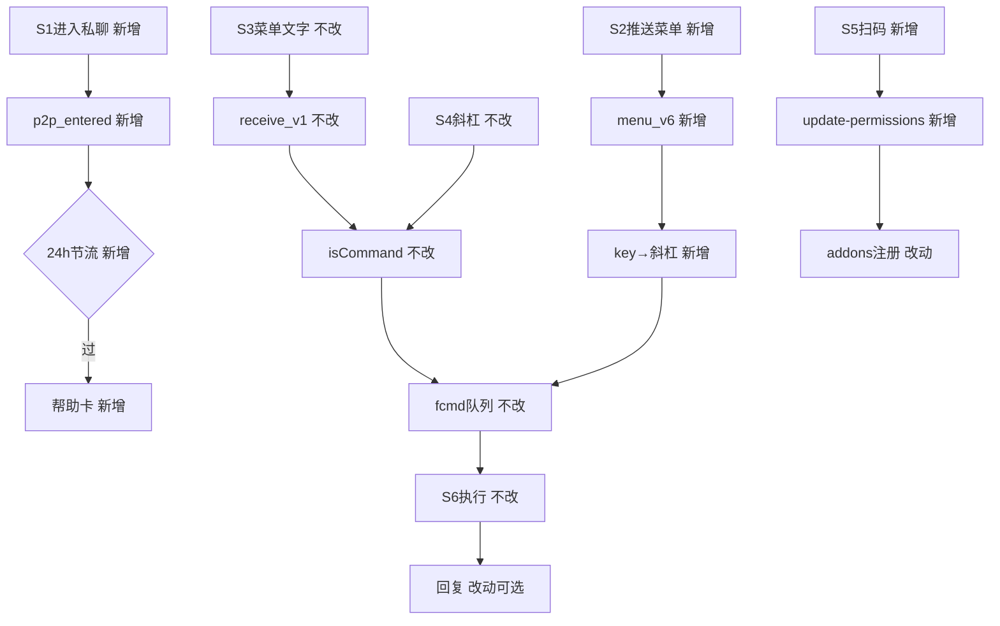

# 飞书机器人自定义菜单快捷指令 - 实现设计

> **PRD**：`01-proposal.md`（验收 17 条）

## 一、业务流程与改动范围

### （一）业务流程图

### （二）流程步骤与改动对照

| 步骤ID | 业务含义 | 改动 | 落点文件 | 01验收 |
|--------|----------|------|----------|--------|
| S1 | 进入私聊帮助卡 | 新增 | `feishu-menu.ts`；`lark-core.ts` | 10–12 |
| S2 | 推送事件菜单 | 新增 | `feishu-menu.ts`；`lark-core.ts` | 1–4,8–9 |
| S3 | 发文字菜单 | 不改 | `daemon.ts` isCommand→handleCommand | 9 |
| S4 | 手动斜杠 | 不改 | `daemon.ts`；`daemon-manager.ts` | 13 |
| S5 | 扫码更新权限 | 新增 | `feishu-addons.ts`；IPC；`FeishuQrFlow` | 15–17 |
| S6 | 指令执行回复 | 改动可选 | `checkAndExecutePendingCommands` | 2–7,13–14 |

### （三）改动汇总

新增：`feishu-menu.ts`、`feishu-addons.ts`、`FeishuQrFlow`、IPC。改动：`lark-core` 事件、帮助文案、scope、SDK≥1.67。不改：群聊、CardKit、fcmd、斜杠路径。

## 二、整体思路

根因：无斜杠补全；未订阅 menu/p2p 事件；存量应用无增量开权。

**Ponytail 三问**：①必须——验收8/10/15。②最小——复用fcmd映射斜杠；`buildHelpText`单一源。③延后——群聊菜单、CardKit按钮、全量管理员项。

菜单 UI 飞书后台配置；扫码仅补权限/事件；`Map<openId,lastHelpAt>` 默认 24h 节流。

## 三、分层设计

WS 层 `lark-core` 注册三事件；桥接 `feishu-menu` 映射/节流/发卡；Daemon `pushCommandToQueue` 不变；Electron 帮助 SSOT+指令 switch；渲染端 `FeishuQrFlow`+对照表。

## 四、接口设计

事件：`menu_v6`（event_key+openId+chatId）；`bot_p2p_chat_entered_v1`；`receive_v1` 不改。IPC：`feishu:update-app-permissions({appId})` 带 `FEISHU_MENU_ADDONS`，与 `register-app` 并存。

| event_key | 斜杠 | 权限 |
|-----------|------|------|
| cmd_help | /help | 全员 |
| cmd_status | /status | 全员 |
| cmd_reset | /reset | 全员 |
| cmd_stop | /stop | 全员 |
| cmd_workspace | /workspace | 管理员 |
| cmd_model | /model | 管理员 |
| cmd_chat_new | /chat new | 管理员 |

未知 key→提示；非 admin 点管理员项→同 `denyNonAdmin`。

## 五、数据结构

`feishu-addons.ts`：scopes=`application:bot.menu:write`,`cardkit:card:write`,`application:application.bot.operator_name:readonly`；events=`application.bot.menu_v6`,`im.chat.access_event.bot_p2p_chat_entered_v1`。内存 `helpThrottleMap`；`HELP_CARD_INTERVAL_MS=86400000`。

## 六、实现步骤

1.S5 SDK+addons+IPC+QrFlow → 2.S6 抽帮助文案 → 3.S1 p2p+节流+卡 → 4.S2 menu_v6+映射+fcmd → 5.lark-core 注册+Settings 对照表 → 6.S3/S4 回归+后台菜单文档。

## 七、参考实现

`lark-core.startConnection`；`daemon.isCommand`/`pushCommandToQueue`；`daemon-manager.checkAndExecutePendingCommands`（/help~1041）；`feishu:register-app`；`REQUIRED_FEISHU_SCOPES`；`ChannelPanel.tsx`（659行）。

## 八、技术影响

### （一）影响范围

飞书私聊+设置页；不影响微信/群聊/CardKit。风险：event_key 配错、扫码后须后台发菜单、SDK 版本。

### （二）工程补充验收项

未知 key/无权限有回复；24h 不重复推卡；addons 与 IPC 一致；拆分文件≤300行；单测映射与节流。

## 九、知识库影响

飞书通道文档（菜单步骤、event_key、addons、扫码流程）；帮助/斜杠文案同步。

## 十、知识库更新计划

### （一）必须更新

飞书 IM/通道：菜单配置、event_key 表、addons、扫码更新。

### （二）可能更新

设置页概览；斜杠指令索引（菜单等价说明）。

### （三）不需要更新

CardKit 合并、微信、工作流/MCP 独立文档。
