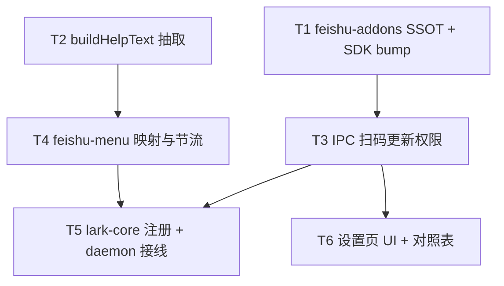

# 飞书机器人自定义菜单快捷指令 - 任务分解

> **来源**：`/kb-plan`（基于 `01-proposal.md`、`02-design.md`）
> **任务数**：6（T1–T6）
> **依赖图与分组调度**：见「一、执行计划」；每条 `T{n}` 自包含，子 agent 只读该 `T{n}` + 上下文文件即可开工，不应回读 `02-design.md`。

## 一、执行计划

### （一）依赖图



**依赖说明**：

- T1 为权限/事件 addons SSOT，T3 IPC 与 T6 UI 均 import `FEISHU_MENU_ADDONS`。
- T2 产出 `/help` 与帮助卡文案 SSOT，T4 帮助卡内容与 T5 发卡均依赖之。
- T4 实现 menu/p2p 业务骨架；T5 在 `lark-core`/`daemon` 注册事件并接线 `pushCommandToQueue`。
- T6 仅依赖 T3 的 IPC 契约，可与 T5 并行（第四轮）。

### （二）分组调度

| 轮次 | 并行任务 | 说明 |
|------|----------|------|
| **第一轮** | T1、T2 | 无共享写文件；T1 新建 `feishu-addons.ts` + bump SDK；T2 新建 `feishu-help-text.ts` 并改 `daemon-manager` `/help` 分支 |
| **第二轮** | T3、T4 | 均依赖 T1；T4 另依赖 T2。T3 改 `daemon-manager`/preload/env.d；T4 新建 `feishu-menu.ts`，文件集无交集 |
| **第三轮** | T5 | 依赖 T3、T4；改 `lark-core.ts`、`daemon.ts`，独占冲突文件 |
| **第四轮** | T6 | 依赖 T3；新建 `FeishuQrFlow.tsx`，改 `ChannelPanel`/`Settings`/`constants.ts` |

**同文件冲突清单（须串行）**：

| 文件 | 涉及任务（顺序） |
|------|------------------|
| `electron/daemon/daemon-manager.ts` | T2（/help 文案）→ T3（IPC handler） |
| `src/bridge/lark-core.ts` | T5 |
| `src/daemon/daemon.ts` | T5 |
| `electron/preload.ts` / `src/renderer/env.d.ts` | T3 → T6（T6 仅消费 T3 已暴露 API，不再改契约） |

## 二、任务清单

## T1: feishu-addons SSOT 与 SDK 版本 bump

### 背景

菜单写入、帮助 CardKit、进入私聊事件及扫码增量开权均依赖一组固定的飞书开放平台 scopes/events。须在 `src/shared/feishu-addons.ts` 集中定义 `FEISHU_MENU_ADDONS`，供 IPC「扫码更新权限」与设置页对照表引用，避免多处硬编码不一致。同时 `@larksuiteoapi/node-sdk` 须 ≥1.67.0 以支持 `registerApp({ appId, addons })` 增量更新流程（02 §五、S5）。

### 上下文文件

- 必读: `src/renderer/constants.ts` — 现有 `REQUIRED_FEISHU_SCOPES` 结构与描述风格
- 必读: `package.json` — 当前 `@larksuiteoapi/node-sdk` 为 `^1.66.1`
- 参考: `electron/daemon/daemon-manager.ts` L1450–1487 — 现网 `feishu:register-app` 使用 `registerApp` 创建流程
- 参考: `02-design.md` §四 event_key 表、§五 addons 清单（本任务内已摘录于接口契约）

### 实现范围

- 新建: `src/shared/feishu-addons.ts` — 导出 `FEISHU_MENU_ADDONS`、`FEISHU_MENU_SCOPES`（含 desc）、`FEISHU_MENU_EVENTS`（含 desc）、`event_key`→斜杠映射常量（与 02 §四 表一致）
- 修改: `package.json` — `@larksuiteoapi/node-sdk` bump 至 `^1.67.0`（或更高兼容版）
- **不修改**: IPC、UI、lark-core（归 T3/T5/T6）

### 接口契约

```typescript
/** 扫码增量开权时传入 registerApp 的 addons（仅增量叠加） */
export const FEISHU_MENU_ADDONS: {
  scopes: { tenant: string[]; user: string[] }
  events: { items: { tenant: string[]; user: string[] } }
}

/** 设置页展示用，含中文 desc */
export const FEISHU_MENU_SCOPES: { scope: string; desc: string }[]
export const FEISHU_MENU_EVENTS: { event: string; desc: string }[]

/** event_key → 斜杠指令（不含前导解析逻辑） */
export const FEISHU_MENU_EVENT_MAP: Record<string, { command: string; adminOnly: boolean; label: string }>
```

**addons 固定清单**（tenant 身份）：

- scopes: `application:bot.menu:write`、`cardkit:card:write`、`application:application.bot.operator_name:readonly`
- events: `application.bot.menu_v6`、`im.chat.access_event.bot_p2p_chat_entered_v1`

**event_key 表**：

| event_key | 斜杠 | 权限 |
|-----------|------|------|
| cmd_help | /help | 全员 |
| cmd_status | /status | 全员 |
| cmd_reset | /reset | 全员 |
| cmd_stop | /stop | 全员 |
| cmd_workspace | /workspace | 管理员 |
| cmd_model | /model | 管理员 |
| cmd_chat_new | /chat new | 管理员 |

### 验收标准

- [ ] `FEISHU_MENU_ADDONS` 与 02 §五 scopes/events 完全一致，可被 `import` 且无循环依赖（02 八·（二）addons 与 IPC 一致之前置）
- [ ] `FEISHU_MENU_EVENT_MAP` 覆盖上表 7 项，`adminOnly` 与 01 F3.2/F3.3 二分模型一致
- [ ] `package.json` 中 SDK 版本 ≥1.67.0；`npm install` 后 lockfile 更新
- [ ] 新建文件 ≤300 行，含必要中文注释
- [ ] 无 02/03 未要求的抽象层或未批准的新依赖（Ponytail 口径）

### 依赖

- 前置任务: 无
- 后续任务: T3、T4、T6

---

## T2: 抽取 buildHelpText 帮助文案 SSOT

### 背景

`/help` 文本、进入私聊帮助 CardKit 与菜单项说明须语义一致（01 F2.3、验收 11）。现网 `/help` 文案内联于 `daemon-manager.ts` L1041–1063，须抽取为单一函数 `buildHelpText(isAdmin: boolean)`，供 Electron 指令执行与 bridge 帮助卡共用，避免三套文案漂移。

### 上下文文件

- 必读: `electron/daemon/daemon-manager.ts` L895 `denyNonAdmin`、L1041–1063 `/help` case — 现网文案与管理员二分
- 必读: `electron/scheduling/AGENTS.md` — scheduling 子目录职责
- 参考: `src/shared/channel-types.ts` — electron 引用 shared 的路径风格（`../../src/shared/...`）
- 参考: `electron/daemon/daemon-manager.ts` L1048–1057 `adminOnly` 列表 — 首期菜单仅覆盖高频子集，帮助卡须注明「更多指令可手动输入 /help」或等价引导

### 实现范围

- 新建: `src/shared/feishu-help-text.ts` — SSOT，导出 `buildHelpText(isAdmin: boolean): string`（bridge 与 Electron 均可 import）
  - 含：基础指令说明（help/status/reset/stop）、自定义菜单位置引导（输入框旁菜单）、管理员区块（仅 `isAdmin` 时）、与 event_key 表首期 7 项语义对齐的菜单等价说明
- 新建: `electron/scheduling/feishu-help-text.ts` — 自 `src/shared/feishu-help-text.js` re-export（满足 scheduling 目录约定）
- 修改: `electron/daemon/daemon-manager.ts` — `/help` case 改为 `await reply(true, buildHelpText(isAdmin))`，import 自 scheduling re-export
- **不修改**: bridge、lark-core（T4/T5 再 import shared）

### 接口契约

```typescript
/**
 * 生成与 /help 及帮助卡一致的纯文本/Markdown 帮助正文。
 * @param isAdmin 是否主用户/管理员（与现网 isAdmin 判定一致）
 */
export function buildHelpText(isAdmin: boolean): string
```

- 非管理员输出不得包含管理员指令明细；须含「点击输入框旁菜单可快捷执行」引导
- 管理员输出在 common 基础上追加 workspace/model/chat new 等说明，与菜单首期项一致

### 验收标准

- [ ] 管理员与普通用户分别调用 `buildHelpText`，内容与改造前 `/help` 回复**语义等价**且含菜单引导（01 验收 11；02 S6）
- [ ] `daemon-manager` `/help` 路径仍走 `checkAndExecutePendingCommands`，行为不变（01 验收 13）
- [ ] 新建文件 ≤300 行
- [ ] 无 02/03 未要求的抽象层或未批准的新依赖（Ponytail 口径）

### 依赖

- 前置任务: 无
- 后续任务: T4、T5

---

## T3: IPC feishu:update-app-permissions（扫码增量开权）

### 背景

存量飞书通道须能在设置页「扫码更新权限」增量开通菜单与进入私聊事件（01 F4.1–F4.5、验收 15–17），不替换 App ID/Secret。主进程新增 IPC `feishu:update-app-permissions`，内部调用 `registerApp({ appId, addons: FEISHU_MENU_ADDONS })`，复用现网 QR 推送通道（`feishu:setup-qrcode` / `feishu:setup-status`），与 `feishu:register-app` **并存**。

### 上下文文件

- 必读: `electron/daemon/daemon-manager.ts` L1447–1496 — 现网 `feishu:register-app` / cancel / QR 广播模式
- 必读: `src/shared/feishu-addons.ts` — T1 产出 `FEISHU_MENU_ADDONS`
- 必读: `electron/preload.ts` L333–344 — `feishuRegisterApp` 与 setup 事件订阅
- 必读: `src/renderer/env.d.ts` L284–285 — 飞书 IPC 类型声明位置

### 实现范围

- 修改: `electron/daemon/daemon-manager.ts` —
  - 新增 `ipcMain.handle("feishu:update-app-permissions", async (_e, appId: string) => ...)`
  - 校验 `appId` 非空（`cli_` 前缀）；调用 `registerApp({ appId, addons: FEISHU_MENU_ADDONS, signal, onQRCodeReady, onStatusChange })`
  - **不**写入/返回新 secret；成功 `{ ok: true }`，取消 `{ ok: false, error: "cancelled" }`，其他错误 `{ ok: false, error: string }`
  - 新增 `feishu:update-app-permissions-cancel`（或复用 cancel 模式，须在契约中明确）
- 修改: `electron/preload.ts` — `feishuUpdateAppPermissions(appId)`、`feishuUpdateAppPermissionsCancel()`
- 修改: `src/renderer/env.d.ts` — 同步上述 API 签名

### 接口契约

```typescript
// IPC（preload 暴露为 window.electronAPI.*）
feishuUpdateAppPermissions(appId: string): Promise<{ ok: boolean; error?: string }>
feishuUpdateAppPermissionsCancel(): Promise<{ ok: boolean }>

// 主进程：registerApp 参数要点
await lark.registerApp({
  appId,  // 已有应用 cli_xxx
  addons: FEISHU_MENU_ADDONS,
  signal,
  onQRCodeReady(info) { /* 复用 feishu:setup-qrcode */ },
  onStatusChange(info) { /* 复用 feishu:setup-status */ },
})
```

- 错误文案（用户可见简体中文）：取消→「已取消授权」；超时/网络→可理解说明 + 可重试提示
- **禁止**修改通道已存 `larkAppSecret`（01 F4.5、验收 16）

### 验收标准

- [ ] 传入有效 `appId` 可弹出扫码 QR，确认页预置清单含 menu 写入、menu_v6、p2p_entered 三项能力（01 验收 15）
- [ ] 扫码成功后应用凭证未变；开发者后台可见增量权限/事件（01 验收 16；须人工对比后台）
- [ ] 取消/失败时返回明确 `error`，非静默（01 验收 17；02 八·（二））
- [ ] `addons` 与 T1 `FEISHU_MENU_ADDONS` 引用同一导出，无重复字面量（02 八·（二））
- [ ] preload/env.d 与 handler 三处契约一致
- [ ] 无 02/03 未要求的抽象层或未批准的新依赖（Ponytail 口径）

### 依赖

- 前置任务: T1
- 后续任务: T5（无直接代码依赖，事件订阅需管理员先扫码）、T6

---

## T4: feishu-menu 映射、节流与事件处理骨架

### 背景

飞书「推送事件」类菜单（`application.bot.menu_v6`）与进入私聊（`bot_p2p_chat_entered_v1`）须在 bridge 层解析 `event_key`、校验管理员权限、映射为斜杠指令或推送帮助卡。本任务新建 `feishu-menu.ts`，实现 `handleMenuClick`（→ `pushCommandToQueue` 等价语义）、`handleP2pEntered`（24h 节流 + 帮助卡内容），**不**在 `lark-core` 注册事件（归 T5）。

### 上下文文件

- 必读: `src/shared/feishu-addons.ts` — `FEISHU_MENU_EVENT_MAP`
- 必读: `src/shared/feishu-help-text.ts` — T2 `buildHelpText` SSOT
- 必读: `src/daemon/daemon.ts` L2240–2318 — `pushCommandToQueue`、`handleCommand` 入队契约
- 必读: `electron/daemon/daemon-manager.ts` L895 `denyNonAdmin` — 无权限文案风格
- 参考: `src/bridge/lark-core.ts` L432 `renderMergeBatchCard` — CardKit 发卡模式（T5 接线时复用）

### 实现范围

- 新建: `src/bridge/feishu-menu.ts`（≤300 行，超限拆 `feishu-menu-throttle.ts`）—
  - `resolveMenuCommand(eventKey: string, isAdmin: boolean): { ok: true; command: string } | { ok: false; replyText: string }`
  - `handleMenuClick(ctx: MenuClickContext): Promise<MenuHandleResult>` — 未知 key、非 admin 点管理员项返回可理解回复
  - `handleP2pEntered(ctx: P2pEnteredContext): Promise<P2pHandleResult>` — 内存 `helpThrottleMap: Map<openId, lastHelpAt>`，`HELP_CARD_INTERVAL_MS = 86400000`
  - 帮助卡正文 import `buildHelpText` from `../shared/feishu-help-text.js`（T2 SSOT）
- 新建（可选）: `src/bridge/feishu-menu.test.ts` — 映射与节流单测
- **不修改**: `lark-core.ts`、`daemon.ts`（T5）

### 接口契约

```typescript
interface MenuClickContext {
  eventKey: string
  openId: string
  chatId: string
  messageId?: string  // 用于 reply 锚点，由 T5 传入
  isAdmin: boolean
}

type MenuHandleResult =
  | { action: "enqueue"; command: string; messageId: string; chatId: string; chatType: "p2p" }
  | { action: "reply"; text: string }

interface P2pEnteredContext { openId: string; chatId: string; isAdmin: boolean }

type P2pHandleResult =
  | { action: "send_help_card"; helpMarkdown: string }
  | { action: "skip"; reason: "throttled" }

export const HELP_CARD_INTERVAL_MS = 86400000
```

- 未知 `event_key` → `reply` 含「未知菜单项」类提示（02 八·（二））
- 非 admin + 管理员项 → 与 `denyNonAdmin` 语义一致：「🔒 该指令仅管理员可用」

### 验收标准

- [ ] 7 个 event_key 映射正确；`cmd_chat_new` → `/chat new`（01 验收 1–7、8–9 逻辑层）
- [ ] 未知 key、无权限均有 `reply` 文案，不静默（02 八·（二））
- [ ] 同一 openId 24h 内第二次 `handleP2pEntered` 返回 `skip`（02 八·（二）；01 验收 12）
- [ ] 单测覆盖映射表与节流边界（02 八·（二））
- [ ] 单文件 ≤300 行
- [ ] 无 02/03 未要求的抽象层或未批准的新依赖（Ponytail 口径）

### 依赖

- 前置任务: T1、T2
- 后续任务: T5

---

## T5: lark-core 事件注册与 daemon 接线

### 背景

将 T4 骨架接入运行时：`lark-core.startConnection` 注册 `application.bot.menu_v6` 与 `im.chat.access_event.bot_p2p_chat_entered_v1`；`daemon.ts` 在回调中判定 admin、调用 `handleMenuClick`/`handleP2pEntered`，菜单路径经既有 `pushCommandToQueue` 进入 `.fcmd` 队列（与 S3/S4 斜杠路径一致）；进入私聊帮助以 CardKit 发送（复用 merge 卡 create+send 模式或等价 CardKit helper）。

### 上下文文件

- 必读: `src/bridge/lark-core.ts` L986–1021 `startConnection` — 现网 `im.message.receive_v1` 注册模式
- 必读: `src/bridge/feishu-menu.ts` — T4 导出
- 必读: `src/daemon/daemon.ts` L2131–2198 飞书连接、`L2240` `pushCommandToQueue`、`L2316` `handleCommand`
- 必读: `electron/daemon/daemon-manager.ts` — `checkAndExecutePendingCommands` 消费 `.fcmd`（/help 等）
- 参考: `src/bridge/lark-core.ts` L432–450 `renderMergeBatchCard` — CardKit 创建+发送模式

### 实现范围

- 修改: `src/bridge/lark-core.ts` —
  - `EventDispatcher.register` 增加 `application.bot.menu_v6`、`im.chat.access_event.bot_p2p_chat_entered_v1` handler
  - 解析 payload 为统一结构回调上层（或 export 类型供 daemon 使用）
  - 新增 `renderHelpCard(chatId: string, markdown: string, replyMessageId?: string)`（或于 `feishu-menu` 调 lark-core 薄封装），CardKit schema 2.0，正文为 T2 帮助 Markdown
- 修改: `src/daemon/daemon.ts` —
  - 飞书 `onMessage` 旁新增 menu/p2p 事件回调接线
  - `handleMenuClick` 返回 `enqueue` 时调用 `pushCommandToQueue(command, messageId, source, chatId, "p2p")`（**不**改 `isCommand`/receive_v1 路径，01 验收 13）
  - `handleP2pEntered` 返回 `send_help_card` 时调 lark-core 发卡
  - admin 判定复用现网主用户 openId/chatId 逻辑（与斜杠路径一致，01 F3.4）
- **回归**: 手动斜杠、`isCommand`、CardKit 合并预览路径不被破坏（01 验收 13–14）

### 接口契约

```typescript
// lark-core 新增事件回调类型（示意）
type FeishuMenuEvent = { eventKey: string; openId: string; chatId: string; operatorId?: string }
type FeishuP2pEnteredEvent = { openId: string; chatId: string }

// daemon 接线
onFeishuMenuV6(ev: FeishuMenuEvent): Promise<void>
onFeishuP2pEntered(ev: FeishuP2pEnteredEvent): Promise<void>
```

- 菜单点击最终须走 `.fcmd` → `checkAndExecutePendingCommands`，与文本 `/status` 等结果类型一致（01 验收 2–4、7）
- 至少一项菜单在飞书后台配置为「推送事件」验收（01 验收 8；部署/后台配置属人工步骤，代码须支持 event_key 路径）

### 验收标准

- [ ] 私聊点击菜单（推送事件配置）后，私聊反馈与对应斜杠一致（01 验收 1–4、8–9）
- [ ] 管理员可见/可执行管理员项；非管理员无权限提示（01 验收 5–6）
- [ ] 符合节流规则时进入私聊收到帮助 CardKit，内容与 `/help` 无矛盾（01 验收 10–11）
- [ ] 24h 内重复进入不重复发卡（01 验收 12）
- [ ] 文本斜杠与合并预览/流式 CardKit 体验无回退（01 验收 13–14）
- [ ] 改动后 `lark-core.ts`、`daemon.ts` 若超 300 行，须按 AGENTS.md 拆分新增文件，本任务内完成
- [ ] 无 02/03 未要求的抽象层或未批准的新依赖（Ponytail 口径）

### 依赖

- 前置任务: T3、T4（T3 为联调前置：事件订阅需权限就绪；代码层无 import 依赖）
- 后续任务: 无（T6 可并行）

---

## T6: 设置页扫码更新入口与 event_key 对照表

### 背景

管理员在**已有凭据**的飞书通道编辑页需见「扫码更新权限」入口（01 F4.1、验收 15），调用 T3 IPC；设置页飞书 Tab 补充 event_key 对照表与增量 scopes 说明，降低后台菜单配置出错率（02 §十 知识库计划；NG7 菜单 UI 仍须后台配置）。

### 上下文文件

- 必读: `src/renderer/components/ChannelPanel.tsx` L252–316、L418–459 — 现网一键创建 QR 流程
- 必读: `src/shared/feishu-addons.ts` — scopes/events/event_key 表
- 必读: `electron/preload.ts` / `src/renderer/env.d.ts` — T3 `feishuUpdateAppPermissions`
- 必读: `src/renderer/pages/Settings.tsx` L637–694 — 权限/事件参考区块
- 必读: `src/renderer/constants.ts` — `REQUIRED_FEISHU_SCOPES`

### 实现范围

- 新建: `src/renderer/components/FeishuQrFlow.tsx` — 可复用 QR 展示组件（loading/wait/error/cancel），props 区分 `mode: "register" | "update-permissions"`
- 修改: `src/renderer/components/ChannelPanel.tsx` —
  - 当 `draft.larkAppId` 已填且非一键创建进行中时，展示「扫码更新权限」按钮
  - 调用 `feishuUpdateAppPermissions(draft.larkAppId.trim())`；失败/取消展示 `feishuQrMsg`
  - **不**遮挡「一键创建应用」（01 验收 17）
- 修改: `src/renderer/pages/Settings.tsx` — 新增「自定义菜单 event_key 对照表」小节（7 项 + 飞书后台配置提示）；权限列表合并展示 T1 增量 scopes（或标注「菜单能力增量权限」）
- 修改: `src/renderer/constants.ts` — 扩展 `REQUIRED_FEISHU_SCOPES` 或在注释中指向 `FEISHU_MENU_SCOPES`；`FEISHU_SCOPES_JSON` 是否合并增量 scopes 须在实现时二选一并在 UI 说明（推荐：Settings 分「基础权限」与「菜单增量权限」两表，避免破坏现网复制 JSON 行为）

### 接口契约

```typescript
// FeishuQrFlow.tsx
interface FeishuQrFlowProps {
  mode: "register" | "update-permissions"
  appId?: string  // update 模式必填
  onSuccess?: () => void
  onCancel?: () => void
}
```

- 「扫码更新权限」仅 `larkAppId` 存在时 enabled；无 appId 时 disabled + tooltip
- 成功提示：「权限已提交更新，请在飞书开发者后台确认并发布应用版本」类说明（02 风险：版本审批缓冲）

### 验收标准

- [ ] 已绑定应用通道可见「扫码更新权限」，点击后出现 QR 引导（01 验收 15）
- [ ] 与「一键创建应用」并存、互不遮挡（01 验收 17）
- [ ] 取消/失败有可理解提示，可再次发起（01 验收 17）
- [ ] Settings 页 event_key 表与 T1 映射一致，含后台配置说明（降低 event_key 配错风险，02 八·（一））
- [ ] 各组件文件 ≤300 行；`FeishuQrFlow` 从 `ChannelPanel` 抽出后 ChannelPanel 行数下降
- [ ] 无 02/03 未要求的抽象层或未批准的新依赖（Ponytail 口径）

### 依赖

- 前置任务: T3
- 后续任务: 无（人工验收：飞书后台菜单结构配置 + 推送事件项）
