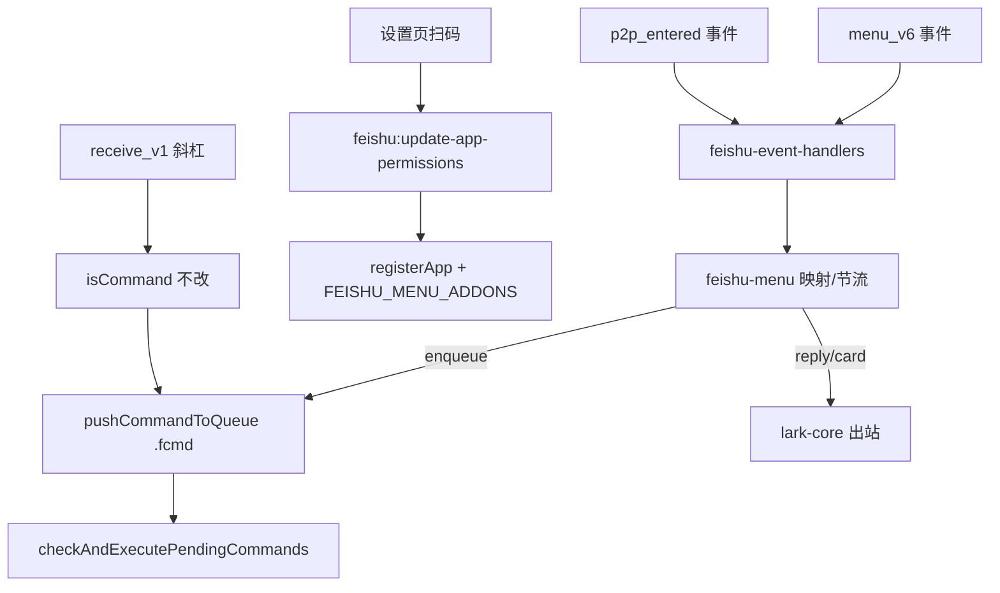

# 飞书机器人自定义菜单快捷指令 - 代码评审报告

## 1、审查范围

- **变更类型**: apply 产出的工作区变更（T1–T6 全量落地）
- **评审等级**: focused-review（飞书 bridge + Electron IPC + 设置页局部；无 proto/DB/资金路径；未达 full-review 六路并行门槛）
- **涉及文件**:
  - 新建: `src/shared/feishu-addons.ts`、`src/shared/feishu-help-text.ts`、`electron/scheduling/feishu-help-text.ts`、`src/bridge/feishu-menu.ts`、`src/daemon/feishu-event-handlers.ts`、`src/renderer/components/FeishuQrFlow.tsx`
  - 修改: `package.json`、`electron/daemon/daemon-manager.ts`、`electron/preload.ts`、`src/bridge/lark-core.ts`、`src/daemon/daemon.ts`、`src/renderer/components/ChannelPanel.tsx`、`src/renderer/pages/Settings.tsx`、`src/renderer/constants.ts`、`src/renderer/env.d.ts`
- **设计文档**: `02-design.md`（对照基准）；任务: `03-tasks.md` T1–T6
- **评审轮次**: 首轮 focused 发现 3 项 score≥75 → **T-FIX-01** 修复 → 复评 R1–R3 闭合

## 2、严重（必须处理）

无（首轮最高 R1 评分 82，未达 critical 门槛 85）。

## 3、警告（建议处理）

| ID | 分数 | 问题 | 位置 | 修复 | 状态 |
|----|------|------|------|------|------|
| R1 | 82 | **admin 误判**：`menu_v6` 在 payload 缺 `chat_id` 时 `resolveMenuChatId` 回退至 `mainUserChatId`，随后 `isFeishuChannelAdmin(rt, chatId)` 恒为 true，非主用户点击管理员菜单项可能被误放行 | `src/daemon/feishu-event-handlers.ts` L39–67 | T-FIX-01：admin 判定改基于 `openId`（或与 `daemon.isSessionMainUser` / Electron `isMainUser` 同等语义），与 `chatId` 回退解耦；`p2p_entered` 路径同步 | ✅ fixed |
| R2 | 58 | **QR 通道并发**：`feishu:register-app` 与 `feishu:update-app-permissions` 均广播 `feishu:setup-qrcode` / `feishu:setup-status`，各自独立 `AbortController`，并行发起时 QR/状态可能串台 | `electron/daemon/daemon-manager.ts` L1430–1530 | T-FIX-01：两 handler 共享互斥锁或统一 feishu QR 会话（发起新流程 abort 旧流程 + UI mode 区分） | ✅ fixed |
| R3 | 28 | **cleanExpiredCommands 缺 chatId**：`.fcmd` 超时清除后 `replyToMessage(parsed.messageId)` 未传 `chatId`，多会话/跨 chat 锚点时超时提示可能发错会话 | `src/daemon/daemon.ts` L2311–2330 | T-FIX-01：超时 reply 传入 `parsed.chatId`（及必要 `chatType`） | ✅ fixed |
| R4 | 45 | T4 验收要求 `feishu-menu.test.ts` 单测，仓库无单测惯例，与根 `AGENTS.md`「不写单测」冲突 | `03-tasks.md` T4 验收；`02-design` 八·（二） | **false_positive** → `accepted_debt`：静态契约 + `/kb-test` 手工覆盖映射与节流 | accepted_debt |
| R5 | 25 | `ChannelPanel.tsx` 仍 **658 行**，超出 ≤300 行规范；T6 抽出 `FeishuQrFlow` 后行数未显著下降 | `src/renderer/components/ChannelPanel.tsx` | **accepted_debt**（ponytail）：archive 后持续拆分 | accepted_debt |
| R6 | 30 | `lark-core.ts` **1154 行**，T5 新增事件注册与 `renderHelpCard` 后仍超限 | `src/bridge/lark-core.ts` | **accepted_debt**（历史枢纽，bridge AGENTS 不拆 lark-core） | accepted_debt |

## 4、设计偏差

| 设计项 | 预期 | 实际 | 状态 |
|--------|------|------|------|
| S1 p2p 进入私聊 + 24h 节流帮助卡 | `feishu-menu` + lark-core CardKit | `handleP2pEntered` + `HELP_CARD_INTERVAL_MS=86400000` | ✅ |
| S2 menu_v6 映射 → fcmd | 7 项 event_key + admin 二分 | `FEISHU_MENU_EVENT_MAP` + `pushCommandToQueue` | ✅（R1 修复后 admin 语义对齐 01 F3.4） |
| S5 扫码增量开权 | IPC + `FEISHU_MENU_ADDONS` SSOT | `feishu:update-app-permissions` 与 register 并存 | ✅（R2 修复后 QR 互斥） |
| S6 帮助文案 SSOT | `buildHelpText(isAdmin)` | shared + scheduling re-export | ✅ |
| T4 单测 | 映射与节流单测 | 未新增 test 文件 | ⚠️ accepted_debt（R4） |
| 单文件 ≤300 行 | T4/T5/T6 新文件合规 | `feishu-menu` 124 行、`feishu-event-handlers` 120 行；`ChannelPanel`/`lark-core` 超限 | ⚠️ R5/R6 债务 |

无与 `02-design` 已确认决策（fcmd 路径不变、群聊不在范围、addons SSOT）相悖的功能性偏差。

## 5、验收标准检查

### T1–T6（`03-tasks.md`）

| 任务 | 验收条件 | 状态 |
|------|---------|------|
| T1 | `FEISHU_MENU_ADDONS` / event_key 表 / SDK ≥1.67 | ✅ |
| T2 | `buildHelpText` SSOT；daemon `/help` 语义等价 | ✅ |
| T3 | IPC 三处契约一致；addons 引用 SSOT；取消/失败非静默 | ✅ |
| T4 | 7 项映射、未知 key/无权限 reply、24h 节流 | ✅ 静态；单测项 accepted_debt（R4） |
| T5 | menu_v6/p2p 注册；fcmd 入队；帮助 CardKit | ✅（R1/R3 修复后 admin/超时 reply 闭合） |
| T6 | 扫码更新入口 + Settings 对照表；与一键创建并存 | ✅ |

### 01 提案验收（§六 1–17）

| 区间 | 条件 | 状态 |
|------|------|------|
| 1–4 | 基础菜单 → 斜杠等价 | ✅ 代码路径 |
| 5–7 | 管理员二分 + 无权限提示 | ✅ R1 修复后 |
| 8–9 | 推送事件菜单路径 | ✅ |
| 10–12 | 进入私聊帮助卡 + 24h 节流 | ✅ |
| 13–14 | 文本斜杠 / CardKit 无回退 | ⏳ `/kb-test` 回归 |
| 15–17 | 扫码更新权限 UI + 失败可重试 | ✅（R2 修复后 QR 互斥） |

### 02 工程补充验收（八·（二））

| 项 | 状态 |
|----|------|
| 未知 key / 无权限有回复 | ✅ |
| 24h 不重复推卡 | ✅ |
| addons 与 IPC 一致 | ✅ |
| 新文件 ≤300 行 | ✅（R5/R6 为存量/面板债务） |
| 单测映射与节流 | accepted_debt（R4） |

## 6、调用链与回归风险

| 风险 | 等级 | 说明 |
|------|------|------|
| admin 误判（R1） | 中→低 | T-FIX-01 已闭合；须 `/kb-test` 验收 5–6 |
| QR 串台（R2） | 低 | T-FIX-01 互斥后；并行点击 register/update 不再混 QR |
| fcmd 超时 reply（R3） | 低 | T-FIX-01 补 chatId |
| 飞书后台菜单 event_key 配错 | 中 | Settings 对照表 + 未知 key reply；人工配置 |
| lark-core/daemon 枢纽膨胀 | 低 | 本变更抽出 `feishu-event-handlers`；lark-core 行数债务 R6 |
| SDK 版本 / 权限审批延迟 | 低 | 设计已知；扫码后须后台发版 |

## 7、遗留债务

1. **R4 单测缺口**（`accepted_debt`）：03 T4 与仓库 AGENTS 冲突；以静态 + 手工验收替代，不阻断 archive。
2. **R5 ChannelPanel 658 行**（`accepted_debt` ponytail）：`FeishuQrFlow` 已抽出；面板本体仍超限，archive 后拆分。
3. **R6 lark-core 1154 行**（`accepted_debt` 历史）：bridge 域约定不拆枢纽；本变更增量在事件注册与 help card。
4. **08-verify / kb-test 待跑**：01 验收 13–14 流式/CardKit 回归；飞书后台菜单「推送事件」项 E2E（验收 8）。

## 8、修复任务建议

| 问题 ID | 建议动作 | 关联任务 | 状态 |
|---------|----------|----------|------|
| R1 | admin 基于 openId，与 chatId 回退解耦 | T-FIX-01 | ✅ fixed |
| R2 | register-app 与 update-permissions QR 互斥 | T-FIX-01 | ✅ fixed |
| R3 | cleanExpiredCommands 超时 reply 传 chatId | T-FIX-01 | ✅ fixed |
| R4 | 不新增单测；kb-test 手工覆盖 | — | accepted_debt |
| R5 | archive 后拆分 ChannelPanel | — | accepted_debt |
| R6 | lark-core 历史债务；不本变更扩 scope | — | accepted_debt |

## 9、结论

**通过**，可进入 `/kb-test`。

- **blocking 数**: 0
- **首轮 score≥75**: R1(82)、R2(58) — 均已由 **T-FIX-01** 闭合；R3(28) 同步修复
- **accepted_debt**: R4（false_positive 单测）、R5（ChannelPanel 行数）、R6（lark-core 历史）
- **不可 archive 项**: 无；须 `/kb-test` 完成 01 验收 13–14 及飞书 E2E 冒烟后再 `/kb-archive`
