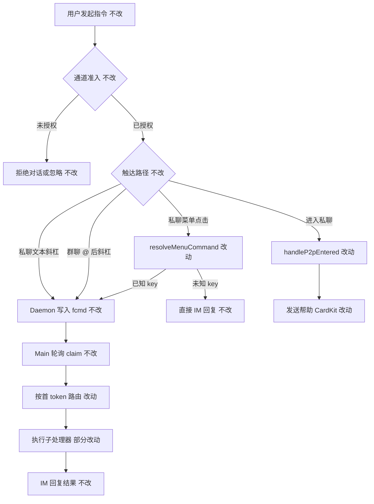
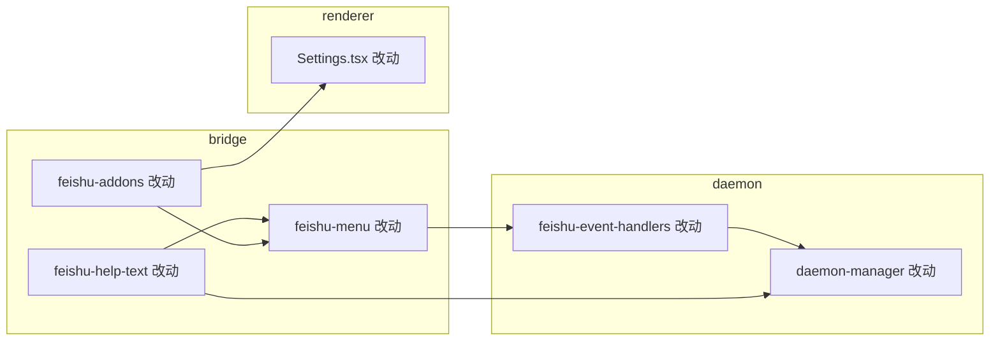

# 远程指令全员与群聊开放 - 实现设计

> **业务 PRD**：见同目录 `01-proposal.md`（验收标准以 01 为准）

## 一、业务流程与改动范围

> 业务口径以 `01-proposal.md` 第三节用户故事、第四节功能需求、第六节验收标准为准；下图覆盖指令从触达到回复的主流程与关键分支。

### （一）业务流程图

**图例**：`不改` 行为与现网一致；`改动` 移除角色门控或统一文案/行为；`新增`/`删除` 本变更无新增业务节点、无删除路径。

### （二）流程步骤与改动对照

| 步骤 ID | 业务含义 | 改动 | 落点（模块/文件） | 01 验收关联 |
|---------|----------|------|-------------------|-------------|
| S1 | 用户私聊/群聊发送斜杠文本 | 不改 | `src/daemon/daemon.ts` `isCommand` / `pushCommandToQueue` | 6.1、6.2、6.3·7 |
| S2 | 通道准入（allowOthers、群聊 @、主用户绑定） | 不改 | `src/daemon/daemon.ts` 入站 eligibility | 6.4·8 |
| S3 | 私聊菜单点击映射为斜杠 | 改动 | `src/bridge/feishu-menu.ts` `resolveMenuCommand` | 6.1·2、6.4·9 |
| S4 | Main claim 并解析指令头 | 不改 | `electron/daemon/daemon-manager.ts` `checkAndExecutePendingCommands` | 6.3·7 |
| S5 | 移除「仅管理员」拒绝分支 | 改动 | `daemon-manager.ts` 各 `case` 内 `denyNonAdmin` | 6.1·1、6.2·4 |
| S6 | `/stop` 执行范围统一 | 改动 | `daemon-manager.ts` `case "/stop"` | 6.3·6、01·R1 |
| S7 | `/list` 队列展示范围 | 改动 | `daemon-manager.ts` `case "/list"` | 6.1·1 |
| S8 | `/help` 与帮助卡正文 | 改动 | `src/shared/feishu-help-text.ts`；`feishu-menu.ts` `handleP2pEntered` | 6.1·3 |
| S9 | 设置页 event_key 对照表权限列 | 改动 | `src/renderer/pages/Settings.tsx` | 6.1·3、01·R6 |
| S10 | 菜单映射表 adminOnly 语义 | 改动 | `src/shared/feishu-addons.ts` | 6.1·2 |
| S11 | 飞书事件接线传 isAdmin | 改动（仅日志/签名简化） | `src/daemon/feishu-event-handlers.ts` | — |
| S12 | 微信斜杠执行 | 改动（随 S5 同枢纽生效） | 同 `daemon-manager.ts` | 6.5·10（若纳入） |

### （三）改动汇总

- **改动**：删除指令级 `isMainUser` 门控；统一 `/help` 全文；菜单 `adminOnly` 不再拦截；`/stop` 与 `/list` 行为对齐「人人同一规则」；设置页对照表权限列改为全员。
- **新增**：无。
- **不改（显式）**：
  - 通道准入：`allowOthers`、`mainUserEnabled`、群聊须 @（01·NG2、NG3）。
  - `isMainUser` 用于**会话键/工作区目录解析**（`resolveCommandSessionKey`、`resolveResetWorkspaceDir`、会话生命周期通知），**不**用于指令拒绝。
  - 各指令业务语义与子处理器（`handleChatCommand`、`handleFeishuModelCommand` 等）内部逻辑。
  - 飞书后台菜单物理分组与 event_key（01·NG5）。

## 二、整体思路

**根因**（见 01·§一）：指令执行枢纽 `checkAndExecutePendingCommands` 以 `isMainUser(chatId, chatType)` 为门控；群聊 `chatType !== "p2p"` 时 `isMainUser` 恒为 `false`，导致群聊下管理类指令一律被拒。菜单路径 `resolveMenuCommand` 另设 `adminOnly` 二次门控，与文本路径不一致。

**方案要点**：

1. **单点删除角色门控**：在 `daemon-manager.ts` 移除全部 `denyNonAdmin()` 及依赖 `isAdmin` 的 early-return；保留 `isAdmin` 仅用于日志（可选，后续可删）。
2. **菜单与帮助 SSOT 对齐**：`FEISHU_MENU_EVENT_MAP` 取消 `adminOnly` 权限语义；`buildHelpText` 改为**单一全文**，不再按角色分叉。
3. **`/stop` 产品定稿**（闭合 01·R1，设计默认）：**全员统一为「仅停当前会话 Agent」**——删除 `isAdmin` 分支下的全局 `stopAgent()`；人人执行 `stopSessionAgent(claimed.chatId)` 路径。理由：全员开放后若保留「主用户停全部」会形成新的隐性角色差；人人停全部风险过高（01·R2）。
4. **`/list` 产品定稿**：全员展示**完整队列**（与现网管理员视图一致），移除按 `sessionKey` 过滤的非管理员分支。
5. **微信同步**（闭合 01·R3，设计默认）：指令执行仅经 Main 轮询枢纽，**飞书与微信自动同规则**，无需分通道改门控。

**最小方案三问**（[kb-ponytail.md](../../../.cursor/skills/kb-workflow/references/kb-ponytail.md)）：

1. **复用现有模块？** 是。仅改 `daemon-manager`、`feishu-menu`、`feishu-help-text`、`feishu-addons`、`Settings.tsx`；不新建权限服务或策略类。
2. **新增抽象/依赖？** 否。删除 `denyNonAdmin`、`adminOnly` 门控与 `buildHelpText(isAdmin)` 分叉即可；YAGNI：01 未要求 RBAC/审计层（01·NG7）。
3. **合并到已有文件？** 是。改动集中在既有枢纽文件；`feishu-menu.ts` 可 inline 删除 `DENY_NON_ADMIN_TEXT` 与 `isAdmin` 参数（签名变更随调用方同轮更新）。

## 三、分层设计

| 层 | 职责 | 本变更 |
|----|------|--------|
| **Daemon 入站** | 文本/菜单入队、通道 eligibility | 不改 eligibility；菜单解析去掉 admin 门控 |
| **Main 指令枢纽** | `checkAndExecutePendingCommands` 路由与 reply | 删除角色门控；调整 `/stop`、`/list` |
| **会话/配置子处理器** | `/chat`、`/model`、`/workspace` 等 | 不改内部；入口不再被 admin 拦截 |
| **Renderer** | Settings 对照表展示 | 权限列统一「全员」 |
| **Shared SSOT** | `feishu-addons`、`feishu-help-text` | 扁平化权限与文案 |

## 四、接口设计

无新增 HTTP/IPC/proto 接口。

**变更的函数签名（内部）**：

| 符号 | 变更 |
|------|------|
| `buildHelpText()` | 移除 `isAdmin` 参数，恒返回全量指令说明 |
| `resolveMenuCommand(eventKey)` | 移除 `isAdmin` 参数与 `adminOnly` 判断 |
| `MenuClickContext` / `P2pEnteredContext` | 移除 `isAdmin` 字段（或保留只读日志，实现阶段二选一，推荐移除） |
| `FEISHU_MENU_EVENT_MAP` 条目 | 删除 `adminOnly` 字段，或全部置 `false` 且 UI 不再读取（推荐删除字段并改 Settings 渲染） |

## 五、数据结构

无持久化/schema 变更。

- `FEISHU_MENU_EVENT_MAP`：由 `Record<string, { command; adminOnly; label }>` 简化为 `Record<string, { command; label }>`（推荐）。
- 进程内 `helpThrottleMap`、`.fcmd` 文件格式：不变。

## 六、实现步骤

1. **T1（S10、S3）** — `feishu-addons.ts`：移除 `adminOnly`；`feishu-menu.ts`：简化 `resolveMenuCommand` / `handleMenuClick` / `handleP2pEntered`，删除拒绝文案常量。
2. **T2（S8）** — `feishu-help-text.ts`：`buildHelpText()` 单列表；标题改为「💡 可用指令：」；合并原 `COMMON` + `ADMIN` 行。
3. **T3（S5–S7、S12）** — `daemon-manager.ts`：删除 `denyNonAdmin` 及 8 处 `if (!isAdmin)`；`/stop` 统一会话停止；`/list` 全量队列；`/help` 调无参 `buildHelpText()`。
4. **T4（S11）** — `feishu-event-handlers.ts`：调用方适配 T1 签名；日志可保留 openId/chatId，去掉 admin 维度或标为 deprecated。
5. **T5（S9）** — `Settings.tsx`：对照表权限列固定「全员」或移除权限列（产品选择展示列，默认全员）。
6. **T6** — `npx tsc --noEmit`；手工验收 01·§6.1–6.4（飞书私聊/群聊、菜单、/help）。

步骤依赖：T1→T2→T4 可部分并行；T3 与 T1/T2 无文件冲突可并行；T5 独立。

## 七、参考实现

| 符号 | 路径 | 现网行为 |
|------|------|----------|
| `checkAndExecutePendingCommands` | `electron/daemon/daemon-manager.ts` | `isAdmin` + `denyNonAdmin` 门控 |
| `isMainUser` | `electron/session/session-dispatcher.ts` | `chatType==="p2p"` 且匹配 `mainUserChatId` |
| `resolveMenuCommand` | `src/bridge/feishu-menu.ts` | `adminOnly && !isAdmin` 拒绝 |
| `buildHelpText` | `src/shared/feishu-help-text.ts` | 双套列表 |
| `pushCommandToQueue` | `src/daemon/daemon.ts` | 携带 `chatType`，群聊/私聊均入队 |
| `handleChatCommand` | `electron/session/session-dispatcher.ts` | 无独立 admin 门控 |

CodeGraph 本次未加载（MCP 工作目录问题）；以上经源码检索确认。

## 八、技术影响

### （一）影响范围

- **涉及模块**：Agent 调度（指令枢纽）、消息桥接（飞书菜单/帮助）、Renderer（Settings 对照表）。
- **接口/proto**：无。
- **数据**：无。
- **风险**：
  - **R2（01）**：任意用户可 `/restart`、`/clean`、改 workspace/model——本期按 PRD 接受，无二次确认；发布说明须提示。
  - **R7**：`/task`、`/workflow` 开放后并发与资源消耗上升——观察日志，不另加限流（01 非目标）。
  - **`isMainUser` 误删风险**：仅删指令门控，保留 session/workspace 解析用途。

### （二）工程补充验收项

- [ ] `grep` 仓库无残留「该指令仅管理员可用」运行时路径（Settings 说明性文字除外）。
- [ ] 群聊 `chatType=group` 下非主用户 `/workspace` 可执行（非 `denyNonAdmin`）。
- [ ] 菜单 `cmd_workspace` 与文本 `/workspace` 结果一致。
- [ ] `buildHelpText()` 所有调用点已更新签名（`daemon-manager`、`feishu-menu`）。
- [ ] `tsc --noEmit` 通过。

## 九、知识库影响

- `knowledge/业务域/Agent调度/04-远程指令.md` — 「权限二分」段与指令表、event_key 权限列须改为全员；`/stop` 行为描述更新。
- `knowledge/业务域/消息桥接/02-飞书通道.md` — 菜单 admin 门控描述删除；帮助卡与 `/help` SSOT 说明更新。
- `knowledge/业务域/消息桥接/01-概览.md` — 若术语/边界提及管理员指令门槛则同步。
- **两级索引**：子模块职责未变，**不需要**更新 `knowledge/知识索引.md`。

## 十、知识库更新计划

### （一）必须更新

- `knowledge/业务域/Agent调度/04-远程指令.md` — 「二、设计决策」删除权限二分；「三、服务端规则」指令表与 event_key 表权限列改为全员；`/stop` 统一行为；变更记录。
- `knowledge/业务域/消息桥接/02-飞书通道.md` — 菜单/help 不再按角色分叉；变更记录。

### （二）可能更新（视实现结果）

- `knowledge/业务域/消息桥接/01-概览.md` — 边界段若仍写「管理员菜单」则改一句。
- `knowledge/业务域/消息桥接/03-微信通道.md` — 若验收确认微信同步，补一句指令与飞书同规则。

### （三）不需要更新

- CardKit、工作流独立文档、工程平台、知识地图/总索引（无入口变化）。
- 飞书后台菜单配置教程（NG5：物理分组仍由运营在飞书后台维护）。
