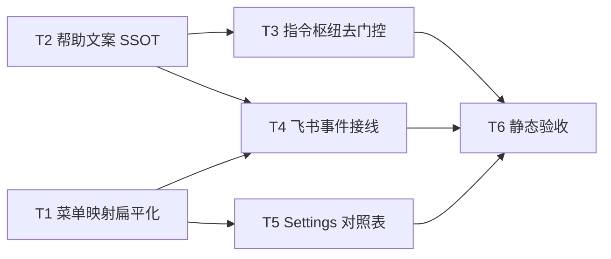

 # 远程指令全员与群聊开放 - 任务分解

> **来源**：`/kb-plan`（基于 `01-proposal.md`、`02-design.md`）

## 1、执行计划

### 1.1 依赖图

### 1.2 分组调度

- **第一轮（并行）**：T1、T2（无文件交集）
- **第二轮（并行）**：T3、T4、T5（分属 `daemon-manager` / `feishu-event-handlers` / `Settings.tsx`，互不写同一文件）
- **第三轮**：T6（全量 `tsc` + grep 残留）

## 2、任务清单

## T1: 菜单映射表与 resolveMenuCommand 扁平化

### 背景

飞书私聊菜单路径在 `resolveMenuCommand` 内用 `adminOnly` 二次拒绝非主用户，与 PRD「菜单与文本斜杠一致」冲突（01·F3.3、02·S3/S10）。本任务删除映射表权限字段与菜单侧拒绝逻辑，为 T4 事件接线提供无 `isAdmin` 的接口契约。

### 上下文文件

- CodeGraph: `resolveMenuCommand` `FEISHU_MENU_EVENT_MAP` `adminOnly` — 菜单映射与拒绝分支
- 必读: `src/shared/feishu-addons.ts` — `FEISHU_MENU_EVENT_MAP` 结构与 event_key
- 必读: `src/bridge/feishu-menu.ts` — `resolveMenuCommand`、`handleMenuClick`、`MenuClickContext`
- 参考: `knowledge/变更/进行中/20260704152837-远程指令全员与群聊开放/02-design.md` §四 — 签名变更表

### 实现范围

- 修改: `src/shared/feishu-addons.ts` — `FEISHU_MENU_EVENT_MAP` 条目删除 `adminOnly` 字段，类型改为 `Record<string, { command: string; label: string }>`
- 修改: `src/bridge/feishu-menu.ts` —
  - 删除 `DENY_NON_ADMIN_TEXT` 常量
  - `resolveMenuCommand(eventKey)` 移除 `isAdmin` 参数与 `adminOnly` 判断；未知 key 仍返回 `UNKNOWN_MENU_TEXT`
  - `MenuClickContext` 移除 `isAdmin` 字段
  - `handleMenuClick` 调用新签名
  - `handleP2pEntered` 暂仍调 `buildHelpText(ctx.isAdmin)`（T2 完成后由 T4 改为无参）

### 接口契约

- `FEISHU_MENU_EVENT_MAP: Record<string, { command: string; label: string }>` — Settings 与菜单解析 SSOT
- `resolveMenuCommand(eventKey: string): MenuCommandResult` — 仅校验 key 存在性
- `MenuClickContext` — `{ eventKey; openId; chatId; messageId? }`（无 `isAdmin`）

### 验收标准

- [ ] `cmd_workspace` / `cmd_model` / `cmd_chat_new` 对任意 `eventKey` 解析成功返回对应斜杠，无权限拒绝分支
- [ ] 未知 `eventKey` 仍返回 `❓ 未知菜单项`
- [ ] `grep` `feishu-menu.ts` 无「该指令仅管理员可用」
- [ ] 无 `02`/`03` 未要求的抽象层、trait/mixin 中间层或未批准的新依赖（Ponytail 口径）

### 依赖

- 前置任务: 无
- 后续任务: T4、T5

---

## T2: buildHelpText 单一全文 SSOT

### 背景

`/help`、进入私聊帮助卡、菜单引导须展示**用户实际可用的全量指令**（01·F3.1/F3.2、验收 6.1·3）。现网 `buildHelpText(isAdmin)` 对非管理员隐藏管理类指令，须改为无参单列表。

### 上下文文件

- CodeGraph: `buildHelpText` — 帮助文案调用链
- 必读: `src/shared/feishu-help-text.ts` — `COMMON_COMMAND_LINES` / `ADMIN_COMMAND_LINES` 现状
- 必读: `electron/scheduling/feishu-help-text.ts` — re-export，签名随 T2 同步
- 参考: `electron/daemon/daemon-manager.ts` L1043–1045 — `/help` 调用点（T3 改）

### 实现范围

- 修改: `src/shared/feishu-help-text.ts` —
  - `buildHelpText(): string` 无参；标题固定「💡 可用指令：」
  - 合并 `COMMON_COMMAND_LINES` + `ADMIN_COMMAND_LINES` 为单一 `ALL_COMMAND_LINES`（保留 `MENU_GUIDE_LINE`）
  - 删除 `isAdmin` 分支与「管理员」标题
- 修改: `electron/scheduling/feishu-help-text.ts` — 仅 re-export，确认类型导出一致（通常无需改体，仅编译随签名变）

### 接口契约

- `export function buildHelpText(): string` — bridge 与 Electron 共用 SSOT

### 验收标准

- [ ] 返回正文含 `/workspace`、`/model`、`/chat`、`/list`、`/restart` 等原 ADMIN 行
- [ ] 正文不含「仅管理员」「管理员：」等角色门槛表述
- [ ] 仍含 `MENU_GUIDE_LINE` 菜单引导
- [ ] 无 `02`/`03` 未要求的抽象层、trait/mixin 中间层或未批准的新依赖（Ponytail 口径）

### 依赖

- 前置任务: 无
- 后续任务: T3、T4

---

## T3: 指令枢纽移除角色门控并统一 /stop、/list

### 背景

`checkAndExecutePendingCommands` 是飞书/微信斜杠的**唯一执行枢纽**（02·§二）。群聊下 `isMainUser` 恒 false 导致管理类指令被拒；本任务删除全部 `denyNonAdmin` 门控，并按设计统一 `/stop`（仅停当前会话）与 `/list`（全量队列）。

### 上下文文件

- CodeGraph: `checkAndExecutePendingCommands` `denyNonAdmin` `isMainUser` — 指令路由与门控
- 必读: `electron/daemon/daemon-manager.ts` L871–1055 — `checkAndExecutePendingCommands` 全 switch
- 必读: `electron/session/session-dispatcher.ts` L89–95 — `isMainUser`（**勿删**，仅停止用于指令门控）
- 参考: `02-design.md` §一·S5–S7、§二·方案要点 3–4

### 实现范围

- 修改: `electron/daemon/daemon-manager.ts` —
  - 删除 `denyNonAdmin` 闭包及 8 处 `if (!isAdmin) { await denyNonAdmin(); break }`（`/task`、`/model`、`/mcp`、`/workflow`、`/restart`、`/clean`、`/workspace`、`/chat`）
  - `case "/stop"`：删除 `isAdmin` 分支与全局 `stopAgent()`；统一为 `claimed.chatId && isSessionAgentRunning` → `stopSessionAgent`，否则回复无运行中 Agent
  - `case "/list"`：删除 `isAdmin` 过滤，始终 `msgs` 全量展示
  - `case "/help"`：`buildHelpText()` 无参调用
  - **保留** `resolveCommandSessionKey` / `resolveResetWorkspaceDir` 内 `isMainUser` 用法
  - 日志行 `admin=${isAdmin}` 可保留或删除（实现自选，推荐删除避免误导）

### 接口契约

- 无新增导出；`/help` 依赖 T2 的 `buildHelpText(): string`

### 验收标准

- [ ] 非主用户、群聊 `chatType=group` 发送 `/workspace` 不因「仅管理员」被拒（01·6.2·4）
- [ ] `/task`、`/model`、`/chat new` 等非主用户可进入对应 handler（成功或业务错误，非角色拒绝）
- [ ] `/stop` 不再调用全局 `stopAgent()`；仅停 `claimed.chatId` 会话 Agent（02·R1 定稿）
- [ ] `/list` 展示全队列条数，与现网管理员视图一致
- [ ] `grep daemon-manager.ts` 无「该指令仅管理员可用」
- [ ] 无 `02`/`03` 未要求的抽象层、trait/mixin 中间层或未批准的新依赖（Ponytail 口径）

### 依赖

- 前置任务: T2
- 后续任务: T6

---

## T4: 飞书 menu/p2p 事件接线适配

### 背景

`feishu-event-handlers.ts` 向 `handleMenuClick` / `handleP2pEntered` 传入 `isAdmin` 并调用 `isFeishuChannelAdmin`。T1/T2 签名变更后须同步接线，使菜单点击与帮助卡走扁平化路径。

### 上下文文件

- CodeGraph: `onFeishuMenuV6` `onFeishuP2pEntered` `isFeishuChannelAdmin` — 飞书事件接线
- 必读: `src/daemon/feishu-event-handlers.ts` — 菜单与 p2p 处理
- 必读: `src/bridge/feishu-menu.ts` — T1 后的 `MenuClickContext` / `P2pEnteredContext`
- 参考: `src/daemon/daemon.ts` — `pushCommandToQueue` 接线（不改）

### 实现范围

- 修改: `src/daemon/feishu-event-handlers.ts` —
  - `onFeishuMenuV6`：构造 `MenuClickContext` 时不传 `isAdmin`；日志去掉 `admin=` 或仅保留 openId/chatId
  - `onFeishuP2pEntered`：构造 `P2pEnteredContext` 无 `isAdmin`；`handleP2pEntered` 内 `buildHelpText()` 无参（若 T1 未改 p2p，本任务一并改 `feishu-menu.ts` 的 `handleP2pEntered`）
- 修改: `src/bridge/feishu-menu.ts`（若 T1 遗留）— `handleP2pEntered` 调 `buildHelpText()`；`P2pEnteredContext` 移除 `isAdmin`
- 可选删除: `isFeishuChannelAdmin` 若再无引用则删除函数（或保留仅文档注释，推荐无引用则删）

### 接口契约

- `onFeishuMenuV6` / `onFeishuP2pEntered` 与 T1 `MenuClickContext`、`P2pEnteredContext` 对齐

### 验收标准

- [ ] 非主用户点击 `cmd_workspace` 入队 `/workspace`，不出现菜单侧拒绝文案（01·6.1·2）
- [ ] 进入私聊帮助卡正文与 `/help` 一致且含全量指令（01·6.1·3）
- [ ] `tsc` 无 `isAdmin` 字段/参数类型错误
- [ ] 无 `02`/`03` 未要求的抽象层、trait/mixin 中间层或未批准的新依赖（Ponytail 口径）

### 依赖

- 前置任务: T1、T2
- 后续任务: T6

---

## T5: Settings event_key 对照表权限列

### 背景

设置页对照表将部分 event_key 标为「管理员」，与开放后产品语义不一致（01·R6、02·S9）。本任务更新展示，避免用户误以为菜单仍受角色限制。

### 上下文文件

- 必读: `src/renderer/pages/Settings.tsx` L728–752 — event_key 对照表渲染
- 必读: `src/shared/feishu-addons.ts` — T1 后无 `adminOnly` 的 `FEISHU_MENU_EVENT_MAP`

### 实现范围

- 修改: `src/renderer/pages/Settings.tsx` —
  - 对照表「权限」列全部显示「全员」（emerald 样式），或删除权限列仅保留 event_key/名称/等价斜杠（默认保留列、全员）
  - 移除对 `item.adminOnly` 的分支渲染
  - 表头说明可改为「所有已授权用户均可使用对应指令」

### 接口契约

- 无；只读 `FEISHU_MENU_EVENT_MAP` 的 `command` + `label`

### 验收标准

- [ ] 7 项 event_key 权限列均为「全员」（或列已移除且无「管理员」字样）
- [ ] 无编译错误（`adminOnly` 字段已不存在）
- [ ] 无 `02`/`03` 未要求的抽象层、trait/mixin 中间层或未批准的新依赖（Ponytail 口径）

### 依赖

- 前置任务: T1
- 后续任务: T6

---

## T6: 静态验收与残留检查

### 背景

闭合 02·§八·（二）工程补充验收项，并为 `/kb-test` 提供静态通过基线；不执行飞书 E2E（归 kb-test 手工）。

### 上下文文件

- 必读: `knowledge/变更/进行中/20260704152837-远程指令全员与群聊开放/01-proposal.md` §六 — 业务验收追溯
- 必读: `02-design.md` §八·（二）— 工程验收清单

### 实现范围

- 无代码修改（仅验证）；若 `tsc` 失败则回到对应 Tn 修复

### 接口契约

- 无

### 验收标准

- [ ] `npx tsc --noEmit` 通过
- [ ] 全仓 `grep`「该指令仅管理员可用」仅允许出现在 knowledge/变更 历史文档，**不允许**出现在 `src/`、`electron/`
- [ ] `buildHelpText(` 所有调用均为无参形式
- [ ] `resolveMenuCommand(` 所有调用均为单参数 `eventKey`
- [ ] 对照 01·§6.1–6.4 列出 kb-test 手工项清单（私聊/群聊斜杠、菜单、/help、通道未授权边界）
- [ ] 无 `02`/`03` 未要求的抽象层、trait/mixin 中间层或未批准的新依赖（Ponytail 口径）

### 依赖

- 前置任务: T3、T4、T5
- 后续任务: 无（下一步 `/kb-apply`）
