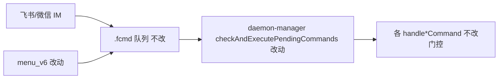

# 远程指令全员与群聊开放 - 代码评审报告

> **评审等级**：focused-review  
> **对照**：`01-proposal.md`、`02-design.md`、`03-tasks.md`  
> **diff 范围**：apply 未提交变更（6 个代码文件 + manifest）

## 1、审查范围

- **变更类型**：行为变更 — 取消斜杠/菜单指令管理员二分，统一私聊/群聊可用集合
- **评审等级**：focused-review（局部枢纽改动，无 proto/跨端契约）
- **涉及文件**：6 个源码文件 + Settings
- **设计文档**：`02-design.md`（对照基准）

## 2、严重（必须处理）

无（评审中发现的 R1 已在同轮修复，见 §8）。

## 3、警告（建议处理）

无（评分 ≥75 且未闭合项无）。

### Ponytail 精简（Agent #3）

Lean already. Ship. 变更以删除门控与签名扁平为主，无新增抽象/依赖；`isFeishuChannelAdmin` 已删除。

## 4、设计偏差

| 项 | 设计预期 | 实际 | 状态 |
|----|----------|------|------|
| 删除 `denyNonAdmin` 8 处 | 02·T3 | 已删除 | ✅ |
| `/stop` 仅停当前会话 | 02·R1 定稿 | 统一 `stopSessionAgent`，无 `stopAgent()` | ✅ |
| `/list` 全量队列 | 02·T3 | 已移除 session 过滤 | ✅ |
| `buildHelpText()` 无参 | 02·T2 | 已落实 | ✅ |
| 菜单无 `adminOnly` | 02·T1 | 已删除字段与门控 | ✅ |
| 微信同步 | 02·R3 | 同 `daemon-manager` 枢纽自动生效 | ✅ |

## 5、验收标准检查

| 任务 | 验收条件 | 状态 |
|------|---------|------|
| T1 | admin 菜单项解析成功、无拒绝文案 | ✅ |
| T1 | 未知 key 仍返回未知菜单项 | ✅ |
| T2 | 帮助正文含全量指令、无管理员门槛措辞 | ✅ |
| T3 | 无 `denyNonAdmin`；`/stop`/`/list` 行为符合设计 | ✅（R1 修复后 `/stop` 用 `resolveCommandSessionKey`） |
| T4 | 事件接线无 `isAdmin`；帮助卡与 `/help` 一致 | ✅ |
| T5 | Settings 权限列全员 | ✅ |
| T6 | `tsc` 通过；无运行时「仅管理员」残留 | ✅ |

## 6、调用链与回归风险

| 风险 | 级别 | 说明 |
|------|------|------|
| `/restart` `/clean` 全员可用 | 产品接受（01·R2） | 无二次确认，发布说明提示 |
| `/stop` 主用户 sessionKey | 已修复 R1 | 主用户 p2p 会话键含 `::workspaceDir`，须与 `/reset` 同解析 |
| 通道准入不变 | 低 | `allowOthers` 仍控制能否对话 |

## 7、遗留债务

| ID | 说明 | 处置 |
|----|------|------|
| D1 | `daemon-manager.ts` 行数远超 AGENTS ≤300 | accepted_debt（历史枢纽，本变更净删行） |
| D2 | `/stop` 对 `temp_*` 临时会话键仍可能匹配不到（沿用 chatKey） | accepted_debt；与改前非 admin 行为一致，非本变更引入 |
| D3 | 飞书 E2E 手工验收未在本轮执行 | 归 `/kb-test` |

## 8、修复任务建议

| 问题 ID | 建议动作 | 关联任务 | 状态 |
|---------|----------|----------|------|
| R1 | `/stop` 使用 `resolveCommandSessionKey` 再 `stopSessionAgent` | T-FIX-01（评审同轮已修复） | fixed |

## 9、结论

**通过**，可进入 `/kb-test` 与 `/kb-archive`。

- blocking 问题：0  
- 评审同轮修复：R1（`/stop` 会话键解析）  
- Ponytail：Lean already. Ship.
