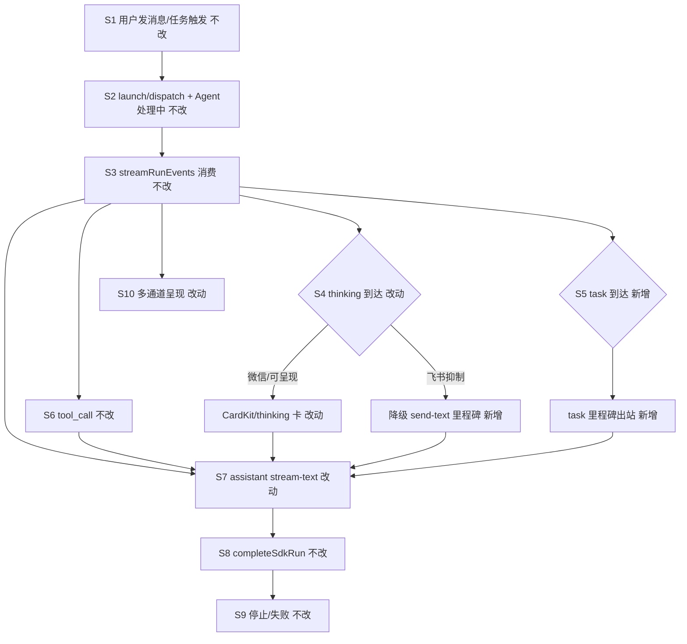

# SDK think与task事件实时通知 - 实现设计

> **业务 PRD**：见同目录 `01-proposal.md`

## 1、业务流程与改动范围

### 1.1 业务流程图



**图例**：`不改` 现网一致；`改动` 改代码；`新增` 新分支/类型；`删除` 无。

### 1.2 流程步骤与改动对照

| 步骤 ID | 业务含义 | 改动 | 落点文件 | 01 验收关联 |
|---------|----------|------|----------|-------------|
| S1 | 用户 IM/任务面板发消息 → Daemon 入队 | 不改 | `src/daemon/daemon.ts` orchestrator | 验收 6 |
| S2 | launch/dispatch → `startSdkRun` →「Agent 处理中…」 | 不改 | `electron/agent/cursor-sdk/sdk-run-lifecycle.ts` | F5.1 |
| S3 | `streamRunEvents` / `handleSdkEvent` 消费事件流 | 不改结构 | `electron/agent/cursor-sdk/sdk-run-stream.ts` | — |
| S4 | thinking 到达 → 过程通知；飞书抑制时降级单条文本 | 改动 | `sdk-run-stream.ts`；`sdk-run-presentation.ts`；`daemon.ts` `handleThinkingPresentationEvent` | 验收 1；F1.1～F1.4 |
| S5 | task 到达 → 映射里程碑文案并出站 | 新增 | `sdk-run-stream.ts`；`sdk-session-types.ts`；`daemon.ts` `handleTaskPresentationEvent` | 验收 2；F2.1～F2.3 |
| S6 | tool_call → presentation-event | 不改（飞书降级同 S4 模式） | `sdk-run-stream.ts`；`handleToolPresentationEvent` | F5.4 |
| S7 | assistant 流式；抑制场景不长时间 defer | 改动 | `sdk-run-presentation.ts` `markProcessEventSeen`/`shouldDeferAssistantPost` | 验收 3；F3.1～F3.2 |
| S8 | Run 结束 `completeSdkRun` / flush final | 不改 | `sdk-run-stream.ts`；`sdk-run-lifecycle.ts` | F3.4 |
| S9 | 用户停止 / 失败 notify | 不改 | `sdk-run-lifecycle.ts`；`sdk-run-finalize.ts` | F5.2～F5.3 |
| S10-F | 飞书私聊/群聊：抑制 CardKit → 里程碑 send-text | 改动 | `feishu-presentation-gate.ts`；`daemon.ts` | 验收 6；F4.1～F4.3 |
| S10-W | 微信：thinking/tool/task CardKit 或 send-text | 改动（task 新增） | `daemon.ts` presentation handlers | 验收 6；F4.1 |
| S10-T | 任务面板：与 IM 同链路 presentation | 新增 task 可见 | 同上 | F2.4；验收 6 |

**对照表行数**：12 行（S1～S10 + S10 通道子项）。

### 1.3 改动汇总

- **改动**：`sdk-run-stream.ts`、`sdk-run-presentation.ts`、`sdk-session-types.ts`、`src/shared/feishu-presentation-gate.ts`、`src/daemon/daemon.ts`
- **新增**：`PresentationKind` 含 `task`；`handleTaskPresentationEvent`；飞书抑制路径里程碑 send-text 降级
- **不改**：Claude/Codex/OpenCode 引擎；watchdog/续接；`STREAM_POST_INTERVAL_MS=400`；MergeBatch；三态「Agent 处理中…」语义

## 2、整体思路

**根因**（回代码）：

1. `postPresentationEvent` 入口 + daemon `handleThinking/Tool` 对飞书全通道抑制 CardKit，过程事件对用户不可见（`feishu-presentation-gate.ts`）。
2. `handleSdkEvent` 的 `task` 分支仅 `markSessionActivity`，无出站（`sdk-run-stream.ts:150`）。
3. `markProcessEventSeen` 在 thinking/tool 时置 `seenProcessEvent`/`presentationDeferStream`，飞书抑制下用户既无过程卡又延迟 assistant（`sdk-run-presentation.ts:221`）。

**方案要点**：

1. **扩展 task 出站**：`task` → `postPresentationEvent({ kind: "task", task_status, task_text })`；daemon 新增 handler，微信走 CardKit/文本，飞书走降级里程碑。
2. **飞书最低可见性**：presentation 被抑制时 daemon **不静默**——节流后 `send-text` 单条等价通知（首包 thinking、task 状态变更、tool 起止摘要），满足 F1.4/F4.2。
3. **defer 联动门控**：过程 presentation 实际不可见（飞书抑制）时，`markProcessEventSeen` **不**置 defer 闩；`task` 里程碑**不参与** assistant defer。
4. **防刷屏**：session 级——thinking 首 delta + 摘要变更；task 按 `(status,text)` 去重；同类里程碑 ≥3s 节流；验收 7 同文案 ≤4 条/Run。

**Ponytail 三问**：

| 问题 | 结论 |
|------|------|
| 能不能更简单？ | 是。inline 扩展现有 presentation 链路 + daemon 降级 send-text，不新建事件总线或 UI。 |
| 能不能不做？ | 否。根因 2/3 导致长等待完全沉默，直接违背 01 验收 1/2/4。 |
| 能不能晚点做？ | task 可二期，但 thinking+defer 联动必须同期，否则飞书仍「无过程+迟正文」。 |

## 3、分层设计

| 层 | 职责 | 落点 |
|----|------|------|
| SDK 消费 | 分派 thinking/task/tool，映射文案，条件性 markProcessEventSeen | `sdk-run-stream.ts` |
| Electron 出站 | POST presentation-event；门控下仍 POST（由 daemon 降级） | `sdk-run-presentation.ts` |
| Daemon 呈现 | CardKit 或降级 send-text；task handler；ordering 仅真实可见过程 | `daemon.ts` |
| 共享门控 | 扩展抑制 kind 含 `task`；区分「抑制 CardKit」与「禁止出站」 | `feishu-presentation-gate.ts` |

## 4、接口设计

**POST `/api/presentation-event`**（扩展 body）：

| 字段 | 类型 | 说明 |
|------|------|------|
| `kind` | `"task"`（新增） | 子任务里程碑 |
| `task_status` | `string?` | 映射自 SDK `status` |
| `task_text` | `string?` | 映射自 SDK `text` |
| 其余 | 不变 | thinking/tool 字段保持 |

**降级 send-text**（daemon 内部）：复用现有 send-text，**不带** `message_id`/`stop_progress`（与三态进度区分）；节流键 `sessionKey + milestoneKind + hash(text)`。

**Electron `markProcessEventSeen` 契约**：仅当 `!isProcessPresentationSuppressed(session, kind)` 且 `kind !== "task"` 时置 defer 闩。

## 5、数据结构

```ts
// sdk-session-types.ts
export type PresentationKind = "assistant" | "thinking" | "tool" | "diff" | "merge_batch" | "task"

export interface PresentationEvent {
  // ...existing
  task_status?: string
  task_text?: string
}
```

**SessionProgressState 扩展**（daemon）：`lastMilestoneText`、`lastMilestoneAt`、`milestoneDedupSet`（Run 级，Run 结束清）。

**task 文案映射**（`sdk-run-stream.ts` 内联）：

| SDK status | 用户文案 |
|------------|----------|
| （空）/started | `正在执行：{text}` 或 `子任务进行中…` |
| completed | `已完成：{text}` |
| failed | `子任务失败：{text}` |
| 其他 | `{text}` 或 `子任务更新（{status}）` |

## 6、实现步骤

1. **T1 类型与门控**：扩展 `PresentationKind`/`PresentationEvent`；`feishu-presentation-gate` 抑制 `task` CardKit（仍允许 daemon 文本降级）。
2. **T2 Electron 消费**：`handleSdkEvent` 独立 `task` 分支 → 映射 + `postPresentationEvent`；调整 `postPresentationEvent` 飞书路径仍 POST；`markProcessEventSeen` 联动门控。
3. **T3 Daemon task handler**：`handleTaskPresentationEvent` + `handlePresentationEvent` 路由；微信 CardKit 或 send-text。
4. **T4 飞书降级**：thinking/tool/task handler 抑制分支改 `sendMilestoneText`（节流/去重）；ordering 闩仅 CardKit 成功时影响 defer。
5. **T5 验收与日志**：UI 日志保留 `[thinking]`/`[task]`；NF 日志 `milestone_fallback` 可检索。

步骤回溯：T2→S4/S5/S7；T4→S10-F；T3→S5/S10-W。

## 7、参考实现

| 符号 | 路径 |
|------|------|
| `handleSdkEvent` | `electron/agent/cursor-sdk/sdk-run-stream.ts` |
| `postPresentationEvent` / defer | `electron/agent/cursor-sdk/sdk-run-presentation.ts` |
| `isFeishuProcessPresentationSuppressed` | `src/shared/feishu-presentation-gate.ts` |
| `handleThinkingPresentationEvent` | `src/daemon/daemon.ts` ~1475 |
| `NOTIFY_PROCESSING` | `electron/agent/cursor-sdk/sdk-run-lifecycle.ts` |
| SDK 类型 | `@cursor/sdk` `SDKTaskMessage` / `SDKThinkingMessage` |

## 8、技术影响

### 8.1 影响范围

- **仅 Cursor SDK 路径**；其他引擎 presentation 不变。
- 飞书群聊/私聊消息频率略增（里程碑文本），靠节流/去重控量。
- PRESENTATION_ORDERING 行为变更：飞书抑制场景 assistant 首包恢复现网时序，与 27210352 变更互补。

### 8.2 工程补充验收项

1. 飞书私聊：thinking 首包 10s 内可见（CardKit 或降级文本）。
2. 含 task 运行：首个 task 通知 10s 内可见。
3. 飞书短问答：首条 assistant 时延相对变更前无显著劣化。
4. 单次 Run 同文案里程碑 ≤4 条。
5. `presentation-event` kind=task 微信路径不 500。
6. 停止 Run 后无残留 milestone 定时器。

## 9、知识库影响

- **Agent 调度 / Cursor SDK 执行引擎**：presentation 出站与事件消费描述需同步。
- **消息桥接 / 飞书通道**：过程呈现与门控降级策略。
- **daemon Presentation 章节**：新增 task kind 与里程碑降级。

## 10、知识库更新计划

### 10.1 必须更新

- `knowledge/业务域/Agent调度/06-CursorSDK执行引擎.md` — thinking/task 出站与 defer 联动
- `knowledge/业务域/消息桥接/02-飞书通道.md` — 抑制降级为里程碑文本

### 10.2 可能更新

- `electron/agent/cursor-sdk/AGENTS.md` — presentation 门控与 task 分支
- `src/daemon/AGENTS.md` — `handleTaskPresentationEvent`、里程碑节流

### 10.3 不需要更新

- 微信通道细节（复用 thinking/tool 模式，无新协议）
- Claude/Codex/OpenCode 引擎文档
- Electron 设置 UI、changelog（archive 阶段处理）
