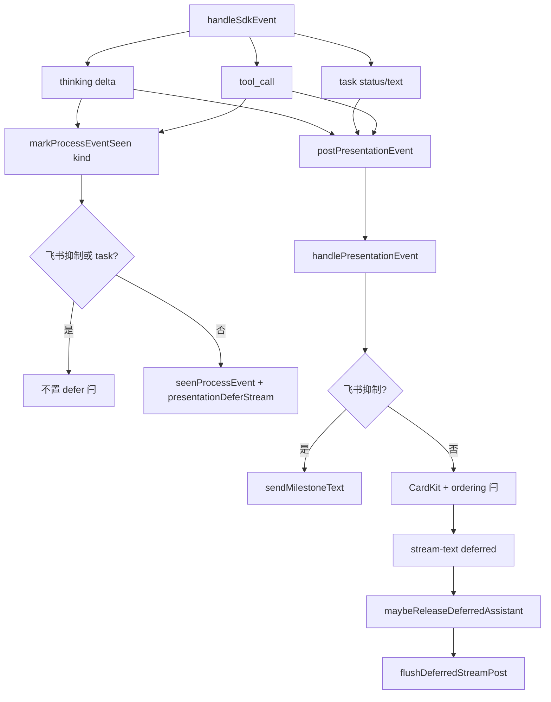

# SDK think与task事件实时通知 - 代码评审报告

## 1、审查范围

- **变更类型**：T1–T6 已实现（`stage` 由 `planned` → `reviewed`）
- **评审等级**：focused-review（Cursor SDK presentation 出站 + Daemon 里程碑降级；无 proto/DB/权限级 full-review 门槛）
- **涉及文件**（7 个实现文件 + KB 设计/任务文档）：
  - `electron/agent/cursor-sdk/sdk-session-types.ts`
  - `electron/agent/cursor-sdk/sdk-run-presentation.ts`
  - `electron/agent/cursor-sdk/sdk-run-stream.ts`
  - `src/shared/feishu-presentation-gate.ts`
  - `src/daemon/daemon-presentation-milestone.ts`（新建）
  - `src/daemon/daemon.ts`
- **设计文档**：`02-design.md`、`03-tasks.md`（对照基准）
- **评审方式**：git diff + 源码精读；初评发现 R1/R2 后复评复检修复 diff
- **范围外**：01 验收 1–7 与 02·八·（二）1–6 的 E2E 勾选归 `/kb-test`；本报告做**代码路径**覆盖度评估

## 2、严重（必须处理）

初评发现 2 项 critical（评分 ≥90），**均已修复**；复评无未关闭严重项。

| ID | 问题 | 状态 | 修复依据 |
|----|------|------|----------|
| **R1** | Daemon 飞书抑制路径误置 `presentationProcessActive` / ordering 闩，导致无 CardKit 过程卡时 assistant 仍被 defer | **已关闭** | `handleToolPresentationEvent` / `handleThinkingPresentationEvent`：飞书抑制分支**先于** ordering 闩更新，仅 `sendMilestoneText` 后 `return`；`presentationProcessActive`、`activeToolNames`、`thinkingOpen` 仅 CardKit 路径更新 |
| **R2** | `maybeReleaseDeferredAssistant` 与 Run 收尾 flush 仅检查 `seenProcessEvent`，Daemon 已 `deferred: true` 时 Electron 不释放 assistant 缓冲 | **已关闭** | `maybeReleaseDeferredAssistant` 条件扩展为 `seenProcessEvent \|\| presentationDeferStream`；`streamRunEvents` 收尾 flush 同步对齐 |

## 3、警告（建议处理）

| 严重度 | 项 | 位置 | 说明 |
|--------|-----|------|------|
| 信息（<75） | 注释与实现不一致 | `daemon.ts` L450 | `isFeishuProcessPresentationSuppressed` 注释仍写「ordering 闩锁仍须更新」；R1 修复后飞书抑制路径**不**再更新 ordering 闩。建议改为「改里程碑降级，不置 ordering 闩」 |
| 信息（<75） | AGENTS 文档滞后 | `src/daemon/AGENTS.md` Presentation 飞书门控段 | 仍描述「静默 `{ ok: true }`」；实现已改为 `sendMilestoneText` 降级。按 `02-design` §10.2 在 `/kb-archive` 同步 |

无评分 ≥75 的未关闭警告项。

## 4、设计偏差

| 设计预期 | 实际实现 | 评估 |
|----------|----------|------|
| 飞书抑制仍 POST，Daemon 里程碑降级（§4、T2） | `postPresentationEvent` 移除飞书 early return | ✅ 一致 |
| `markProcessEventSeen` 仅可见过程 kind 且非 task 置 defer（§4、T2） | 传入 `kind`；飞书抑制 / `task` 早退 | ✅ 一致 |
| task 独立分支出站 + 文案映射（§5、T3） | `case "task"` + `mapTaskMilestoneText` + `postPresentationEvent` | ✅ 一致 |
| 里程碑节流 ≥3s、同文案 ≤4/Run（T4） | `daemon-presentation-milestone.ts` `MILESTONE_THROTTLE_MS=3000`、`MILESTONE_MAX_PER_RUN=4` | ✅ 一致 |
| task 不参与 `presentationProcessActive`（T5） | `handleTaskPresentationEvent` 仅 `sendMilestoneText`，无 ordering 闩 | ✅ 一致 |
| T5 初版要求飞书抑制仍更新 ordering 闩 | R1 修复后改为 CardKit 路径专属 | ⚠️ 与 T5 初稿字面略有出入，**符合** 02 §2 方案要点 3（抑制场景不置 defer 闩）；以设计为准 |

无阻断性设计偏差。

## 5、验收标准检查

### `03-tasks.md` 任务（代码层）

| 任务 | 关键验收 | 状态 |
|------|---------|------|
| T1 | `PresentationKind` 含 `task`；gate 抑制 feishu+task | ✅ |
| T2 | 飞书仍 POST；`markProcessEventSeen(session, kind)` 门控；无飞书 early return | ✅ |
| T3 | 独立 `case "task"`；`mapTaskMilestoneText`；不调用 `markProcessEventSeen` | ✅ |
| T4 | `daemon-presentation-milestone.ts` ≤300 行；节流/去重/`clearMilestoneState` | ✅（125 行） |
| T5 | task handler 路由；thinking/tool 飞书 `sendMilestoneText`；`stopSessionProgress` 清里程碑 | ✅ |
| T6 | grep/类型静态项 | ✅（实现 diff 满足；E2E 待 `/kb-test`） |

### `01-proposal.md` 验收 1–7（代码路径）

| 编号 | 代码评估 | E2E |
|------|---------|-----|
| 1 think 10s 内可见 | ✅ 飞书里程碑 / 微信 CardKit 双路径 | ⏳ `/kb-test` |
| 2 task 里程碑可见 | ✅ electron 出站 + daemon handler | ⏳ |
| 3 assistant 时序不劣化 | ✅ R1/R2 修复后抑制场景不 defer | ⏳ |
| 4 长任务 ≥2 次过程更新 | ✅ thinking 摘要/tool/task 里程碑 | ⏳ |
| 5 停止/失败不掩盖 | ✅ `stopSessionProgress` → `clearMilestoneState` | ⏳ |
| 6 多通道可感知 | ✅ gate + `sendMilestonePlainText` 双通道 | ⏳ |
| 7 同文案 ≤4 条 | ✅ `MILESTONE_MAX_PER_RUN` | ⏳ |

### `02-design.md` §8.2 工程补充项

| 项 | 代码层 |
|----|--------|
| 1 飞书 thinking 10s 可见 | ✅ |
| 2 首个 task 10s 可见 | ✅ |
| 3 飞书短问答 assistant 无显著劣化 | ✅（R1/R2） |
| 4 同文案里程碑 ≤4 | ✅ |
| 5 微信 task 不 500 | ✅ handler 无 feishu-only 硬依赖 |
| 6 Run 结束无残留 | ✅ `clearMilestoneState` |

## 6、调用链与回归风险

| 回归点 | 风险 | 说明 |
|--------|------|------|
| 微信 thinking/tool defer | 低 | `markProcessEventSeen` 非抑制路径语义不变 |
| `PRESENTATION_ORDERING=0` | 低 | 门控外逻辑未改 |
| 飞书纯对话短问答 | 低 | R1 后抑制路径不 defer |
| MergeBatch / 三态进度 | 低 | 里程碑不带 `message_id`/`stop_progress` |
| Claude/Codex/OpenCode | 无 | 未改非 SDK 引擎 |
| `STREAM_POST_INTERVAL_MS=400` | 无 | 常量未变 |
| 里程碑频率 | 中 | 飞书长任务消息略增；3s 节流 + 4 次去重兜底 |

## 7、遗留债务

- **L450 注释过时**（§3）— archive 前或顺手修正，不阻断
- **`src/daemon/AGENTS.md` 飞书 Presentation 段** — archive 按 §10.2 同步里程碑降级描述
- **`electron/agent/cursor-sdk/AGENTS.md`** — 02 §10.2 可能更新；archive 视实现补 presentation/task 分支
- **T6 E2E** — workflow 待办，非代码债务

## 8、修复任务建议

| 问题 | 建议动作 | 优先级 |
|------|----------|--------|
| L450 注释 | 改为「不渲染 CardKit，改里程碑降级；ordering 闩仅 CardKit 路径」 | 低（archive 顺手） |
| daemon AGENTS | archive 更新飞书门控段：抑制 → `sendMilestoneText` | archive 必做（§10.2 可能） |
| sdk AGENTS | archive 补 task 出站与 defer 门控 | archive 可选 |

无 T-FIX 阻断项；R1/R2 已落地，无需新开修复任务。

## 9、结论

**复评：通过（可进入 `/kb-test`）**

- 初评 R1/R2 critical 已按设计关闭；无评分 ≥75 的剩余 open 问题。
- T1–T5 实现与 `02-design` / `03-tasks` 契约对齐；静态验收路径满足 T6 grep/类型项。
- **不可 `/kb-archive`**：须 `/kb-test` 完成 01 验收 1–7 与 02·八·（二）E2E 勾选；archive 时同步 `src/daemon/AGENTS.md`（及可选 sdk AGENTS）、changelog。

**工作流**：`stage` → `reviewed`；建议 `/kb-test` 优先飞书私聊 thinking 首包、含 task Run 首个里程碑、飞书短问答 assistant 时延对比。
