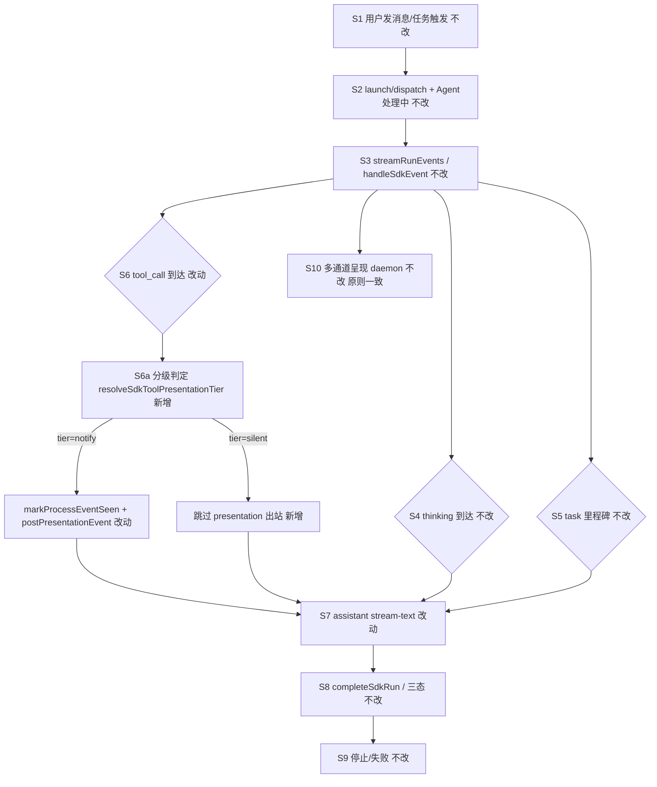

# SDK 工具调用通知分级 - 实现设计

> **业务 PRD**：见同目录 `01-proposal.md`

## 1、业务流程与改动范围

### 1.1 业务流程图



**图例**：`不改` 现网一致；`改动` 改代码；`新增` 新分支/类型；`删除` 无。

**说明**：S6 始终执行 `pushUiLog`、`session.lastTool`、`markSessionActivity`、`closeThinkingIfOpen`、`runPhase`（watchdog 不变）；仅 presentation 出站与 `markProcessEventSeen` 受分级门控。

### 1.2 流程步骤与改动对照

| 步骤 ID | 业务含义 | 改动 | 落点文件 | 01 验收关联 |
|---------|----------|------|----------|-------------|
| S1 | 用户 IM/任务面板发消息 → Daemon 入队 | 不改 | `src/daemon/daemon.ts` orchestrator | 验收 5 |
| S2 | launch/dispatch → `startSdkRun` →「Agent 处理中…」 | 不改 | `electron/agent/cursor-sdk/sdk-run-lifecycle.ts` | F4.3 |
| S3 | `streamRunEvents` / `handleSdkEvent` 消费事件流 | 不改结构 | `electron/agent/cursor-sdk/sdk-run-stream.ts` | — |
| S4 | thinking 到达 → `postPresentationEvent({ kind: "thinking" })` | 不改 | `sdk-run-stream.ts`；`sdk-run-presentation.ts` | 验收 3；F1.1；F4.1 |
| S5 | task 事件 → 独立 `case "task"` → 里程碑出站 | 不改 | `sdk-run-stream.ts`；`daemon.ts` `handleTaskPresentationEvent` | 验收 3；F1.2；F4.1 |
| S6 | tool_call → 按工具名分级 → 条件性出站 | 改动 | `sdk-run-stream.ts`；**新增** `src/shared/sdk-tool-presentation-tier.ts` | 验收 1/2/4；F1.3～F1.6；F2.1～F2.5；F3 |
| S6a | `resolveSdkToolPresentationTier(toolName)` 纯函数判定 | 新增 | `src/shared/sdk-tool-presentation-tier.ts` | F3.1～F3.3 |
| S6n | tier=notify → `markProcessEventSeen` + `postPresentationEvent` | 改动（收窄触发面） | `sdk-run-stream.ts` `case "tool_call"` | 验收 2；F1.3～F1.6 |
| S6s | tier=silent → 跳过 presentation 与 markProcessEventSeen | 新增 | `sdk-run-stream.ts` `case "tool_call"` | 验收 1/4；F2.1～F2.5 |
| S7 | assistant 流式；silent 不置 defer 闩 | 改动 | `sdk-run-presentation.ts` `markProcessEventSeen`/`shouldDeferAssistantPost` | 验收 6；F4.2 |
| S8 | Run 结束 `completeSdkRun` / flush final | 不改 | `sdk-run-stream.ts`；`sdk-run-lifecycle.ts` | F4.3 |
| S9 | 用户停止 / 失败 notify | 不改 | `sdk-run-lifecycle.ts`；`sdk-run-finalize.ts` | F4.3 |
| S10 | 多通道：飞书里程碑 / 微信 CardKit；daemon handler 不重复分级 | 不改 | `daemon.ts`；`feishu-presentation-gate.ts` | 验收 5；F4.4 |

**对照表行数**：13 行（S1～S10 + S6 子步骤）。

### 1.3 改动汇总

- **新增**：`src/shared/sdk-tool-presentation-tier.ts`（`SdkToolPresentationTier`、`resolveSdkToolPresentationTier`）
- **改动**：`electron/agent/cursor-sdk/sdk-run-stream.ts` `case "tool_call"` 分支（唯一出站门控）
- **不改**：`src/daemon/daemon.ts` presentation handlers；`feishu-presentation-gate.ts`；thinking/task 分支；Claude/Codex/OpenCode/CC 引擎；watchdog/续接；三态语义
- **范围**：仅 Cursor SDK 运行路径；UI 日志（`pushUiLog` `[tool]`）保留全量 tool 记录

### 1.4 SDK 工具分级表（SSOT）

判定口径：`resolveSdkToolPresentationTier` 对 `tool_name` **大小写不敏感**归一化后查表；未命中白名单默认 `silent`（F3 灰度）。

| SDK tool_name（归一化） | 分级 | 用户可见语义 | 01 关联 |
|---|---|---|---|
| shell | notify | 执行命令 | F1.3 |
| Write, StrReplace | notify | 写入/修改文件 | F1.4 |
| Delete | notify | 删除 | F1.5 |
| Task | notify | 启动子 Agent（与 task 里程碑并存，文案区分） | F1.6 |
| Read | silent | 读文件 | F2.1 |
| Glob | silent | 目录匹配 | F2.2 |
| Grep, SemanticSearch, WebSearch, WebFetch | silent | 只读探查/检索 | F2.3 |
| LS, Head, list_dir（若出现） | silent | 列目录/读片段 | F2.3 |
| CallMcpTool, GenerateImage, SwitchMode, Await, AskQuestion 等 | silent（默认） | 非动手类默认静默；GenerateImage 默认静默，实现可不通知 | F3.1 |

注：`task` **事件**（非 `tool_call`）走既有 `case "task"` 里程碑链路，不在上表重复。

## 2、整体思路

**根因**（回代码）：

1. `handleSdkEvent` 的 `case "tool_call"` 对**每一次**工具调用无条件 `markProcessEventSeen(session, "tool")` + `postPresentationEvent`（`sdk-run-stream.ts:129-137`），read/glob 等高频只读探查亦全量出站，导致 IM 过程流刷屏。
2. `markProcessEventSeen("tool")` 在 PRESENTATION_ORDERING 场景置 `seenProcessEvent`/`presentationDeferStream`（`sdk-run-presentation.ts:217-225`），即使用户侧因飞书抑制或未来静默策略未见过程卡，assistant 首包仍可能被 defer。
3. think/task 已在上一变更独立出站且 task 不参与 defer；本次须在 **不削弱 S4/S5** 前提下，仅对 tool_call 做减法分级。

**方案要点**：

1. **共享 SSOT**：新增 `sdk-tool-presentation-tier.ts`，导出 `resolveSdkToolPresentationTier(toolName)` → `"notify" | "silent"`。
2. **唯一出站门控**：仅在 `sdk-run-stream.ts` `tool_call` 分支按 tier 分支；notify 保持现网 `markProcessEventSeen` + `postPresentationEvent`（含 `extractShellPresentationFields`）；silent 跳过二者。
3. **副作用隔离**：silent 不得调用 `markProcessEventSeen`，避免「无过程卡却延迟正文」；notify 工具完成时仍 `maybeReleaseDeferredAssistant`。
4. **观测不变**：`pushUiLog` `[tool]`、`session.lastTool`、`runPhase`/watchdog 逻辑对全量 tool_call 保持，满足开发者/运维完整记录（01 边界）。

**Ponytail 三问**：

| 问题 | 结论 |
|------|------|
| 能不能更简单？ | **能**。复用 `tool-presentation.ts` 邻域新增 tier 纯函数 + `sdk-run-stream.ts` 单点 if 门控；不新建事件总线、不扩 daemon。 |
| 能不能不做？ | **否**。根因 1 直接违背 01 验收 1/4 与 F2；根因 2 在 read burst 场景叠加 defer 劣化 F4.2。 |
| 能不能晚点做？ | **否**。分级与 defer 副作用须同期；daemon 重复门控可永远不做（YAGNI）。 |

## 3、分层设计

| 层 | 职责 | 落点 |
|----|------|------|
| 共享分级 SSOT | 工具名 → notify/silent 映射；大小写不敏感 | **新增** `src/shared/sdk-tool-presentation-tier.ts` |
| 共享呈现辅助 | shell CardKit 字段解析（仅 notify 路径使用） | `src/shared/tool-presentation.ts`（不变，~154 行，未超限） |
| SDK 消费 | `tool_call` 分级门控；thinking/task 不变 | `electron/agent/cursor-sdk/sdk-run-stream.ts` |
| Electron 出站 | `postPresentationEvent` / `markProcessEventSeen` 契约不变 | `electron/agent/cursor-sdk/sdk-run-presentation.ts` |
| Daemon 呈现 | 收到即呈现；**不**二次分级 | `src/daemon/daemon.ts` `handleToolPresentationEvent` |
| 飞书门控 | 抑制 CardKit，里程碑降级（仅 notify 工具仍会 POST） | `src/shared/feishu-presentation-gate.ts` |

## 4、接口设计

**新增共享函数**（`src/shared/sdk-tool-presentation-tier.ts`）：

```ts
export type SdkToolPresentationTier = "notify" | "silent"

/** 基于 SDK tool_name 判定用户侧过程是否出站；大小写不敏感 */
export function resolveSdkToolPresentationTier(toolName: string): SdkToolPresentationTier
```

**`handleSdkEvent` `tool_call` 分支契约**（逻辑伪码）：

| 步骤 | tier=notify | tier=silent |
|------|-------------|-------------|
| `markSessionActivity` / `flushSdkLog` / `closeThinkingIfOpen` | 执行 | 执行 |
| `session.lastTool` / `runPhase` | 执行 | 执行 |
| `pushUiLog` `[tool]` | 执行 | 执行 |
| `markProcessEventSeen(session, "tool")` | 执行 | **跳过** |
| `postPresentationEvent({ kind: "tool", ... })` | 执行 | **跳过** |
| `maybeReleaseDeferredAssistant`（非 running） | 执行 | 仅当 session 已有 defer 闩时按现网逻辑（silent 不新置闩） |

**HTTP `/api/presentation-event`**：body 字段无变更；silent 工具不产生 POST。

## 5、数据结构

```ts
// src/shared/sdk-tool-presentation-tier.ts
export type SdkToolPresentationTier = "notify" | "silent"

// 内部实现建议：归一化 toolName.toLowerCase() 后
// - Set/Map 命中 notify 白名单：shell, write, strreplace, delete, task
// - 其余默认 silent（含 read, glob, grep, semanticsearch, ...）
```

**Session 字段**：无新增；`session.lastTool` 仍记录最近一次 tool（含 silent），供超时日志与 watchdog 使用。

**与 `PresentationEvent` 关系**：无扩展；notify 路径继续透传 `tool_name`/`tool_status`/`extractShellPresentationFields` 结果。

## 6、实现步骤

1. **T1 分级 SSOT**：新增 `sdk-tool-presentation-tier.ts`，实现 `resolveSdkToolPresentationTier` 与 §1.4 分级表；单测或内联注释覆盖边界（大小写、未知工具默认 silent）。→ **S6a**
2. **T2 stream 门控**：`sdk-run-stream.ts` `case "tool_call"` 调用 tier 函数；notify 保留现网 presentation 块；silent 跳过 `markProcessEventSeen`/`postPresentationEvent`；确认 `maybeReleaseDeferredAssistant` 仅在非 running 且需释放时触发。→ **S6 / S6n / S6s**
3. **T3 回归核对**：thinking/task 分支零改动 diff；`pushUiLog` `[tool]` 对 silent 仍输出。→ **S4 / S5**
4. **T4 知识库**：archive 前更新 `06-CursorSDK执行引擎.md` §二/§八/§十（见 §10）。→ **S10 原则一致**
5. **T5 验收**：按 §8.2 工程补充项手测/自动覆盖。→ **01 验收 1～7**

步骤回溯：T1→S6a；T2→S6/S6n/S6s/S7；T3→S4/S5。

## 7、参考实现

| 符号 | 路径 |
|------|------|
| `handleSdkEvent` / `case "tool_call"` | `electron/agent/cursor-sdk/sdk-run-stream.ts` ~121-141 |
| `postPresentationEvent` | `electron/agent/cursor-sdk/sdk-run-presentation.ts` |
| `markProcessEventSeen` | `electron/agent/cursor-sdk/sdk-run-presentation.ts` ~217-225 |
| `extractShellPresentationFields` | `src/shared/tool-presentation.ts` |
| `isFeishuProcessPresentationSuppressed` | `src/shared/feishu-presentation-gate.ts` |
| `handleToolPresentationEvent` | `src/daemon/daemon.ts` |
| thinking / task 分支（不改） | `sdk-run-stream.ts` ~111-119、~165-175 |

## 8、技术影响

### 8.1 影响范围

- **仅 Cursor SDK** `tool_call` 出站；Claude/Codex/OpenCode/CC 引擎 presentation 不变。
- IM 过程消息量预期显著下降（read/glob burst 不再出站）；notify 类 tool 频率与现网一致。
- PRESENTATION_ORDERING：read/glob 密集任务不再因 `markProcessEventSeen("tool")` 误置 defer，assistant 首包时序改善（与 27210352 think/task 变更互补）。
- 飞书抑制路径：silent 工具不再 POST，里程碑 spam 进一步减少；notify 工具仍走 daemon 降级里程碑。

### 8.2 工程补充验收项

1. **silent UI 日志**：Read/Glob/Grep 等 silent 工具运行时，Electron UI 日志仍有 `[tool] Read: running` 等 `[tool]` 行；`session.lastTool` 正确更新。
2. **notify 多通道可达**：shell / Write / Delete / Task(tool) 在飞书私聊可见里程碑文本，在微信可见 CardKit 或等价呈现；语义可区分命令/写入/删除/子 Agent。
3. **ordering 不回归**：典型「多轮 read burst + 少量 write」任务中，assistant 首包不因 read burst 触发 `presentationDeferStream` 而明显迟于仅有 think 的短任务（对照变更前 read 全量 defer 场景）。
4. **think/task 不变**：thinking 首包与 task 里程碑时延与 archive `20260704174846` 验收水平一致。
5. **notify defer 仍有效**：连续 shell running → assistant 在 p2p+ordering 场景仍按现网 defer 至 tool 完成或 release。
6. **失败可见性**：silent 探查后 notify 类 write/delete 失败，用户仍经 tool 完成态 / 三态 / 正文得知错误。

## 9、知识库影响

- **Agent 调度 / Cursor SDK 执行引擎**：§二 Presentation 策略、§三 `handleSdkEvent` tool 分支、§八 推送分级须同步。
- **shared AGENTS.md**（可能）：补充 `sdk-tool-presentation-tier.ts` 职责一行。
- **electron/agent/cursor-sdk/AGENTS.md**（可能）：`tool_call` 分级门控说明。
- **消息桥接 / 飞书通道**：无协议变更；过程量减少为行为结果，文档可选轻量提及。

## 10、知识库更新计划

### 10.1 必须更新

- `knowledge/业务域/Agent调度/06-CursorSDK执行引擎.md`
  - **§二 设计决策与取舍**：补充 tool_call 分级原则（notify vs silent）、`markProcessEventSeen` 仅 notify tool 触发、UI 日志全量保留。
  - **§三 服务端规则**：`handleSdkEvent` 第 3 点改为「notify tool → mark+post；silent tool → 仅日志/lastTool；thinking/task 不变」。
  - **§八 推送**：说明 read/glob 等默认不出站 IM；shell/write/delete/Task 工具仍 `presentation-event`。
  - **§十 变更记录**：追加本变更 archive 摘要。

### 10.2 可能更新（视实现结果）

- `electron/agent/cursor-sdk/AGENTS.md` — `tool_call` tier 门控与文件引用
- `src/shared/AGENTS.md` — 新文件 `sdk-tool-presentation-tier.ts` 索引

### 10.3 不需要更新

- `knowledge/业务域/消息桥接/02-飞书通道.md`（无新降级类型；daemon 不改）
- Claude/Codex/OpenCode 引擎文档
- Electron 设置 UI、changelog（`/kb-archive` 阶段处理）
