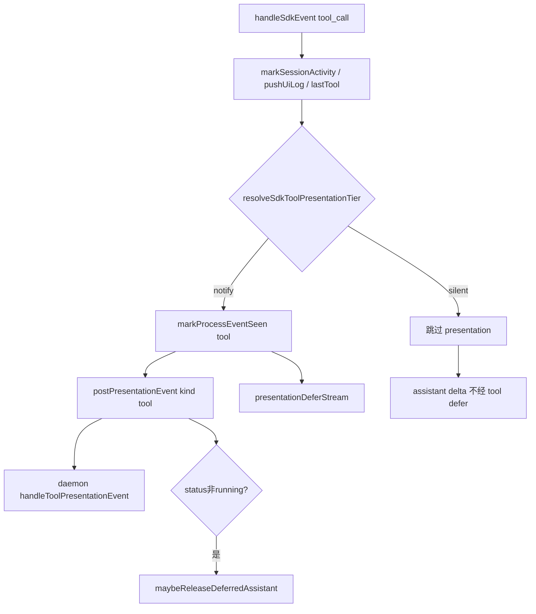

# SDK 工具调用通知分级 - 代码评审报告

## 1、审查范围

- **变更类型**：T1–T3 已实现（`stage`: `applied` → 评审 `reviewed`）
- **评审等级**：focused-review（Cursor SDK `tool_call` presentation 门控 + shared SSOT；无 proto/DB/权限门槛）
- **涉及文件**（4 个实现/索引文件 + KB 设计/任务文档）：
  - `src/shared/sdk-tool-presentation-tier.ts`（新建）
  - `electron/agent/cursor-sdk/sdk-run-stream.ts`
  - `electron/agent/cursor-sdk/AGENTS.md`
  - `src/shared/AGENTS.md`
- **设计文档**：`02-design.md`、`03-tasks.md`（对照基准）
- **评审方式**：git diff + 源码精读 + `sdk-run-presentation.ts` 调用链核对
- **范围外**：01 验收 1–7 与 02·八·（二）1–6 的 E2E 勾选归 `/kb-test`；`06-CursorSDK执行引擎.md` 归 `/kb-archive`（02 §10.1）

## 2、严重（必须处理）

无评分 ≥75 的未关闭严重项。

## 3、警告（建议处理）

| ID | 分数 | 位置 | 描述 | 修复建议 |
|----|------|------|------|----------|
| ~~**W1**~~ | 68→已修 | `electron/agent/cursor-sdk/AGENTS.md` L19 | ~~段首表述矛盾~~ 已改为「thinking/task 始终 POST；tool_call 仅 notify 白名单 POST」 | ✅ 复评关闭 |
| **W2** | 55 | `src/shared/sdk-tool-presentation-tier.ts` | T1 验收允许「单测或内联注释」；当前仅有内联注释、无自动化用例，边界（大小写/空串/未知工具）靠人工回归 | `/kb-test` 或 archive 前补 1 个 shared 单测文件（可选，不阻断） |

无评分 ≥75 的警告项。

## 4、设计偏差

| 设计预期 | 实际实现 | 评估 |
|----------|----------|------|
| 唯一门控在 `sdk-run-stream` `case "tool_call"`（§1.3、T2） | `resolveSdkToolPresentationTier` + `if (tier === "notify")` 包裹 presentation 块 | ✅ 一致 |
| notify 白名单 shell/write/strreplace/delete/task（§1.4、T1） | `NOTIFY_TOOL_NAMES` Set 五项；`toLowerCase().trim()` | ✅ 一致 |
| silent 跳过 `markProcessEventSeen` / `postPresentationEvent`（S6s） | tier=silent 不进入 notify 分支 | ✅ 一致 |
| UI 日志 / `lastTool` / watchdog 全量（§1.1 说明） | 门控前执行 `pushUiLog`、`session.lastTool`、`runPhase` | ✅ 一致 |
| thinking / task 分支零改动（T2、T3） | `case "thinking"` / `case "task"` diff 无逻辑变更 | ✅ 一致 |
| daemon / 飞书门控不改（§1.3） | 无 `daemon.ts` / `feishu-presentation-gate.ts` 变更 | ✅ 一致 |
| S7：silent 不置 defer 闩（§1.2） | 通过不调用 `markProcessEventSeen("tool")` 间接达成；`sdk-run-presentation.ts` 无 diff | ✅ 一致（间接实现） |
| §4 表 silent `maybeReleaseDeferredAssistant`「已有闩时按现网」 | T2/实现：silent 完成态**一律跳过** `maybeReleaseDeferredAssistant` | ⚠️ 与 §4 表字面略出入，**符合** T2 契约与 §2 根因 2（避免 read burst 误释放）；以 T2 为准 |
| `06-CursorSDK执行引擎.md` 同步（§10.1） | 未改（留 archive） | ✅ 符合任务边界 |

无阻断性设计偏差。

## 5、验收标准检查

### `03-tasks.md` 任务（代码层）

| 任务 | 关键验收 | 状态 |
|------|---------|------|
| T1 | 白名单五项 → notify；Read/Glob/未知/空串 → silent；≤300 行；shared 无环 | ✅（25 行） |
| T2 | notify 保留 mark+post+release；silent 跳过 presentation；thinking/task 不变；UI `[tool]` 全量 | ✅ |
| T3 | 两处 AGENTS.md 含 tier 说明与文件索引 | ✅（W1 文案已修） |

### `01-proposal.md` / `02-design.md` §8.2（代码路径）

| 编号 | 代码评估 | E2E |
|------|---------|-----|
| 验收 1 silent 不出站 IM | ✅ silent 不产生 `presentation-event` | ⏳ `/kb-test` |
| 验收 2 notify 可见可区分 | ✅ notify 路径保留 `extractShellPresentationFields` + 原 POST | ⏳ |
| 验收 3 think/task 不变 | ✅ 分支未改 | ⏳ |
| 验收 4 过程条数下降 | ✅ 结构性减少 read/glob POST | ⏳ |
| 验收 6 短任务/三态不劣化 | ✅ silent 不置 defer；notify defer 路径保留 | ⏳ |
| 8.2·1 silent UI 日志 | ✅ `pushUiLog` 在门控前 | ⏳ |
| 8.2·2 notify 多通道 | ✅ notify 仍 `postPresentationEvent` | ⏳ |
| 8.2·3 read burst 不误 defer | ✅ silent 不调 `markProcessEventSeen` | ⏳ |
| 8.2·5 shell defer 仍有效 | ✅ notify shell 仍 mark+release | ⏳ |
| 8.2·6 失败可见性 | ✅ notify write/delete 完成态仍出站 | ⏳ |

## 6、调用链与回归风险

| 回归点 | 风险 | 说明 |
|--------|------|------|
| notify shell/write/delete/Task defer | 低 | notify 分支逻辑与变更前等价 |
| read/glob burst + ordering | 低→改善 | silent 不再误置 defer；assistant 首包预期更快 |
| thinking → silent read → assistant | 低 | `closeThinkingIfOpen` 仍在 tool_call 入口，thinking 闩释放不变 |
| notify shell running + silent reads | 低→改善 | silent 完成不再过早 `maybeReleaseDeferredAssistant` |
| 微信 CardKit / 飞书里程碑 | 低 | 仅减少 silent POST 量；notify 路径不变 |
| Claude/Codex/OpenCode/CC | 无 | 未改非 SDK 引擎 |
| watchdog / `lastTool` 超时归因 | 无 | silent 仍更新 `lastTool` |
| Task 工具 + task 事件双通知 | 低 | 设计允许并存；非本次引入 |

## 7、遗留债务

- ~~**W1** AGENTS 段首 POST 表述~~ — 已修复
- **W2** 分级函数无单测 — 可选补测，不阻断
- **`06-CursorSDK执行引擎.md`** — archive 按 02 §10.1 必更
- **E2E** — `/kb-test` 待办，非代码债务

## 8、修复任务建议

| 问题 | 建议动作 | 优先级 |
|------|----------|--------|
| ~~W1 文档矛盾~~ | 已修复 AGENTS 段首表述 | ✅ 关闭 |
| W2 无单测 | 可选 `sdk-tool-presentation-tier.test.ts` | 低 |
| 业务域 KB | archive 更新 `06-CursorSDK执行引擎.md` §二/§三/§八/§十 | archive 必做 |

无 T-FIX 阻断项。

## 9、结论

**评审：通过（可进入 `/kb-test`）**

- 实现与 `02-design` / `03-tasks` 核心契约对齐；唯一门控、白名单、silent 跳过 presentation、观测全量均落地。
- **Ponytail**：未过度工程 — 25 行 Set 纯函数 + `sdk-run-stream.ts` 单点 `if`，无 daemon 二次分级、无配置开关、无事件总线，符合 02 §2 Ponytail 三问。
- **无 ≥75 分 open 问题**；不可直接 `/kb-archive`：须 `/kb-test` 完成 E2E 验收与 changelog。

**工作流**：`stage` → `reviewed`；建议 `/kb-test` 优先「多 Read/Glob + 单次 Write」过程条数对比、飞书私聊 notify 工具里程碑、PRESENTATION_ORDERING 下 shell defer 与 read burst assistant 时延。
