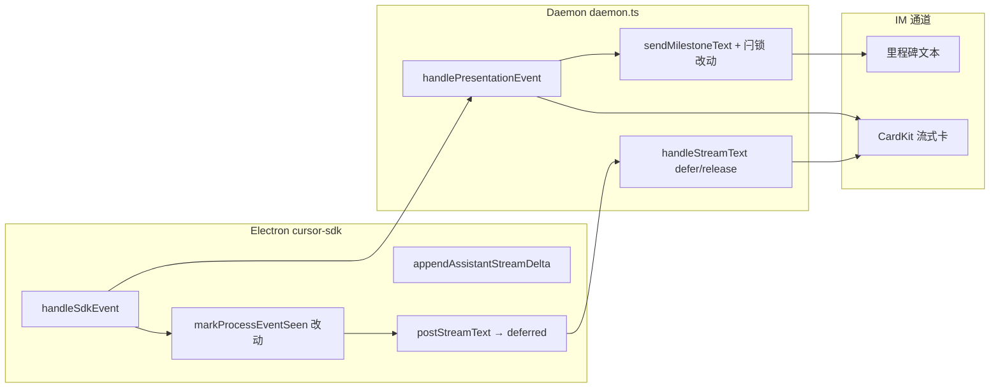

# IM 通知消息顺序与流式推送优化 - 实现设计

> **业务 PRD**：见同目录 `01-proposal.md`（验收标准以 01 为准）

## 1、业务流程与改动范围

> 业务口径以 `01-proposal.md` §功能需求 F1–F7 与验收 1–9 为准；下图覆盖 **MVP（主用户私聊 Cursor SDK）** 从入队到 Run 收尾的主路径，含飞书里程碑降级与 CardKit 双形态。

### 1.1 业务流程图

```mermaid
flowchart TD
  startNode["S0 用户 IM 发消息 不改"] --> enqueue["S0-F1 入队确认 + Get 表情 不改"]
  enqueue --> dispatch["S1 Daemon dispatch → SDK Run 不改"]
  dispatch --> sdkStream["S2 SDK run.stream 事件 不改"]

  sdkStream --> orderGate{"S3 PRESENTATION_ORDERING<br/>且主用户私聊? 不改"}
  orderGate -->|否/回滚| legacyPath["S3-L 先到先展示 不改"]
  orderGate -->|是| eventRoute{"S4 SDK 事件分流 改动"}

  eventRoute -->|thinking| thinkEvt["S4-T thinking 出站 改动"]
  eventRoute -->|tool notify| toolEvt["S4-Tool 关键工具出站 改动"]
  eventRoute -->|task| taskEvt["S4-Task 子任务里程碑 改动"]
  eventRoute -->|assistant delta| assistBuf["S5 assistant delta 累积 改动"]

  thinkEvt --> presentFork{"S4-P 呈现形态 不改"}
  toolEvt --> presentFork
  taskEvt --> presentFork

  presentFork -->|飞书抑制| milestone["S4-M 里程碑 send-text 改动"]
  presentFork -->|微信/CardKit| cardkit["S4-C CardKit 过程卡 不改"]

  milestone --> latchOn["S6 置 ordering 闩锁 改动"]
  cardkit --> latchOn

  latchOn --> deferGate{"S5-D 过程活跃且未释放?<br/>assistant 首建 defer 不改"]
  deferGate -->|是| bufferAssist["缓冲 deferredAssistantText 不改"]
  deferGate -->|否且无过程| preamble["S5-P preamble 400ms 短窗 不改"]
  deferGate -->|否且过程 idle| release["S7 释放 assistant 流式首建 不改"]

  assistBuf --> moreEvents{"更多 SDK 事件 不改"]
  preamble --> streamCreate["首建 assistant CardKit 不改"]
  moreEvents --> eventRoute

  moreEvents -->|过程 idle| release
  release --> streamPatch["S8 流式 PATCH 更新 不改"]
  streamCreate --> streamPatch

  moreEvents -->|Run final| runEnd["S9 Run 收尾 flush final 不改"]
  runEnd --> stopProgress["S10 stop/ack 三态 不改"]

  legacyPath --> legacyStream["assistant 首 delta 即建卡 不改"]
  legacyStream --> runEnd
```

**图例**：`不改` 行为与现网一致；`改动` 需改代码/配置；`新增` 本期无独立新模块；`删除` 本期无删除项。

### 1.2 流程步骤与改动对照

| 步骤 ID | 业务含义 | 改动 | 落点（模块/文件） | 01 验收关联 |
|---------|----------|------|-------------------|-------------|
| S0 | 用户 IM 发消息、入队 | 不改 | `src/daemon.ts` `pushMessage` | — |
| S0-F1 | 入队确认、Get 表情、三态「处理中」 | 不改 | `src/daemon.ts` `confirmEnqueueAndStartProgress` | F7；验收 7 |
| S1 | Daemon 调度 → Electron SDK Run | 不改 | `src/daemon.ts` `runAgentDispatchLoop`；`electron/agent/cursor-sdk/sdk-run-stream.ts` `streamRunEvents` | — |
| S2 | SDK 事件流 thinking / tool_call / task / assistant | 不改 | `electron/agent/cursor-sdk/sdk-run-stream.ts` `handleSdkEvent` | — |
| S3 | `PRESENTATION_ORDERING` + 主用户私聊门控 | 不改 | `src/daemon.ts` `presentationOrderingEnabled`；`electron/agent/cursor-sdk/sdk-session-registry.ts` `presentationOrderingEligible` | F6.1；验收 8 |
| S3-L | 开关关闭：先到先展示 | 不改 | 同上，门控返回 false | — |
| S4-T | thinking → `postPresentationEvent` | 改动（闩锁） | `electron/agent/cursor-sdk/sdk-run-stream.ts`；`electron/agent/cursor-sdk/sdk-run-presentation.ts` `markProcessEventSeen`；`src/daemon.ts` `handleThinkingPresentationEvent` | F1；验收 1 |
| S4-Tool | notify 级 tool → `postPresentationEvent` | 改动（闩锁） | `electron/agent/cursor-sdk/sdk-run-stream.ts`；`src/daemon/daemon.ts` `handleToolPresentationEvent` | F1/F4；验收 1/4 |
| S4-Task | task 里程碑 → `postPresentationEvent` | 改动 | `electron/agent/cursor-sdk/sdk-run-stream.ts`；`src/daemon.ts` `handleTaskPresentationEvent` | F1/F3；验收 2 |
| S4-P | 飞书抑制 vs CardKit 呈现形态分流 | 不改 | `src/shared/feishu-presentation-gate.ts`；`src/daemon.ts` 抑制分支 | F6.1 |
| S4-M | 飞书里程碑 `sendMilestoneText` 降级 | 改动 | `src/daemon/daemon-presentation-milestone.ts`；`src/daemon.ts` 抑制分支 | F6.1；验收 8 |
| S4-C | 微信/非抑制 CardKit 过程卡 | 不改 | `src/daemon.ts` CardKit 分支；`src/bridge/lark-core.ts` | F6.2 |
| S5-D | assistant delta 累积、daemon 返回 `deferred: true` | 改动（触发条件修复） | `electron/agent/cursor-sdk/sdk-run-presentation.ts` `appendAssistantStreamDelta`；`src/daemon.ts` `handleStreamText` | F1/F2；验收 1/3 |
| S5-P | 纯对话 preamble 400ms 短窗后首包 | 不改 | `electron/agent/cursor-sdk/sdk-run-presentation.ts` `schedulePreambleRelease` | F5；验收 5/6 |
| S6 | 置 `presentationProcessActive` / `seenProcessEvent` 闩锁 | 改动 | `src/daemon.ts` 抑制分支 + `handleTaskPresentationEvent`；`electron/agent/cursor-sdk/sdk-run-presentation.ts` `markProcessEventSeen` | F1/F3；验收 1/2 |
| S7 | 过程 idle → `releaseDeferredAssistantStream` | 不改 | `src/daemon.ts`；`electron/agent/cursor-sdk/sdk-run-presentation.ts` `maybeReleaseDeferredAssistant` | F2；验收 3 |
| S8 | assistant CardKit 流式 PATCH | 不改 | `src/daemon.ts` `handleStreamText`；`src/bridge/lark-core.ts` | F2.1–F2.4 |
| S9 | Run 收尾 `flushStreamPost(final)` | 不改 | `electron/agent/cursor-sdk/sdk-run-stream.ts` `streamRunEvents` | F2/F7；验收 3/7 |
| S10 | stopSessionProgress / ackOnReply | 不改 | `src/daemon.ts` | F7；验收 7 |
| NF1 | 顺序违规 `presentation_order_violation` 日志 | 不改（回归） | `src/daemon.ts` `logPresentationOrderViolation` | §8.2 |
| NF2 | MergeBatch reply 锚点 | 不改 | `src/daemon.ts` `getPresentationReplyAnchor` | 01 边界 3 |
| NF-Tier | 工具分级 notify/silent 门控 | 不改 | `src/shared/sdk-tool-presentation-tier.ts`；`sdk-run-stream.ts` `resolveSdkToolPresentationTier` | F4；验收 4 |

### 1.3 改动汇总

- **改动**：
  - `electron/agent/cursor-sdk/sdk-run-presentation.ts`：`markProcessEventSeen` 移除飞书抑制与 `task` 早退，统一置 `seenProcessEvent`/`presentationDeferStream`
  - `electron/agent/cursor-sdk/sdk-run-stream.ts`：`case "task"` 补 `markProcessEventSeen(session, "task")`
  - `src/daemon.ts`：飞书抑制分支 `sendMilestoneText` 成功后按 kind 更新 ordering 闩；`handleTaskPresentationEvent` ordering 开启时置 `presentationProcessActive`
  - `src/daemon/daemon-presentation-milestone.ts`（可选）：`sendMilestoneText` 返回 `boolean` 供闩锁仅在真实出站后更新
- **新增**：无新模块/类；仅补齐里程碑路径与 Electron defer 闩的等价语义
- **不改（显式列出）**：工具分级 SSOT（`sdk-tool-presentation-tier.ts`）；MergeBatch 状态机与 `getPresentationReplyAnchor`；三态进度与 `stop_progress` 语义；read/glob silent 不出站；里程碑 3s 节流与 ≤4 次/Run；`STREAM_POST_INTERVAL_MS` 400ms；CardKit schema 与降级链；`PRESENTATION_ORDERING` MVP 范围（主用户私聊）

## 2、整体思路

见 01 §背景与问题、§功能需求 F1–F7。根因：**ordering 闩锁与呈现形态（CardKit vs 里程碑）错误耦合**，导致飞书私聊虽能收到过程里程碑，但 assistant 流式首包仍抢先建卡。

**根因明细（主 Agent 已核实）**：

1. **飞书里程碑路径未置 ordering 闩**：`handleToolPresentationEvent` / `handleThinkingPresentationEvent` 在飞书抑制分支 `sendMilestoneText` 后直接 `return`，**不**更新 `presentationProcessActive` / `thinkingOpen` / `activeToolNames`（回归自 think/task 变更）；`handleStreamText` 因 `presentationProcessActive=false` 立即首建 assistant CardKit → 结论在上。
2. **Electron defer 闩与飞书抑制脱钩**：`markProcessEventSeen` 对 `feishuSuppressesProcessKind` 早退；飞书私聊 thinking/tool 虽 POST 但不置 `seenProcessEvent` / `presentationDeferStream`，assistant delta 经 `appendAssistantStreamDelta` 立即 `scheduleStreamPost`。
3. **task 不参与 defer**：`markProcessEventSeen` 对 `kind==="task"` 早退；`handleTaskPresentationEvent` 注释「不参与 presentationProcessActive」；task 里程碑在 assistant 之后发出。
4. **现网 ordering 范围**：`presentationOrderingEligible` = `PRESENTATION_ORDERING && f41Stream && p2p`；daemon `presentationOrderingEnabled` = 开关 && `isMainUserP2pEligible`。CardKit 路径（微信私聊）逻辑正确，缺口在飞书里程碑 + task。

**方案要点**：

- **统一 ordering 闩与呈现形态解耦**：CardKit 抑制 ≠ 不参与时序编排；里程碑 `sendMilestoneText` 成功后仍更新与 CardKit 路径等价的 `SessionProgressState` 编排字段；assistant `handleStreamText` 继续 defer 首建。
- **Electron**：`markProcessEventSeen` 移除飞书抑制早退与 task 早退；`sdk-run-stream.ts` task 分支补 `markProcessEventSeen(session, "task")`；释放仍靠 `closeThinkingIfOpen`、notify tool 完成、`maybeReleaseDeferredAssistant`、`streamRunEvents` 收尾 flush（task 只置闩不单独 release）。
- **Daemon**：飞书抑制分支在 `sendMilestoneText` 成功后按 kind 更新 ordering 状态；`handleTaskPresentationEvent` 在 ordering 开启时置 `presentationProcessActive`；过程 idle 或 final 时 `releaseDeferredAssistantStream`；保持 CardKit 抑制、里程碑节流不变。
- **范围**：MVP 保持主用户私聊（与现网 `PRESENTATION_ORDERING` 一致）；飞书群聊/微信扩展列为 §8 风险或 §10.2 可能更新。

**最小方案三问（Ponytail）**：

1. **能否复用现有模块/符号？** 能。复用 `SessionProgressState`（`src/daemon.ts:304`）与 `SdkSessionAgent`（`electron/agent/cursor-sdk/sdk-session-types.ts`）既有编排字段；复用 `markProcessEventSeen`、`releaseDeferredAssistantStream`、`sendMilestoneText`，不新建 Orchestrator 类或独立 ordering 子系统。
2. **新增抽象是否 PRD 要求？** 否。不引入新 trait/mixin/第三方依赖。可选将闩锁更新提取为 daemon 内联 helper（如 `applyOrderingLatchForKind(state, kind, status)`），属同文件 DRY，非通用框架。YAGNI：里程碑路径 mirror CardKit 路径已有布尔语义即可。
3. **能否合并到已有文件？** 能。改动集中 `sdk-run-presentation.ts`、`sdk-run-stream.ts`、`daemon.ts`；仅当 `sendMilestoneText` 需返回 `sent` 布尔时微调 `daemon-presentation-milestone.ts`（≤10 行），不预建通用层。

## 3、分层设计



- **端点层**：`POST /api/presentation-event`、`POST /api/stream-text` 契约不变；daemon 抑制分支补闩锁副作用。
- **服务层**：Electron `handleSdkEvent` 统一置 defer 闩；daemon presentation handler 在里程碑成功出站后 mirror CardKit 闩锁更新；`handleStreamText` defer/release 逻辑不变，仅输入闩锁状态修正。
- **数据层**：会话级 `SessionProgressState` + `SdkSessionAgent` 内存字段；无持久化/schema 变更。

## 4、接口设计

无新增 HTTP 路由；沿用现有契约。

**`POST /api/stream-text`**（不变）：

| 字段 | 说明 |
|------|------|
| `session_key` | 会话键 |
| `text` | 累积全文 |
| `stream_id` / `outbound_message_id` | 续传游标 |
| `final` / `message_id` | 收尾与 ack |

响应：过程活跃且首建未释放时 `{ ok: true, deferred: true, stream_id }`；释放后 `{ ok: true, outbound_message_id, stream_id }`。

**`POST /api/presentation-event`**（不变）：

| kind | 关键字段 | 说明 |
|------|----------|------|
| `thinking` | `delta`, `final` | 飞书抑制 → 里程碑 |
| `tool` | `tool_name`, `tool_status`, shell 字段 | notify 级出站 |
| `task` | `task_status`, `task_text` | 里程碑全文 |

本变更仅影响 daemon 处理副作用（闩锁），请求/响应 JSON 形状不变。

## 5、数据结构

无新表；复用既有内存字段。

**Daemon `SessionProgressState`**（`src/daemon.ts:304`）：

| 字段 | 用途 | 本变更 |
|------|------|--------|
| `presentationProcessActive` | 本 Run 已见过程且 assistant 未释放 | 里程碑/task 路径亦置 true |
| `activeToolNames` | running 工具集合 | 里程碑 tool started 亦 add |
| `thinkingOpen` | thinking 未 final | 里程碑 thinking delta 亦置 true |
| `deferredAssistantText` | defer 期间 assistant 累积 | 不改 |
| `assistantCardReleased` | 已首建 assistant 卡 | 不改 |

**Electron `SdkSessionAgent`**（`sdk-session-types.ts`）：

| 字段 | 用途 | 本变更 |
|------|------|--------|
| `seenProcessEvent` | 本 Run 出现过过程事件 | 飞书抑制与 task 亦置 true |
| `presentationDeferStream` | daemon 已 deferred 或本地闩 | 同上 |
| `thinkingOpen` | thinking 进行中 | task 不单独维护 |

无 proto/磁盘模型变更。

## 6、实现步骤

1. **S6-E1**（`sdk-run-presentation.ts`）：`markProcessEventSeen` 移除 `kind==="task"` 与 `feishuSuppressesProcessKind` 早退；保留 `presentationOrderingEligible` 门控；thinking/tool/task 均置 `seenProcessEvent`+`presentationDeferStream` 并 `clearStreamPostTimer`。
2. **S4-Task-E**（`sdk-run-stream.ts`）：`case "task"` 在 `postPresentationEvent` 前调用 `markProcessEventSeen(session, "task")`。
3. **S4-M-T**（`daemon.ts` `handleThinkingPresentationEvent`）：飞书抑制分支 `sendMilestoneText` 成功后，若 `ordering`：`thinkingOpen=true`、`presentationProcessActive=true`；`event.final` 时 `thinkingOpen=false`，idle 则 `releaseDeferredAssistantStream`。
4. **S4-M-Tool**（`daemon.ts` `handleToolPresentationEvent`）：飞书抑制分支成功后 mirror CardKit 闩：`started` → `activeToolNames.add`+`presentationProcessActive=true`；`completed`/`failed` → delete；idle 则 release。
5. **S4-Task-D**（`daemon.ts` `handleTaskPresentationEvent`）：`sendMilestoneText` 成功后，若 `ordering` 且里程碑实际发出（非节流跳过）→ `presentationProcessActive=true`；task 不维护 `activeToolNames`/`thinkingOpen`；不在 task 单独 release（由 assistant final / 其他过程 idle 触发）。
6. **S4-M-Ret**（可选，`daemon-presentation-milestone.ts`）：`sendMilestoneText` 返回 `boolean`（`true`=已发送或节流跳过前的成功发送），供 handler 仅在真实出站后更新闩锁，避免节流跳过误置闩。
7. **§8.2 回归**：飞书私聊长任务 + 短问答手工验收；确认 NF1 `presentation_order_violation` 不因本变更新增；更新 `electron/agent/cursor-sdk/AGENTS.md` 与 `src/daemon/AGENTS.md` 闩锁描述。

## 7、参考实现

| 符号 | 路径 | 职责 |
|------|------|------|
| `markProcessEventSeen` | `electron/agent/cursor-sdk/sdk-run-presentation.ts:217` | Electron defer 闩（本变更核心） |
| `appendAssistantStreamDelta` | `electron/agent/cursor-sdk/sdk-run-presentation.ts:196` | assistant 累积与 defer 判定 |
| `shouldDeferAssistantPost` | `electron/agent/cursor-sdk/sdk-run-presentation.ts:173` | `seenProcessEvent \|\| presentationDeferStream` |
| `handleSdkEvent` | `electron/agent/cursor-sdk/sdk-run-stream.ts:96` | thinking/tool/task/assistant 分流 |
| `presentationOrderingEligible` | `electron/agent/cursor-sdk/sdk-session-registry.ts` | Electron ordering 门控 |
| `handleStreamText` | `src/daemon/daemon.ts:655` | defer 首建 / release |
| `handleToolPresentationEvent` | `src/daemon/daemon.ts:1388` | 飞书抑制 L1415–1425 缺口 |
| `handleThinkingPresentationEvent` | `src/daemon/daemon.ts:1515` | 飞书抑制 L1539–1555 缺口 |
| `handleTaskPresentationEvent` | `src/daemon/daemon.ts:1685` | task 不置闩 L1704 |
| `sendMilestoneText` | `src/daemon/daemon-presentation-milestone.ts:67` | 里程碑节流降级 |
| `releaseDeferredAssistantStream` | `src/daemon/daemon.ts:566` | 过程 idle 后首建 assistant |
| `resolveSdkToolPresentationTier` | `src/shared/sdk-tool-presentation-tier.ts` | notify/silent 分级（不改） |
| `logPresentationOrderViolation` | `src/daemon/daemon.ts:488` | NF1 可观测 |

## 8、技术影响

### 8.1 影响范围

- **涉及模块**：`electron/agent/cursor-sdk/sdk-run-presentation.ts`、`sdk-run-stream.ts`；`src/daemon/daemon.ts`；可选 `src/daemon/daemon-presentation-milestone.ts`；AGENTS 文档同步。
- **接口/proto 变更**：无。
- **数据变更**：无。
- **风险**：
  - 飞书群聊 / 微信私聊 CardKit 路径已正确，本变更主要修复飞书私聊里程碑 + task；群聊 ordering 未开启，行为应与变更前一致。
  - 里程碑节流跳过时不应误置闩（步骤 6 可选返回布尔缓解）。
  - task 仅置 `presentationProcessActive`，不参与 `activeToolNames`/`thinkingOpen`，idle 判定仍由 thinking/tool 收尾驱动；纯 task 无 assistant 场景由 Run final 强制 release。

### 8.2 工程补充验收项

- [ ] 飞书私聊「思考 → notify 工具 → 答复」：里程碑在 assistant CardKit 首包之前可见（对照 §1.2 S4-M + S5-D）
- [ ] 飞书私聊含 ≥2 次 task 里程碑 + 工具过程：时间轴自上而下与发生顺序一致（验收 2）
- [ ] task 出现后 assistant 首包 defer，直至过程 idle 或 Run final（S4-Task + S6）
- [ ] 短问答无实质过程：首包时延与变更前相比无明显劣化，preamble 仍 ≤400ms（验收 5/6）
- [ ] read/glob silent 工具仍不出站、不置闩（验收 4）
- [ ] NF1：长任务场景无新增 `presentation_order_violation` WARN（或仅保留极端竞态）
- [ ] `PRESENTATION_ORDERING=0` 回滚：行为与变更前一致
- [ ] MergeBatch 活跃时 deferred assistant 首建仍带 `getPresentationReplyAnchor`（NF2 零回归）

## 9、知识库影响

- `knowledge/业务域/Agent调度/06-CursorSDK执行引擎.md` — §二/§三 `markProcessEventSeen` 与 task 门控描述需更新（task 参与 defer；飞书抑制仍 POST 且置闩）
- `src/daemon/AGENTS.md` — Presentation 时序编排：飞书抑制分支亦更新 ordering 闩
- `electron/agent/cursor-sdk/AGENTS.md` — `markProcessEventSeen` 门控与 task 分支说明
- 两级索引：`知识索引.md` / `Agent调度/00-README.md` 无需结构性变更（行为修正，非新子模块）

## 10、知识库更新计划

### 10.1 必须更新

- `knowledge/业务域/Agent调度/06-CursorSDK执行引擎.md` — §二 PRESENTATION_ORDERING、§三 `markProcessEventSeen`/task 规则
- `src/daemon/AGENTS.md` — 飞书抑制 + ordering 闩锁语义
- `electron/agent/cursor-sdk/AGENTS.md` — Electron defer 闩与 task 参与 ordering

### 10.2 可能更新（视实现结果）

- `knowledge/业务域/Agent调度/` 下 IM 呈现相关段落（若验收 8 扩展微信/群聊场景有额外结论）
- `knowledge/变更/归档/20260627210352-飞书Presentation展示时序编排/` 交叉引用（archive 本变更时）

### 10.3 不需要更新

- `src/shared/sdk-tool-presentation-tier.ts` 及工具分级知识（行为不变）
- MergeBatch、三态进度、里程碑节流参数文档
- Proto / Flutter / Quasar 分区（无触达）
