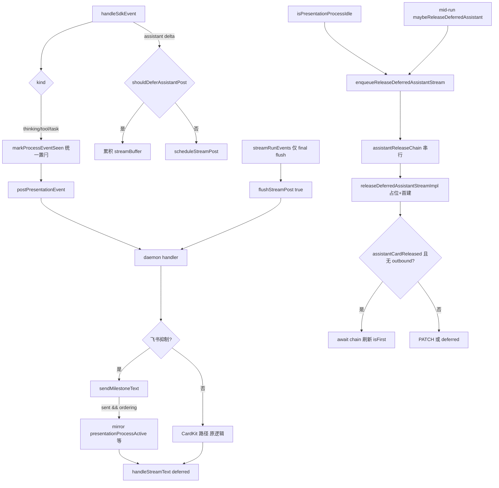

# IM 通知消息顺序与流式推送优化 - 代码评审报告

## 1、审查范围

- **变更类型**：T1–T5 + T-FIX-1~4 已实现（`stage`: `applied` → `reviewed`）
- **评审等级**：focused-review（T-FIX 验收修复轮；对照 08-verify-issue 第 1 轮重复 assistant 文案）
- **评审轮次**：R1（88 分）→ T-FIX-1/2/3 → R2（72 分）→ R3（58 分）→ T-FIX-4 → 本轮通过
- **涉及文件**（9 个实现/索引 + KB 文档）：
  - `electron/agent/cursor-sdk/sdk-run-presentation.ts`（T1）
  - `electron/agent/cursor-sdk/sdk-run-stream.ts`（T3、T-FIX-2）
  - `src/daemon/daemon-presentation-milestone.ts`（T2）
  - `src/daemon/daemon.ts`（T4、T-FIX-1、T-FIX-4）
  - `electron/agent/cursor-sdk/AGENTS.md`（T5、T-FIX-3）
  - `src/daemon/AGENTS.md`（T5、T-FIX-3、T-FIX-4）
  - `knowledge/业务域/Agent调度/06-CursorSDK执行引擎.md`（T5）
- **设计文档**：`02-design.md`、`03-tasks.md`、`08-verify-issue.md`（对照基准）
- **评审方式**：git diff + 源码精读 + 三轮 focused-review 静态验收
- **范围外**：01 验收 1–9 与 02 §8.2 E2E 勾选归 `/kb-test`；08-verify 复验建议手工

## 2、严重（必须处理）

无评分 ≥75 的未关闭严重项。

**已关闭（R1，原 88 分）**：`handleStreamText` 与 `releaseDeferredAssistantStream` 飞行窗口竞态——`assistantCardReleased` 已占位但 `outboundMessageId` 未写入时，并发 stream-text 仍 `isFirst=true` 重复首建。→ **T-FIX-4** 飞行窗口门控（await `assistantReleaseChain` + 刷新 `isFirst` + 非 final 返回 `deferred: true`）。

## 3、警告（建议处理）

无评分 ≥75 的 open 警告项。

以下为 **accepted debt**（score 50–74，已接受、不阻断评审）：

| ID | 分数 | 位置 | 描述 | 处置 |
|----|------|------|------|------|
| **R-D1** | ~55 | Electron `markProcessEventSeen` vs Daemon `sendMilestoneText` sent | Electron 侧过程事件到达即置 defer 闩；Daemon 侧飞书里程碑仅在 `sent === true` 时置 `presentationProcessActive`——双侧闩锁触发条件不完全对称 | **accepted**：节流跳过时 Electron 已 defer、Daemon 不置闩属合理；Run final flush 兜底 |
| **R-D2** | ~40 | `handleTaskPresentationEvent` | 纯 task 场景 mid-run 不单独 release，依赖 thinking/tool idle 或 Run final | **accepted**：02 §6 步骤 5、§8.1 风险已写明；`streamRunEvents` 收尾强制 final flush |
| **R-D3** | ~72 | Run 收尾跨通道并发 | Electron `flushStreamPost(final)` 与 Daemon `enqueueRelease` 仍可能近时序叠加；T-FIX-2 移除 non-final 双 POST，T-FIX-4 门控缓解剩余窗口 | **accepted**：08-verify 根因已对准并发 release；E2E 复验优先 |
| **R-D4** | ~58 | `enqueueReleaseDeferredAssistantStream` 链 | `impl` 内 try/catch 已回滚 `assistantCardReleased` 并 rethrow；外层 `.catch` 仅 WARN 日志、不向上传播，后续链项仍执行 | **accepted**：与 Electron `streamPostChain` 模式一致；失败场景依赖 impl 回滚 + 后续 release 重试 |

## 4、设计偏差

| 设计预期 | 实际实现 | 评估 |
|----------|----------|------|
| S6-E1：task/飞书抑制早退移除（§6 步骤 1） | `markProcessEventSeen` 仅保留 `presentationOrderingEligible` 门控 | ✅ 一致 |
| S4-Task-E：task 分支前置闩（§6 步骤 2） | `markProcessEventSeen(session, "task")` 在 `postPresentationEvent` 前 | ✅ 一致 |
| S4-M-Ret：`sendMilestoneText` 返回 sent（§6 步骤 6） | `Promise<boolean>`；节流/去重/失败 → `false` | ✅ 一致 |
| S4-M-T/Tool/Task：飞书抑制 + ordering + sent 后置闩 | thinking/tool mirror CardKit 字段；task 仅 `presentationProcessActive` | ✅ 一致 |
| S7：过程 idle → release assistant 首建 | 改经 `enqueueReleaseDeferredAssistantStream` 串行入链 | ✅ 增强（T-FIX-1） |
| S9：Run 收尾单 final flush | 移除收尾 `flushDeferredStreamPost`，仅 `flushStreamPost(true)` | ✅ 增强（T-FIX-2） |
| 08-verify：消除 assistant 双首建 | chain 串行 + 占位回滚 + 飞行窗口门控 | ✅ 对齐修复目标 |
| 工具分级 / MergeBatch / 三态不改（§1.3） | 无相关文件逻辑变更 | ✅ 一致 |

无阻断性设计偏差。

## 5、验收标准检查

### `03-tasks.md` 主任务（T1–T5）

| 任务 | 关键验收 | 状态 |
|------|---------|------|
| T1 | 移除 task/飞书抑制早退；ordering 门控保留；thinking/tool/task 均置 defer 闩 | ✅ |
| T2 | `sendMilestoneText` 返回 sent；节流/去重/空文案/失败 → false | ✅ |
| T3 | task 分支 `markProcessEventSeen` 在 `postPresentationEvent` 前 | ✅ |
| T4 | 飞书抑制 sent 后 mirror 闩；task 置 `presentationProcessActive`；idle enqueue release | ✅ |
| T5 | 三份文档：抑制≠defer、task 参与 ordering、`sent` 语义 | ✅ |

### T-FIX 修复任务（08-verify 第 1 轮）

| 任务 | 关键验收 | 状态 |
|------|---------|------|
| T-FIX-1 | `assistantReleaseChain` 串行 enqueue；首建前 `assistantCardReleased` 占位；发送失败回滚；`resetPresentationOrderingFields` 清 chain | ✅ |
| T-FIX-2 | `streamRunEvents` 收尾移除 `flushDeferredStreamPost`；仅 `flushStreamPost(session, true)` | ✅ |
| T-FIX-3 | AGENTS ×2 同步 enqueue release 链与 Run 收尾单 final flush 语义 | ✅ |
| T-FIX-4 | ordering 且 `assistantCardReleased && !outboundMessageId` 时 await chain 刷新 `isFirst`；飞行窗口非 final 返回 `deferred: true`；impl try/catch 回滚占位 | ✅ |

### `01-proposal.md` / `02-design.md` §8.2（E2E）

| 编号 | 代码评估 | E2E |
|------|---------|-----|
| 验收 1 过程先于结论（F1） | ✅ defer 闩 + release 串行 | ⏳ `/kb-test` |
| 验收 2 多过程有序（F3） | ✅ task 参与 defer | ⏳ |
| 验收 3 assistant defer 至 idle/final（F2） | ✅ enqueue release + 飞行门控 | ⏳ |
| 验收 4 silent 工具不出站（F4） | ✅ 无分级逻辑变更 | ⏳ |
| 验收 5/6 短问答 preamble ≤400ms（F5） | ✅ preamble 路径未改 | ⏳ |
| 验收 7 三态协调（F7） | ✅ stop/ack 路径未改 | ⏳ |
| 验收 8 ordering 范围（F6.1） | ✅ p2p 门控未扩 | ⏳ |
| 验收 9 阅读无逻辑颠倒 / 无重复文案 | ✅ T-FIX 对准双首建根因 | ⏳ 08-verify 手工复验 |
| 8.2·6 NF1 无新增 order violation | ✅ 逻辑上减少违规根因 | ⏳ |
| 8.2·7 `PRESENTATION_ORDERING=0` 回滚 | ✅ 门控 false 时双侧无副作用 | ⏳ |
| 8.2·8 MergeBatch reply 锚点（NF2） | ✅ `getPresentationReplyAnchor` 未改 | ⏳ |

## 6、调用链与回归风险

| 回归点 | 风险 | 说明 |
|--------|------|------|
| assistant 重复首建（08-verify） | 低→改善 | T-FIX-1/2/4 对准根因；E2E 待复验 |
| 飞书私聊里程碑 + assistant 顺序 | 低→改善 | T1–T4 闩锁 + T-FIX release 串行 |
| 微信 CardKit 私聊 | 无 | 非抑制路径 diff 为零 |
| 飞书群聊 / ordering 关闭 | 无 | 门控 false 双侧早退 |
| release 链错误传播 | 低 | R-D4：外层 catch 吞异常，impl 已回滚占位 |
| Run 收尾 Electron↔Daemon 时序 | 低 | R-D3：T-FIX-2 单 final + T-FIX-4 门控 |
| 里程碑节流跳过 | 低 | R-D1：Electron defer、Daemon 不置闩，final 兜底 |
| 纯 task 无 thinking/tool | 低 | R-D2：Run final 强制 release |
| MergeBatch reply 锚点 | 无 | NF2 路径未触达 |
| 短问答 preamble | 低 | `schedulePreambleRelease` 未改 |

## 7、遗留债务

- **R-D1** Electron/Daemon 闩锁触发条件不对称 — accepted
- **R-D2** 纯 task mid-run 不 release — accepted，Run final 兜底
- **R-D3** Run 收尾跨通道近时序 — accepted，T-FIX-4 门控缓解
- **R-D4** release 链外层吞异常 — accepted，对齐 streamPostChain 模式
- **E2E / 08-verify** — 归 `/kb-test` 与手工复验，非代码阻断债务

## 8、修复任务建议

| 问题 | 建议动作 | 优先级 |
|------|----------|--------|
| 08-verify 复验 | 飞书私聊长任务：确认 assistant 答复不再重复；含 thinking→tool→task 过程 | 高（archive 前） |
| E2E 验收 | `/kb-test`：01 验收 1–9 与 02 §8.2 全项 | 高 |
| R-D1~R-D4 | 无需 T-FIX；若 E2E 暴露新边缘竞态再评估 | — |

无 open T-FIX 阻断项。

## 9、结论

**评审：通过（可进入 `/kb-test` 与 `/kb-archive`）**

- T1–T5 与 `02-design` / `03-tasks` 核心契约对齐；T-FIX-1~4 对准 08-verify 第 1 轮 assistant 重复文案根因。
- **Ponytail**：T-FIX 复用 Electron `streamPostChain` 模式（`assistantReleaseChain`），无新抽象层或配置开关。
- **无 ≥75 分 open 问题**（0 个）；R1 已 fixed（T-FIX-4）；R-D1~R-D4 均为 accepted debt。
- **E2E**：`/kb-test` 完成 01/02 验收项；**08-verify 第 1 轮建议手工复验**后再 archive 并 bump changelog。

**工作流**：`stage` → `reviewed`；优先飞书私聊「过程在上、结论不重复」长任务与短问答首包时延对比。
