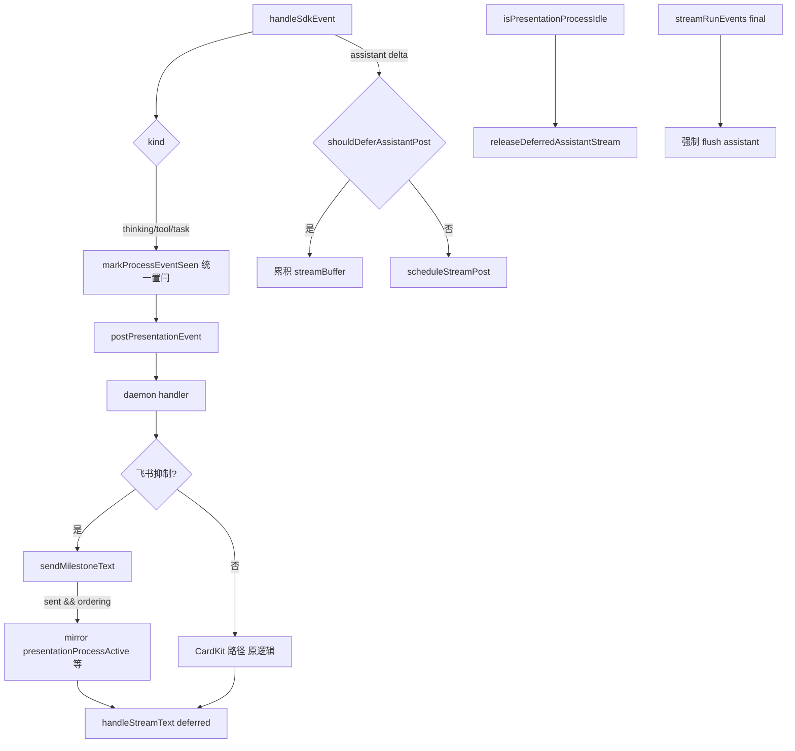

# IM 通知消息顺序与流式推送优化 - 代码评审报告

## 1、审查范围

- **变更类型**：T1–T5 已实现（`stage`: `applied` → 评审 `reviewed`）
- **评审等级**：focused-review（Electron defer 闩 + Daemon 飞书里程碑 ordering 闩；无 proto/DB/权限门槛）
- **涉及文件**（7 个实现/索引文件 + KB 设计/任务文档）：
  - `electron/agent/cursor-sdk/sdk-run-presentation.ts`（T1）
  - `electron/agent/cursor-sdk/sdk-run-stream.ts`（T3）
  - `src/daemon/daemon-presentation-milestone.ts`（T2）
  - `src/daemon/daemon.ts`（T4）
  - `electron/agent/cursor-sdk/AGENTS.md`（T5）
  - `src/daemon/AGENTS.md`（T5）
  - `knowledge/业务域/Agent调度/06-CursorSDK执行引擎.md`（T5）
- **设计文档**：`02-design.md`、`03-tasks.md`（对照基准）
- **评审方式**：git diff + 源码精读 + 主 Agent/子 Agent 静态验收 + `tsc` 通过
- **范围外**：01 验收 1–9 与 02 §8.2 飞书私聊长任务/短问答 E2E 勾选归 `/kb-test`

## 2、严重（必须处理）

无评分 ≥75 的未关闭严重项。

## 3、警告（建议处理）

无评分 ≥75 的 open 警告项。

以下为 **accepted debt**（score 50–74，已接受、不阻断评审）：

| ID | 分数 | 位置 | 描述 | 处置 |
|----|------|------|------|------|
| **R-D1** | ~55 | Electron `markProcessEventSeen` vs Daemon `sendMilestoneText` sent | Electron 侧过程事件到达即置 defer 闩；Daemon 侧飞书里程碑仅在 `sent === true` 时置 `presentationProcessActive`——双侧闩锁触发条件不完全对称 | **accepted**：节流跳过时 Electron 已 defer、Daemon 不置闩属合理；`streamRunEvents` final flush 兜底；符合 T4 验收 |
| **R-D2** | ~40 | `handleTaskPresentationEvent` | 纯 task 场景 mid-run 不单独 `releaseDeferredAssistantStream`，依赖 thinking/tool idle 或 Run final | **accepted**：02 §6 步骤 5、§8.1 风险已写明；`streamRunEvents` 收尾强制 flush |

## 4、设计偏差

| 设计预期 | 实际实现 | 评估 |
|----------|----------|------|
| S6-E1：`markProcessEventSeen` 移除 task/飞书抑制早退（§6 步骤 1） | 移除 `kind==="task"` 与 `feishuSuppressesProcessKind` 早退；保留 `presentationOrderingEligible` 门控 | ✅ 一致 |
| S4-Task-E：task 分支 `postPresentationEvent` 前置闩（§6 步骤 2） | `case "task"` 在 `postPresentationEvent` 前调用 `markProcessEventSeen(session, "task")` | ✅ 一致 |
| S4-M-Ret：`sendMilestoneText` 返回 `boolean`（§6 步骤 6） | `Promise<boolean>`；空/节流/去重/失败 → `false`；成功出站 → `true` | ✅ 一致 |
| S4-M-T/Tool/Task：飞书抑制 + ordering + sent 后置闩（§6 步骤 3–5） | thinking/tool mirror CardKit 字段；task 仅 `presentationProcessActive`；idle 时 `releaseDeferredAssistantStream` | ✅ 一致 |
| 呈现抑制 ≠ 不参与 ordering defer（§2 方案要点） | Electron 仍 POST 并置闩；Daemon 里程碑 sent 后 mirror 编排字段 | ✅ 一致 |
| task 不维护 `activeToolNames`/`thinkingOpen`、不单独 release（§6 步骤 5） | `handleTaskPresentationEvent` 仅置 `presentationProcessActive` | ✅ 一致 |
| 工具分级 / MergeBatch / 三态 / CardKit 非抑制路径不改（§1.3） | 无 `sdk-tool-presentation-tier.ts`、`feishu-presentation-gate.ts`、MergeBatch 逻辑变更 | ✅ 一致 |
| T5 三份文档同步（§10.1） | AGENTS ×2 + `06-CursorSDK执行引擎.md` 已更新 | ✅ 一致 |

无阻断性设计偏差。

## 5、验收标准检查

### `03-tasks.md` 任务（代码层）

| 任务 | 关键验收 | 状态 |
|------|---------|------|
| T1 | 移除 task/飞书抑制早退；ordering 门控保留；thinking/tool/task 均置 defer 闩 | ✅ |
| T2 | `sendMilestoneText` 返回 sent；节流/去重/空文案/失败 → false | ✅ |
| T3 | task 分支 `markProcessEventSeen` 在 `postPresentationEvent` 前；thinking/tool 零改动 | ✅ |
| T4 | 飞书抑制 sent 后 mirror 闩；task 置 `presentationProcessActive`；idle release | ✅（代码静态） |
| T5 | 三份文档：抑制≠defer、task 参与 ordering、`sent` 语义 | ✅ |

### `01-proposal.md` / `02-design.md` §8.2（E2E）

| 编号 | 代码评估 | E2E |
|------|---------|-----|
| 验收 1 过程先于结论（F1） | ✅ defer 闩双侧补齐 | ⏳ `/kb-test` |
| 验收 2 多过程有序（F3） | ✅ task 参与 defer | ⏳ |
| 验收 3 assistant defer 至 idle/final（F2） | ✅ release 路径保留 | ⏳ |
| 验收 4 silent 工具不出站（F4） | ✅ 无分级逻辑变更 | ⏳ |
| 验收 5/6 短问答 preamble ≤400ms（F5） | ✅ preamble 路径未改 | ⏳ |
| 验收 7 三态协调（F7） | ✅ stop/ack 路径未改 | ⏳ |
| 验收 8 ordering 范围（F6.1） | ✅ p2p 门控未扩 | ⏳ |
| 验收 9 阅读无逻辑颠倒 | ✅ 结构性修复闩锁缺口 | ⏳ |
| 8.2·6 NF1 无新增 order violation | ✅ 逻辑上减少违规根因 | ⏳ |
| 8.2·7 `PRESENTATION_ORDERING=0` 回滚 | ✅ 门控 false 时双侧无副作用 | ⏳ |
| 8.2·8 MergeBatch reply 锚点（NF2） | ✅ `getPresentationReplyAnchor` 未改 | ⏳ |

## 6、调用链与回归风险

| 回归点 | 风险 | 说明 |
|--------|------|------|
| 飞书私聊里程碑 + assistant 顺序 | 低→改善 | 根因路径已补闩；E2E 待 kb-test 确认 |
| 微信 CardKit 私聊 | 无 | 非抑制路径 diff 为零 |
| 飞书群聊 / ordering 关闭 | 无 | 门控 false 双侧早退 |
| notify tool defer + release | 低 | CardKit 分支逻辑不变；里程碑 mirror 等价 |
| silent read/glob 不误 defer | 无 | 仍跳过 `markProcessEventSeen` |
| 里程碑节流跳过 | 低 | Daemon 不置闩；Electron 已 defer，final flush 兜底（R-D1） |
| 纯 task 无 thinking/tool | 低 | Run final 强制 release（R-D2） |
| MergeBatch reply 锚点 | 无 | NF2 路径未触达 |
| 短问答 preamble | 低 | `schedulePreambleRelease` 未改 |

## 7、遗留债务

- **R-D1** Electron/Daemon 闩锁触发条件不对称 — accepted，不阻断
- **R-D2** 纯 task mid-run 不 release — accepted，Run final 兜底
- **E2E** — 飞书私聊长任务/短问答归 `/kb-test`，非代码债务

## 8、修复任务建议

| 问题 | 建议动作 | 优先级 |
|------|----------|--------|
| E2E 验收 | `/kb-test`：飞书私聊「思考→notify 工具→答复」顺序、含 task 长任务、短问答 preamble | 高（archive 前） |
| R-D1/R-D2 | 无需 T-FIX；若 E2E 暴露边缘竞态再评估 | — |

无 T-FIX 阻断项。

## 9、结论

**评审：通过（可进入 `/kb-test` 与 `/kb-archive`）**

- 实现与 `02-design` / `03-tasks` 核心契约对齐：ordering 闩与呈现形态解耦、Electron task 参与 defer、Daemon 里程碑 sent 后 mirror 编排字段均已落地。
- **Ponytail**：改动集中于 4 个运行时文件 + 文档同步；无新抽象层、无配置开关扩展、无事件总线，符合 02 §2 最小方案三问。
- **无 ≥75 分 open 问题**；T1–T4 代码静态验收与 `tsc` 通过；T5 文档已同步。
- **不可直接 `/kb-archive`**：须 `/kb-test` 完成 01 验收 1–9 与 02 §8.2 E2E 项后再 archive 并 bump changelog。

**工作流**：`stage` → `reviewed`；建议 `/kb-test` 优先飞书私聊「过程在上、结论在下」长任务与短问答首包时延对比。
