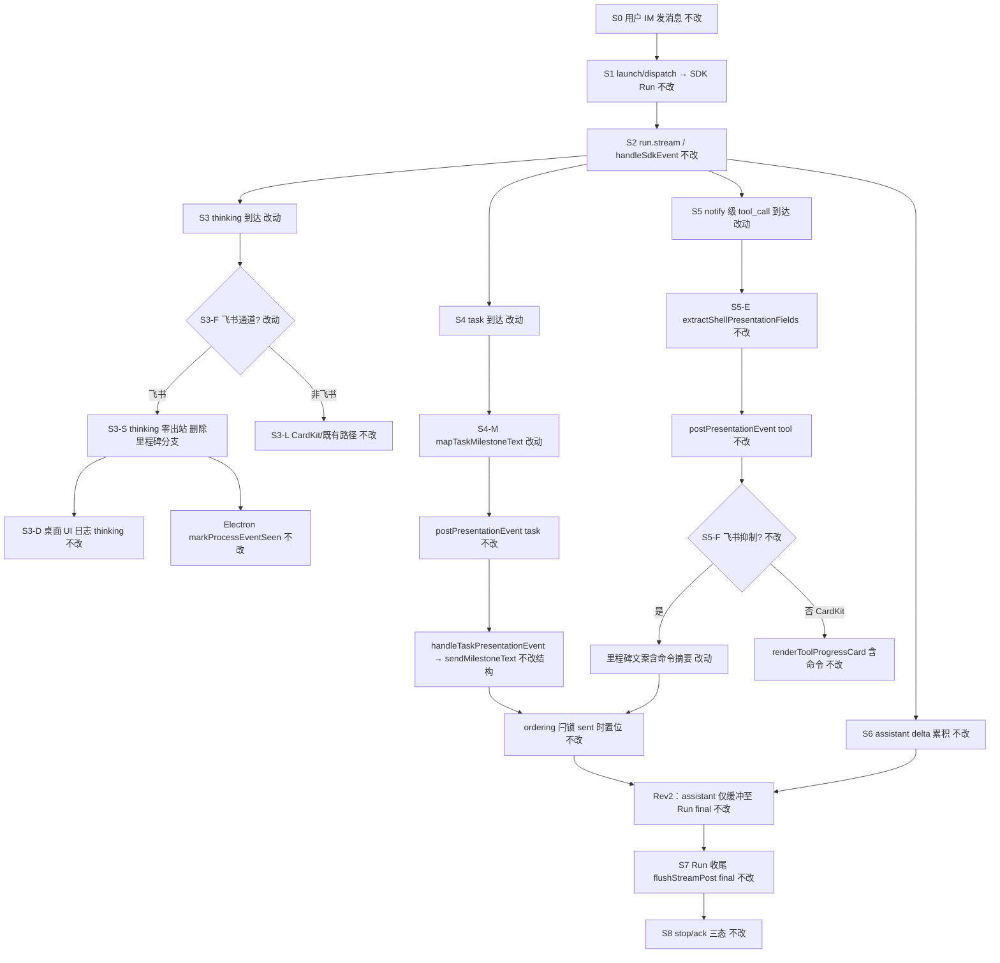

# SDK 开始态飞书通知携带描述 - 实现设计

> **业务 PRD**：见同目录 `01-proposal.md`（验收标准以 01 为准）
> **合并来源**：`20260704212612-SDK shell started 携带具体命令`（B）、`20260704212716-think不再发送飞书消息`（D）已 `merged_into` 本变更

## 一、业务流程与改动范围

> 业务口径以 `01-proposal.md` 功能需求 F1–F5 与验收 1–8 为准；下图覆盖 **Cursor SDK → 飞书里程碑降级路径** 主流程（含 B 多通道一致性、D 飞书 thinking 零出站）。与变更 A（`20260704190748-IM通知消息顺序与流式推送优化`，`archived_with_debt` v1.13.4）**正交**：本变更只改里程碑**文案**与飞书 thinking **是否出站**，不触碰 Rev2 end-only assistant、process-idle release 禁用、`flushStreamPost(true)` 收尾语义。

### （一）业务流程图



**图例**：`不改` 行为与现网一致；`改动` 需改代码/配置；`新增` 本变更无新增主路径节点；`删除` 移除飞书 thinking 里程碑出站。

### （二）流程步骤与改动对照

| 步骤 ID | 业务含义 | 改动 | 落点（模块/文件） | 01 验收关联 |
|---------|----------|------|-------------------|-------------|
| S0 | 用户飞书私聊/群聊 @ Agent 发消息 | 不改 | `src/daemon/daemon.ts` orchestrator | 验收 7 |
| S1 | Daemon dispatch → `startSdkRun` →「Agent 处理中…」 | 不改 | `electron/agent/cursor-sdk/sdk-run-lifecycle.ts` | F5.2 |
| S2 | `streamRunEvents` / `handleSdkEvent` 消费 SDK 事件流 | 不改结构 | `electron/agent/cursor-sdk/sdk-run-stream.ts` | — |
| S3 | thinking 到达 → Electron 仍 POST；飞书 daemon **零出站** | 改动（删除里程碑） | `src/daemon/daemon.ts` `handleThinkingPresentationEvent` | 验收 5；F5.1–F5.2；D F1 |
| S3-D | 桌面 SDK 运行日志 `[thinking]` 可观测 | 不改 | `sdk-run-stream.ts` `appendSdkLog` | D F2；验收 5 |
| S3-L | 非飞书 thinking CardKit/既有呈现 | 不改 | `daemon.ts` CardKit 分支 | F5.3 |
| S4 | task 开始 → 里程碑含可理解描述 | 改动 | `sdk-run-stream.ts` `mapTaskMilestoneText`；可选 Run 内 `taskSeq` | 验收 3；F2.1–F2.3 |
| S4-M | task 里程碑经 daemon 出站（截断/节流不变） | 不改结构 | `daemon.ts` `handleTaskPresentationEvent`；`daemon-presentation-milestone.ts` | F4.2；验收 6 |
| S5 | shell notify 级 tool started → 里程碑含命令摘要 | 改动 | `src/shared/tool-presentation.ts` **新增** `formatToolMilestoneText`；`daemon.ts` `handleToolPresentationEvent` | 验收 1–2；F1.1–F1.3；B F1/F5 |
| S5-E | Electron 侧 `extractShellPresentationFields` 透传 shell 字段 | 不改 | `sdk-run-stream.ts`；`tool-presentation.ts` | F1.3；B 多通道字段一致 |
| S5-C | 飞书 CardKit tool 路径（私聊等）已含命令 | 不改 | `daemon.ts` CardKit 分支；`bridge/lark-core` | F1.3；B F5.1 |
| S6 | assistant Rev2 end-only 缓冲与 defer | 不改 | `sdk-run-presentation.ts`；`daemon.ts` `handleStreamText` | 验收 8；与 A Rev2 正交 |
| S7 | Run 收尾 `flushStreamPost(true)` 唯一 assistant IM 出站 | 不改 | `sdk-run-stream.ts` | A F8.2–F8.3 |
| S8 | 分级：read/glob 等 silent 工具无 started 通知 | 不改 | `sdk-tool-presentation-tier.ts`；`sdk-run-stream.ts` `tool_call` | 验收 4；F3.1 |
| S9 | 长命令/长描述截断与脱敏 | 改动（复用截断常量） | `tool-presentation.ts` `truncateText`；`daemon-presentation-milestone.ts` 节流键不变 | 验收 6；F1.2；F2.2；F4.4 |

### （三）改动汇总

- **改动**：
  - 飞书 `handleToolPresentationEvent` 抑制分支：里程碑由 `` `${toolName}: ${status}` `` 改为含 **shell 命令摘要**（及 B 定义的无命令降级文案）。
  - `mapTaskMilestoneText`：started 态优先展示 SDK `text`；缺失时用 **Run 内递增序号** 等业务兜底，避免固定「子任务进行中…」。
  - 飞书 `handleThinkingPresentationEvent`：**移除** `sendMilestoneText` 全部分支，**显式 supersede** A·F8.1 中「飞书 thinking 须实时里程碑」条款（D F5.1）。
- **新增**：`src/shared/tool-presentation.ts` 导出 `formatToolMilestoneText`（及里程碑单行长度常量，如 `TOOL_MILESTONE_TEXT_MAX`）。
- **不改（显式列出，防 implement 误触）**：
  - `sdk-run-presentation.ts` 的 `shouldEndOnlyAssistantDefer`、`markProcessEventSeen`、`maybeReleaseDeferredAssistant`、Run 收尾 `flushStreamPost(true)`（A Rev2）。
  - `daemon.ts` 的 `enqueueReleaseDeferredAssistantStream` / `assistantReleaseChain` / `handleStreamText` 飞行窗口（A T-FIX-1~4）。
  - `daemon-presentation-milestone.ts` 的 `MILESTONE_THROTTLE_MS`、`MILESTONE_MAX_PER_RUN` 语义（仅消费更长文案，不改节流规则）。
  - `resolveSdkToolPresentationTier` 白名单与 silent 门控；非 Cursor SDK 引擎；微信等非飞书通道 thinking 策略（F5.3）。

## 二、整体思路

**根因**（回代码核实）：

1. **Shell started 信息不足**：飞书抑制路径 `handleToolPresentationEvent` 里程碑硬编码 `` `${toolName}: ${status}` ``（`daemon.ts` L1457–1464），在 `toolName=shell`、`status=started` 时即「shell: started」，**丢弃** Electron 已透传的 `tool_shell_command`（`extractShellPresentationFields` 在 `sdk-run-stream.ts` L130–136 已填充）。CardKit 路径同事件已展示命令，造成 B 所述「里程碑与卡片割裂」。
2. **Task started 兜底空洞**：`mapTaskMilestoneText` 在 `status=started` 且 `text` 空时返回固定「子任务进行中…」（`sdk-run-stream.ts` L58–59）；daemon `buildTaskFallbackText` 重复同类兜底（`daemon.ts` L1724–1729），用户无法区分步骤。
3. **飞书 thinking 仍出站**：抑制 CardKit 后 `handleThinkingPresentationEvent` 仍 `sendMilestoneText`「正在思考…」（`daemon.ts` L1582–1605），与 F5/D「零出站」冲突，且与 A·F8.1 实时 thinking 里程碑策略需由本变更 **supersede**（仅飞书）。

**方案要点**：

1. **文案 SSOT 下沉 shared**：在 `tool-presentation.ts` 新增 `formatToolMilestoneText`，与 `extractShellPresentationFields` / `truncateText` 同文件，供 daemon 里程碑与未来通道复用；shell started 单行形如 `执行命令：{截断命令}`，无命令时用 B F3 降级句，禁止无信息占位。
2. **Task 描述在 Electron 映射**：扩展 `mapTaskMilestoneText(status, text, seq?)`；`handleSdkEvent` `case "task"` 在 Run 级维护 `taskSeq`（仅 started 递增），started+无 text 时输出 `子任务 #{seq} 已开始` 等可读句；有 text 时 `正在执行：{截断描述}`。daemon 继续消费 `task_text`，删除与映射重复的 `buildTaskFallbackText` 逻辑或改为调用 shared 兜底（避免双 SSOT）。
3. **飞书 thinking 真静默**：`isFeishuProcessPresentationSuppressed(..., "thinking")` 分支直接 `return { ok: true }`，不调用 `sendMilestoneText`、不累积 `thinkingBuffer` 用于出站；ordering 闩由 Electron `markProcessEventSeen` 承担，与 A Rev2「里程碑 sent 才置 daemon 闩」既有不对称（R-D1 debt）兼容——thinking 静默后飞书侧无过程消息，但 defer 闩仍可能生效，**不修改** Rev2 release 时机。
4. **与 A/Rev2 边界**：本变更文件落点限定为 `tool-presentation.ts`、`sdk-run-stream.ts`（`mapTaskMilestoneText` + 可选 seq）、`daemon.ts`（`handleToolPresentationEvent` / `handleThinkingPresentationEvent` / 可选 `buildTaskFallbackText` 收敛）；**禁止**在同一任务中修改 `sdk-run-presentation.ts` release 链或 `handleStreamText` final 语义。

**最小方案三问**：

| 问题 | 结论 |
|------|------|
| 1. 能否复用已定位模块/符号，而非新建文件或抽象层？ | **能**。复用 `tool-presentation.ts` 增纯函数；daemon 仅替换里程碑入参字符串；task 映射留在 `sdk-run-stream.ts` 既有 `mapTaskMilestoneText`。 |
| 2. 新增抽象/依赖是否被 01 验收明确要求？ | **否额外抽象**。`formatToolMilestoneText` 为 F1/B 多通道一致的 inline 纯函数；`taskSeq` 为 F2.2/F2.3 要求的序号兜底，非通用层。不新增 npm 依赖。 |
| 3. 能否合并到已有文件？ | **能**。不新建 daemon 子模块；`daemon-presentation-milestone.ts` 仅被调用，逻辑不变。若 `tool-presentation.ts` 接近 300 行，将里程碑格式化拆至同目录小函数文件需 YAGNI 审批——当前 ~154 行，inline 可接受。 |

## 三、分层设计

| 层 | 职责 | 落点 |
|----|------|------|
| 共享呈现 SSOT | shell 字段解析、里程碑单行格式化、截断常量 | `src/shared/tool-presentation.ts`（改动） |
| SDK 事件消费 | task 文案映射、shell 字段提取、thinking 桌面日志 | `electron/agent/cursor-sdk/sdk-run-stream.ts`（改动 `mapTaskMilestoneText` / `case "task"`） |
| Electron 出站契约 | `postPresentationEvent` / `markProcessEventSeen` 不变 | `sdk-run-presentation.ts`（**不改**） |
| Daemon 飞书呈现 | tool/task 里程碑发送；thinking 飞书静默 | `src/daemon/daemon.ts`（改动两处 handler） |
| 里程碑基础设施 | 节流 3s、同文案 ≤4 次/Run | `daemon-presentation-milestone.ts`（**不改**） |
| 飞书门控 | `isFeishuProcessPresentationSuppressed` 判定不变 | `feishu-presentation-gate.ts`（**不改**） |

## 四、接口设计

**新增共享函数**（`src/shared/tool-presentation.ts`）：

```ts
/** 飞书里程碑单行展示上限（区别于 CardKit TOOL_CARD_SHELL_OUTPUT_MAX） */
export const TOOL_MILESTONE_TEXT_MAX = 120

/**
 * notify 级工具飞书里程碑文案（含 shell started 命令摘要）
 * @param status presentation-event tool_status：started | completed | failed
 */
export function formatToolMilestoneText(
  toolName: string,
  status: "started" | "completed" | "failed",
  shell?: Pick<ToolShellPresentationFields, "tool_shell_command" | "tool_shell_cwd">,
): string
```

**行为契约**：

- `toolName === "shell"` 且 `status === "started"`：有 `tool_shell_command` → `执行命令：{truncateText(command, TOOL_MILESTONE_TEXT_MAX)}`；无命令 → `命令执行已开始（具体命令暂不可展示）`（B F3.1）。
- 其他 notify 工具 / 非 started：保持 `` `${toolName}：${状态标签}` `` 或简短中文状态，不扩展至 read/glob（分级不变）。
- **无** `presentation-event` / HTTP 契约变更；`tool_shell_*` 字段已存在。

**`mapTaskMilestoneText` 签名扩展**（`sdk-run-stream.ts`，模块内或导出供测试）：

```ts
function mapTaskMilestoneText(
  status?: string,
  text?: string,
  taskSeq?: number,
): string
```

- `started` + 有 `text` → `正在执行：{截断 text}`。
- `started` + 无 `text` + `taskSeq` → `子任务 #${taskSeq} 已开始`。
- `started` + 无 `text` + 无 seq → `子任务已开始`（优于原「子任务进行中…」）。

## 五、数据结构

- **`PresentationEvent`**（`sdk-session-types.ts` / `daemon.ts`）：无字段扩展；继续沿用 `tool_shell_command`、`task_text`。
- **`SdkSessionAgent`**：可选新增 `taskSeq?: number`（Run 级，在 `resetSdkRunPresentationState` / `startSdkRun` 清零）；用于 F2.3 步骤区分。
- **持久化 / proto**：无变更。

## 六、实现步骤

1. **S5·共享格式化（步骤 S5）**：在 `tool-presentation.ts` 实现 `formatToolMilestoneText` + `TOOL_MILESTONE_TEXT_MAX`；单测口径：shell started 有/无命令、超长截断。
2. **S5·Daemon tool 里程碑（步骤 S5）**：`handleToolPresentationEvent` 飞书抑制分支将 `sendMilestoneText` 第三参改为 `formatToolMilestoneText(toolName, status, event)`；ordering `sent` 语义不变。
3. **S4·Task 映射（步骤 S4）**：`sdk-run-stream.ts` 扩展 `mapTaskMilestoneText`；`case "task"` 在 `status=started` 时递增 `session.taskSeq` 并传入映射；`postPresentationEvent` 仍传 `task_text: mappedText`。
4. **S4·Daemon task 兜底收敛（步骤 S4/S9）**：`buildTaskFallbackText` 与映射逻辑对齐或删除冗余（避免 started 再次覆盖为「子任务进行中…」）。
5. **S3·飞书 thinking 静默（步骤 S3）**：`handleThinkingPresentationEvent` 飞书抑制分支移除 `sendMilestoneText` 与 `thinkingBuffer` 出站用途，直接 `return { ok: true }`；**不**改 CardKit 非飞书路径；**不**改 Electron `case "thinking"` POST（桌面日志保留）。
6. **文档（archive 消费）**：同步 `electron/agent/cursor-sdk/AGENTS.md`、`src/daemon/AGENTS.md`、`knowledge/业务域/Agent调度/06-CursorSDK执行引擎.md` §八推送——注明飞书 thinking 零出站、started 里程碑文案规则；在知识库记录 **supersede A·F8.1（仅飞书 thinking）**。

**`/kb-plan` 任务分组建议（与 A Rev2 正交）**：

| 组 | 任务范围 | 禁止混入 |
|----|----------|----------|
| G1 里程碑文案 | T1–T2 tool；T3–T4 task | `sdk-run-presentation.ts` release |
| G2 飞书 thinking 静默 | T5 thinking handler | ordering final / assistant 流式 |
| G3 文档 | T6 AGENTS + 06 引擎 | 代码行为变更 |

预估 **4–6 条实现任务**（G1 可拆 2–3 条，G2 单条，G3 单条）。

## 七、参考实现

> CodeGraph 本次会话未加载索引；符号位置经源码精读与 inspector 核实。

| 符号 | 路径 | 本变更角色 |
|------|------|------------|
| `extractShellPresentationFields` | `src/shared/tool-presentation.ts` | shell 命令解析 SSOT；Electron 已调用 |
| `mapTaskMilestoneText` | `electron/agent/cursor-sdk/sdk-run-stream.ts` L55–68 | task 文案映射，需扩展 |
| `handleToolPresentationEvent` | `src/daemon/daemon.ts` L1428–1561 | 飞书里程碑 `` shell: started `` 根因 |
| `handleThinkingPresentationEvent` | `src/daemon/daemon.ts` L1563–1629 | 飞书 thinking `sendMilestoneText` 根因 |
| `handleTaskPresentationEvent` | `src/daemon/daemon.ts` L1732–1765 | 消费 `task_text`；结构不变 |
| `sendMilestoneText` | `src/daemon/daemon-presentation-milestone.ts` | 节流/去重；调用方换文案 |
| `mergeShellToolDetail` | `src/shared/tool-presentation.ts` | CardKit 路径对照（不改） |
| `markProcessEventSeen` | `electron/agent/cursor-sdk/sdk-run-presentation.ts` | thinking 仍置 defer 闩；**不改** |
| `shouldEndOnlyAssistantDefer` | 同上 | Rev2 门控；**不改** |

## 八、技术影响

### （一）影响范围

- **涉及模块**：`src/shared/tool-presentation.ts`、`electron/agent/cursor-sdk/sdk-run-stream.ts`、`src/daemon/daemon.ts`；文档 `AGENTS.md`、`06-CursorSDK执行引擎.md`。
- **接口/proto 变更**：无。
- **数据变更**：无；可选内存字段 `taskSeq` 仅 Run 生命周期。
- **风险**：
  - 里程碑文案变长可能更易触发 `MILESTONE_MAX_PER_RUN` 去重（可接受，F4.4）。
  - 飞书 thinking 静默后，纯思考短问答飞书侧无过程消息，依赖处理中态/assistant Run final（F5.2；与 A F5 短问答一致）。
  - **supersede A·F8.1** 后，验收「thinking 实时飞书」以本变更 F5 为准，不与 A 归档验收 1 中 thinking 里程碑项冲突——实现时勿恢复 thinking `sendMilestoneText`。

### （二）工程补充验收项

- [ ] `formatToolMilestoneText("shell","started",{tool_shell_command:"npm test"})` 含 `npm test`，且不含裸 `` shell: started ``。
- [ ] 飞书抑制路径 tool completed/failed 里程碑不回归为无命令（若 event 带 `tool_shell_command` 仍应可见）。
- [ ] 同一 Run 连续 2 个无 text 的 task started，飞书里程碑文案可区分序号（F2.3）。
- [ ] 飞书 thinking：含多段 delta 的 run，飞书会话消息数为 0（thinking 类）；`pushUiLog` `[thinking]` 仍有输出。
- [ ] `grep` 确认本变更 diff **未修改** `sdk-run-presentation.ts` 的 `shouldEndOnlyAssistantDefer` / `flushStreamPost` 调用链。
- [ ] 微信通道 thinking 行为与变更前一致（抽检 1 场景）。

## 九、知识库影响

- `knowledge/业务域/Agent调度/06-CursorSDK执行引擎.md` — §八推送：飞书 thinking 零出站；shell/task started 里程碑文案；supersede A·F8.1（飞书 thinking 部分）。
- `electron/agent/cursor-sdk/AGENTS.md` — `mapTaskMilestoneText` / task seq；明确不改 Rev2 段落。
- `src/daemon/AGENTS.md` — 飞书 Presentation 门控：`handleThinkingPresentationEvent` 飞书真静默；tool 里程碑用 `formatToolMilestoneText`。
- `knowledge/变更/归档/20260704190748-IM通知消息顺序与流式推送优化/07-prd-revisions.md`（或 01 脚注）— 可选记录 F8.1 被本变更 supersede 的交叉引用（archive 时由 kb-librarian 处理）。
- **两级索引**：若 `知识索引.md` 无「飞书里程碑文案」检索词，archive 时可不强制更新（变更记录写入 06 引擎即可）。

## 十、知识库更新计划

### （一）必须更新

- `knowledge/业务域/Agent调度/06-CursorSDK执行引擎.md` — §二 Presentation、§八推送：三处 started 文案 + 飞书 thinking 静默 + 与 A Rev2 边界一句。
- `electron/agent/cursor-sdk/AGENTS.md` — task 映射与 `taskSeq`；声明 ordering/Rev2 文件不在本变更范围。
- `src/daemon/AGENTS.md` — `handleToolPresentationEvent` / `handleThinkingPresentationEvent` 行为更新。

### （二）可能更新（视实现结果）

- `src/shared/AGENTS.md` — 若新增 `TOOL_MILESTONE_TEXT_MAX` / `formatToolMilestoneText` 条目。
- `knowledge/变更/归档/20260704190748-IM通知消息顺序与流式推送优化/01-proposal.md` 或 `07-prd-revisions.md` — supersede F8.1 交叉引用（由 kb-librarian 判断是否落盘）。

### （三）不需要更新

- `src/shared/sdk-tool-presentation-tier.ts` 与分级表（静默工具范围不变）。
- `src/shared/feishu-presentation-gate.ts`（门控条件不变，仅 handler 内行为变）。
- `daemon-presentation-milestone.ts` 模块说明（节流算法不变）。
- Flutter / 其他引擎知识文件（范围仅 Cursor SDK）。
