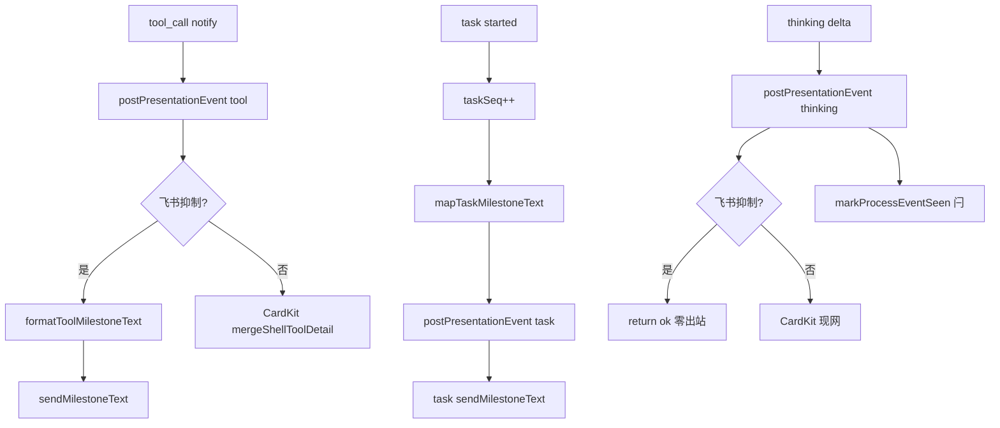

# SDK 开始态飞书通知携带描述 - 代码评审报告

## 1、审查范围

- **变更类型**：T1–T5 已实现（`stage`: `applied` → 评审 `reviewed`）
- **评审等级**：focused-review（飞书里程碑文案 + thinking 零出站；无 proto/DB/权限门槛）
- **涉及文件**（实现 + KB）：
  - `src/shared/tool-presentation.ts`（T1）
  - `src/daemon/daemon.ts`（T2/T3/T4）
  - `electron/agent/cursor-sdk/sdk-run-stream.ts`（T3）
  - `electron/agent/cursor-sdk/sdk-session-types.ts`、`sdk-session-registry.ts`（T3）
  - `electron/agent/cursor-sdk/AGENTS.md`、`src/daemon/AGENTS.md`、`src/shared/AGENTS.md`（T5）
  - `knowledge/业务域/Agent调度/06-CursorSDK执行引擎.md`（T5）
- **设计文档**：`02-design.md`、`03-tasks.md`（对照基准）
- **评审方式**：git diff + 源码精读 + `sdk-run-presentation.ts` 未改确认
- **范围外**：01 验收 1–10 E2E 勾选归 `/kb-test`；archive changelog 归 `/kb-archive`

## 2、严重（必须处理）

| ID | 分数 | 位置 | 描述 | 修复建议 |
|----|------|------|------|----------|
| **S1** | 80 | `src/daemon/daemon.ts` L38/L3527–3534；`src/shared/AGENTS.md` L14/L42–44 | 工作区混入变更 `20260704214025-未处理Promise拒绝日志可诊断化`（`formatUnknownError` import 与全局 handler、`format-unknown-error.ts` 索引），**不在**本变更 manifest.files | archive commit 前还原上述 hunk，**禁止**与 `format-unknown-error.ts` / `electron/main.ts` 等同批提交 |

**open 严重（≥75）**：1 项（S1，archive 闸门须剥离后关闭）。

## 3、警告（建议处理）

| ID | 分数 | 位置 | 描述 | 修复建议 |
|----|------|------|------|----------|
| **W1** | 52 | `sdk-run-stream.ts` `truncateMilestoneText` | 与 `tool-presentation.ts` `truncateText` 逻辑重复；02 建议复用 shared | 可选改为 import `truncateText` + `TOOL_MILESTONE_TEXT_MAX`，不阻断 |
| **W2** | 48 | `formatToolMilestoneText` | 无自动化单测；边界靠静态 + E2E | `/kb-test` 手工抽检；可选 shared 单测，不阻断 |

无其他评分 ≥75 的警告项。

## 4、设计偏差

| 设计预期 | 实际实现 | 评估 |
|----------|----------|------|
| T1 `formatToolMilestoneText` + `TOOL_MILESTONE_TEXT_MAX`（§四） | 191 行；shell started/completed/failed 契约完整 | ✅ 一致 |
| T2 飞书抑制 tool 里程碑换文案，ordering `sent` 闩不变 | `handleToolPresentationEvent` 调用 `formatToolMilestoneText`；CardKit 分支未改 | ✅ 一致 |
| T3 `mapTaskMilestoneText` + `taskSeq` + daemon 兜底对齐 | stream 递增 seq；`buildTaskFallbackText` →「子任务已开始」 | ✅ 一致 |
| T4 飞书 thinking 零 `sendMilestoneText` | 抑制分支 `return { ok: true }`；移除 buffer 出站 | ✅ 一致；supersede A·F8.1 |
| T5 三份必更文档 + 可选 shared AGENTS | 均已更新；`06` §八推送与 supersede 已写 | ✅ 一致 |
| **禁止**改 `sdk-run-presentation.ts` Rev2 链 | diff 无该文件 | ✅ 一致 |
| **禁止**改 `daemon-presentation-milestone.ts` 节流 | diff 无该文件 | ✅ 一致 |
| Electron thinking 仍 POST + 桌面 `[thinking]` | `case "thinking"` 无逻辑删减 | ✅ 一致 |
| 非飞书 CardKit thinking 路径不变 | `handleThinkingPresentationEvent` CardKit 分支保留 | ✅ 一致 |

无阻断性设计偏差（S1 为提交范围问题，非行为偏差）。

## 5、验收标准检查

### `03-tasks.md` 任务（代码层）

| 任务 | 关键验收 | 状态 |
|------|---------|------|
| T1 | shell started 含命令/降级句；≤300 行；纯函数 | ✅（191 行） |
| T2 | `formatToolMilestoneText` 接入飞书抑制；未改 CardKit/Rev2 | ✅ |
| T3 | taskSeq + 映射 + 兜底对齐；stream ≤300 行 | ✅（258 行） |
| T4 | 飞书 thinking 零出站；微信/CardKit 不变 | ✅ |
| T5 | 三份 KB/AGENTS 与代码一致 | ✅ |

### `01-proposal.md` / `02-design.md` §8.2（代码路径）

| 编号 | 代码评估 | E2E |
|------|---------|-----|
| 验收 1 shell started 含命令摘要 | ✅ `formatToolMilestoneText` | ⏳ `/kb-test` |
| 验收 2 里程碑与 CardKit 信息等价 | ✅ 同源 `tool_shell_command` | ⏳ |
| 验收 3 task started 含描述/序号 | ✅ `mapTaskMilestoneText` + `taskSeq` | ⏳ |
| 验收 4 silent 工具无 started | ✅ 门控仍在 Electron tier | ⏳ |
| 验收 5 飞书无 thinking 里程碑 | ✅ handler 真静默 | ⏳ |
| 验收 6 长文案截断 | ✅ `TOOL_MILESTONE_TEXT_MAX=120` | ⏳ |
| 验收 7 群聊触发者可见 | ✅ 同里程碑路径 | ⏳ |
| 验收 8 时序无倒置 | ✅ 未改 defer/release | ⏳ |
| 验收 9 completed/failed 不退化 | ✅ shell 完成态保留命令摘要 | ⏳ |
| 验收 10 桌面 `[thinking]` 保留 | ✅ stream 未改 | ⏳ |
| 8.2·5 未改 `sdk-run-presentation.ts` | ✅ grep 无 diff | ✅ |
| 8.2·6 微信 thinking 不变 | ✅ 非飞书分支保留 | ⏳ |

## 6、调用链与回归风险

| 回归点 | 风险 | 说明 |
|--------|------|------|
| notify shell defer / Rev2 end-only | 低 | 未改 `sdk-run-presentation.ts` |
| 飞书纯 thinking 短问答可见性 | 中→预期 | 无过程里程碑；依赖处理中态 + Run final（F5.2） |
| 里程碑文案变长触发节流/去重 | 低 | `MILESTONE_MAX_PER_RUN` 仍 ≤4；可接受 |
| task 双序号与 completed 态 | 低 | 仅 started 递增 `taskSeq` |
| 微信/非飞书 thinking CardKit | 低 | 分支未动 |
| ordering `sent` 闩（thinking 静默后） | 低 | Electron 仍 `markProcessEventSeen`；daemon 无 sent 不 mirror `thinkingOpen`（设计允许） |

## 7、遗留债务

- **S1** 工作区混入 `formatUnknownError` — archive commit 前须剥离（kb-release 职责）
- **W1** `truncateMilestoneText` 重复 — 可选收敛
- **W2** 无单测 — 不阻断
- **E2E** — `/kb-test` 待维护者手工（01 验收 1–10）

## 8、修复任务建议

| 问题 | 建议动作 | 优先级 |
|------|----------|--------|
| S1 变更混入 | archive 前还原 `daemon.ts` 全局 handler + `src/shared/AGENTS.md` format-unknown-error 条目；不提交 `format-unknown-error.ts` | **P0** |
| W1 截断重复 | 可选 import `truncateText` | 低 |
| E2E | `/kb-test` 手工场景（§06） | archive 后可残留 |

## 9、结论

**评审：通过（可进入 `/kb-test`）**

- T1–T5 实现与 `02-design` / `03-tasks` 核心契约对齐；shell/task 开始态文案、飞书 thinking 零出站均已落地；Rev2/ordering 边界未误触。
- **Ponytail**：符合最小方案——单文件纯函数 + handler 文案替换 + Run 级 `taskSeq`，无新模块/依赖。
- **archive 闸门**：须先关闭 **S1**（剥离 `20260704214025` 混入）再 `/kb-archive`；无其他 ≥75 分 open 问题。
- **不可直接 archive**：须 `/kb-test` + S1 剥离 + changelog 1.13.5（本变更三条摘要）。
