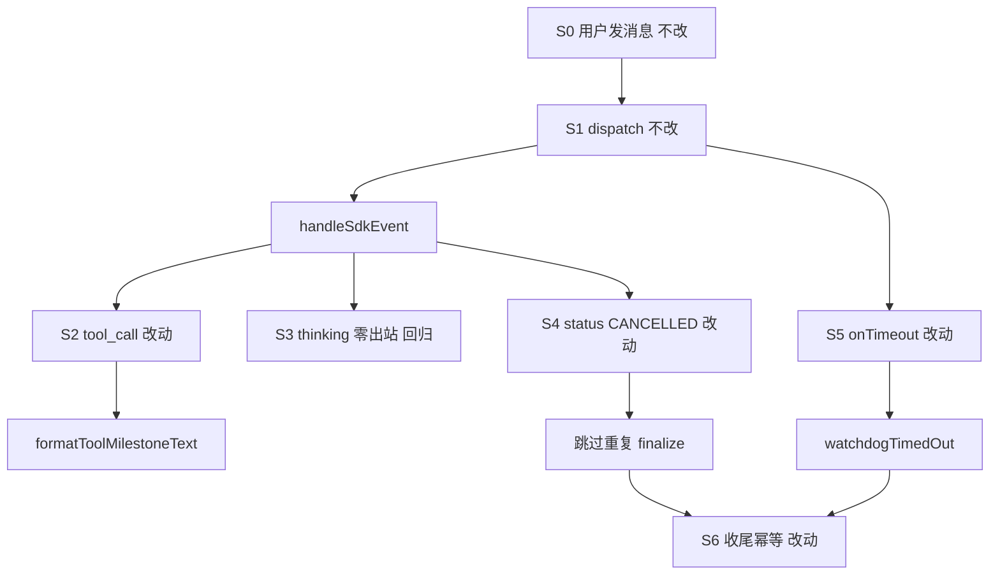

# SDK 飞书 Tool 开始态与 Watchdog 误杀修复 - 实现设计

> **业务 PRD**：见同目录 `01-proposal.md`

## 一、业务流程与改动范围

继承 `20260704212706`；补 Task 工具 tool_call 与 watchdog 竞态门控。

### （一）业务流程图

### （二）流程步骤与改动对照

| ID | 含义 | 改动 | 落点 | 验收 |
|----|------|------|------|------|
| S2 | tool_call | Task+shell | tool-presentation 等 | 1–4,8–9 |
| S3 | thinking | 零出站 | daemon | 5,10 |
| S4 | status | 闩门控 | stream/finalize | 6–7 |
| S5 | watchdog | timedOut闩 | watchdog/types | 6–7 |
| S6 | finalize | 幂等 | finalize-sdk-run | 6–7 |

### （三）改动汇总

改动：`watchdogTimedOut`、activity 门控、status 去重、Task 描述（6b7caf3 待验收）。不改：task 事件、Rev2、分级、节流。

## 二、整体思路

根因：① Task 工具与 task 事件双路径；6b7caf3 已贯通 tool_call。② `markSessionActivity` 对 CANCELLED 无条件 resume；`isRunTimeoutFailure`(≥7min) 与 onTimeout 双触发 finalize。

方案：对称 CC 置 `watchdogTimedOut`；cancelling/闩已置不 resume；status/stream 跳过重复超时。Stop 不置闩。三问：复用 CC 模式；无新依赖；改 registry/watchdog/stream/finalize。

## 三、分层设计

Electron：`handleSdkEvent`、`armRunWatchdog`、`isRunTimeoutFailure`。shared/daemon 回归验收。

## 四、接口设计

`tool_task_description?` 已落地；`markSessionActivity` 在 cancelling/闩已置不 resume。无 HTTP 变更。

## 五、数据结构

新增 `watchdogTimedOut?`（reset 清零）。已落地 task/shell 呈现字段与 `formatToolMilestoneText`。

## 六、实现步骤

1. **S2** 验收 `extractTaskPresentationFields`→daemon `tool_task_description`→`formatToolMilestoneText`（6b7caf3 完整则仅验证）。
2. **S2** shell 飞书抑制路径命令摘要回归，禁裸 `shell: started`。
3. **S3** grep/静态确认 thinking 飞书分支零 `sendMilestoneText`。
4. **S5** `sdk-session-types` 增 `watchdogTimedOut?`；`resetSdkRunPresentationState` 清零。
5. **S5** `armRunWatchdog.onTimeout` 在 `cancelRunAndWait` 前 `watchdogTimedOut=true`。
6. **S4/S5** `markSessionActivity`：`cancelling||watchdogTimedOut` 时不 `activity_resume`。
7. **S4/S6** status 分支：`watchdogTimedOut||runFinalizing` 跳过 `isRunTimeoutFailure`/finalize/notify。
8. **S6** `isRunTimeoutFailure` 或 caller：闩已置且 trigger=status 时 false。
9. 同步 cursor-sdk/shared/daemon `AGENTS.md`。

## 七、参考实现

CC `agent-cc-events.ts` L228。归档 A `20260704212706`。符号：`markSessionActivity`、`finalizeSdkRunOnTimeout`、`isRunTimeoutFailure`、`extractTaskPresentationFields`。

## 八、技术影响

### （一）影响范围

cursor-sdk/shared/daemon。仅禁 CANCELLED 复活与重复 archive；非竞态 hung run 不变。

### （二）工程补充验收项

- [ ] cancelling+CANCELLED 无 resume
- [ ] ≥7min 单次 sdk_timeout
- [ ] Task started 含 description
- [ ] build:mcp 通过

## 九、知识库影响

`06-CursorSDK执行引擎.md` §二/§八；cursor-sdk、shared、daemon 的 `AGENTS.md`。

## 十、知识库更新计划

### （一）必须更新

- `knowledge/业务域/Agent调度/06-CursorSDK执行引擎.md` §二/§八
- `electron/agent/cursor-sdk/AGENTS.md`
- `src/shared/AGENTS.md`
- `src/daemon/AGENTS.md`

### （二）可能更新

无。

### （三）不需要更新

`知识索引.md`；task 事件段落（除非回归）。
