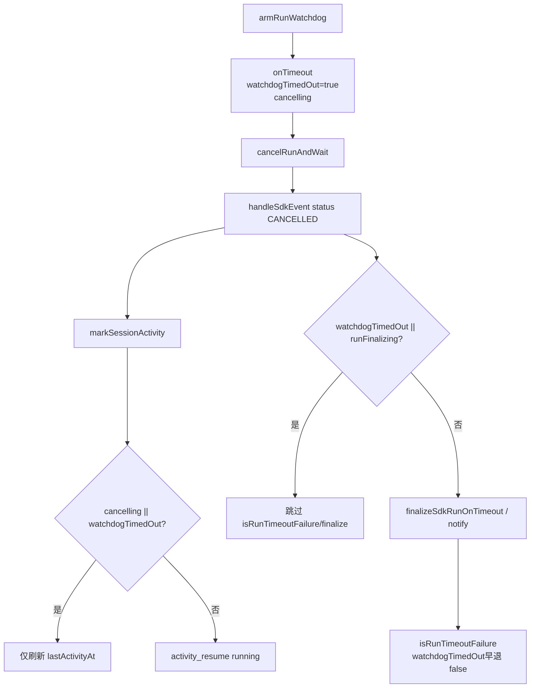

# SDK 飞书 Tool 开始态与 Watchdog 误杀修复 - 代码评审报告

## 1、审查范围

- **变更类型**：T1–T5 均已 `done`（`stage`: `applying` → 评审 `reviewed`）
- **评审等级**：focused-review（Cursor SDK Presentation 回归 + watchdog 竞态门控；无 proto/DB/权限门槛）
- **涉及文件**（10 个）：
  - `electron/agent/cursor-sdk/sdk-session-types.ts`（T2）
  - `electron/agent/cursor-sdk/sdk-session-registry.ts`（T2/T3）
  - `electron/agent/cursor-sdk/sdk-run-watchdog.ts`（T3）
  - `electron/agent/cursor-sdk/sdk-run-stream.ts`（T1 验收 / T4）
  - `electron/agent/cursor-sdk/sdk-run-lifecycle.ts`（T4）
  - `electron/agent/cursor-sdk/finalize-sdk-run.ts`（T4）
  - `electron/agent/cursor-sdk/AGENTS.md`（T5）
  - `src/shared/AGENTS.md`（T5）
  - `src/daemon/AGENTS.md`（T5）
  - T1 上下文（本 diff **无改动**，静态验收）：`src/shared/tool-presentation.ts`、`src/daemon/daemon.ts`
- **设计文档**：`02-design.md`、`03-tasks.md`（对照基准）
- **评审方式**：git diff + 源码精读；对照 CC 路径 `agent-cc-events.ts` L228 置闩时序
- **范围外**：01 验收 1–10 E2E 勾选归 `/kb-test`；`06-CursorSDK执行引擎.md` 归 `/kb-archive`（R4）

## 2、严重（必须处理）

无（评分 ≥90 的阻断项未发现）。

## 3、警告（建议处理）

无（评分 ≥75 的 open 问题未发现）。

## 4、设计偏差

| 设计预期 | 实际实现 | 评估 |
|----------|----------|------|
| T2 `watchdogTimedOut?` + `resetSdkRunPresentationState` 清零 | 字段与 reset 已落地；Stop 不置闩 | ✅ 一致 |
| T3 `onTimeout` 在 `cancelRunAndWait` **前**置闩；`markSessionActivity` cancelling/闩门控 | 已实现；对称 CC L228 | ✅ 一致 |
| T4 caller + `isRunTimeoutFailure` 副门控去重 | status/stream/complete 三路径 + finalizer 早退 | ✅ 一致 |
| T1 6b7caf3 tool_call 路径回归验收 | 本 diff 无 presentation/daemon 改动 | ✅ 符合「验收为主」；E2E 待 kb-test（R3） |
| T5 三份 `AGENTS.md`；**不写** `06-CursorSDK` | 三份已同步；业务域留 archive | ✅ 一致 |
| **禁止**改 `sdk-run-presentation.ts` Rev2 链 | diff 无该文件 | ✅ 一致 |

无阻断性设计偏差。

## 5、验收标准检查

### `03-tasks.md` 任务（代码层）

| 任务 | 关键验收 | 状态 |
|------|---------|------|
| T1 | tool_call/shell/thinking 路径与 6b7caf3 契约一致；本 diff 无代码 | ✅ 静态；⏳ E2E `/kb-test`（R3） |
| T2 | `watchdogTimedOut` 字段 + reset；≤300 行 | ✅ |
| T3 | `onTimeout` 置闩；`markSessionActivity` cancelling/闩不 resume | ✅ |
| T4 | status/stream/complete 门控 + `isRunTimeoutFailure` 副门控 | ✅ |
| T5 | 三份 `AGENTS.md` 与 T1–T4 行为一致 | ✅ |

### `01-proposal.md` 验收 1–10 / `02-design.md` §八·（二）

| 编号 | 代码评估 | E2E |
|------|---------|-----|
| 验收 1 Task 工具 started 含描述 | ✅ 6b7caf3 路径未回退 | ⏳ `/kb-test` |
| 验收 2 task 事件与 tool_call 并存 | ✅ 双路径独立 | ⏳ |
| 验收 3–4 shell 开始态无裸占位 | ✅ `formatToolMilestoneText` 未改 | ⏳ |
| 验收 5 飞书 thinking 零出站 | ✅ daemon 抑制分支未改 | ⏳ |
| 验收 6 看门狗取消后不因 CANCELLED 复活 | ✅ T3/T4 门控已落地 | ⏳ 竞态场景台架 |
| 验收 7 真实 hung run 仍 timeout | ✅ 无闩路径保留 finalize | ⏳ |
| 验收 8 分级 silent 工具无 started | ✅ tier 门控未动 | ⏳ |
| 验收 9 completed/failed 不退化 | ✅ presentation 未改 | ⏳ |
| 验收 10 桌面 `[thinking]` 日志 | ✅ stream thinking 未删 | ⏳ |
| 8.2· cancelling+CANCELLED 无 resume | ✅ `markSessionActivity` 门控 | ⏳ 日志台架 |
| 8.2· ≥7min 单次 sdk_timeout | ✅ 去重门控 | ⏳ |
| 8.2· Task started 含 description | ✅ 继承 6b7caf3 | ⏳ |
| 8.2· build:mcp 通过 | ⏳ `/kb-test` 编译门禁 | ⏳ |

## 6、调用链与回归风险

| 回归点 | 风险 | 说明 |
|--------|------|------|
| 非竞态 hung run 超时保护 | 低 | 仅 `watchdogTimedOut`/`runFinalizing` 时跳过 status 路径 finalize |
| draining 态 activity resume | 低 | 无闩时仍允许 resume（现网语义保留） |
| 用户主动 Stop | 低 | `stopSdkSession` 不置 `watchdogTimedOut` |
| Presentation / Rev2 / 分级 | 低 | 未改 `sdk-run-presentation.ts`、tier SSOT |
| T1 6b7caf3 路径静默回归 | 中→待证 | 本 diff 无 presentation 改动；须 kb-test E2E（R3） |

## 7、遗留债务

| ID | 分数 | 说明 |
|----|------|------|
| **R1** | 58 | `onTimeout` 在 `runFinalizing` 早退时不置 `watchdogTimedOut`；建议闩前移对齐 CC（可选一行加固，不阻断） |
| **R2** | 42 | caller 门控可额外判断 `watchdogState==='cancelling'`（可选，现网 `watchdogTimedOut` 已覆盖主路径） |
| **R3** | 48 | T1 本 diff 无代码；01 验收 1–5、8–10 须 `/kb-test` 手工补证 |
| **R4** | 25 | `knowledge/业务域/Agent调度/06-CursorSDK执行引擎.md` §二/§八 留 `/kb-archive` 更新（T5 已注明） |

**Ponytail**：**Lean already. Ship.** 对称 CC 闩 + 三处 caller 门控 + 副门控，无新依赖/抽象层；可选闩前移一行。

## 8、修复任务建议

| 问题 | 建议动作 | 优先级 |
|------|----------|--------|
| — | 无必须 **T-FIX**（无 ≥75 open 项） | — |
| R1 闩前移 | 可选 **T-FIX-01**：`onTimeout` 入口尽早 `watchdogTimedOut=true`（对齐 CC） | 低 |
| R2 cancelling caller | 可选在 status/stream/complete 门控加 `watchdogState==='cancelling'` | 低 |
| R3 E2E | `/kb-test` 维护 01 验收 1–10 + build:mcp | archive 前建议 |
| R4 知识库 | `/kb-archive` 更新 `06-CursorSDK执行引擎.md` | archive |

## 9、结论

**评审：通过**（可进入 `/kb-test` → `/kb-archive`）

- T2–T5 实现与 `02-design` / `03-tasks` 核心契约对齐；watchdog 竞态门控与收尾去重已落地；Rev2/分级边界未误触。
- T1 以 6b7caf3 静态验收通过，运行时证据待 `/kb-test`（R3）。
- 无评分 ≥75 的 open 严重/警告项；R1/R2 为可选加固债务，不阻断流转。
