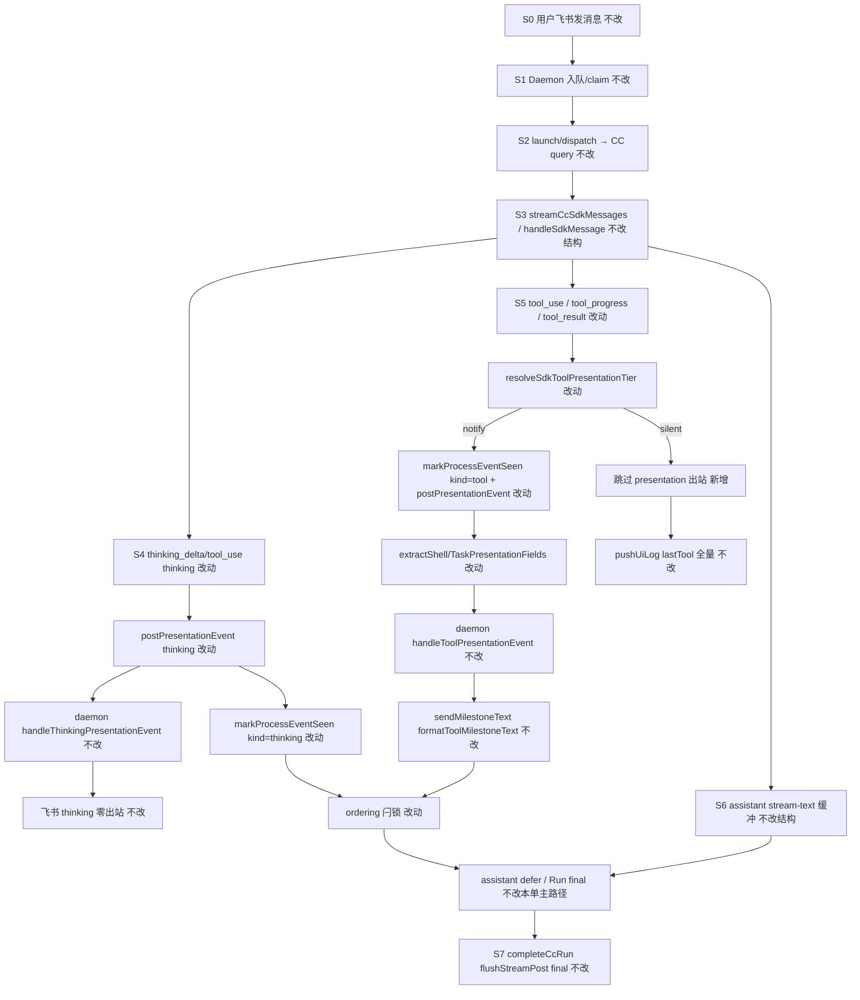

# Claude Code 飞书通知对齐 Cursor SDK - 实现设计

> **业务 PRD**：见同目录 `01-proposal.md`（验收标准以 01 为准）
> **对齐基准**：Cursor SDK 现行飞书过程通知契约（`electron/agent/cursor-sdk/AGENTS.md` §Presentation、`src/daemon/AGENTS.md` §飞书 Presentation 门控）
> **关联变更口径**：`20260704212716-think不再发送飞书消息` 已 **merged_into** `20260704212706` 并归档废弃；**thinking 飞书零出站**以现行 `daemon.ts` `handleThinkingPresentationEvent` L1593–1596 与 `src/daemon/AGENTS.md` 为准（Electron 仍 POST + `markProcessEventSeen` 置闩）

## 一、业务流程与改动范围

### （一）业务流程图



**图例**：`不改` 现网一致；`改动` 本变更改代码；`新增` 新分支；`删除` 移除 CC `postPresentationEvent` 飞书早退。

### （二）流程步骤与改动对照

| 步骤 ID | 业务含义 | 改动 | 落点文件 | 01 验收关联 |
|---------|----------|------|----------|-------------|
| S0 | 飞书私聊/群聊用户发消息 | 不改 | `src/daemon/daemon.ts` orchestrator | 验收 1、5 |
| S1 | 入队、claim、`POST /api/agent/launch\|dispatch` | 不改 | `daemon.ts`；`agent-cc-http.ts` | — |
| S2 | `query()` 启动 CC Run | 不改 | `agent-claude-sdk.ts` | — |
| S3 | `handleSdkMessage` 消费 SDKMessage 流 | 不改结构 | `agent-cc-events.ts` | — |
| S4 | thinking 到达 → 始终 POST（飞书 daemon 零出站） | 改动 | `agent-cc-events.ts`；`agent-cc-stream.ts` | 验收 3；F4.1–F4.3 |
| S4-L | `markProcessEventSeen(session, "thinking")` 置 ordering 闩 | 改动 | `agent-cc-stream.ts` | F4.2 |
| S5 | tool_use / tool_progress / tool_result | 改动 | `agent-cc-events.ts` | 验收 1–4；F1–F3 |
| S5-T | 工具名归一化 + `resolveSdkToolPresentationTier` 分级门控 | 改动 | `src/shared/sdk-tool-presentation-tier.ts` 或 `tool-presentation.ts` | 验收 1；F1.1–F1.2 |
| S5-N | tier=notify → 透传 shell/task 字段 + POST | 改动 | `agent-cc-events.ts`；`src/shared/tool-presentation.ts` | 验收 2；F2.1–F2.3 |
| S5-S | tier=silent → 跳过 `markProcessEventSeen` 与 POST | 新增 | `agent-cc-events.ts` | 验收 1；F1.2 |
| S5-D | 相邻 running 去重；Task 工具防双推 | 改动 | `electron/agent/shared/tool-presentation-dedup.ts`（自 `sdk-tool-event-dedup.ts` 抽取） | 验收 4；F3.1–F3.2 |
| S6 | assistant `stream-text` / PRESENTATION_ORDERING | 不改本单主路径 | `agent-cc-presentation.ts` | F4.2（见 §八 风险） |
| S7 | Run 收尾 `completeCcRun` | 不改 | `agent-cc-stream.ts` | — |
| S8 | Daemon 飞书里程碑 / thinking 零出站 | 不改 | `daemon.ts`；`daemon-presentation-milestone.ts` | 验收 3；F4.1 |
| S9 | Codex / OpenCode 飞书早退 | 不改（后续） | `agent-codex-stream.ts`；`agent-opencode-stream.ts` | 01 边界 |

### （三）改动汇总

| 类型 | 路径 |
|------|------|
| **改动** | `electron/agent/claude-code/agent-cc-stream.ts`（删飞书早退；`markProcessEventSeen(session, kind)`） |
| **改动** | `electron/agent/claude-code/agent-cc-events.ts`（分级门控、字段透传、去重、kind 传参） |
| **改动** | `electron/agent/claude-code/agent-cc-types.ts`（`taskSeq`、`lastToolCallRunningDedupKey`） |
| **新增/抽取** | `electron/agent/shared/tool-presentation-dedup.ts`（自 `sdk-tool-event-dedup.ts` 泛化） |
| **改动** | `electron/agent/cursor-sdk/sdk-run-stream.ts`（dedup import 路径） |
| **删除/薄 re-export** | `electron/agent/cursor-sdk/sdk-tool-event-dedup.ts`（≤10 行 re-export 或删除） |
| **改动** | `src/shared/sdk-tool-presentation-tier.ts` 与/或 `src/shared/tool-presentation.ts`（CC 工具名归一化、Bash/Edit 字段解析） |
| **改动** | `electron/agent/claude-code/AGENTS.md` |
| **archive** | `knowledge/业务域/消息桥接/02-飞书通道.md`；`package.json` patch + `changelog/` |
| **不改** | `src/daemon/daemon.ts` presentation handlers（thinking 零出站已落地）；Codex/OpenCode 引擎 |

## 二、整体思路

**根因**：CC 路径在 Electron 侧对飞书做了 **过早拦截**（`agent-cc-stream.ts` L81 `feishuSuppressesProcessKind` 早退），导致 thinking/tool **既不 POST 也不置 ordering 闩**，与 SDK「Electron 始终 POST、daemon 决定飞书是否里程碑出站」契约相悖；且 CC **未应用** `resolveSdkToolPresentationTier` 分级、**未透传** `tool_shell_command`/`tool_task_description`、**无** running 去重，造成飞书刷屏与开始态文案贫瘠。

**方案要点**：

1. **以 SDK 为 SSOT**：分级、字段提取、去重、POST 不早退、thinking 飞书零出站（daemon 侧）四条原则照搬。
2. **CC 工具名映射**：Claude Code `tool_use.name` 为 `Bash`/`Read`/`Write`/`Edit`/`Task` 等，须在 shared 层 **归一化为 SDK  canonical 名**（`shell`/`read`/`write`/`strreplace`/`task`）后再走 tier 与 `extract*PresentationFields`。
3. **去重共享**：将 `sdk-tool-event-dedup.ts` 抽到 `electron/agent/shared/`，用最小 session 切片接口供 SDK/CC 共用，单文件 ≤300 行。
4. **daemon 零改动**：飞书 thinking 零出站、tool 里程碑文案 SSOT 已在 SDK 变更链落地；本单只改 Electron CC 出站侧。

**01 追溯**：F1→S5-T/S5-S；F2→S5-N + shared `formatToolMilestoneText`；F3→S5-D；F4→S4/S4-L/S8；F5→§十 知识库。

## 三、分层设计

| 层 | 职责 | 本变更 |
|----|------|--------|
| **Electron CC 事件** | `handleSdkMessage` 映射 tool/thinking → presentation-event | 分级门控、args 透传、去重、kind 置闩 |
| **Electron CC 出站** | `postPresentationEvent` HTTP POST | **删除**飞书抑制早退 |
| **Electron 共享** | 跨引擎去重 | 新增 `tool-presentation-dedup.ts` |
| **src/shared** | tier、里程碑字段、文案 SSOT | 扩展 CC 工具名归一化与 Bash/Edit args 解析 |
| **Daemon** | 飞书抑制、里程碑、ordering mirror | **不改**（thinking 零出站已现行） |
| **Bridge/Lark** | CardKit / send-text | 不改 |

## 四、接口设计

### `POST /api/presentation-event`（不改契约，CC 载荷对齐）

| kind | CC 改动后关键字段 |
|------|-------------------|
| `thinking` | `delta` / `final`；飞书由 daemon 零出站 |
| `tool` | `tool_name`（canonical）、`tool_status`、`tool_shell_command?`、`tool_task_description?`、`final` |
| `task` | 无（CC 无独立 `task` SDKMessage；子任务走 `Task` tool_use，见 §八 待确认） |

### `markProcessEventSeen(session, kind)`

| 参数 | 说明 |
|------|------|
| `kind` | `"thinking" \| "tool" \| "task"`；CC 签名与 SDK 对齐；silent 工具**不调用** |

### `normalizePresentationToolName(rawName: string): string`（新增，shared）

将 CC/SDK 原始工具名归一化为 tier 与 `formatToolMilestoneText` 使用的 canonical 名。

**拟定映射（待实现前用真实 Run 日志校验）**：

| CC `tool_use.name` | canonical | tier |
|--------------------|-----------|------|
| `Bash`, `bash` | `shell` | notify |
| `Write`, `write` | `write` | notify |
| `Edit`, `edit`, `StrReplace` | `strreplace` | notify |
| `Delete`, `delete` | `delete` | notify |
| `Task`, `task` | `task` | notify |
| `Read`, `Glob`, `Grep`, `LS`, `SemanticSearch`, … | 原名小写 | silent（默认） |

### `resolveSdkToolPresentationTier(toolName: string)`

对 **归一化后** 名查白名单；逻辑不变，调用方先 `normalizePresentationToolName`。

## 五、数据结构

### `CcSessionAgent` 扩展（`agent-cc-types.ts`）

| 字段 | 类型 | 用途 |
|------|------|------|
| `taskSeq?` | `number` | 无描述 Task started 里程碑序号（对称 SDK） |
| `lastToolCallRunningDedupKey?` | `string` | 相邻同参 running 去重 |

### `ToolPresentationDedupSession`（shared 切片接口）

```ts
interface ToolPresentationDedupSession {
  lastToolCallRunningDedupKey?: string
  lastTool?: { name: string; status: string }
  taskSeq?: number
}
```

`CcSessionAgent` 与 `SdkSessionAgent` 均满足该接口。

## 六、实现步骤

| 序 | 步骤 | 回溯 | 要点 |
|----|------|------|------|
| 1 | shared：新增 `normalizePresentationToolName`；扩展 `extractShellPresentationFields` 接受 `bash`/`shell`；`extractTaskPresentationFields` 接受 `task`/`Task`；从 `tool_use.input` 解析 args | S5-T、S5-N | `parseShellToolArgs` 已支持 `command` 字段 |
| 2 | shared：扩展 `resolveSdkToolPresentationTier` 文档/测试覆盖 CC 别名（或 tier 内调 normalize） | S5-T | 保持 SDK 行为回归 |
| 3 | 抽取 `electron/agent/shared/tool-presentation-dedup.ts`，迁移 `mapTaskMilestoneText`/running 去重/`isRedundantTaskEventAfterToolCall`；SDK import 改路径 | S5-D | 单文件 ≤300 行 |
| 4 | `agent-cc-stream.ts`：删除 L81 飞书早退；`markProcessEventSeen(session, kind)` 对称 SDK | S4、S4-L | 与 `sdk-run-presentation.ts` L225–230 一致 |
| 5 | `agent-cc-events.ts`：`tool_use`/`tool_progress`/`tool_result` 应用分级、去重、字段透传；thinking 传 `kind`；notify 才 `markProcessEventSeen`+POST | S5 全分支 | `tool_use` 须读 `block.input` 作 args |
| 6 | `agent-cc-types.ts` + `resetCcRunPresentationState`：新字段清零 | 五 | — |
| 7 | 更新 `electron/agent/claude-code/AGENTS.md` Presentation 契约 | F5.2 | 对称 cursor-sdk AGENTS §Presentation |
| 8 | 手工验收：CC vs SDK 同任务飞书并排对比 | 01 验收 1–5 | archive 时 kb-librarian 更新知识库 |

## 七、参考实现

| 符号 | 路径 | 说明 |
|------|------|------|
| `postPresentationEvent`（无飞书早退） | `electron/agent/cursor-sdk/sdk-run-presentation.ts` L31–62 | CC 对齐目标 |
| `postPresentationEvent`（**有**飞书早退） | `electron/agent/claude-code/agent-cc-stream.ts` L76–81 | **待删** |
| `handleSdkEvent` `tool_call` 分级 | `electron/agent/cursor-sdk/sdk-run-stream.ts` L114–150 | CC 对称模板 |
| `handleSdkEvent` `thinking` | `sdk-run-stream.ts` L100–112 | thinking 始终 POST |
| `markProcessEventSeen(session, kind)` | `sdk-run-presentation.ts` L225–230 | CC 应对齐签名 |
| `resolveSdkToolPresentationTier` | `src/shared/sdk-tool-presentation-tier.ts` | tier SSOT |
| `extractShellPresentationFields` / `extractTaskPresentationFields` | `src/shared/tool-presentation.ts` L100–138 | 开始态字段 |
| `formatToolMilestoneText` | `src/shared/tool-presentation.ts` L192–235 | daemon 里程碑文案 |
| 去重 | `electron/agent/cursor-sdk/sdk-tool-event-dedup.ts` | 抽取至 shared |
| thinking 飞书零出站 | `src/daemon/daemon.ts` L1593–1596 | 现行真相 |
| CC 全量 POST（现状） | `electron/agent/claude-code/agent-cc-events.ts` L54–60、L172–176 | 无分级 |

## 八、技术影响

### （一）影响范围

- **用户可见**：飞书 CC 引擎过程通知与 SDK 对称——探查类静默、动手类可见、命令/子任务开始有摘要、去重、思考不刷屏。
- **桌面端**：UI 日志仍全量 `[tool]`/`[thinking]`，不受 silent 影响。
- **微信**：不经飞书 gate；CC POST 恢复后行为与改前一致或更完整。
- **引擎**：仅 Claude Code；Codex `agent-codex-stream.ts` L69、OpenCode `agent-opencode-stream.ts` L78 仍有飞书早退——**后续单独立项**。

### （二）工程补充验收项

| ID | 项 | 方法 |
|----|-----|------|
| E1 | CC `postPresentationEvent` 飞书会话仍发起 HTTP（Network/日志） | 飞书私聊 CC Run，确认 daemon 收到 thinking/tool 事件 |
| E2 | 飞书 thinking **零**里程碑文本 | 同 Run IM 无思考类 send-text |
| E3 | 多次 Read/Glob 无飞书 tool 里程碑 | 对比 SDK 同任务 |
| E4 | Bash/Write/Task started 含命令或描述摘要 | 并排 SDK/CC |
| E5 | 相邻相同 Bash running 不双推 | 日志 + IM 条数 |
| E6 | `normalizePresentationToolName("Bash")` → tier notify | `npx tsx -e` 冒烟 |

### 风险与依赖

| 风险 | 说明 | 缓解 |
|------|------|------|
| **R1 CC 工具名表不全** | `tool_use.name` 随 SDK 版本变化 | E6 冒烟 + 实现步骤 8 真机日志校准；未知名默认 silent |
| **R2 `tool_use.input` 字段形态** | CC block 类型当前未声明 `input` | 扩展 block 类型；无 input 时走 F2.3 降级文案 |
| **R3 无独立 `task` 事件** | CC 可能仅有 `Task` tool_use | F3.2 用 `isRedundantTaskEventAfterToolCall` 覆盖；无 task 事件则跳过 |
| **R4 ordering Rev2 不对称** | CC `agent-cc-presentation.ts` 仍 mid-run `maybeReleaseDeferredAssistant`；SDK 已 Rev2 end-only | **本单主验收聚焦飞书过程出站**；若验收 3 编排失败，另开 CC ordering 对齐子任务或依赖 `20260704190748` CC 覆盖项 |
| **R5 并行 SDK 变更** | shell started / think 零出站已合并入 `20260704212706` 并归档 | 以 **现行代码 + daemon AGENTS** 为准，不依赖 abandoned `20260704212716` 目录 |
| **R6 文件行数** | `agent-cc-events.ts` 接近 280 行 | 分级/去重逻辑可拆 `agent-cc-presentation-tool.ts`（≤300 行） |

## 九、知识库影响

| 文件 | 影响 |
|------|------|
| `knowledge/业务域/消息桥接/02-飞书通道.md` | 缺「多引擎统一契约」；archive 须补 |
| `electron/agent/claude-code/AGENTS.md` | 缺 Presentation 分级/POST/去重契约 |
| `electron/agent/cursor-sdk/AGENTS.md` | 只读基准，本单不改 |
| `src/shared/AGENTS.md` | 若新增 normalize 或扩展 tier 文档 |
| `src/daemon/AGENTS.md` | 只读基准（thinking 零出站） |

## 十、知识库更新计划

### （一）必须更新（archive / kb-librarian）

| 文件 | 内容 |
|------|------|
| `knowledge/业务域/消息桥接/02-飞书通道.md` | 新增「多引擎飞书过程通知统一契约」：SDK 为基准；分级表；Electron 不早退；thinking 飞书零出站 + ordering 闩；开始态字段；CC 本次对齐、Codex/OpenCode 后续 |
| `electron/agent/claude-code/AGENTS.md` | 补 §Presentation 出站对称 SDK：分级、字段、去重、禁止 `postPresentationEvent` 飞书早退 |
| `package.json` + `changelog/<新版本>.json` | 用户可见体验对齐 → **patch** bump |

### （二）可能更新（视实现结果）

| 文件 | 条件 |
|------|------|
| `src/shared/AGENTS.md` | 新增 `normalizePresentationToolName` 或 tier CC 别名时更新 presentation 段 |
| `knowledge/业务域/Agent调度/` CC 引擎文档 | 若存在独立 CC 执行引擎知识文件且与 AGENTS 重复，archive 时择一补交叉链接 |

### （三）不需要更新

| 文件 | 原因 |
|------|------|
| `src/daemon/AGENTS.md` | daemon 行为本单不改 |
| `electron/agent/codex/AGENTS.md`、`electron/agent/opencode/AGENTS.md` | 非本次范围 |
| `knowledge/变更/归档/20260704212716-*` | 已 merged_into 20260704212706，不回头改 |
