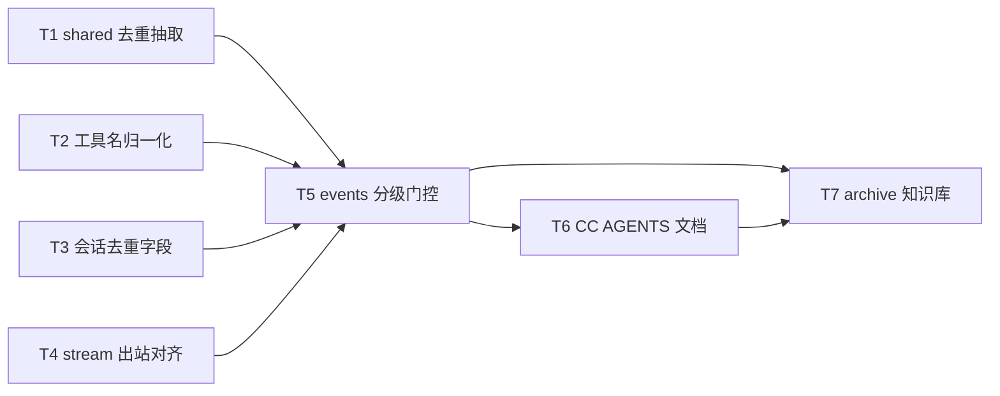

# Claude Code 飞书通知对齐 Cursor SDK - 任务分解

> **来源**：`/kb-plan`（基于 `01-proposal.md`、`02-design.md`）
> **范围**：仅 Claude Code 引擎 Electron 出站侧对齐 SDK 飞书过程通知契约；**不改** `src/daemon/daemon.ts` presentation handlers、Codex/OpenCode 引擎；archive 阶段由 T7 更新知识库与 changelog。

## 一、执行计划

### （一）依赖图



- **T1**：`electron/agent/shared/tool-presentation-dedup.ts`（自 `sdk-tool-event-dedup.ts` 泛化）+ SDK import 改路径
- **T2**：`normalizePresentationToolName` + `extract*` / tier 扩展（shared）
- **T3**：`CcSessionAgent` 去重字段 + `resetCcRunPresentationState` 清零
- **T4**：`agent-cc-stream.ts` 删飞书早退；`markProcessEventSeen(session, kind)` 对称 SDK
- **T5**：`agent-cc-events.ts` 分级门控、字段透传、去重、thinking/tool ordering（主逻辑）
- **T6**：`electron/agent/claude-code/AGENTS.md` §Presentation 契约（apply 后）
- **T7**：archive — `knowledge/业务域/消息桥接/02-飞书通道.md` + `package.json` patch + `changelog/`（**仅 `/kb-archive`**）

### （二）分组调度

| 轮次 | 任务 | 并行 | 说明 |
|------|------|------|------|
| **第一轮** | T1、T2、T3、T4 | ✅ 四任务可并行 | 无同文件冲突；T1 改 SDK dedup import，T2/T3/T4 各改独立文件 |
| **第二轮** | T5 | — | 依赖 T1–T4 全部完成；`agent-cc-events.ts` 接近 280 行，超限可拆 `agent-cc-presentation-tool.ts`（≤300 行） |
| **第三轮** | T6 | — | 文档与 T5 实现对齐 |
| **第四轮（archive）** | T7 | — | 依赖 T5 手工验收 + T6；kb-librarian 执行 |

**推荐串行顺序（单 agent）**：T1 → T2 → T3 → T4 → T5 → T6 →（验收通过后）T7

**同文件冲突清单**

| 文件 | 涉及任务（顺序） |
|------|------------------|
| `electron/agent/shared/tool-presentation-dedup.ts` | T1（新建） |
| `electron/agent/cursor-sdk/sdk-tool-event-dedup.ts` | T1（薄 re-export 或删除） |
| `electron/agent/cursor-sdk/sdk-run-stream.ts` | T1（import 路径） |
| `src/shared/tool-presentation.ts` | T2 |
| `src/shared/sdk-tool-presentation-tier.ts` | T2（可选：tier 内调 normalize） |
| `electron/agent/claude-code/agent-cc-types.ts` | T3 |
| `electron/agent/claude-code/agent-cc-utils.ts` | T3（`resetCcRunPresentationState`） |
| `electron/agent/claude-code/agent-cc-stream.ts` | T4 |
| `electron/agent/claude-code/agent-cc-events.ts` | T5（或 + `agent-cc-presentation-tool.ts`） |
| `electron/agent/claude-code/AGENTS.md` | T6 |
| `knowledge/业务域/消息桥接/02-飞书通道.md`、`package.json`、`changelog/` | T7 |

**CodeGraph 核对摘要**（`projectPath: /Users/kiki/github/cursor-claw`）：索引对 CC 符号命中偏弱；已用源码确认：`agent-cc-stream.ts` L76–81 存在 `feishuSuppressesProcessKind` 早退；L210 `markProcessEventSeen` 无 `kind` 参数；`agent-cc-events.ts` L51–60、L172–176 对全量 tool/thinking 无条件 POST；`sdk-tool-event-dedup.ts` 现存 77 行待抽取；`normalizePresentationToolName` **尚不存在**（T2 新建）。

## 二、任务清单

---

## T1: 抽取 shared 工具呈现去重模块

### 背景

SDK 已在 `sdk-tool-event-dedup.ts` 实现相邻 running 去重与 Task 双推抑制；CC 路径缺失同等能力（01 F3）。本任务将逻辑泛化到 `electron/agent/shared/`，供 SDK/CC 共用，满足单文件 ≤300 行与跨引擎 SSOT（02 S5-D）。

### 上下文文件

- 必读: `electron/agent/cursor-sdk/sdk-tool-event-dedup.ts` — `mapTaskMilestoneText`、`buildToolCallRunningDedupKey`、`isDuplicateToolCallRunning`、`clearToolCallRunningDedup`、`isRedundantTaskEventAfterToolCall`
- 必读: `electron/agent/cursor-sdk/sdk-run-stream.ts` L36、L121–149 — dedup import 与 `case "tool_call"` 消费方式
- 必读: `electron/agent/cursor-sdk/sdk-session-types.ts` — `lastToolCallRunningDedupKey`、`taskSeq` 字段（对称参考）
- 参考: `electron/agent/shared/AGENTS.md` — 跨引擎共享模块约定

### 实现范围

- **新建**: `electron/agent/shared/tool-presentation-dedup.ts`（≤300 行，中文注释）—
  - 导出 `ToolPresentationDedupSession` 切片接口（`lastToolCallRunningDedupKey?`、`lastTool?`、`taskSeq?`）
  - 自 `sdk-tool-event-dedup.ts` 迁移上述 5 个函数，session 参数改为 `ToolPresentationDedupSession`
- **改动**: `electron/agent/cursor-sdk/sdk-run-stream.ts` — import 改指向 `../shared/tool-presentation-dedup.js`
- **改动**: `electron/agent/cursor-sdk/sdk-tool-event-dedup.ts` — ≤10 行 re-export 至 shared，或删除并全量改 import（二选一，保持 SDK 编译通过）
- **不改**: dedup 算法语义；`src/shared/tool-presentation.ts` 截断常量仍由 dedup 引用

### 接口契约

```ts
export interface ToolPresentationDedupSession {
  lastToolCallRunningDedupKey?: string
  lastTool?: { name: string; status: string }
  taskSeq?: number
}

export function mapTaskMilestoneText(status?: string, text?: string, taskSeq?: number): string
export function buildToolCallRunningDedupKey(name: string, args?: unknown): string
export function isDuplicateToolCallRunning(session: ToolPresentationDedupSession, name: string, args?: unknown): boolean
export function clearToolCallRunningDedup(session: ToolPresentationDedupSession): void
export function isRedundantTaskEventAfterToolCall(session: ToolPresentationDedupSession, taskStatus?: string): boolean
```

### 验收标准

- [ ] SDK 路径编译通过；`sdk-run-stream.ts` 行为与迁移前一致（回归 notify/silent + dedup）
- [ ] shared 模块不 import `SdkSessionAgent`/`CcSessionAgent` 具体类型
- [ ] 文件 ≤300 行；含中文注释说明双推抑制与 running 去重用途
- [ ] 覆盖 01 F3.1–F3.2 的去重基础设施；工程 **E5** 由 T5 端到端验收

### 依赖

- 前置任务: 无
- 后续任务: T5

---

## T2: CC 工具名归一化与 shared 字段解析扩展

### 背景

CC `tool_use.name` 为 `Bash`/`Read`/`Task` 等 PascalCase，而 tier 白名单与 `formatToolMilestoneText` 使用 canonical 小写名（`shell`/`read`/`task`）。未归一化会导致分级错误与开始态字段提取失败（01 F1、F2；02 S5-T/S5-N）。

### 上下文文件

- 必读: `src/shared/sdk-tool-presentation-tier.ts` — `resolveSdkToolPresentationTier` 白名单
- 必读: `src/shared/tool-presentation.ts` L100–138 — `extractShellPresentationFields`（现仅 `toolName === "shell"`）、`extractTaskPresentationFields`（现仅 `task`）
- 必读: `src/shared/AGENTS.md` — presentation 段 shell/task 里程碑约定
- 参考: `electron/agent/cursor-sdk/sdk-run-stream.ts` L129–141 — SDK 消费 canonical 名的方式
- 参考: `02-design.md` §四 `normalizePresentationToolName` 映射表

### 实现范围

- **修改**: `src/shared/tool-presentation.ts`（≤300 行）—
  - 新增并导出 `normalizePresentationToolName(rawName: string): string`（映射表见 02 §四；未知名 `toLowerCase().trim()` 后原样或 silent 默认）
  - `extractShellPresentationFields`：对归一化后为 `shell` 的工具解析（接受 CC `Bash`/`bash` 经 normalize 后走 `parseShellToolArgs`）
  - `extractTaskPresentationFields`：对归一化后为 `task` 的工具解析 `description`
  - `postPresentationEvent` 载荷中 `tool_name` 使用 **canonical** 名
- **修改**（二选一，优先 tier 内调 normalize）: `src/shared/sdk-tool-presentation-tier.ts` — `resolveSdkToolPresentationTier` 入口先 `normalizePresentationToolName`，保持 SDK 回归
- **可选**: `src/shared/AGENTS.md` presentation 段补充 normalize（亦可留 T7）

### 接口契约

```ts
/** 将 CC/SDK 原始工具名归一化为 tier 与里程碑文案使用的 canonical 名 */
export function normalizePresentationToolName(rawName: string): string

// 既有函数签名不变；内部或调用方先 normalize toolName
export function resolveSdkToolPresentationTier(toolName: string): SdkToolPresentationTier
export function extractShellPresentationFields(toolName: string, ...): ToolShellPresentationFields | undefined
export function extractTaskPresentationFields(toolName: string, ...): ToolTaskPresentationFields | undefined
```

**拟定映射**（实现前可用真实 Run 日志校准）：`Bash`→`shell`；`Write`→`write`；`Edit`/`StrReplace`→`strreplace`；`Delete`→`delete`；`Task`→`task`；`Read`/`Glob`/`Grep` 等→小写原名（默认 silent）。

### 验收标准

- [ ] `normalizePresentationToolName("Bash")` → `"shell"`；`resolveSdkToolPresentationTier` 对归一化结果 → `notify`（工程 **E6**）
- [ ] `normalizePresentationToolName("Read")` → `"read"`；tier → `silent`
- [ ] `extractShellPresentationFields("shell", "running", { command: "ls" })` 返回 `tool_shell_command`
- [ ] `extractTaskPresentationFields("task", "running", { description: "修复测试" })` 返回 `tool_task_description`
- [ ] SDK `sdk-run-stream.ts` tier 行为无回归（`Shell`/`shell` 仍 notify）
- [ ] 覆盖 01 F1.1–F1.2、F2.1–F2.3 的 shared 层前提；F1.3 由 T5 保证 UI 日志全量

### 依赖

- 前置任务: 无
- 后续任务: T5

---

## T3: CcSessionAgent 去重状态字段与 Run 重置

### 背景

去重与 Task 序号依赖 session 级 `lastToolCallRunningDedupKey`、`taskSeq`；现 `CcSessionAgent` 无此字段（02 §五）。须在类型与 `resetCcRunPresentationState` 补齐，对称 `SdkSessionAgent`（`sdk-session-types.ts` L40、L78）。

### 上下文文件

- 必读: `electron/agent/claude-code/agent-cc-types.ts` — `CcSessionAgent` 全字段
- 必读: `electron/agent/claude-code/agent-cc-utils.ts` L117–141 — `resetCcRunPresentationState`
- 必读: `electron/agent/cursor-sdk/sdk-session-registry.ts` — SDK `resetSdkRunPresentationState` 对 `lastToolCallRunningDedupKey`/`taskSeq` 清零
- 参考: T1 `ToolPresentationDedupSession` 接口

### 实现范围

- **修改**: `agent-cc-types.ts` — `CcSessionAgent` 新增可选字段：
  - `taskSeq?: number` — 无描述 Task started 里程碑序号
  - `lastToolCallRunningDedupKey?: string` — 相邻同参 running 去重
- **修改**: `agent-cc-utils.ts` `resetCcRunPresentationState` — 清零上述两字段（与 `lastTool` 一并重置）
- **不改**: 持久化；仅 Run 内存生命周期

### 接口契约

`CcSessionAgent` 满足 `ToolPresentationDedupSession`；新 Run / dispatch 前 `resetCcRunPresentationState` 将 `taskSeq`、`lastToolCallRunningDedupKey` 置 `undefined`。

### 验收标准

- [ ] TypeScript 编译通过；`CcSessionAgent` 可传入 T1 dedup 函数
- [ ] 连续 dispatch 第二轮 Run 不继承上一轮 dedup 键或 taskSeq
- [ ] 为 01 F3、F2.3（无描述 Task 序号兜底）提供数据结构前提

### 依赖

- 前置任务: 无（与 T1 接口定义宜同轮对齐，无硬依赖）
- 后续任务: T5

---

## T4: agent-cc-stream 出站与 ordering 闩对齐

### 背景

根因之一：`postPresentationEvent` L81 对飞书 `feishuSuppressesProcessKind` 早退，导致 thinking/tool **既不 POST 也不置 ordering 闩**（02 根因、S4/S4-L）。`markProcessEventSeen` 缺 `kind` 参数且未对称 SDK `presentationOrderingEligible` 门控（`sdk-run-presentation.ts` L225–230）。

### 上下文文件

- 必读: `electron/agent/claude-code/agent-cc-stream.ts` L76–81（**待删早退**）、L210–214（`markProcessEventSeen`）
- 必读: `electron/agent/cursor-sdk/sdk-run-presentation.ts` L31–62（无飞书早退）、L225–230（`markProcessEventSeen(session, kind)`）
- 必读: `src/daemon/daemon.ts` L1593–1596 — thinking 飞书零出站（daemon 侧，本任务不改）
- 参考: `src/shared/feishu-presentation-gate.ts` — 门控仅 daemon 使用，Electron CC 不再调用

### 实现范围

- **删除**: `agent-cc-stream.ts` `postPresentationEvent` 内 L81 `feishuSuppressesProcessKind` 早退及对应 import（若全文件无其他引用）
- **修改**: `markProcessEventSeen(session, kind: "thinking" | "tool" | "task")` —
  - 与 SDK 一致：仅 `presentationOrderingEligible(session)` 时置 `seenProcessEvent`/`presentationDeferStream`
  - 始终 `clearStreamPostTimer`
- **修改**: 本文件内所有 `markProcessEventSeen(session)` 调用改为传入对应 `kind`（thinking 路径在 T5 统一亦可，本任务至少改签名与 `closeThinkingIfOpen` 相关调用）
- **不改**: `postPresentationEvent` HTTP 载荷结构；`completeCcRun` / stream-text 链

### 接口契约

```ts
export async function postPresentationEvent(
  session: CcSessionAgent,
  event: Omit<PresentationEvent, "session_key">,
  resolveChannelType: (sessionKey: string) => string | undefined,
): Promise<void>
// 行为：不因 channel/kind 早退；飞书抑制由 daemon 处理

export function markProcessEventSeen(
  session: CcSessionAgent,
  kind: "thinking" | "tool" | "task",
): void
```

### 验收标准

- [ ] 飞书私聊 CC Run：`postPresentationEvent` 仍发起 HTTP（工程 **E1**）；Network/日志可见 `presentation-event`
- [ ] 飞书 IM **无**思考类里程碑文本（daemon 零出站，工程 **E2**）；与 01 验收 3、F4.1 一致
- [ ] thinking POST 后 `seenProcessEvent`/`presentationDeferStream` 在 p2p+ordering 下正确置闩（01 F4.2）
- [ ] `postPresentationEvent` 内无 `isFeishuProcessPresentationSuppressed` / `feishuSuppressesProcessKind` 引用

### 依赖

- 前置任务: 无
- 后续任务: T5（events 层传 `kind` 并配合 silent 跳过）

---

## T5: agent-cc-events 分级门控、字段透传与去重

### 背景

现 `handleContentBlocks`/`handleStreamEvent`/`tool_progress` 对全量 tool/thinking 无条件 `markProcessEventSeen` + `postPresentationEvent`（L51–60、L87–89、L172–176），无 tier、无 args 透传、无 dedup。本任务对称 `sdk-run-stream.ts` L100–150 模板，是 01 验收 1–4 的主落点。

### 上下文文件

- 必读: `electron/agent/claude-code/agent-cc-events.ts` — 全文（~280 行）
- 必读: `electron/agent/cursor-sdk/sdk-run-stream.ts` L100–150 — 对称模板
- 必读: T1 `tool-presentation-dedup.ts`、T2 `normalizePresentationToolName` / `resolveSdkToolPresentationTier` / `extract*`
- 必读: T3 `CcSessionAgent` 新字段、T4 `markProcessEventSeen(session, kind)`
- 参考: `electron/agent/cursor-sdk/sdk-run-presentation.ts` — `mapToolPresentationStatus`
- 风险: `tool_use` block 类型须扩展 `input?` 字段（02 R2）

### 实现范围

- **修改**: `handleContentBlocks` / `handleStreamEvent` / `tool_progress` —
  1. **thinking**（`thinking` block、`thinking_delta`）：`markProcessEventSeen(session, "thinking")` + 始终 `postPresentationEvent`（与 SDK 一致；飞书零出站由 daemon）
  2. **tool_use**（`block.type === "tool_use"`）：
     - 公共副作用（tier 无关）：`flushCcLog`、`closeThinkingIfOpen`、`session.lastTool`、`pushUiLog` `[tool]`（若现有路径无则补）
     - `canonicalName = normalizePresentationToolName(block.name)`
     - `tier = resolveSdkToolPresentationTier(canonicalName)`
     - running 去重：`isDuplicateToolCallRunning(session, canonicalName, block.input)` 命中则跳过日志与 presentation
     - **仅 `tier === "notify"`**：`markProcessEventSeen(session, "tool")` + `postPresentationEvent`（`tool_name: canonicalName`，`tool_status: "started"`，`...extractShellPresentationFields(..., block.input)`，`...extractTaskPresentationFields(...)`）；Task started 无描述时递增 `session.taskSeq`
     - **`tier === "silent"`**：跳过 `markProcessEventSeen` 与 `postPresentationEvent`
  3. **tool_result**：非 running 时 `clearToolCallRunningDedup`；notify 路径 `postPresentationEvent` final + `maybeReleaseDeferredAssistant`；载荷含 extract 字段
  4. **tool_progress**：与 tool_use running 对称（tier + dedup）；避免与 tool_use 双推
- **扩展**: content block 类型声明 `input?: unknown`（读 `tool_use.input` 作 args）
- **若超 300 行**：将 tool 分级/去重拆至 `agent-cc-presentation-tool.ts`（新建，≤300 行）
- **不改**: `streamCcSdkMessages` 结构；daemon；assistant/stream-text 主路径

### 接口契约

- silent 工具：**不**调用 `markProcessEventSeen`、**不** `postPresentationEvent`
- notify 工具 POST 载荷 `tool_name` 为 canonical 名；可选 `tool_shell_command`、`tool_task_description`
- `markProcessEventSeen` 的 `kind` 与事件类型一致；silent 工具不置闩

### 验收标准

- [ ] **01 验收 1 / F1**：典型多步任务（多次 Read/Glob + Bash/Write）— 飞书无只读探查里程碑（**E3**）；动手类可见且与 SDK 同任务对称
- [ ] **01 验收 2 / F2**：Bash started 含命令摘要；Task started 含描述或序号降级（**E4**）
- [ ] **01 验收 3 / F4**：飞书零 thinking 里程碑；task/notify 工具与答复 ordering 无乱序（**E2**；R4 ordering Rev2 不对称不阻断本单，若失败另开子任务）
- [ ] **01 验收 4 / F3**：相邻相同 Bash running 不双推（**E5**）；Task 与 tool 不等价双推
- [ ] **F1.3**：桌面 UI `[tool]`/`[thinking]` 日志全量，silent 仍可见
- [ ] **F4.3**：notify 级 tool/task 不受 thinking 静默影响
- [ ] 单文件 ≤300 行；代码含必要中文注释

### 依赖

- 前置任务: T1、T2、T3、T4
- 后续任务: T6、T7

---

## T6: Claude Code AGENTS Presentation 契约文档

### 背景

01 F5.2 要求 Claude Code 引擎文档体现分级、开始态字段、禁止 Electron 飞书早退等产品约束，对称 `electron/agent/cursor-sdk/AGENTS.md` §Presentation。

### 上下文文件

- 必读: `electron/agent/claude-code/AGENTS.md` — 现有 Presentation 时序段
- 必读: `electron/agent/cursor-sdk/AGENTS.md` — §Presentation 出站（只读基准）
- 必读: T5 落地后的 `agent-cc-stream.ts`、`agent-cc-events.ts` 实际行为

### 实现范围

- **修改**: `electron/agent/claude-code/AGENTS.md` — 新增或扩展 §Presentation 出站小节：
  - Electron **不**在 `postPresentationEvent` 做飞书早退
  - thinking 始终 POST；飞书 thinking 零里程碑由 daemon
  - tool 分级：`resolveSdkToolPresentationTier` + `normalizePresentationToolName`
  - notify 载荷字段与 shared dedup 引用路径
  - silent 仅抑制 IM 出站，UI 日志全量
  - Codex/OpenCode 仍早退，标注后续范围
- **不改**: cursor-sdk AGENTS（只读基准）

### 接口契约

文档与代码行为一致；术语与 SDK AGENTS 对齐（notify/silent、canonical 名、ordering 闩）。

### 验收标准

- [ ] **01 F5.2**：文档含分级表引用、禁止早退、开始态字段说明
- [ ] 支持人员可据 AGENTS 逐项对照 CC 飞书行为（**01 验收 5** 文档侧）
- [ ] 无与实现矛盾的过时描述（如 feishuSuppressesProcessKind 早退）

### 依赖

- 前置任务: T5
- 后续任务: T7

---

## T7: archive 知识库与版本 changelog（仅 `/kb-archive`）

### 背景

01 F5.1 与 02 §十要求 archive 阶段补充「多引擎飞书过程通知统一契约」及用户可见 patch 版本说明；本任务 **不在 apply 阶段执行**，由 kb-librarian 在 `/kb-archive` 消费。

### 上下文文件

- 必读: `knowledge/业务域/消息桥接/02-飞书通道.md` — 补「多引擎统一契约」
- 必读: `01-proposal.md` F5、验收 5–6
- 必读: T6 `electron/agent/claude-code/AGENTS.md`
- 参考: `.cursor/rules/kb-archive-changelog.mdc` — patch bump 与 `changelog/<version>.json`
- 条件: `src/shared/AGENTS.md` — 若 T2 新增 normalize 且未在 apply 更新

### 实现范围

- **修改**: `knowledge/业务域/消息桥接/02-飞书通道.md` — SDK 为基准；分级；Electron 不早退；thinking 飞书零出站 + ordering 闩；CC 本次对齐；Codex/OpenCode 后续
- **修改**: `package.json` `version` — **patch** bump
- **新建**: `changelog/<新版本>.json` — 用户可感知变更摘要（中文要点）
- **可选**: `src/shared/AGENTS.md` normalize 段
- **前置**: T5 手工验收 01 验收 1–5 通过

### 接口契约

changelog 单文件格式见 kb-archive 规则；`manifest.files` 纳入新版本 changelog 与 `package.json`。

### 验收标准

- [ ] **01 F5.1**、**01 验收 6**：知识库可追溯多引擎契约与 CC 对齐落点
- [ ] `package.json` 与 `changelog/` 同步 bump
- [ ] Codex/OpenCode 仅出现在「后续范围」

### 依赖

- 前置任务: T5（手工验收）、T6
- 后续任务: 无（archive 闭环）
