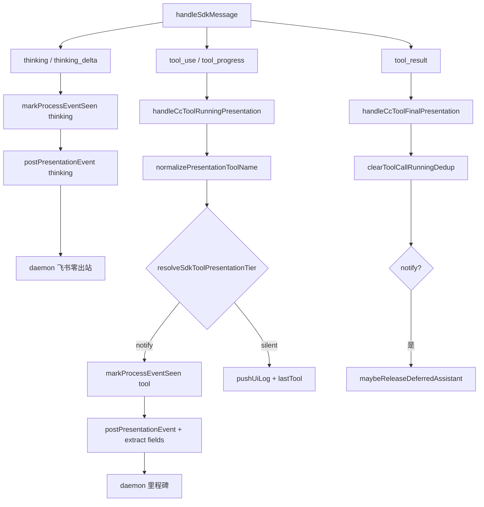

# Claude Code 飞书通知对齐 Cursor SDK - 代码评审报告

## 1、审查范围

- **变更类型**：T1–T6 已实现（`stage`: `applied` → 评审 `reviewed`）；T7 archive 不在本次评审闭环
- **评审等级**：full-review（对照 `01-proposal.md` 验收 1–5、`02-design.md`、`03-tasks.md` T1–T6；实现 diff + 源码精读 + E6 冒烟）
- **涉及文件**（实现 11 个 + KB 设计/任务）：
  - `electron/agent/shared/tool-presentation-dedup.ts`（新建）
  - `electron/agent/cursor-sdk/sdk-tool-event-dedup.ts`、`sdk-run-stream.ts`
  - `src/shared/tool-presentation.ts`、`sdk-tool-presentation-tier.ts`
  - `electron/agent/claude-code/agent-cc-stream.ts`、`agent-cc-events.ts`、`agent-cc-presentation-tool.ts`（新建）、`agent-cc-types.ts`、`agent-cc-utils.ts`
  - `electron/agent/claude-code/AGENTS.md`、`electron/agent/shared/AGENTS.md`
- **设计文档**：`01-proposal.md`、`02-design.md`、`03-tasks.md`
- **评审方式**：git diff + 源码精读 + `npx tsx` E6 冒烟 + `tsc -p electron/tsconfig.json --noEmit`
- **范围外**：01 验收 1–5 飞书 E2E（E1–E5）归手工/`/kb-test`；T7 知识库/changelog 归 `/kb-archive`

## 2、严重（必须处理）

无评分 ≥75 的未关闭严重项。

## 3、警告（建议处理）

| ID | 分数 | 位置 | 描述 | 修复建议 |
|----|------|------|------|----------|
| **W1** | 62 | `agent-cc-events.ts` L174–175 → `agent-cc-presentation-tool.ts` | `tool_progress` 调用 `handleCcToolRunningPresentation(..., undefined)`，去重键与先前 `tool_use`（含 `input`）不一致，极端情况下 notify 工具可能二次 running 日志/POST | archive 前真机观察；若复现则在 `tool_progress` 分支复用 session 缓存 args 或跳过已 running 的 notify 工具 |
| **W2** | 55 | 全变更 | E1–E5 飞书/CC vs SDK 并排验收无仓库内留证 | `/kb-test` 或 archive 前手工勾选 01 验收 1–5 |
| **W3** | 50 | `src/shared/AGENTS.md` | T2 新增 `normalizePresentationToolName` 未同步 shared AGENTS presentation 段（T7 可选） | T7 archive 时补索引 |
| **W4** | 45 | shared 层 | `normalize` / tier 无自动化单测（E6 仅评审时冒烟通过） | 可选补 `tool-presentation` 单测，不阻断 |
| **W5** | 40 | `agent-cc-events.ts` L137–138 | CC 仍在每轮 `assistant` 调 `maybeReleaseDeferredAssistant`（02 R4 ordering Rev2 不对称，设计已标注非本单阻断） | 若验收 3 编排失败另开 ordering 子任务 |

无评分 ≥75 的警告项。

## 4、设计偏差

| 设计预期 | 实际实现 | 评估 |
|----------|----------|------|
| S4：删 `postPresentationEvent` 飞书早退 | `agent-cc-stream.ts` 移除 `feishuSuppressesProcessKind` import 与早退；CC 目录无残留引用 | ✅ 一致 |
| S4-L：`markProcessEventSeen(session, kind)` | 签名对齐 SDK；thinking 传 `"thinking"`，notify tool 传 `"tool"` | ✅ 一致 |
| S5-T/S5-S：分级门控对称 SDK | `agent-cc-presentation-tool.ts`：`resolveSdkToolPresentationTier` + silent 跳过 mark+POST | ✅ 一致 |
| S5-N：shell/task 字段透传 | `extractShellPresentationFields` / `extractTaskPresentationFields` + `normalizePresentationToolName`；Task 无描述 `taskSeq` 降级 `#N` | ✅ 一致（与 SDK task 事件序号策略等价） |
| S5-D：去重抽取 shared | `tool-presentation-dedup.ts` 82 行；SDK import 改路径；`sdk-tool-event-dedup.ts` 薄 re-export | ✅ 一致 |
| S5-S：silent 仍 UI 全量 | `pushUiLog`/`lastTool` 在 tier 判断前执行 | ✅ 一致 |
| F3.2 Task 双推抑制 | CC 无独立 `task` SDKMessage，未接 `isRedundantTaskEventAfterToolCall` | ✅ 符合 02 R3 |
| T6：CC AGENTS Presentation 契约 | L12 补充分级、禁止早退、dedup 路径、Codex/OpenCode 后续 | ✅ 一致 |
| daemon 不改 | 无 `daemon.ts` diff | ✅ 一致 |
| SDK 无行为回归 | `sdk-run-stream.ts` 仅 dedup import 路径；tier 入口改调 normalize（幂等兼容小写 canonical 名） | ✅ 一致 |

无阻断性设计偏差。

## 5、验收标准检查

### `03-tasks.md` T1–T6（代码层）

| 任务 | 关键验收 | 状态 |
|------|---------|------|
| T1 | shared dedup + SDK re-export + ≤300 行 | ✅（82 行，中文注释） |
| T2 | `normalize("Bash")→shell→notify`；`extract*` 字段；tier 内 normalize | ✅（E6 冒烟通过） |
| T3 | `taskSeq`/`lastToolCallRunningDedupKey` + `resetCcRunPresentationState` 清零 | ✅ |
| T4 | 无飞书早退；`markProcessEventSeen(session, kind)` | ✅ |
| T5 | 分级/透传/去重；拆 `agent-cc-presentation-tool.ts` | ✅（events 274 行 + tool 114 行） |
| T6 | CC AGENTS §Presentation 与实现一致 | ✅ |

### `01-proposal.md` 验收（代码路径 / E2E）

| 编号 | 代码评估 | E2E |
|------|---------|-----|
| 验收 1 分级一致 | ✅ silent 不 mark+POST；notify 出站；`Read`→silent | ⏳ E3 |
| 验收 2 开始态文案 | ✅ `tool_shell_command`/`tool_task_description` 透传 + Task `#N` 降级 | ⏳ E4 |
| 验收 3 thinking 零出站 + 编排 | ✅ thinking 始终 POST（daemon 抑制）；ordering 闩恢复 | ⏳ E2 + 编排 |
| 验收 4 去重 | ✅ `isDuplicateToolCallRunning`；相邻同参跳过 | ⏳ E5 |
| 验收 5 多引擎预期 | ✅ 契约落 CC AGENTS + shared tier/normalize | ⏳ 并排 |
| 验收 6 知识库 | — | ⏳ T7 archive |

### 工程补充项 E1–E6

| ID | 代码评估 | E2E |
|----|---------|-----|
| E1 CC 仍 HTTP POST | ✅ 早退已删 | ⏳ |
| E2 thinking 零里程碑 | ✅ daemon 侧不变 | ⏳ |
| E3 Read/Glob 无 tool 里程碑 | ✅ silent 路径 | ⏳ |
| E4 Bash/Task started 摘要 | ✅ extract + formatToolMilestoneText SSOT | ⏳ |
| E5 相邻 Bash 不双推 | ✅ dedup（W1 边界见警告） | ⏳ |
| E6 normalize 冒烟 | ✅ `Bash→shell notify`、`Read→read silent` | ✅ 评审执行 |

## 6、调用链与回归风险

| 回归点 | 风险 | 说明 |
|--------|------|------|
| SDK dedup import 路径 | 无 | 薄 re-export 保持旧符号可寻址 |
| SDK tier + normalize | 低 | 小写 canonical 名行为不变；PascalCase 别名反而更稳 |
| CC 飞书过程条数 | 低→改善 | 早退删除 + silent 门控，探查类不再误拦 ordering 闩 |
| CC ordering mid-run release | 中（已知） | 02 R4；非本单引入，验收 3 需 E2E 确认 |
| tool_progress 双推 | 低–中 | W1；notify 工具需真机确认 |
| Codex/OpenCode | 无 | 未改，仍早退 |
| 微信通道 | 低 | CC POST 更完整，不经飞书 gate |

## 7、遗留债务

- **W1** `tool_progress` 去重键与 `tool_use` args 不一致 — 建议 E5 真机顺带验证
- **W2** E1–E5 无自动化/E2E 留证 — `/kb-test` 或 archive 前手工
- **T7** `02-飞书通道.md`、changelog、patch bump — archive 必做
- **W3** `src/shared/AGENTS.md` normalize 索引 — T7 可选
- **W4** 无单测 — 可选，不阻断

## 8、修复任务建议

| 问题 | 建议动作 | 优先级 |
|------|----------|--------|
| W1 tool_progress dedup | 真机复现后补 args 传递或二次 running 跳过 | 中（若 E5 失败则 T-FIX） |
| W2 E2E | `/kb-test`：CC vs SDK 同任务飞书私聊并排 | 高（archive 前） |
| T7 知识库/changelog | `/kb-archive` 执行 T7 | 高 |
| W3 shared AGENTS | archive 顺带补 normalize 段 | 低 |
| W4 单测 | 可选 `normalizePresentationToolName` 单测 | 低 |

无 T-FIX 阻断项；W1 待 E5 真机结论。

## 9、结论

**评审：有条件通过（可进入 `/kb-test`，不可直接 `/kb-archive`）**

- T1–T6 实现与 `02-design` / `03-tasks` 核心契约对齐：飞书早退已删、分级门控对称 SDK、字段透传、shared 去重复用、`markProcessEventSeen(session, kind)` 落地，单文件均 ≤300 行且含中文注释。
- SDK 路径仅 dedup import 与 tier 归一化入口变更，**无逻辑回归**（`tsc` 通过）。
- **无 ≥75 分 open 问题**；archive 须：E1–E5 手工验收 + T7 知识库/changelog。
- **Ponytail**：合理拆分 `agent-cc-presentation-tool.ts`，shared dedup 最小接口，无 daemon 二次门控，符合设计。

**工作流**：`stage` → `reviewed`；建议 `/kb-test` 优先「CC 多 Read + Bash/Write/Task」飞书私聊与 SDK 并排、PRESENTATION_ORDERING 下 thinking 零里程碑与 assistant 顺序。
