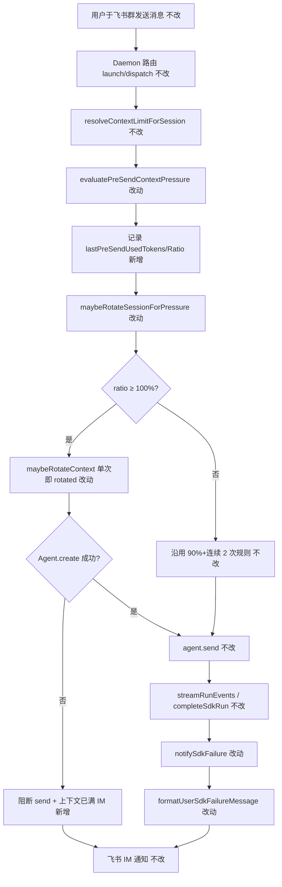
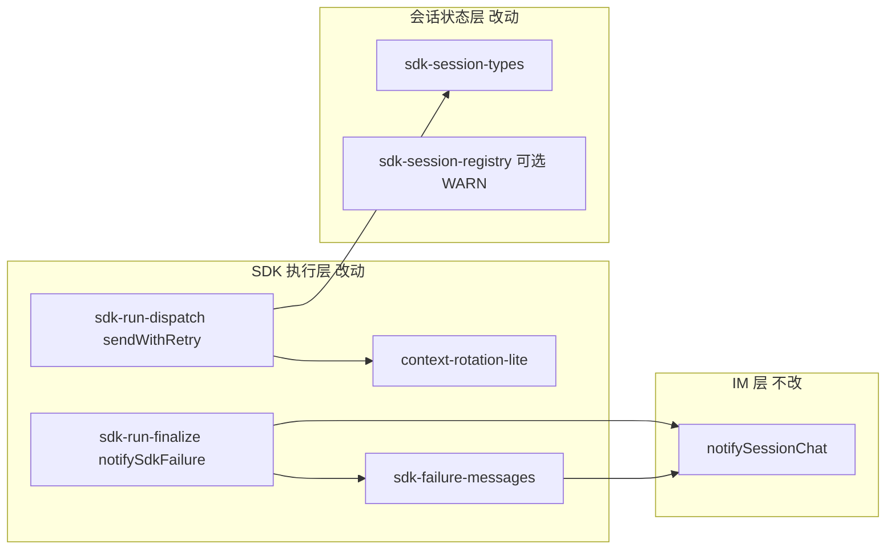

# SDK 预发送上下文保护与失败文案修复 - 实现设计

> **业务 PRD**：见同目录 `01-proposal.md`（验收标准以 01 为准）

## 1、业务流程与改动范围

> 业务口径以 `01-proposal.md` 场景 A～D、F1～F4 为准；下图覆盖发送前检测到 Run 失败通知的主链路。

### 1.1 业务流程图



**图例**：`不改` 行为与现网一致；`改动` 需改代码；`新增` 新分支或新字段。

### 1.2 流程步骤与改动对照

| 步骤 ID | 业务含义 | 改动 | 落点（模块/文件） | 01 验收关联 |
|---------|----------|------|-------------------|-------------|
| S1 | 用户发消息，Daemon 路由至 SDK | 不改 | `electron/agent/cursor-sdk/agent-sdk.ts` | 验收 4（多群独立） |
| S2 | send 前解析模型上下文上限 | 不改 | `electron/agent/cursor-sdk/context-usage.ts` `resolveContextLimitForSession` | — |
| S3 | send 前评估占用比例并写 `[compression] pre-send usage` | 改动 | `context-usage.ts` `evaluatePreSendContextPressure`；`context-usage-pressure.ts` | 验收 1、2 |
| S4 | **新增** 将 pre-send 用量/ratio 写入 session 快照 | 新增 | `sdk-session-types.ts`；`sdk-run-dispatch.ts` | 验收 1、3 |
| S5 | 高压时触发上下文轮转 | 改动 | `context-rotation-lite.ts` `maybeRotateContext`；`sdk-run-dispatch.ts` `maybeRotateSessionForPressure` | 验收 2、3 |
| S6 | **新增** ratio≥100% 且轮转失败时阻断 send、即时 IM | 新增 | `sdk-run-dispatch.ts` `sendWithRetry`；`sdk-run-finalize.ts` 或 `agent-sdk.ts` 收尾 notify | 验收 2 |
| S7 | `agent.send` 与 Run 流式处理 | 不改 | `sdk-run-dispatch.ts`、`sdk-run-stream.ts` | — |
| S8 | Run 失败时组装归因并 notify | 改动 | `sdk-run-finalize.ts` `notifySdkFailure` | 验收 1、3 |
| S9 | 用户可见文案映射（含 pre-send 兜底） | 改动 | `sdk-failure-messages.ts` `formatUserSdkFailureMessage` | 验收 1、3 |
| S10 | **可选** 多 session 共用 workspaceDir WARN | 新增 | `sdk-session-registry.ts` 或 `agent-sdk.ts` launch/dispatch 入口 | 验收 5 |
| S11 | 通道默认 othersWorkspaceMode / 飞书 UI | 不改 | 通道配置、`sdk-run-presentation.ts` | 验收 6 |

### 1.3 改动汇总

- **改动**：pre-send 压力快照；ratio≥100% 强制首轮轮转；失败归因读 pre-send；文案分类器扩展。
- **新增**：send 阻断 + 即时「上下文已满」通知分支；可选 workspaceDir 共用 WARN。
- **不改（显式列出）**：`othersWorkspaceMode` 默认隔离策略；`agent-sdk.ts` 大体编排（仅必要时增加 send 阻断后的 notify 调用，≤10 行）；`sdk-run-stream.ts` / `completeSdkRun` 主链；不新增单元测试。

## 2、整体思路

### 根因（可追溯 01 §一）

1. **文案误报**：`notifySdkFailure` 用 `resolveDisplayContextTokens(contextUsage, contextUsagePeakTokens)` 组装 `formatUserSdkFailureMessage`。`maybeRotateSessionForPressure` 轮转成功后会 `contextUsage = ZERO`、`contextUsagePeakTokens = undefined`（`sdk-run-dispatch.ts` L106-107），Run 再失败时 peak 为零，`isContextExhaustedByUsage` 不成立，落入通用兜底「建议精简输入」（`sdk-failure-messages.ts` L141）。
2. **慢失败**：`maybeRotateContext` 需 ratio≥90% **且连续命中 2 次**（`context-rotation-lite.ts` L24-46）。故障样本占用 361%～969% 时首次 send 仍不轮转，直接进入 `agent.send`，等待数秒后才 error notify。
3. **多群同时报错**：各群独立 session、独立检测，属同类问题并发，非串扰（01 已核实）；本修复不改变隔离模型，只修正单会话归因与响应速度。

### 方案要点

| 目标 | 手段 |
|------|------|
| F1 / 验收 1、3 | session 级 `lastPreSendUsedTokens` / `lastPreSendUsageRatio`；`notifySdkFailure` → `SdkFailureContext` 传入；文案器在 peak 清零时仍用 pre-send≥95%（或≥100%）判定「上下文已满」 |
| F2 / 验收 2 | `maybeRotateContext`：ratio≥1.0 时跳过 `ROTATION_HITS`，单次即 `rotated`（冷却仍生效，但 ratio≥1.0 可另设 bypass 冷却，见 §6 步骤 2） |
| F2 补充 | 轮转 `Agent.create` 失败且 ratio≥1.0：`sendWithRetry` 不调用 `agent.send`，返回 `finalReason: "context_blocked"`；调用方 `notifyPreSendContextFailure`（专用文案，复用 `formatUserSdkFailureMessage` 上下文已满分支） |
| F3 / 验收 4 | 各 session 独立字段，无跨 session 读写 |
| F4 / 验收 5（可选） | launch/dispatch 时统计 `sdkSessions` 同 `workspaceDir` 计数，>1 时 WARN 一次/目录 |

### 最小方案三问

1. **复用现有模块？** 是。扩展 `SdkSessionAgent`、`SdkFailureContext`、`maybeRotateContext`、`sendWithRetry`；不新建抽象层或独立 service 文件。
2. **新增抽象是否必要？** 否。pre-send 快照为 2 个可选字段；阻断 notify 可复用 `formatUserSdkFailureMessage` + `notifySessionChat`，无需新 notifier 类。
3. **能否合并到已有文件？** 是。预计 6 个既有文件各小改；`agent-sdk.ts` 仅在 `!sendResult.run && finalReason===context_blocked` 时补一行 notify（避免大改）。

## 3、分层设计



- **端点层**：无 HTTP/IPC 契约变更；Daemon `launch|dispatch` 入参不变。
- **服务层**：`sendWithRetry` 增加 pre-send 快照与阻断分支；`notifySdkFailure` 增加 pre-send 入参。
- **数据层**：`SdkSessionAgent` 增加 2 个可选数字字段；`SdkFailureContext` 增加 `preSendUsedTokens?` / `preSendUsageRatio?`。

## 4、接口设计

无新增对外 HTTP/IPC 接口。内部函数契约扩展如下：

| 符号 | 变更 |
|------|------|
| `SdkFailureContext` | 新增 `preSendUsedTokens?: number`、`preSendUsageRatio?: number` |
| `evaluatePreSendContextPressure` | 副作用：写入 `session.lastPreSendUsedTokens/Ratio`（在 `sdk-run-dispatch` 调用后统一写入亦可） |
| `maybeRotateContext` | ratio≥`FULL_ROTATION_RATIO`（1.0）时 `highPressureHits` 视为已满足，直接 `rotated: true`（若 `cooldownRemain>0` 且 ratio≥1.0 则 bypass 冷却，见实现步骤） |
| `sendWithRetry` 返回值 | 可能新增 `finalReason: "context_blocked"`；`rotated` 语义不变 |
| `notifyPreSendContextFailure(session)` | **新增** 薄封装：`notifySessionChat` + 上下文已满文案（可放在 `sdk-run-finalize.ts`） |

## 5、数据结构

### SdkSessionAgent 扩展（`sdk-session-types.ts`）

```typescript
/** send 前最后一次压力评估快照；轮转清零 peak 后仍供失败归因 */
lastPreSendUsedTokens?: number
lastPreSendUsageRatio?: number  // used/limit，可 >1
```

### 常量（`context-rotation-lite.ts`）

```typescript
const FULL_ROTATION_RATIO = 1.0   // ≥100% 单次轮转
const ROTATION_RATIO = 0.9        // 现网保留
const ROTATION_HITS = 2           // 现网保留，仅 <100% 时生效
```

### SdkFailureContext 扩展（`sdk-failure-messages.ts`）

与 session 字段对齐；`formatUserSdkFailureMessage` 判定顺序不变（超时 → 上下文已满 → …），在 `isContextExhaustedByUsage` 之后、兜底之前增加：

```typescript
function isContextExhaustedByPreSend(ctx): boolean {
  if (ctx.preSendUsageRatio != null && ctx.preSendUsageRatio >= CONTEXT_EXHAUSTED_RATIO) return true
  if (ctx.preSendUsedTokens != null && ctx.contextLimit != null && ctx.contextLimit > 0
      && ctx.preSendUsedTokens / ctx.contextLimit >= CONTEXT_EXHAUSTED_RATIO) return true
  return false
}
```

上下文已满文案沿用现网句：`⚠️ 上下文窗口已接近或达到上限，请精简需求或开启新话题后重新发送。`（已含「上下文」语义，满足验收 1）。

## 6、实现步骤

1. **S4 — 类型与快照**：在 `sdk-session-types.ts` 增加 `lastPreSendUsedTokens/Ratio`；在 `maybeRotateSessionForPressure` 内 `evaluatePreSendContextPressure` 之后赋值 session 快照（覆盖每次 dispatch 最新 pre-send）。
2. **S5 — 强制轮转**：`context-rotation-lite.ts` 中 ratio≥`FULL_ROTATION_RATIO` 时跳过 `ROTATION_HITS`；ratio≥1.0 时 **bypass** `ROTATION_COOLDOWN`（否则冷却内仍慢失败）。保留 ratio∈[0.9,1.0) 的现网 2 次命中逻辑。
3. **S6 — 阻断 send**：`sendWithRetry` 在 attempt===1 后：若 `pressure.ratio >= 1.0 && !rotated`，直接 `return { attempts: 1, finalReason: "context_blocked", rotated: false }`，不进入 `agent.send`。
4. **S6 — 阻断 notify**：`sdk-run-finalize.ts` 新增 `notifyPreSendContextFailure(session)`；`agent-sdk.ts` 的 `launchSdkAgent` / `dispatchToSdkAgent` 在 `!sendResult.run && sendResult.finalReason === "context_blocked"` 时调用（各 1 处，避免遗漏 dispatch 路径）。
5. **S8/S9 — 失败归因**：`notifySdkFailure` 组装 `preSendUsedTokens/Ratio` 自 session；`formatUserSdkFailureMessage` 增加 `isContextExhaustedByPreSend` 分支（在 peak 路径之后、BUSY 之前）。
6. **S10 — 可选 WARN**：`sdk-session-registry.ts` 新增 `warnIfSharedWorkspaceDir(workspaceDir, sessionKey)`，遍历 `sdkSessions` 同目录计数>1 时 `pushUiLog WARN`（模块级 `Set` 去重，每 workspaceDir 每进程至多 1 条）；在 `launchSdkAgent` 与 `dispatchToSdkAgent` 入口调用。
7. **回归**：以 `crash_log/20260705225838～20260705230040` 同类场景手动验证验收 1～4。

## 7、参考实现

> CodeGraph 未加载（`projectPath` 未注入）；以下经源码阅读核实。

| 符号 | 路径 | 职责 |
|------|------|------|
| `evaluatePreSendContextPressure` | `context-usage.ts` L235-242 | send 前只读评估，现不阻断 |
| `evaluatePreSendContextPressureCore` | `context-usage-pressure.ts` L31-43 | ratio 计算与 `[compression] pre-send usage` 日志 |
| `maybeRotateSessionForPressure` | `sdk-run-dispatch.ts` L59-110 | 评估 → `maybeRotateContext` → `Agent.create` → 清零 peak |
| `sendWithRetry` | `sdk-run-dispatch.ts` L113-150 | attempt===1 调用轮转后 `agent.send` |
| `maybeRotateContext` | `context-rotation-lite.ts` L33-56 | 90%+2 次命中 + 冷却 |
| `notifySdkFailure` | `sdk-run-finalize.ts` L58-98 | peak/limit → `formatSdkStreamFailure` |
| `formatUserSdkFailureMessage` | `sdk-failure-messages.ts` L101-142 | `CONTEXT_EXHAUSTED_RATIO=0.95`；兜底 L141 |
| `completeSdkRun` error 路径 | `sdk-run-lifecycle.ts` L95-117 | 调用 `notifySdkFailure` |
| `launchSdkAgent` / `dispatchToSdkAgent` | `agent-sdk.ts` L179-247 | pre-send 日志 + `sendWithRetry` |
| `SdkSessionAgent` | `sdk-session-types.ts` L9-97 | 会话状态 SSOT |

调用链：`agent-sdk` → `sendWithRetry` → `maybeRotateSessionForPressure` → `evaluatePreSendContextPressure` + `maybeRotateContext` → `agent.send` → `completeSdkRun` → `notifySdkFailure` → `formatUserSdkFailureMessage`。

## 8、技术影响

### 8.1 影响范围

- **涉及模块**：`electron/agent/cursor-sdk/` 内 6～7 个文件；`agent-sdk.ts` 微量改动。
- **接口/proto 变更**：无。
- **数据变更**：session 内存字段 2 个；无持久化 schema 变更。
- **风险**：
  - ratio≥1.0 bypass 冷却可能导致频繁 `Agent.create`；仅高压场景触发，可接受。
  - 阻断 send 后需确保 `runGuard`/`pendingDispatch` 与现网 `!sendResult.run` 清理路径一致（对照 `agent-sdk.ts` L190-256）。
  - pre-send 快照在成功 Run 后是否清零：建议 **不清零**，保留至下次 pre-send 覆盖，以便同 Run 内失败仍可归因；新 dispatch 会覆盖。

### 8.2 工程补充验收项

- [ ] `context_blocked` 路径：`launch` 与 `dispatch` 均能收到 IM，且 `errorNotified` 不与其他路径重复。
- [ ] ratio=150% 首次 send：日志可见 `[compression] pre-send usage 150%` 后 **无** 3s+ `agent.send` 等待（轮转成功或阻断）。
- [ ] 轮转成功后再失败：IM 文案含「上下文窗口已接近或达到上限」，footer 可显示换新后低占用，正文不误为「精简输入」兜底。
- [ ] `agent-sdk.ts` 各文件修改后仍 ≤300 行。

## 9、知识库影响

- `knowledge/业务域/Agent调度/06-CursorSDK执行引擎.md` — pre-send 保护、失败归因、轮转阈值需与代码对齐（01 §五）。
- `knowledge/业务域/Agent调度/02-多会话模型.md` — 多群隔离心智、workspaceDir 配置说明（01 §五、场景 D）。
- 两级索引：archive 后若 Agent 调度段落有实质更新，视情况在 `知识索引.md` 补检索词（如「上下文已满」「pre-send」）。

## 10、知识库更新计划

### 10.1 必须更新

- `knowledge/业务域/Agent调度/06-CursorSDK执行引擎.md`：补充 pre-send 快照字段、ratio≥100% 轮转/阻断策略、`notifySdkFailure` 归因优先级（含 pre-send）。
- `knowledge/业务域/Agent调度/02-多会话模型.md`：多群并发失败的产品说明；可选 workspaceDir WARN 与通道配置关系。

### 10.2 可能更新（视实现结果）

- `electron/agent/cursor-sdk/AGENTS.md`：ContextRotation / SDK error notify 小节同步 pre-send 与 `context_blocked` 路径。
- `knowledge/业务域/Agent调度/01-概览.md`：若失败提示口径成为全局约束，在「关键约束」补一句。

### 10.3 不需要更新

- 通道类型定义、`othersWorkspaceMode` 默认值相关文件。
- Proto、Flutter/Quasar 客户端知识库。
- `sdk-run-presentation.ts` / 飞书 CardKit 呈现链。
