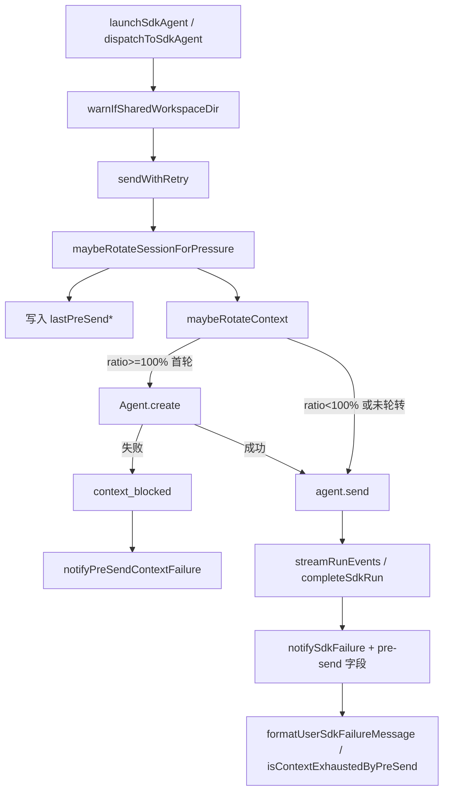

# SDK 预发送上下文保护与失败文案修复 - 代码评审报告

## 1、审查范围

- **变更类型**: apply 产出的未提交变更（git diff）
- **评审等级**: focused-review（局部 SDK 缺陷修复，无契约/跨端/数据层变更）
- **涉及文件**: 8 个（7 个 TS 源文件 + `electron/agent/cursor-sdk/AGENTS.md`）
- **设计文档**: `02-design.md`（对照基准）
- **任务文档**: `03-tasks.md`（T1～T6 全部 `done`）
- **关注点复核**: pre-send 快照归因、ratio≥100% 快拒/快轮转、`othersWorkspaceMode` 未误改、`agent-sdk.ts` 行数、95% vs 100% 阈值分工

## 2、严重（必须处理）

无

## 3、警告（建议处理）

无

**Ponytail 精简轴**：实现复用既有模块（session 字段、`formatUserSdkFailureMessage`、`notifySessionChat`），无未批准新抽象或依赖。Lean already. Ship.

## 4、设计偏差

无

实现与 `02-design.md` 主链路一致：

| 设计步骤 | 实现落点 | 结论 |
|---------|---------|------|
| S4 快照字段 | `sdk-session-types.ts` + `maybeRotateSessionForPressure` 写入 | ✅ |
| S5 ratio≥100% 强制轮转 + bypass 冷却 | `context-rotation-lite.ts` `FULL_ROTATION_RATIO` | ✅ |
| S6 context_blocked 阻断 send | `sendWithRetry` `preSendRatio >= 1.0 && !rotated` | ✅ |
| S6 阻断 notify | `notifyPreSendContextFailure` + `agent-sdk.ts` launch/dispatch 各 1 处 | ✅ |
| S8/S9 失败归因 | `notifySdkFailure` 传 pre-send；`isContextExhaustedByPreSend` | ✅ |
| S10 可选 WARN | `warnIfSharedWorkspaceDir` + launch/dispatch 入口 | ✅ |
| S11 othersWorkspaceMode 不改 | diff 未触及通道配置相关文件 | ✅ |

## 5、验收标准检查

| 任务 | 验收条件 | 状态 |
|------|---------|------|
| T1 | `SdkSessionAgent` 含 `lastPreSend*` 可选字段，JSDoc 语义与 §五 一致 | ✅ |
| T1 | 01 验收 1、3 数据前提 | ✅ |
| T2 | ratio≥100% 首次 `maybeRotateContext` 返回 `rotated: true` | ✅ |
| T2 | ratio≥100% bypass 冷却 | ✅ |
| T2 | ratio=95% 首次仍 `rotated: false`，保留 2 次命中 | ✅ |
| T3 | 每次 pre-send 写入快照 | ✅ |
| T3 | ratio≥100% 且 `!rotated` 不调用 `agent.send`，返回 `context_blocked` | ✅ |
| T3 | ratio≥100% 且轮转成功仍正常 send | ✅ |
| T4 | 轮转后 peak 清零，Run 失败仍走「上下文窗口已接近或达到上限」 | ✅ |
| T4 | pre-send≥95% 判定；负例不误报 | ✅ |
| T5 | launch/dispatch 均调用 `notifyPreSendContextFailure` | ✅ |
| T5 | `errorNotified` 闩；删 session 前 notify（launch） | ✅ |
| T5 | `agent-sdk.ts` ≤300 行（当前 281 行） | ✅ |
| T6 | 多 session 同 `workspaceDir` WARN，每目录每进程 1 条 | ✅ |
| T6 | 用户可见行为不变 | ✅ |
| 02·八·（二） | ratio=150% 无 3s+ 无意义 send（静态逻辑满足；见 §7 手动项） | ⚠️ 待手动 |

## 6、调用链与回归风险

| 回归点 | 风险 | 说明 |
|--------|------|------|
| ratio∈[95%,100%) | 低 | 仍走 90%+2 次轮转；文案靠 pre-send≥95% 归因，与设计分工一致 |
| ratio≥100% 轮转成功后再 send 慢失败 | 低 | 设计接受：已换新 agent，慢失败走 `notifySdkFailure` + pre-send |
| `context_blocked` vs `agent_busy` 清理路径 | 低 | launch/dispatch 均先 notify 再 return，`runGuard`/`pendingDispatch` 与现网一致 |
| 多群并发 | 低 | 快照为 session 级字段，无跨 session 读写 |
| `othersWorkspaceMode` | 无 | 未改通道类型/默认值/解析逻辑 |

**阈值一致性（关注点 5）**：分工明确且与 design 一致——**100%**（`FULL_ROTATION_RATIO` / `context_blocked`）用于强制轮转与 send 阻断；**95%**（`CONTEXT_EXHAUSTED_RATIO`）用于失败文案「上下文已满」归因。非矛盾，属有意分层。

## 7、遗留债务

1. **手动回归未落盘**：`02-design.md` §八·（二）与 `crash_log/20260705225838～20260705230040` 同类场景（ratio=150%、轮转成功后再失败、launch/dispatch 双路径 IM）建议在 `/kb-archive` 前做一次 smoke test；仓库内无自动化或测试记录。
2. **可观测性小缺口**：`notifyPreSendContextFailure` 未调用 `archiveAgentFailureLogs`（`notifySdkFailure` 有）；仅影响故障归档，不阻断功能。

## 8、修复任务建议

| 问题 ID | 建议动作 | 关联任务 |
|---------|----------|----------|
| — | 无 open 阻断项 | — |

若手动回归发现问题，按场景追加 `T-FIX-{n}` 后复评。

## 9、结论

**通过**，可进入 `/kb-archive`。

T1～T6 实现与 `02-design.md` / `03-tasks.md` 对齐；pre-send 快照在轮转清零 peak 后仍用于失败归因；ratio≥100% 具备首轮强制轮转与 `context_blocked` 快拒；未误改 `othersWorkspaceMode`；`agent-sdk.ts` 281 行无大重构。建议在归档前完成 §7 手动 smoke test。
