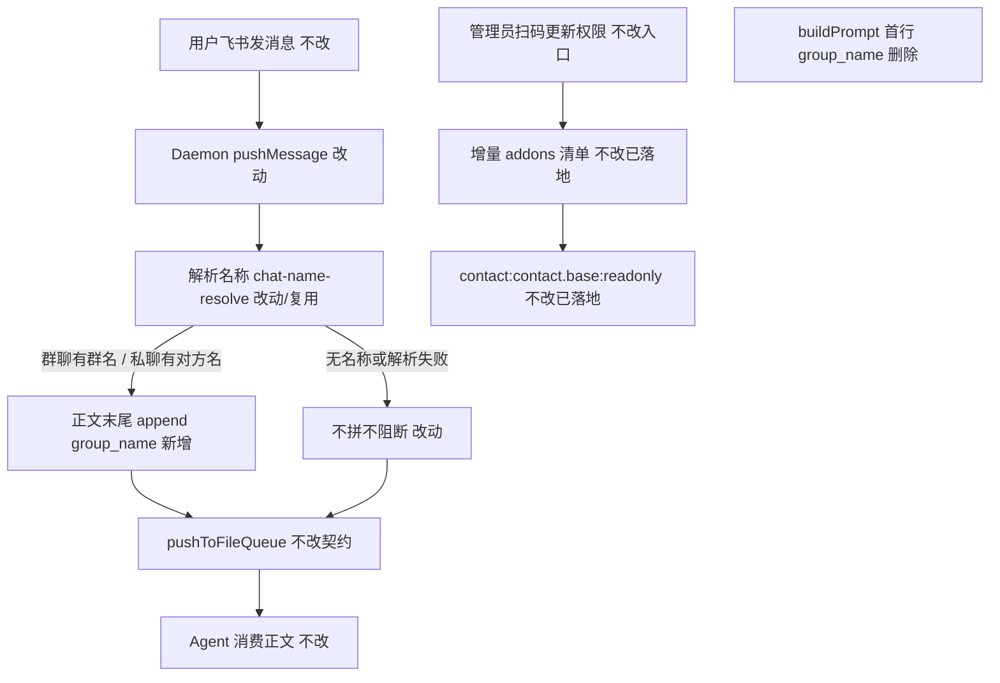

# 私聊注入对方名称到 group_name - 实现设计

> **业务 PRD**：见同目录 `01-proposal.md`（验收标准以 01 为准）
> **修订**：Rev1（2026-07-11）— 注入落点改为入队正文末尾；**废止** `buildPrompt` 首行注入（见 `07-prd-revisions.md`）

## 一、业务流程与改动范围

> 业务口径以 `01-proposal.md` §三场景 A–D、§四 F1–F3、§六验收为准（Rev1）。

### （一）业务流程图



**图例**：`不改` 行为与现网一致；`改动` 需改代码；`新增` 新节点；`删除` 废止路径。

### （二）流程步骤与改动对照

| 步骤 ID | 业务含义 | 改动 | 落点（模块/文件） | 01 验收关联 |
|---------|----------|------|-------------------|-------------|
| A1 | 消息入队前解析名称并拼尾 | **改动（Rev1）** | `src/daemon/daemon.ts` `pushMessage` → `pushToFileQueue`；`chat-name-resolve.ts` | §六·1/2/4；F1/F2 |
| A2 | 群聊用群名、私聊用对方显示名 | **改动（Rev1）** | `chat-name-resolve` 按 `chat_type` | §三场景 D；NF3 |
| A3 | 无名/失败不拼、不阻断入队 | **改动（Rev1）** | 同上 | §六·2；F2 |
| B1 | **废止** Prompt 首行 `group_name:` | **删除（Rev1）** | `electron/agent/shared/agent-launcher.ts` `buildPrompt` | Rev1；非 01 验收 |
| B2 | 收敛仅服务首行的 chatName 透传/日志 | **删除/降级（Rev1）** | launcher / 四引擎 / dispatch；`pushUiLog group_name=` 若仅服务首行 | Rev1 |
| C1 | 扫码增量含 contact | 不改（已落地） | `src/shared/feishu-addons.ts` | §六·3；F3 |
| D1 | status poll / user-names 缓存 | 不改 | 既有链路；入队可复用拉名 | 支撑 A1 |

### （三）改动汇总

- **改动（Rev1）**：`pushMessage` 入队前解析名称，有名则正文末尾 append `\ngroup_name: <名>`；复用 `chat-name-resolve`。
- **删除（Rev1）**：`buildPrompt` 首行 `group_name:` 拼接；仅为该路径服务的透传与可观测日志。
- **不改**：文件队列契约、引擎协议、飞书气泡、已落地的 `FEISHU_MENU` contact（T2）。

## 二、整体思路

根因（Rev1）：Prompt 首行注入经验证不生效；产品改验收为「Agent 在用户消息正文末尾看到 `group_name`」。

方案：在 Daemon `pushMessage` → `pushToFileQueue` 前完成名称解析与拼尾；格式固定；失败不阻断。Electron `buildPrompt` 首行注入废止，避免双路径与无效验收。

**最小方案三问**：1) 复用已有 `chat-name-resolve`；2) 不新增抽象/依赖；3) 收敛而非扩张首行透传链路。

## 三、分层设计

- **端点层**：无新对外 API。
- **服务层**：Daemon 入队拼尾；launcher 去掉首行注入。
- **数据层**：沿用既有拉名/缓存；无持久化 schema 变更。

## 四、接口设计

无新增对外接口。入队正文约定（内部）：

```text
<原消息正文>\ngroup_name: <名称>
```

有名才追加；无名 omit 整行（含前导换行）。

## 五、数据结构

无表结构变更。名称解析继续按 `chat_type`（`group` / `p2p`）取值。

## 六、实现步骤

1. A1–A3：`daemon.ts` `pushMessage` 入队前解析并 append（`T-Rev1-01`）。
2. B1–B2：去掉 `buildPrompt` 首行注入及相关仅服务路径（`T-Rev1-02`）。
3. 回归：有名拼尾、无名不拼、入队不阻断、扫码权限仍可用。
4. archive 时按 §十更新知识库。

## 七、参考实现

| 符号 | 路径 | 说明 |
|------|------|------|
| `pushMessage` / `pushToFileQueue` | `src/daemon/daemon.ts` | Rev1 入队拼尾落点 |
| `chat-name-resolve` | `src/daemon/chat-name-resolve.ts` | 已有；入队复用 |
| `buildPrompt` | `electron/agent/shared/agent-launcher.ts` | Rev1 **废止**首行 `group_name:` |
| `FEISHU_MENU_SCOPES` | `src/shared/feishu-addons.ts` | contact 已落地（T2） |

## 八、技术影响

### （一）影响范围

- 涉及模块：Daemon 入队、launcher（删除首行）、可选四引擎/dispatch 透传收敛。
- 接口/proto：无。
- 风险：入队拼尾后队列落盘内容含后缀行（预期）；解析超时/失败须不阻断。

### （二）工程补充验收项

- [ ] 有名时入队正文末尾为 `\ngroup_name: <名>`，Agent 可见
- [ ] 无名/失败不拼、入队不阻断
- [ ] `buildPrompt` 不再首行注入 `group_name:`
- [ ] 群聊群名 / 私聊对方显示名
- [ ] 无未要求的新抽象/依赖

## 九、知识库影响

- `knowledge/业务域/Agent调度/03-启动与自动重连.md` — 须改写为首行→入队拼尾
- `knowledge/业务域/消息桥接/02-飞书通道.md` — 可能（入队正文约定）
- 两级索引 — 预计不改

## 十、知识库更新计划

### （一）必须更新

- `knowledge/业务域/Agent调度/03-启动与自动重连.md` — 注入改为入队正文末尾；废止 Prompt 首行描述

### （二）可能更新（视实现结果）

- `knowledge/业务域/消息桥接/02-飞书通道.md` — 若写明入队正文约定
- `src/daemon/AGENTS.md` / `electron/agent/shared/AGENTS.md` — 与代码对齐

### （三）不需要更新

- Agent调度 README/概览、知识索引、Proto/工程平台分区正文
