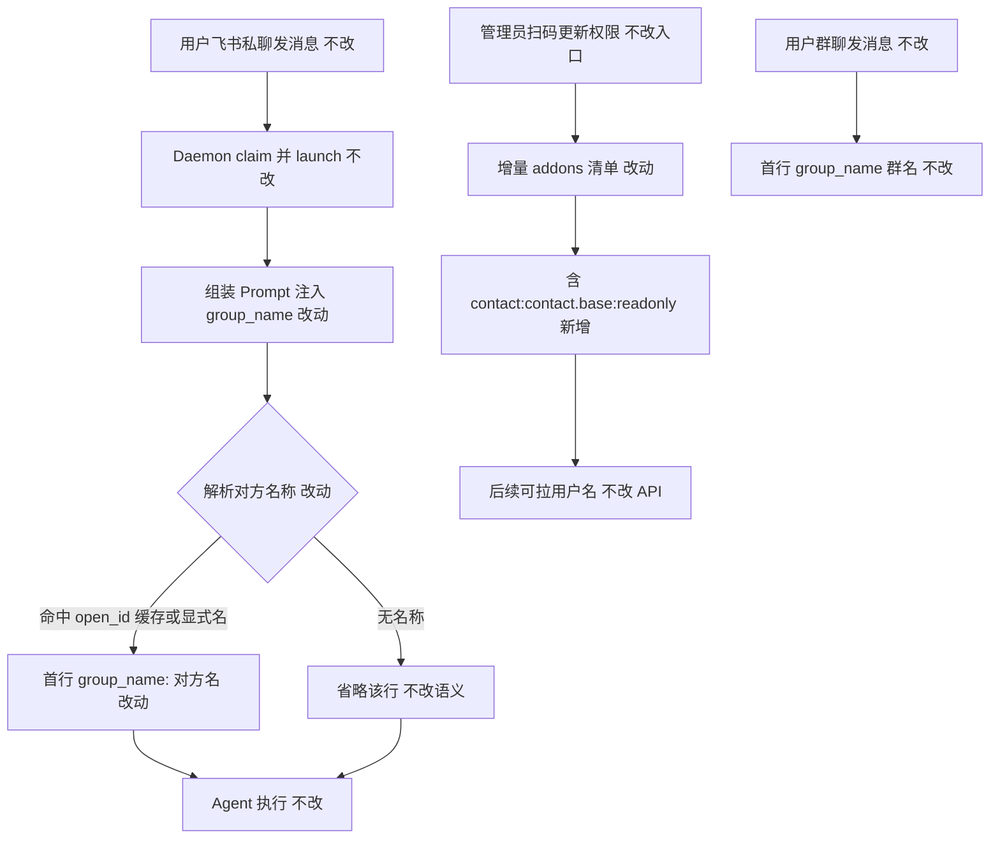

# 私聊注入对方名称到 group_name - 实现设计

> **业务 PRD**：见同目录 `01-proposal.md`（验收标准以 01 为准）

## 一、业务流程与改动范围

> 业务口径以 `01-proposal.md` §三场景 A–D、§四 F1–F3、§六验收为准。

### （一）业务流程图

**图例**：`不改` 行为与现网一致；`改动` 需改代码/配置；`新增` 新节点或新清单项；`删除` 本变更无删除路径。

### （二）流程步骤与改动对照

| 步骤 ID | 业务含义 | 改动 | 落点（模块/文件） | 01 验收关联 |
|---------|----------|------|-------------------|-------------|
| A1 | 私聊消息入队 / claim / launch | 不改 | `src/daemon/daemon.ts` `dispatchSessionToAgent` | §三场景 A；§六·1 |
| A2 | status poll 对 p2p 拉用户名写入缓存 | 不改 | `daemon-manager.ts`；`fetchUserNames`；`/api/user-names` | §三场景 A；F1 |
| A3 | `buildPrompt` 解析名称并首行注入 | 改动 | `electron/agent/shared/agent-launcher.ts` | §六·1；F1 |
| A4 | 四引擎 launch/dispatch 传 `senderOpenId` | 改动 | 四引擎 sdk 各 `buildPrompt` 调用点 | §六·1；NF1 |
| B1 | 无对方名称时省略该行 | 不改 | 现网 `if (!name) return body` | §六·2；F2 |
| C1 | 一键创建清单含 contact | 不改 | `REQUIRED_FEISHU_SCOPES` 已含 | §六·3；F3 |
| C2 | 扫码更新 addons 补 contact | 改动 | `src/shared/feishu-addons.ts` | §六·3；F3 |
| D1 | 群聊注入行为 | 不改 | `fetchChatNames` / 群聊路径 | §六·4；NF3 |

### （三）改动汇总

- **改动**：`buildPrompt` 补传 `senderOpenId`；四引擎调用点对齐；`FEISHU_MENU_ADDONS` 补 contact。
- **新增**：扫码增量 scopes 中的 contact 项（经 `FEISHU_MENU_SCOPES`）。
- **不改**：群聊注入、`/api/user-names`、status poll、`REQUIRED_FEISHU_SCOPES`、引擎/会话/IM 协议、无名省略语义。

## 二、整体思路

见 01 §一与 §二。根因：`resolveSessionChatName` 支持按 `senderOpenId` 查 open_id 缓存，广播已传参，但 `buildPrompt` 只调 `resolveSessionChatName(sessionKey)`，Daemon launch 又不传 `chat_name`，私聊名缓存在 open_id → Prompt miss。

方案：`buildPrompt` 增可选 `senderOpenId` 并传入 resolve；四引擎传参；`FEISHU_MENU_SCOPES` 补 contact；创建侧 `REQUIRED_FEISHU_SCOPES` 不动。

**最小方案三问**：1) 复用现有 resolve/cache/fetch/addons；2) 01 未要求新抽象/依赖；3) 合并到已有文件，不新建。

## 三、分层设计

- **端点层**：无新接口；沿用 launch/dispatch、`/api/user-names`、`feishu:update-app-permissions`。
- **服务层**：`buildPrompt` 与四引擎传参；扫码 addons 扩展。
- **数据层**：沿用 `chatNameCache`；无持久化变更。

## 四、接口设计

无新增接口。`buildPrompt(..., chatName?, senderOpenId?)` 可选末参向后兼容；其余契约不变。

## 五、数据结构

无。仅 `FEISHU_MENU_SCOPES` 多一条 `{ scope, desc }`。

## 六、实现步骤

1. A3：`agent-launcher.ts` — `buildPrompt` 增 `senderOpenId`，解析走 `resolveSessionChatName(sessionKey, undefined, senderOpenId)`。
2. A4：四引擎 launch/dispatch 的 `buildPrompt` 传入 `senderOpenId`。
3. C2：`FEISHU_MENU_SCOPES` 增加 `contact:contact.base:readonly`。
4. 回归：群聊/无名/创建侧清单。
5. archive 时更新知识库（§十）。

## 七、参考实现

| 符号 | 路径 | 说明 |
|------|------|------|
| `buildPrompt` | `electron/agent/shared/agent-launcher.ts:36` | 现网未传 senderOpenId |
| `resolveSessionChatName` | 同文件 `:15` | 显式名→chatId→senderOpenId |
| `fetchUserNames` | `electron/session/session-dispatcher.ts:153` | 写 open_id 缓存 |
| status poll p2p | `electron/daemon/daemon-manager.ts:832+` | 已拉用户名 |
| `REQUIRED_FEISHU_SCOPES` | `src/renderer/constants.ts` | 创建侧已含 contact |
| `FEISHU_MENU_ADDONS` | `src/shared/feishu-addons.ts` | 扫码侧缺 contact |
| 归档 | `20260711095806-Agent注入群聊名提示词` | 群聊注入先例 |

## 八、技术影响

### （一）影响范围

- 涉及模块：launcher、四引擎、feishu-addons、Settings 增量表展示。
- 接口/proto：无 proto；可选参数兼容。
- 数据：无。
- 风险：首条早于 poll 可能暂无名（对齐 F2）；存量须扫码更新；勿改 events。

### （二）工程补充验收项

- [ ] 私聊缓存命中时四引擎 Prompt 首行为 `group_name: <对方名>`
- [ ] 无 senderOpenId/chatName 时与现网一致
- [ ] `FEISHU_MENU_ADDONS.scopes.tenant` 含 contact
- [ ] 群聊注入不受影响
- [ ] 无未要求的新抽象/依赖

## 九、知识库影响

- `knowledge/业务域/Agent调度/03-启动与自动重连.md` — 必更
- `knowledge/业务域/消息桥接/02-飞书通道.md` — 可能
- 两级索引 — 预计不改

## 十、知识库更新计划

### （一）必须更新

- `knowledge/业务域/Agent调度/03-启动与自动重连.md` — 私聊经 senderOpenId 命中用户名；格式仍 `group_name:`；无名省略

### （二）可能更新（视实现结果）

- `knowledge/业务域/消息桥接/02-飞书通道.md` — 扫码 scopes 列举时补 contact
- `electron/agent/shared/AGENTS.md` — 代码约定对齐

### （三）不需要更新

- Agent调度 README/概览、知识索引、Proto/工程平台分区正文
