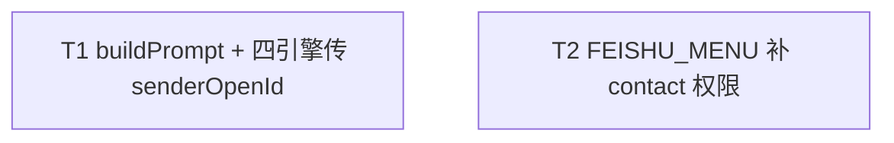

# 私聊注入对方名称到 group_name - 任务分解

> **来源**：`/kb-plan`（基于 `01-proposal.md`、`02-design.md`）
> **任务数**：2（T1–T2）
> **依赖图与分组调度**：见「一、执行计划」；每条 `T{n}` 自包含，子 agent 只读该 `T{n}` + 上下文文件即可开工，不应回读 `02-design.md`。

## 一、执行计划

### （一）依赖图



**依赖说明**：

- T1 与 T2 **无依赖边**：写文件集不相交，可并行。
- T1 产出 Prompt 首行私聊注入能力（覆盖 01 §六·1/2/4）。
- T2 产出扫码增量 scopes 含 contact（覆盖 01 §六·3）；`FEISHU_MENU_ADDONS.scopes.tenant` 由 `FEISHU_MENU_SCOPES.map` 派生，改 scopes 即同步 addons。

### （二）分组调度

| 轮次 | 并行任务 | 说明 |
|------|----------|------|
| **第一轮（并行）** | T1、T2 | 无共享写文件；T1 改 launcher + 四引擎；T2 仅改 `feishu-addons.ts` |

**同文件冲突清单（须串行）**：

| 文件 | 涉及任务 |
|------|----------|
| （无） | T1 / T2 写文件集无交集，无需串行 |

**YAGNI 边界（全任务遵守）**：

- 不新建抽象层 / helper / 中间模块
- 不改 Daemon `fetchUserNames` / status poll / `/api/user-names`
- 不合并 `REQUIRED_FEISHU_SCOPES` 与 `FEISHU_MENU_SCOPES` 两套权限 SSOT
- 不改 `REQUIRED_FEISHU_SCOPES`（创建侧已含 contact）

## 二、任务清单

## T1: buildPrompt 传 senderOpenId 与四引擎 launch/dispatch 对齐

### 背景

私聊用户名已由 status poll 写入 open_id → 名称缓存，且 `resolveSessionChatName(sessionKey, chatName?, senderOpenId?)` 已支持按 `senderOpenId` 查缓存；但 `buildPrompt` 只调用 `resolveSessionChatName(sessionKey)`，四引擎 launch/dispatch 也不传 `senderOpenId`，导致私聊 Prompt 首行 miss。本任务打通解析传参，使私聊缓存命中时首行注入 `group_name: <对方名>`，群聊与无名降级保持现网语义。

### 上下文文件

- CodeGraph: `buildPrompt` / `resolveSessionChatName` — 定位签名与四引擎调用点
- 必读: `electron/agent/shared/agent-launcher.ts` — 现网 `buildPrompt`（约 L36）与 `resolveSessionChatName`（约 L15）
- 必读: `electron/agent/cursor-sdk/agent-sdk.ts` — `launchSdkAgent` / `dispatchToSdkAgent` 的 `buildPrompt` 调用
- 必读: `electron/agent/claude-code/agent-claude-sdk.ts` — `launchClaudeCodeAgent` / `dispatchToClaudeCodeAgent`
- 必读: `electron/agent/codex/agent-codex-sdk.ts` — `launchCodexAgent` / `dispatchToCodexAgent`
- 必读: `electron/agent/opencode/agent-opencode-sdk.ts` — `launchOpencodeAgent` / `dispatchToOpencodeAgent`
- 参考: 广播路径已传 `senderOpenId`（如 `broadcastCcSessionStatus`）— 仅对照，本任务不改广播

### 实现范围

- 修改: `electron/agent/shared/agent-launcher.ts` — `buildPrompt` 增可选末参 `senderOpenId?: string`；名称解析改为 `resolveSessionChatName(sessionKey, undefined, senderOpenId)`（仍优先 `chatName?.trim()`）；无名称时 `return body`（省略该行，不写占位）
- 修改: `electron/agent/cursor-sdk/agent-sdk.ts` — launch/dispatch 的 `buildPrompt(...)` 传入 `senderOpenId` / `session.senderOpenId`
- 修改: `electron/agent/claude-code/agent-claude-sdk.ts` — 同上
- 修改: `electron/agent/codex/agent-codex-sdk.ts` — 同上
- 修改: `electron/agent/opencode/agent-opencode-sdk.ts` — 同上
- **不修改**: Daemon claim/launch、`fetchUserNames`、status poll、群聊 `fetchChatNames`、广播函数、引擎/会话/IM 协议

### 接口契约

```typescript
/** 四引擎共用；可选末参向后兼容 */
export function buildPrompt(
  _meta?: LaunchMeta,
  taskMessage?: string,
  sessionKey?: string,
  _useMainWorkspace?: boolean,
  chatName?: string,
  senderOpenId?: string, // 新增：私聊按 open_id 查 chatNameCache
): string
// 有名 → 首行 `group_name: ${name}\n${body}`；无名 → 仅 body
```

- 调用约定：launch 传 `opts.senderOpenId`（或解构出的 `senderOpenId`）；dispatch 传 `session.senderOpenId`
- `resolveSessionChatName` 签名不变，本任务只补传第三参

### 验收标准

- [x] 私聊且 open_id 缓存命中时，四引擎（Cursor SDK / Claude Code / Codex / OpenCode）组装 Prompt **首行**为 `group_name: <对方名称>`，其后为原有正文（01 §六·1；F1）
- [x] 无法取得对方名称（无 `senderOpenId`、缓存未命中、空串）时省略该行，不注入无效占位（01 §六·2；F2）
- [x] 群聊有显式 `chatName` 或 chatId 缓存命中时仍为首行 `group_name: <群名>`；无群名降级与现网一致（01 §六·4；NF3）
- [x] 无 `senderOpenId`/`chatName` 时行为与改前一致（02 §八·（二））
- [x] 注入仅影响 Prompt 首行，不改飞书气泡样式 / 引擎协议（NF1）
- [x] 无 `02`/`03` 未要求的抽象层、trait/mixin 中间层或未批准的新依赖（Ponytail 口径）

### 依赖

- 前置任务: 无
- 后续任务: 无

## T2: FEISHU_MENU 扫码增量补 contact 权限

### 背景

创建应用侧 `REQUIRED_FEISHU_SCOPES` 已含 `contact:contact.base:readonly`，但扫码更新权限用的 `FEISHU_MENU_SCOPES` / `FEISHU_MENU_ADDONS` 缺少该项，存量应用无法经「扫码更新权限」开通拉用户名能力。本任务仅在菜单增量 SSOT 中补上该 scope；设置页已 `FEISHU_MENU_SCOPES.map` 展示增量表，改 SSOT 后自动可见。

### 上下文文件

- CodeGraph: `FEISHU_MENU_SCOPES` / `FEISHU_MENU_ADDONS` — 确认派生关系与引用方
- 必读: `src/shared/feishu-addons.ts` — 现网 `FEISHU_MENU_SCOPES` 与 `FEISHU_MENU_ADDONS`（tenant 由 scopes.map 派生）
- 必读: `src/renderer/constants.ts` — `REQUIRED_FEISHU_SCOPES` 中 contact 条目的 scope/desc 文案（对齐描述，**勿改本文件**）
- 参考: `src/renderer/pages/Settings.tsx` — 增量表 `FEISHU_MENU_SCOPES.map` 展示（确认无需改 UI 代码）

### 实现范围

- 修改: `src/shared/feishu-addons.ts` — 在 `FEISHU_MENU_SCOPES` 增加一项：`{ scope: "contact:contact.base:readonly", desc: "获取用户名（私聊会话显示）" }`（desc 与 `REQUIRED_FEISHU_SCOPES` 对齐）
- **不修改**: `REQUIRED_FEISHU_SCOPES`、Settings UI 组件、IPC/`registerApp` 接线、Daemon user-names 链路
- **不合并**两套权限 SSOT；`FEISHU_MENU_ADDONS.scopes.tenant` 继续由 `FEISHU_MENU_SCOPES.map((p) => p.scope)` 自动包含新项

### 接口契约

```typescript
// FEISHU_MENU_SCOPES 新增一项后：
// FEISHU_MENU_ADDONS.scopes.tenant 须包含 "contact:contact.base:readonly"
// 设置页扫码更新权限对照表经 FEISHU_MENU_SCOPES.map 可见该条
```

- 对外符号名与结构不变；仅数组多一条 `{ scope, desc }`

### 验收标准

- [x] `FEISHU_MENU_SCOPES` 含 `contact:contact.base:readonly`，desc 为「获取用户名（私聊会话显示）」（01 §六·3；F3）
- [x] `FEISHU_MENU_ADDONS.scopes.tenant` 含 `contact:contact.base:readonly`（02 §八·（二））
- [x] 设置页「扫码更新权限」增量表展示可见该权限（沿用现有 map，无需新 UI）（01 §六·3；NF2）
- [x] 未改动 `REQUIRED_FEISHU_SCOPES`，未合并两套权限 SSOT
- [x] 无 `02`/`03` 未要求的抽象层、trait/mixin 中间层或未批准的新依赖（Ponytail 口径）

### 依赖

- 前置任务: 无
- 后续任务: 无
