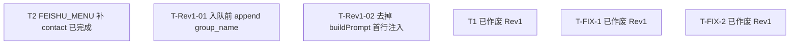
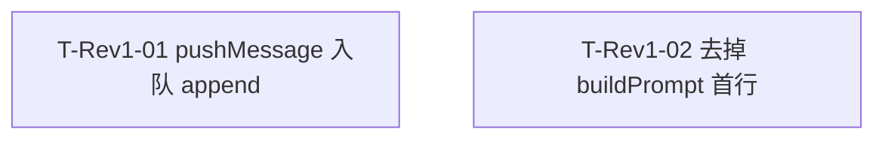

# 私聊注入对方名称到 group_name - 任务分解

> **来源**：`/kb-plan`；验收修复见「三」；**Rev1** 见「四」（`/kb-revise` 2026-07-11）
> **任务数**：Rev1 已完成（T-Rev1-01 / T-Rev1-02 done）；历史 T2 done；T1 / T-FIX-1 / T-FIX-2 **已作废（Rev1）**
> **依赖图与分组调度**：见「一」与「四」；每条任务自包含，子 agent 只读该任务块 + 上下文文件即可开工。

## 一、执行计划

### （一）依赖图



**依赖说明（Rev1）**：

- T-Rev1-01 与 T-Rev1-02 **无依赖边**：Daemon vs Electron，写文件集可并行。
- T2 已完成，权限清单仍有效，支撑入队拉名。
- T1 / T-FIX-1 / T-FIX-2 仅服务 Prompt 首行路径，**已作废（Rev1）**；`chat-name-resolve` 由 T-Rev1-01 复用。

### （二）分组调度

| 轮次 | 并行任务 | 说明 |
|------|----------|------|
| **Rev1 第一轮（并行）** | T-Rev1-01、T-Rev1-02 | Daemon 入队拼尾 vs 去掉 launcher 首行 |

**同文件冲突清单（须串行）**：

| 文件 | 涉及任务 |
|------|----------|
| （无） | T-Rev1-01 / T-Rev1-02 写文件集无交集 |

**YAGNI 边界**：

- 不新建抽象层；复用 `chat-name-resolve`
- 不恢复 Prompt 首行双路径
- 不改 `REQUIRED_FEISHU_SCOPES` / 已落地 T2

## 二、任务清单（历史）

## T1: buildPrompt 传 senderOpenId 与四引擎 launch/dispatch 对齐

> **状态：已作废（Rev1）** — 仅服务 Prompt 首行 `group_name:` 注入；Rev1 改入队正文末尾并废止首行路径，由 `T-Rev1-02` 收敛删除，不再按本任务验收/实现。

### 背景

（作废保留摘要）原计划打通 `buildPrompt`/`senderOpenId` 使私聊 Prompt 首行注入；Rev1 废止该验收。

### 上下文文件

- 见历史实现：`electron/agent/shared/agent-launcher.ts` 及四引擎 sdk（Rev1 由 T-Rev1-02 处理收敛）

### 实现范围

- **已作废**：勿按本任务继续实现或勾选新完成项。

### 接口契约

- 作废；以 T-Rev1-02 为准。

### 验收标准

- [ ] ~~原首行注入验收~~ **已作废（Rev1）**

### 依赖

- 前置任务: 无（作废）

## T2: FEISHU_MENU 扫码增量补 contact 权限

### 背景

创建应用侧 `REQUIRED_FEISHU_SCOPES` 已含 `contact:contact.base:readonly`，扫码更新用的 `FEISHU_MENU_SCOPES` / `FEISHU_MENU_ADDONS` 已补该项（仍有效，支撑入队拉名）。

### 上下文文件

- 必读: `src/shared/feishu-addons.ts`
- 对照: `src/renderer/constants.ts`（勿改）

### 实现范围

- 已完成：`FEISHU_MENU_SCOPES` 含 contact（Rev1 **不改废**）

### 接口契约

```typescript
// FEISHU_MENU_ADDONS.scopes.tenant 含 "contact:contact.base:readonly"
```

### 验收标准

- [x] `FEISHU_MENU_SCOPES` 含 `contact:contact.base:readonly`（01 §六·3；F3）
- [x] 设置页扫码更新可见该权限
- [x] 未改动 `REQUIRED_FEISHU_SCOPES`

### 依赖

- 前置任务: 无

## 三、验收修复（08-verify-issue 第 1 轮）— 历史

> 原为修 Prompt 首行冷启动 miss；**Rev1 起该路径作废**，入队拼尾见「四」。

## T-FIX-1: Daemon launch 前解析并透传 chat_name

> **状态：已作废（Rev1）** — 目标为 launch 透传 `chat_name` 供 Prompt 首行注入；Rev1 改为入队拼尾。解析能力落在 `chat-name-resolve.ts`，由 **T-Rev1-01 复用**，本任务不再作为实现/验收依据。

### 背景

（作废）冷启动 launch 不传 `chat_name` 导致首行 omit。

### 上下文文件

- `src/daemon/daemon.ts`、`src/daemon/chat-name-resolve.ts`（复用归 T-Rev1-01）

### 实现范围

- **已作废**：勿再按「launch 透传供首行」扩展；入队拼尾见 T-Rev1-01。

### 接口契约

- 作废；以 T-Rev1-01 入队约定为准。

### 验收标准

- [ ] ~~冷启动 Prompt 首行~~ **已作废（Rev1）**

### 依赖

- 前置任务: 无（作废）

## T-FIX-2: 可观测 + fetch 失败 WARN

> **状态：已作废（Rev1）** — `pushUiLog group_name=` 等可观测主要为 Prompt 首行注入服务；Rev1 废止首行后由 T-Rev1-02 移除或降级。fetch WARN 若已存在可保留，但不作为本任务未完成项勾选依据。

### 背景

（作废）首行注入结果可观测 + 拉名失败 WARN。

### 上下文文件

- `electron/agent/shared/agent-launcher.ts`、`electron/session/session-dispatcher.ts`

### 实现范围

- **已作废**：首行相关 `pushUiLog` 归 T-Rev1-02 处理。

### 接口契约

- 作废。

### 验收标准

- [ ] ~~首行 group_name 可观测~~ **已作废（Rev1）**

### 依赖

- 前置任务: 无（作废）

## 四、PRD 修订 Rev1（`/kb-revise` 2026-07-11）

> **来源**：`07-prd-revisions.md` Rev1；实现状态 **已完成**（T-Rev1-01 / T-Rev1-02 均 done；`/kb-revise-apply` 收口）。
> **口径**：入队正文末尾 `\ngroup_name: <名称>`；去掉 buildPrompt 首行注入。

### （一）依赖图



### （二）分组调度

| 轮次 | 并行任务 | 说明 |
|------|----------|------|
| **Rev1 第一轮** | T-Rev1-01、T-Rev1-02 | 可并行 |

## T-Rev1-01: Daemon pushMessage 入队前解析名称并 append group_name

### 背景

Rev1：Prompt 首行注入不生效。产品改为消息写入文件队列前，将名称拼到消息正文末尾。格式固定 `\ngroup_name: <名称>`；群聊用群名、私聊用对方显示名；取不到名称则不拼；解析失败不阻断入队。已有 `chat-name-resolve.ts` 供复用（勿重写拉名体系）。

### 上下文文件

- 必读: `src/daemon/daemon.ts` — `pushMessage`、`pushToFileQueue`（入队点）
- 必读: `src/daemon/chat-name-resolve.ts` — 按 chat_type 解析名称（复用）
- 参考: `src/daemon/AGENTS.md` — Daemon 约定
- 对照: `01-proposal.md` §六；`07-prd-revisions.md` Rev1
- **不读**：不必回读完整 `02-design.md`（本块自包含）

### 实现范围

- 修改: `src/daemon/daemon.ts` — 在 `pushMessage`（或等价入队点）调用 `pushToFileQueue` **之前**：解析名称；有名则对消息正文 append `\ngroup_name: <名称>`；无名不拼；异常/失败 WARN（或等价）且**仍入队**
- 复用: `src/daemon/chat-name-resolve.ts`（可小改以适配入队调用，禁止无关重构）
- 可选: 同步 `src/daemon/AGENTS.md` 一句约定
- **不修改**: `buildPrompt` 首行（归 T-Rev1-02）、四引擎协议、`FEISHU_MENU_SCOPES`、文件队列存储格式其它字段

### 接口契约

```typescript
// 入队正文约定（有名时）
messageBody = `${originalBody}\ngroup_name: ${resolvedName}`
// 无名或解析失败：保持 originalBody，不写占位，不阻断 pushToFileQueue
```

- 群聊：`resolvedName` = 群名；私聊 = 对方显示名
- 前导换行与键名固定：`\ngroup_name: `

### 验收标准

- [x] 有名时入队消息正文末尾为 `\ngroup_name: <名称>`，Agent 在用户消息正文末尾可见（01 §六·1；F1）
- [x] 无名/解析失败不拼该行、不写占位，且入队不阻断（01 §六·2/4；F2）
- [x] 群聊用群名、私聊用对方显示名（01 §三场景 D；NF3）
- [x] 复用 `chat-name-resolve`，无未要求的新抽象/依赖（Ponytail）
- [x] `/kb-revise-apply` 已落地本任务

### 依赖

- 前置任务: 无（可与 T-Rev1-02 并行）
- 后续任务: 无

## T-Rev1-02: 去掉 buildPrompt 首行 group_name 注入及相关透传/日志

### 背景

Rev1：因首行注入不生效且验收改为正文末尾，须去掉 `buildPrompt` 首行 `group_name:` 拼接。仅为该路径服务的 chatName/`senderOpenId` 透传与 `pushUiLog group_name=` 可一并移除或降级；保留入队拼尾为唯一产品路径。`chat-name-resolve` 仍供 Daemon 入队使用，勿删。

### 上下文文件

- 必读: `electron/agent/shared/agent-launcher.ts` — `buildPrompt` 首行拼接与相关 `pushUiLog`
- 参考: 四引擎 sdk / `electron/session/session-dispatcher.ts` — 若参数/日志**仅**为服务首行注入，可收敛删除未使用传参
- 参考: `electron/agent/shared/AGENTS.md`、`electron/session/AGENTS.md`
- 对照: `07-prd-revisions.md` Rev1；验收以「正文末尾可见」为准（T-Rev1-01）

### 实现范围

- 修改: `electron/agent/shared/agent-launcher.ts` — 去掉首行 `group_name:` 拼接；仅服务该路径的 `pushUiLog group_name=` 移除或降级
- 可选收敛: 四引擎 launch/dispatch、session-dispatcher 中**仅为**首行注入而增加的 chatName/`senderOpenId` 传参（若去掉后无其它消费者）
- **保留**: `src/daemon/chat-name-resolve.ts`（入队用）；T2 权限清单；与首行无关的 fetch WARN 可保留
- **不修改**: `pushMessage` 入队拼尾逻辑（归 T-Rev1-01）

### 接口契约

```typescript
// buildPrompt：返回 body，不再前置 `group_name: ${name}\n`
export function buildPrompt(...): string
// 不再要求 launch body.chat_name 用于首行注入
```

### 验收标准

- [x] `buildPrompt` 不再在 Prompt 首行注入 `group_name:`（Rev1；02 §八·（二））
- [x] 仅服务首行的透传/日志已移除或降级，无死代码要求（可最小收敛）
- [x] 未删除 `chat-name-resolve`；未破坏入队拼尾路径
- [x] 无未要求的新抽象/依赖（Ponytail）
- [x] `/kb-revise-apply` 已落地本任务

### 依赖

- 前置任务: 无（可与 T-Rev1-01 并行）
- 后续任务: 无
