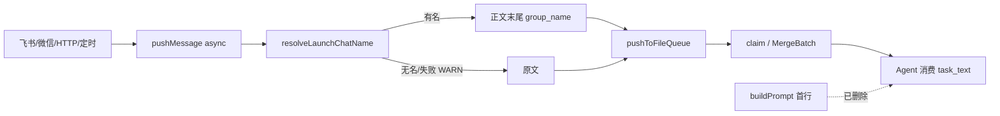

# 私聊注入对方名称到 group_name - 代码评审报告

## 1、审查范围

- **变更类型**: apply / revise-apply 产出的未提交变更（Rev1）
- **评审等级**: focused-review（单端 Daemon+Electron Prompt 收敛；无 proto/资金/事务）
- **本轮焦点**: 对照 Rev1（`01`/`02`/`03`/`07`）整篇重写；废止旧「首行注入」口径
- **涉及文件**: `src/daemon/daemon.ts`、`src/daemon/chat-name-resolve.ts`、`electron/agent/shared/agent-launcher.ts`、四引擎 sdk、`electron/session/session-dispatcher.ts`、相关 AGENTS.md、`src/shared/feishu-addons.ts`（T2 既有）
- **设计/任务基准**: `02-design.md` A1–A3 / B1–B2；`03` T-Rev1-01 / T-Rev1-02（done）；T1 / T-FIX-1 / T-FIX-2 已作废
- **方法**: CodeGraph（`pushMessage` / `resolveLaunchChatName` / `buildPrompt` context + callers + impact + explore）+ `git diff`

## 2、严重（必须处理）

无

## 3、警告（建议处理）

无（评分 ≥75 的 open 为 0）

**Ponytail 精简（Agent #3）**：

1. `delete:` `buildPrompt` 已去掉首行 `group_name:`；四引擎不再向 `buildPrompt` 传 `chatName`/`senderOpenId`。
2. `yagni:` 复用既有 `chat-name-resolve.ts`（130 行），无新 npm 依赖、无新抽象层。
3. `shrink:` `buildPrompt` 保留兼容空参位；launch 仍透传 `chat_name` 供会话列表/广播（`resolveSessionChatName` 仍有调用方），**非**仅服务首行的死路径。

Lean already. Ship.

## 4、设计偏差

无（相对 Rev1）

- **A1–A3**：`pushMessage` 在 `pushToFileQueue` 前 `await resolveLaunchChatName`；有名则 `${content}\ngroup_name: ${name}`；try/catch WARN 后仍入队。
- **B1**：`buildPrompt` 仅透传 `taskMessage`；仓库内无残留 `group_name:` 首行拼接 / `pushUiLog group_name=`。
- **B2**：仅为首行服务的入参已从 `buildPrompt` 签名移除；launch `chat_name` 仍有 UI/广播消费者，按 `03`「若去掉后无其它消费者」可收敛——**保留合理**。
- **T2**：`FEISHU_MENU_SCOPES` 含 `contact:contact.base:readonly`，未改 `REQUIRED_FEISHU_SCOPES`。

## 5、验收标准检查

### （一）T-Rev1-01 / T-Rev1-02（本轮）

| 任务 | 验收条件 | 状态 |
|------|---------|------|
| T-Rev1-01 | 有名时入队正文末尾 `\ngroup_name: <名称>` | ✅ `pushMessage` → `queueContent` |
| T-Rev1-01 | 无名/失败不拼、不占位、不阻断入队 | ✅ catch WARN + 原文入队 |
| T-Rev1-01 | 群聊群名 / 私聊对方显示名 | ✅ `im.chat.get` / `contact.user.get` |
| T-Rev1-01 | 复用 `chat-name-resolve`，无未要求抽象 | ✅ |
| T-Rev1-02 | `buildPrompt` 不再首行注入 | ✅ 仅 `return taskMessage` |
| T-Rev1-02 | 仅服务首行的透传/日志已收敛 | ✅；launch `chat_name` 留作广播 |
| T-Rev1-02 | 未删 `chat-name-resolve`；未破坏入队拼尾 | ✅ |
| T-Rev1-02 | Ponytail | ✅ |

### （二）历史任务

| 任务 | 状态 |
|------|------|
| T2 FEISHU_MENU contact | ✅ done，仍有效 |
| T1 / T-FIX-1 / T-FIX-2 | cancelled（Rev1）；首行验收作废 |

### （三）01 §六

| 项 | 状态 |
|----|------|
| 1 有名入队末尾可见 | ✅ 代码路径齐 |
| 2 无名不拼仍入队 | ✅ |
| 3 扫码含 contact | ✅ T2 |
| 4 群/私命名 + 失败不阻断 | ✅ |

## 6、调用链与回归风险

| 回归点 | 结论 |
|--------|------|
| 入队拼尾格式 | `\ngroup_name: ${name}`，有名前导换行；无名 omit 整行 |
| 失败阻断入队 | 否：外层 try/catch + `resolveLaunchChatName` 内部 catch → WARN |
| `pushMessage` 改 async | 飞书/HTTP `await`；微信/定时 `.catch(WARN)`，无未处理 rejection |
| `buildPrompt` 首行残留 | 无（Grep 引擎目录无命中） |
| launch `chat_name` | 仍解析透传，服务会话 `chatName` 广播；**非** Prompt 注入 |
| CodeGraph impact | `pushMessage` 调用面：Feishu/WeChat/HTTP/定时；`resolveLaunchChatName` 收敛于 daemon |

## 7、遗留债务

无阻断债务（不写入 `reviews[]` open）。

1. **MergeBatch 多条各自带 `group_name`**：每条入队独立拼尾；`formatMergeBody` 合并后可能出现多行 `group_name:`（同名重复）。产品可接受；若日后烦扰可在 merge 时去重末行（非本轮范围）。
2. **双重拉名**：入队一次 + launch 一次（后者服务 UI 名）；尾延迟可接受，热点再议缓存。
3. **`chat-name-resolve.ts` 仍为 untracked**：归档/提交须纳入白名单（manifest 已列 `added`）。

## 8、修复任务建议

| 问题 ID | 建议动作 | 关联任务 |
|---------|----------|----------|
| （无 open≥75） | 无需追加 T-FIX | — |

## 9、结论

**通过**，可进入 `/kb-archive`。focused-review 无评分 ≥75 的 open；实现与 Rev1（入队正文末尾拼尾、废止 `buildPrompt` 首行）对齐；manifest `stage=reviewed`，`reviews=[]`。

### 用户复测 checklist（Rev1）

1. **有名私聊/群聊**：入队/Agent 所见用户消息**正文末尾**为 `group_name: <名称>`（不以 Prompt 首行为验收）。
2. **无名/拉名失败**：正文无该行；消息仍入队；Daemon 可有 WARN。
3. **扫码权限**：存量应用扫码更新可见 `contact:contact.base:readonly`。
4. **MergeBatch（可选）**：连续多条合并后正文可含多行 `group_name:`（已知债务）。
