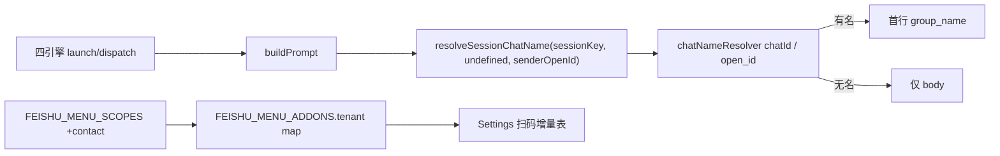

# 私聊注入对方名称到 group_name - 代码评审报告

## 1、审查范围

- **变更类型**: apply 产出的未提交变更
- **评审等级**: focused-review
- **涉及文件**: 8 个（launcher + 四引擎 + feishu-addons + 两处 AGENTS.md）
- **设计文档**: `02-design.md`（对照基准）；任务 `03-tasks.md` T1/T2
- **聚焦轴**: `buildPrompt` / 四引擎传 `senderOpenId`；`FEISHU_MENU_SCOPES` contact 增量；回归群聊注入、无名省略、`REQUIRED_FEISHU_SCOPES` 未破坏
- **方法**: CodeGraph（`buildPrompt` / `FEISHU_MENU_SCOPES` context + impact + callers）+ `git diff`

## 2、严重（必须处理）

无

## 3、警告（建议处理）

无

**Ponytail 精简（Agent #3）**：

- 无未批准新抽象 / 新依赖；仅可选末参透传 + scopes 数组增一项。
- `FEISHU_MENU_ADDONS.scopes.tenant` 仍由 `.map` 派生，未手写第二份清单。
- Lean already. Ship.

## 4、设计偏差

无

- A3/A4：`buildPrompt(..., senderOpenId?)` → `resolveSessionChatName(sessionKey, undefined, senderOpenId)`；四引擎 launch/dispatch 均已传参。
- C2：`FEISHU_MENU_SCOPES` 增 `contact:contact.base:readonly`，desc 与创建侧对齐。
- 不改：Daemon poll / `fetchUserNames` / 群聊路径 / `REQUIRED_FEISHU_SCOPES`（`git diff` 对该文件为空）。

## 5、验收标准检查

| 任务 | 验收条件 | 状态 |
|------|---------|------|
| T1 | 私聊 open_id 缓存命中时四引擎 Prompt 首行 `group_name: <对方名>` | ✅ CodeGraph+diff：八处 launch/dispatch 均传 `senderOpenId` |
| T1 | 无名（无 senderOpenId / 缓存未命中 / 空串）省略该行、无占位 | ✅ `if (!name) return body` |
| T1 | 群聊显式 `chatName` 或 chatId 缓存仍优先；无群名降级不变 | ✅ `chatName?.trim() \|\| resolve...` |
| T1 | 无 senderOpenId/chatName 时与改前一致 | ✅ 可选末参向后兼容 |
| T1 | 仅影响 Prompt 首行；无新抽象/依赖 | ✅ |
| T2 | `FEISHU_MENU_SCOPES` 含 contact，desc「获取用户名（私聊会话显示）」 | ✅ |
| T2 | `FEISHU_MENU_ADDONS.scopes.tenant` 含 contact（map 派生） | ✅ |
| T2 | Settings 增量表经 `FEISHU_MENU_SCOPES.map` 可见 | ✅ 引用点 `Settings.tsx` 未改 UI |
| T2 | 未改 `REQUIRED_FEISHU_SCOPES`、未合并两套 SSOT | ✅ |
| 02 §八·（二） | 工程补充验收五项 | ✅ |

## 6、调用链与回归风险

| 回归点 | 结论 |
|--------|------|
| 群聊注入 | 显式 `chatName` 仍优先；未改 `fetchChatNames` / 群聊路径 |
| 无名省略 | 逻辑未改，仅多传第三参 |
| 创建侧 `REQUIRED_FEISHU_SCOPES` | 未改动；已含同 scope/desc |
| 广播路径 | 本变更未改；既有 `resolveSessionChatName(..., senderOpenId)` 仍独立 |
| 首条早于 poll | 设计已接受 F2 暂无名；非阻断 |

**CodeGraph 注记**：impact 仍列出历史路径 `electron/agent-launcher.ts` / `electron/agent-sdk.ts`，工作区无对应文件；现网调用均自 `electron/agent/shared/agent-launcher` 导入，不构成实现缺口。

## 7、遗留债务

无

## 8、修复任务建议

| 问题 ID | 建议动作 | 关联任务 |
|---------|----------|----------|
| （无） | 无需 T-FIX | — |

## 9、结论

**通过**，可进入 `/kb-archive`。focused-review 无评分 ≥75 的 open 问题；T1/T2 与 01/02 验收对齐。
