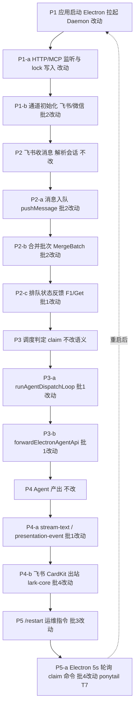
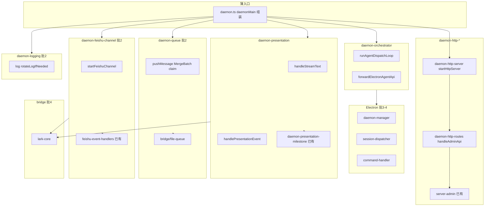

# 巨型单体拆分 - 实现设计

> **业务 PRD**：见同目录 `01-proposal.md`（验收标准以 01 为准）

## 一、业务流程与改动范围

### （一）业务流程图

**图例**：`不改` 用户可见语义与拆分前一致；`改动` 仅源码落点/模块边界变化；`新增` 本变更新建模块文件；`批N` 对应 §六 分批交付序号；`ponytail` 记入 backlog、本轮不实现。

### （二）流程步骤与改动对照

| 步骤 ID | 业务含义 | 改动类型 | 落点（模块/符号/文件） | 01 验收关联 |
|---------|----------|----------|------------------------|-------------|
| P1 | 应用冷启动 → Daemon 就绪 | 改动 | `daemon.ts` → `daemonMain` 瘦身为组装；`daemon-http-server.ts` `startHttpServer`；`daemon-logging.ts` `log`（批2） | 验收 1 |
| P1-a | HTTP/MCP 监听、lock、健康检查 | 改动 | `daemon-http-server.ts`；`handleAdminApi` → `daemon-http-routes.ts` | 验收 1 |
| P1-b | 飞书/微信通道启动与绑定 | 改动 | `daemon-feishu-channel.ts` `startFeishuChannel`/`initWeChatChannel`；已有 `feishu-event-handlers.ts`（批2） | 验收 1、2 |
| P2 | IM 事件接收与解析 | 不改 | `feishu-event-handlers.ts` `onFeishuMenuV6`/`onFeishuP2pEntered`；`lark-core.ts`（批4） | 验收 2 |
| P2-a | 消息写入文件队列 | 改动 | `daemon-queue.ts` `pushMessage`/`initQueue`/`ackOnReply`（批2） | 验收 2 |
| P2-b | 合并批次 collecting→ready→dispatch | 改动 | `daemon-queue.ts` `MergeBatch`/`performClaimAndMerge`/`onMessageEnqueued`（批2） | 验收 2 |
| P2-c | 入队确认 F1、Get 表情、排队文案 | 改动 | `daemon-presentation.ts` `confirmEnqueueAndStartProgress`/`buildEnqueueStatusText`（批1） | 验收 2 |
| P3 | 调度门控与 claim | 不改语义 | `daemon-orchestrator.ts` `claimForOrchestratorDispatch`/`shouldDeferDispatch`（批1） | 验收 3 |
| P3-a | Agent dispatch 循环 | 改动 | `daemon-orchestrator.ts` `runAgentDispatchLoop`/`scheduleAgentDispatch`（批1） | 验收 3 |
| P3-b | Electron Agent API 转发 | 改动 | `daemon-orchestrator.ts` `forwardElectronAgentApi`/`dispatchSessionToAgent`（批1） | 验收 3 |
| P3-c | busy 延后重排 | 改动 | `daemon-orchestrator.ts` `parseBusyRetryDelayMs`/`scheduleBusyRetry`（批1） | 验收 3 |
| P4 | Agent Run 执行 | 不改 | `electron/agent/*`、`session-dispatcher.ts` `launchSessionAgent`（批4仅拆文件） | 验收 3 |
| P4-a | 流式/终态展示出站 | 改动 | `daemon-presentation.ts` `handleStreamText`/`handlePresentationEvent` 族（批1）；`daemon-presentation-milestone.ts`（已有） | 验收 3 |
| P4-b | CardKit 渲染与发送 | 改动 | `lark-core.ts` `renderToolProgressCard` 等（批4） | 验收 3 |
| P5 | `/restart` 等斜杠指令 | 改动 | `daemon-manager.ts` `checkAndExecutePendingCommands`（批3）；`command-handler.ts`（批4） | 验收 4 |
| P5-a | T7 调度 SSOT 统一 | ponytail | `dispatchSessionAgents()` 空实现；Electron 5s 轮询——**本轮不迁移** | 非目标 |
| — | 单文件 ≤300 行 | 新增 | 各批新建 `daemon-*.ts` 子模块 | 验收 5 |
| — | 日志双写统一 | ponytail | Daemon 文件日志 + Electron stderr 回显——**本轮不治理** | 非目标 |

### （三）改动汇总

| 层级 | 批1（本轮 apply） | 批2 | 批3 | 批4 | backlog |
|------|-------------------|-----|-----|-----|---------|
| `src/daemon/` | HTTP 路由、orchestrator、presentation 大块抽出 | queue、channel、logging + `daemon.ts` 瘦身至薄入口 | — | — | T7、日志双写 |
| `electron/daemon/` | — | — | `daemon-manager.ts` 拆分 | — | — |
| `src/bridge/` | — | — | — | `lark-core.ts` 拆分 | — |
| `electron/session/` + `electron/scheduling/` | — | — | — | `session-dispatcher.ts`、`command-handler.ts` | `dispatchSessionAgents` 空实现 |

**对外契约不变**：HTTP 路径（含 `/api/*`、`/mcp`、`/health`）、MCP 工具名、文件队列目录与 claim 语义、飞书卡片/流式展示行为均保持现状。

## 二、整体思路

**根因**：`src/daemon/daemon.ts` 约 3591 行，混合 IM 通道、文件队列、合并批次、Agent 编排、HTTP 管理面、Presentation 出站等职责，违反单文件 ≤300 行规范，排障与并行协作成本高。Electron 侧 `daemon-manager.ts`（≈1598 行）、`lark-core.ts`（≈1147 行）、`session-dispatcher.ts`（≈679 行）、`command-handler.ts`（≈700 行）同类问题。

**方案要点**：

1. **按领域垂直切**（`src/daemon/` 下模块名固定）：`daemon-queue`、`daemon-orchestrator`、`daemon-http-routes`、`daemon-presentation`、`daemon-feishu-channel`、`daemon-logging`；`daemon.ts` 保留为**薄入口/组装**（bootstrap、依赖注入、启动顺序）。
2. **每模块 ≤300 行**；跨模块通过显式 `interface` + 构造函数/工厂注入依赖，**禁止循环依赖**（参考已有 `feishu-event-handlers.ts` 的 `FeishuEventHandlerDeps` 模式）。
3. **行为等价**：纯搬移与边界整理，不改 HTTP 契约、队列路径、飞书展示语义。
4. **纳入已有抽取文件**：`feishu-event-handlers.ts`、`server-admin.ts`、`daemon-scheduled-tasks.ts`、`chat-name-resolve.ts`、`daemon-presentation-milestone.ts` 作为边界锚点，新模块与之对接而非重复实现。
5. **四批交付**：优先 Daemon 主路径（批1～2），再 Electron 生命周期（批3），再桥接/调度巨型文件（批4）。

**与 01 追溯**：满足 F1 行数合规、F2 职责边界、F3 行为等价、F4 关联债登记；验收 1～5 在对应批次完成后逐批回归。

## 三、分层设计

**依赖方向（单向）**：`daemon.ts` → 各 `daemon-*` → `bridge/*` / `shared/*`；`daemon-*` 之间通过 `DaemonContext`（或分域 `OrchestratorDeps`/`PresentationDeps`）注入，**不得** `daemon-queue` ↔ `daemon-presentation` 互引。

## 四、接口设计

无对外 HTTP/MCP **契约变更**。批1 新增**内部**模块契约（供 `daemon.ts` 组装与子模块互调）：

| 模块 | 导出符号（示意） | 关键入参/出参 | 说明 |
|------|------------------|---------------|------|
| `daemon-http-routes` | `createAdminApiHandler(deps): (pathname, method, req, res) => Promise<boolean>` | `deps.channels`、`deps.log`、`deps.resolveChannel` 等 | 承接原 `handleAdminApi` 全部 `/api/*` |
| `daemon-http-server` | `startHttpServer(deps): Promise<number>` | 返回监听端口 | 含 `/mcp`、`/health`、`/queue` 等非 `/api` 路由委托 |
| `daemon-orchestrator` | `createOrchestrator(deps)` → `{ scheduleAgentDispatch, runAgentDispatchLoop, claimForOrchestratorDispatch }` | `deps.forwardElectronAgentApi`、`deps.mergeBatchBySession` | busy retry 内置 |
| `daemon-presentation` | `createPresentationLayer(deps)` → `{ handleStreamText, handlePresentationEvent, confirmEnqueueAndStartProgress }` | `deps.sessionProgressMap`、`deps.larkSender` 解析回调 | 复用 `daemon-presentation-milestone.sendMilestoneText` |
| `daemon-queue`（批2） | `createQueueController(deps)` → `{ pushMessage, onMessageEnqueued, performClaimAndMerge, ackOnReply }` | `deps.broadcastQueueEvent` | 文件队列仍用 `bridge/file-queue` |
| `daemon-feishu-channel`（批2） | `createChannelRegistry(deps)` → `{ channels, startFeishuChannel, resolveChannel }` | `FeishuEventHandlerDeps` 注入 `feishu-event-handlers` | |
| `daemon-logging`（批2） | `createDaemonLogger()` → `{ log, ensureLogDir }` | 环境变量 `DAEMON_LOG_PATH` 不变 | rotate 行为不变 |

错误码与 HTTP 状态码保持现有 `json(res, { ok: false, error })` 语义，不新增错误码枚举。

## 五、数据结构

无新增持久化表/Proto。**内存态**随模块搬迁，字段不变：

| 结构 | 现符号 | 目标模块 | 备注 |
|------|--------|----------|------|
| `ChannelRuntime` | `daemon.ts` L136 | `daemon-feishu-channel`（批2） | 含 `cfg`/`sender`/`wechat` |
| `SessionProgressState` | `daemon.ts` L310 | `daemon-presentation`（批1） | CardKit 流式状态 |
| `MergeBatch` | `daemon.ts` L792 | `daemon-queue`（批2） | phase 状态机 |
| `mergeBatchBySession` | Map | `daemon-queue`（批2） | orchestrator 经 deps 只读 |
| `sessionAgentPhaseMap` | Map | `daemon-orchestrator`（批1） | 与 presentation 分离 |
| `sessionProgressMap` | Map | `daemon-presentation`（批1） | |
| `activeSessionMap` 等路由 Map | 多处 | `daemon-queue` 或 `daemon-feishu-channel`（批2） | 按读写归属拆分 |

文件队列磁盘格式（`.qmsg`/`.claimed`）与 `QueueMessage` 类型**不变**。

## 六、实现步骤

有序步骤可回溯「一·（二）」步骤 ID；**批号**标明交付批次。

1. **【批1】定义 `DaemonBootstrapContext`**：在 `daemon.ts` 集中声明各子模块 deps 接口，不改变运行时行为（对应 P1）。
2. **【批1】抽出 `daemon-orchestrator.ts`**：搬迁 `scheduleAgentDispatch`、`runAgentDispatchLoop`、`dispatchSessionToAgent`、`claimForOrchestratorDispatch`、`forwardElectronAgentApi`、`parseBusyRetryDelayMs`、`scheduleBusyRetry`（P3、P3-a～c）。
3. **【批1】抽出 `daemon-presentation*.ts`**（可按职责拆 2 文件）：搬迁 `SessionProgressState` 相关、`handleStreamText`、`handlePresentationEvent` 族、`confirmEnqueueAndStartProgress`、`stopSessionProgress`；**保留** `daemon-presentation-milestone.ts` 独立（P2-c、P4-a）。
4. **【批1】抽出 `daemon-http-routes.ts` + `daemon-http-server.ts`**：搬迁 `handleAdminApi` 及 `startHttpServer` 路由表；`server-admin.ts` 继续仅 MCP admin 工具注册（P1-a）。
5. **【批1】回归**：冷启动、飞书入队+合并预览、Agent dispatch、stream-text、`/restart` 冒烟；确认 `daemon.ts` 仍 ≤300 行未达标可接受，但批1 目标模块均 ≤300（验收 1～4 子集）。
6. **【批2】抽出 `daemon-queue.ts`**：搬迁 `initQueue`、`pushMessage`、`MergeBatch` 全族、`ackOnReply`、`broadcastQueueEvent`、SSE `sseClients`（P2-a、P2-b）。
7. **【批2】抽出 `daemon-feishu-channel.ts`**：搬迁 `ChannelRuntime`、`startFeishuChannel`、`resolveChannel`、`initWeChatChannel`；与 `feishu-event-handlers.ts` 用 deps 接线（P1-b、P2）。
8. **【批2】抽出 `daemon-logging.ts`**：搬迁 `log`、`rotateLogIfNeeded`、`ensureLogDir`（P1）。
9. **【批2】`daemon.ts` 瘦身**：仅留 `daemonMain`、信号处理、子模块 `create*` 调用与启动顺序；目标 **≤200 行**（验收 5 对 daemon 域批2 完成）。
10. **【批3】拆分 `electron/daemon/daemon-manager.ts`**：按「生命周期 / 状态轮询 / 通道绑定 / 配置同步 / 指令轮询」垂直切分，每文件 ≤300（P1、P5）。
11. **【批4】拆分 `src/bridge/lark-core.ts`**：按「客户端工厂 / CardKit 渲染 / 流式发送 / 工具函数」切分（P4-b）。
12. **【批4】拆分 `session-dispatcher.ts`、`command-handler.ts`**：launch/dispatch 与斜杠指令分文件；**不实现** `dispatchSessionAgents` 本体（ponytail，P5-a）。
13. **全批完成后**：更新 `src/daemon/AGENTS.md` 模块表（归档阶段由 kb-librarian 同步知识库）。

## 七、参考实现

> CodeGraph 索引未初始化（`codegraph init` 缺失），以下由源码符号检索（`daemon.ts` 等）整理，归档前建议补跑 CodeGraph 校验。

| 符号 | 路径 | 职责簇 | 目标模块 |
|------|------|--------|----------|
| `daemonMain` | `src/daemon/daemon.ts` L3495 | 启动组装 | `daemon.ts` 保留 |
| `startHttpServer` | `src/daemon/daemon.ts` L2592 | HTTP 监听 | `daemon-http-server` |
| `handleAdminApi` | `src/daemon/daemon.ts` L3109 | `/api/*` 路由 | `daemon-http-routes` |
| `runAgentDispatchLoop` | `src/daemon/daemon.ts` L1294 | Agent 调度循环 | `daemon-orchestrator` |
| `dispatchSessionToAgent` | `src/daemon/daemon.ts` L1235 | launch 转发 | `daemon-orchestrator` |
| `forwardElectronAgentApi` | `src/daemon/daemon.ts` L1141 | Electron API | `daemon-orchestrator` |
| `performClaimAndMerge` | `src/daemon/daemon.ts` L1061 | 合并 claim | `daemon-queue`（批2） |
| `pushMessage` | `src/daemon/daemon.ts` L2115 | 入队 | `daemon-queue`（批2） |
| `handleStreamText` | `src/daemon/daemon.ts` L642 | 流式出站 | `daemon-presentation` |
| `handlePresentationEvent` | `src/daemon/daemon.ts` L1737 | 过程展示 | `daemon-presentation` |
| `startFeishuChannel` | `src/daemon/daemon.ts` L2236 | 飞书通道 | `daemon-feishu-channel`（批2） |
| `onFeishuMenuV6` | `src/daemon/feishu-event-handlers.ts` | 飞书事件 | 已有，channel 注入 |
| `registerAdminTools` | `src/daemon/server-admin.ts` | MCP 管理 | 已有 |
| `startDaemonScheduledTasks` | `src/daemon/daemon-scheduled-tasks.ts` | 定时任务 | 已有 |
| `resolveLaunchChatName` | `src/daemon/chat-name-resolve.ts` | 名称解析 | 已有 |
| `sendMilestoneText` | `src/daemon/daemon-presentation-milestone.ts` | 里程碑降级 | 已有 |
| `startDaemon` | `electron/daemon/daemon-manager.ts` L526 | Electron 拉起 | 批3 |
| `checkAndExecutePendingCommands` | `electron/daemon/daemon-manager.ts` L874 | 指令轮询 | 批3 |
| `dispatchSessionAgents` | `electron/session/session-dispatcher.ts` L480 | **空实现** | ponytail，批4 仅拆文件 |
| `createLarkClient` | `src/bridge/lark-core.ts` L114 | 飞书客户端 | 批4 |

**当前 `src/daemon/` 行数（wc -l）**：`daemon.ts` 3591；已抽取文件均 <300（`feishu-event-handlers` 106、`daemon-presentation-milestone` 128、`chat-name-resolve` 130、`daemon-scheduled-tasks` 253、`server-admin` 255）。

## 八、技术影响

### （一）影响范围

- **涉及模块**：`src/daemon/*`（批1～2）、`electron/daemon/daemon-manager.ts`（批3）、`src/bridge/lark-core.ts`、`electron/session/session-dispatcher.ts`、`electron/scheduling/command-handler.ts`（批4）。
- **proto/数据**：无；文件队列与 lock 文件 JSON 格式不变。
- **风险**：
  1. **隐性耦合**：`daemon.ts` 内 Map 跨 orchestrator/presentation/queue 共享，拆分时 deps 遗漏易导致运行时 `undefined`。
  2. **循环依赖**：presentation 回调 queue 的 `ackOnReply`、orchestrator 读 merge 状态，须通过 `DaemonContext` 单向注入。
  3. **批间回归**：批1 后 `daemon.ts` 仍含 queue/channel，须每批结束跑通 01 验收 1～4 子集。

### （二）工程补充验收项

对齐 01 五条验收标准，补充可执行检查：

- [ ] **验收1** 冷启动：`daemonMain` 完成后 `/health` 与 `/api/status` 返回 `ok`，lock 文件含 `port`
- [ ] **验收2** 飞书入队：私聊/群聊消息后 `getFileQueueLength` 增加；合并预览卡与 F1 行为与拆分前一致
- [ ] **验收3** dispatch：入队后 `runAgentDispatchLoop` 触发 `forwardElectronAgentApi("/api/agent/launch")`；飞书收到流式或终态回复
- [ ] **验收4** `/restart`：授权用户执行后 Daemon 重启，验收 1～3 仍成立
- [ ] **验收5** 各批纳入文件 `wc -l` ≤300
- [ ] 无新增用户可见配置项；`GET /api/poll-message` 仍 404
- [ ] **ponytail 未假装交付**：`dispatchSessionAgents` 仍为空；T7 统一调度未迁移；日志双写未改动

## 九、知识库影响

- `knowledge/业务域/Agent调度/` — Daemon 编排、dispatch 链路源码锚点将自 `daemon.ts` 扩散为多文件。
- `knowledge/业务域/消息桥接/` — 入队、合并批次、Presentation 落点变更。
- `src/daemon/AGENTS.md` — 模块表与「不拆 daemon.ts」历史约定需改写（当前与本次变更冲突）。

## 十、知识库更新计划

### （一）必须更新

- `knowledge/业务域/Agent调度/00-README.md` — 源码锚点表：`daemon.ts` → `daemon-orchestrator` 等子模块清单
- `knowledge/业务域/消息桥接/00-README.md` — Daemon 路由/队列锚点更新
- `src/daemon/AGENTS.md` — 删除「不拆 daemon.ts」条款，改为模块边界 SSOT

### （二）可能更新（视实现结果）

- `knowledge/业务域/Agent调度/06-CursorSDK执行引擎.md` — 若 dispatch 路径描述绑定具体文件名
- `knowledge/业务域/消息桥接/02-飞书通道.md`、`04-消息队列与路由.md` — 若写明 MergeBatch/Presentation 新落点
- `knowledge/业务域/消息桥接/` 下 Presentation 相关子模块 — 若 stream-text 落点变更

### （三）不需要更新

- 用户可见产品功能描述、Figma、Proto 协议
- T7 / 日志双写 / `dispatchSessionAgents` 空实现 — 行为未变，仅 ponytail 记录于本 design §二
