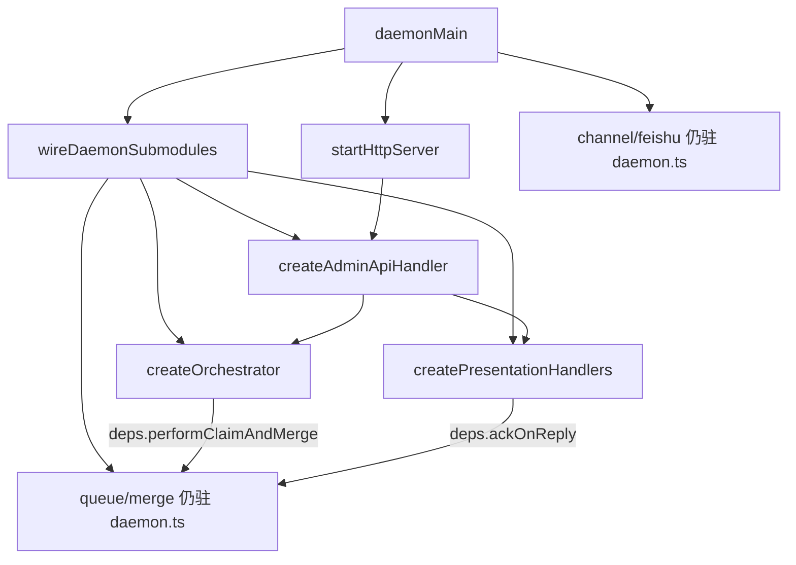

# 巨型单体拆分 - 代码评审报告

## 1、审查范围

- **变更类型**: apply 产出的未提交变更（批1：T1～T7，`stage=applied`）
- **评审等级**: full-review（Daemon 核心主路径机械拆分，跨 orchestrator / presentation / HTTP 多模块，行为回归风险高）
- **涉及文件**: 12 个源码文件（`daemon.ts` 修改 + 10 个新建 `daemon-*.ts` + `src/daemon/AGENTS.md`）；另检出并行变更渗透 `daemon-session-routing.ts`（不在本 manifest）
- **设计文档**: `02-design.md`（批1 模块边界与 deps 注入）、`03-tasks.md`（T1～T7 验收项）
- **对照基准**: `01-proposal.md` 验收 1～5（批1 子集：验收 5 仅约束新建模块 ≤300，`daemon.ts` >300 可接受）
- **静态校验**: `npm run build` 通过（`tsc` + `electron-vite build`）；CodeGraph 未初始化，调用链以 `git diff` + 源码 import 图为准

## 2、严重（必须处理）

1. **批1 新建模块 5 个文件超过 AGENTS.md 300 行硬上限**
   - 位置:
     - `src/daemon/daemon-http-server.ts`（443 行）
     - `src/daemon/daemon-http-routes.ts`（416 行）
     - `src/daemon/daemon-presentation-handlers.ts`（338 行）
     - `src/daemon/daemon-http-admin-crud.ts`（337 行）
     - `src/daemon/daemon-presentation-ordering.ts`（308 行）
   - AGENTS.md: 「代码文件不得超过300行」「单文件行数：≤300 行；超限须拆分」
   - 说明: T2/T4/T5/T6/T7 均将对应新建文件 `wc -l ≤300` 列为验收条件；当前仅 `daemon-orchestrator.ts`（273）、`daemon-presentation-stream.ts`（206）、`daemon-presentation-process-events.ts`（277）、`daemon-presentation-assistant-events.ts`（113）、`daemon-presentation-types.ts`（90）达标。`daemon.ts` 由约 3591 行降至 1688 行符合批1 预期，但**不能**抵消子模块超限。须继续按职责垂直切分（优先 `daemon-http-server`、`daemon-http-routes`），或单独立项跟进并获明确债务接受——评审阶段不得自行放行。

## 3、警告（建议处理）

1. **5 个批1 模块使用 `@ts-nocheck`，类型安全债务**
   - 位置: `daemon-http-routes.ts`（含重复注释行）、`daemon-http-admin-crud.ts`、`daemon-http-server.ts`、`daemon-presentation-handlers.ts`
   - 说明: T1 要求 deps 接口「无 `any` 逃逸」；`@ts-nocheck` 整文件关闭检查，与批2「再收紧类型」计划一致但当前无法在编译期捕获 deps 遗漏（初版 `wireDaemonSubmodules` 曾缺 `fallbackSessionMap`，已由并行变更补齐）。建议在批2 前移除 nocheck 并补齐 `ChannelRuntime` 等共享类型。

2. **`src/AGENTS.md` 根索引未同步批1 模块边界**
   - 位置: `src/AGENTS.md:9`
   - 说明: 仍写「不拆 `daemon.ts` 业务逻辑」，与已更新的 `src/daemon/AGENTS.md`（薄组装 + 子模块表）矛盾，易误导后续协作者。

3. **并行变更文件渗透批1 diff，manifest 未登记**
   - 位置: `src/daemon/daemon-session-routing.ts`；`daemon.ts:63` import；`daemon-http-routes.ts` `fallbackSessionMap` deps
   - 说明: 属变更 `20260711205108-Orchestrator会话路由SSOT收尾` 范围，非 T1～T7 交付物；功能上合理（回退栈 SSOT），但批1 评审边界被污染，归档时应拆分 commit 或在本 manifest `files` 中标注来源。

4. **Ponytail 精简轴（#6）**
   - `shrink:` `daemon-http-routes.ts` + `daemon-http-admin-crud.ts` — admin CRUD 已拆仍双文件超限，须再切路由簇（如 status/send、orchestrator API、SSE）而非新增抽象层 → 替代：按 pathname 前缀拆 2～3 个 ≤300 文件
   - `shrink:` `daemon-presentation-handlers.ts` — 已拆 stream/process/assistant/types 四文件，handlers 仍 338 行，可将入队确认/合并预览回复再下沉独立文件 → 替代：`*-enqueue.ts` 或 `*-merge-preview.ts`
   - `yagni:` `daemon-presentation-types.ts` — 仅为断环的 types 文件（90 行），可接受；勿再叠 `presentation-context.ts` 等工厂
   - `net: -~200 lines possible`（继续切分 HTTP 与 handlers 壳层即可，无需新依赖）

5. **批1 行为验收 1～4 无运行证据**
   - 说明: T7 要求冷启动、`/health`、`/api/status`、飞书入队、dispatch、stream-text、`/restart` 冒烟；评审仅静态确认 `wireDaemonSubmodules` 接线完整、`GET /api/poll-message` 仍 404、`presentation_order_violation` 日志保留。须 `/kb-test` 补跑后再 archive。

## 4、设计偏差

1. **T4 单文件 handlers ≤300 → 实际 5 文件簇，主文件仍超限**
   - 设计预期: `daemon-presentation-handlers.ts` 单文件 ≤300（`03-tasks.md` T4）
   - 实际实现: 拆为 `handlers` + `stream` + `process-events` + `assistant-events` + `types`；方向正确但 `handlers` 仍 338 行
   - 影响: 不阻断行为，阻断验收 5 / T4 行数项

2. **T5 routes ≤300 → 拆为 routes + admin-crud，双文件均超限**
   - 设计预期: `daemon-http-routes.ts` ≤300
   - 实际实现: CRUD 下沉 `daemon-http-admin-crud.ts`，但 routes 416 行、crud 337 行
   - 影响: 模块边界更清晰，但未满足行数验收

3. **T6 `daemon-http-server.ts` 443 行，未再切 MCP / 非 API 路由**
   - 设计预期: ≤300
   - 实际实现: MCP 工厂与 `/enqueue`、`/queue` 等仍同文件
   - 影响: 批2 须优先跟进或本批追加 T-FIX

4. **presentation 子文件簇内部互引**
   - 设计预期: `02-design` §三「daemon-* 之间禁止循环依赖」
   - 实际实现: `handlers` → `stream/process/assistant/types`，`types` → `ordering` + `orchestrator`（type-only）；runtime 无 orchestrator ↔ presentation 环
   - 影响: 与 `src/daemon/AGENTS.md` 批1 表一致，属可接受领域内拆分，非跨域环引

## 5、验收标准检查

| 任务 | 验收条件 | 状态 |
|------|---------|------|
| T1 | 仅增 deps 接口，构建通过 | ✅ |
| T1 | 接口覆盖 T2～T6 跨模块调用 | ✅ |
| T1 | 无未批准中间抽象 / 无 any 逃逸 deps | ⚠️ `@ts-nocheck` 削弱 |
| T2 | `daemon-presentation-ordering.ts` ≤300 | ❌ 308 行 |
| T2 | ordering 门控 / defer 语义未改 | ⏳ 待 `/kb-test` |
| T3 | `daemon-orchestrator.ts` ≤300 | ✅ 273 行 |
| T3 | dispatch → `forwardElectronAgentApi` 链路 | ✅ 静态接线完整 |
| T3 | `sessionAgentPhaseMap` 与 presentation 分离 | ✅ |
| T4 | `daemon-presentation-handlers.ts` ≤300 | ❌ 338 行（且拆为多文件） |
| T4 | F1/Get/排队、stream-text、presentation-event | ⏳ 待 `/kb-test` |
| T4 | 无 queue ↔ presentation 模块互引 | ✅ 仅 deps |
| T5 | `daemon-http-routes.ts` ≤300 | ❌ 416 行 |
| T5 | `/api/status`、stream-text、claim-and-merge 可达 | ✅ 路由体在 |
| T5 | `GET /api/poll-message` → 404 | ✅ |
| T6 | `daemon-http-server.ts` ≤300 | ❌ 443 行 |
| T6 | `/health`、MCP 连接计数 | ⏳ 待 `/kb-test` |
| T7 | 冷启动 lock + `/health` + `/api/status` | ⏳ 待 `/kb-test` |
| T7 | 飞书入队 + 合并预览 + dispatch + `/restart` | ⏳ 待 `/kb-test` |
| T7 | 批1 新建模块各 ≤300 | ❌ 5/10 超标 |
| T7 | `daemon.ts` 显著小于 3591 且批2 前可 >300 | ✅ 1688 行 |
| T7 | `npm run build` 通过 | ✅ |
| T7 | ponytail 未假装交付 | ✅ `dispatchSessionAgents` 已不在 `session-dispatcher.ts` |
| 01-验收5（批1 子集） | 纳入批1 新建文件 ≤300 | ❌ |

## 6、调用链与回归风险

| 风险点 | 等级 | 说明 |
|--------|------|------|
| deps 遗漏导致运行时 `undefined` | 中 | `wireDaemonSubmodules` 字段多，已见 `fallbackSessionMap` 曾缺失；建议去 `@ts-nocheck` |
| `scheduleAgentDispatchRef` 时序 | 低 | queue 侧 ref 在 orchestrator 创建后赋值，与搬移前一致 |
| `stopSessionProgress` 互调 | 低 | `stopProgressRef` 延迟绑定 presentation，避免构造期环 |
| 并行 `daemon-session-routing` | 低 | 仅 Map SSOT，不改变批1 调度语义 |
| 无 E2E 冒烟 | 高 | P2～P4 用户路径须 test 阶段验证 |

## 7、遗留债务

- `@ts-nocheck` ×5：计划批2 收紧，评审记为 **open**（R2）
- `src/AGENTS.md` 根索引过时：归档前或 T-FIX 同步（R3）
- `daemon-session-routing.ts` 归属并行变更，批1 archive 时应拆分提交或交叉引用 manifest（R4）
- 行数超限 5 文件：**open 阻断项**（R1），不可标 `accepted_debt` 除非用户明确接受后 `review_failed` → `archived_with_debt`

## 8、修复任务建议

| 问题 ID | 建议动作 | 关联任务 |
|---------|----------|----------|
| R1 | 继续垂直切分 5 个超限文件；优先 `daemon-http-server`（MCP 与非 `/api` 路由分离）、`daemon-http-routes`（按路由簇拆分） | T-FIX-01 |
| R2 | 移除 `@ts-nocheck`，导出/复用 `ChannelRuntime`、`HttpRoutesDeps` 精确类型 | T-FIX-02 |
| R3 | 更新 `src/AGENTS.md` daemon 行与 `src/daemon/AGENTS.md` 对齐 | T-FIX-03（或 T16 提前） |
| R4 | 将 `daemon-session-routing.ts` 记入并行变更 manifest，批1 commit 不包含或注明 cherry-pick 来源 | 并行变更 `20260711205108` |
| R5 | 批1 子集 `/kb-test`：冷启动、入队、dispatch、stream-text、`/restart` 冒烟清单 | T7 回归 |

## 9、结论

**未通过**，`stage=review_failed`。批1 机械拆分方向正确：`daemon.ts` 大幅瘦身、`wireDaemonSubmodules` deps 注入、runtime 无 orchestrator↔presentation 环引、`npm run build` 通过；但 **5 个新建模块仍超 300 行**，直接违反 AGENTS 硬约束与 T2/T4/T5/T6/T7 验收，**不可进入 `/kb-archive`（批1 子集）**。

**可进入 `/kb-test`（批1 子集）**：建议并行推进 T-FIX-01 行数切分与冒烟测试；测试通过且 R1 修复后复评 `/kb-review`。
