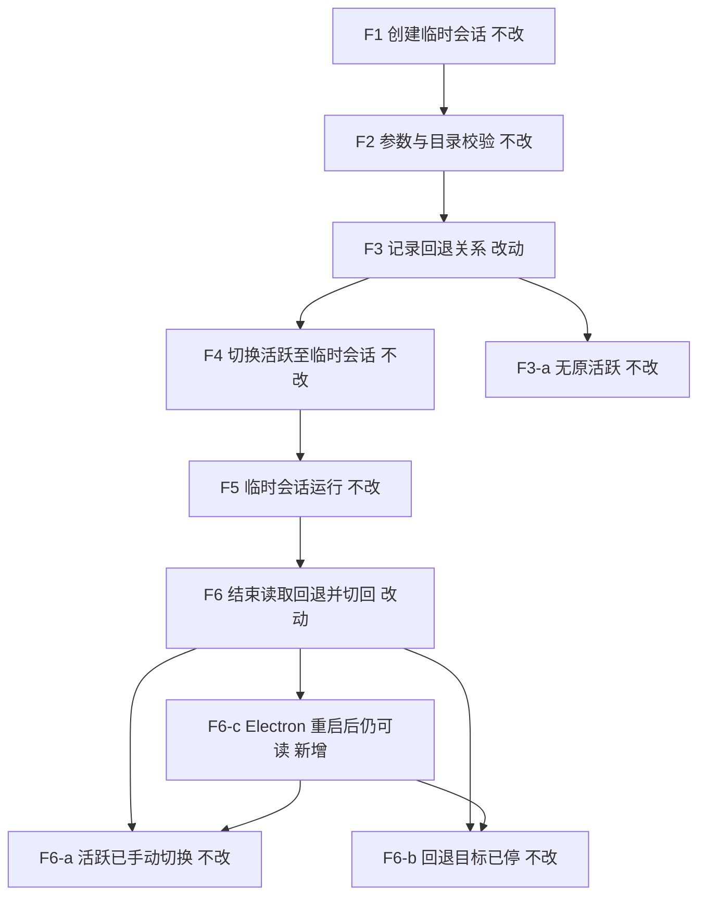
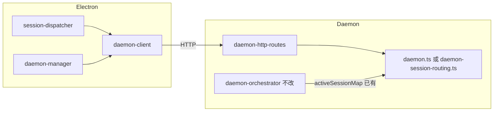

# Orchestrator 会话路由 SSOT 收尾 - 实现设计

> **业务 PRD**：见同目录 `01-proposal.md`（验收标准以 01 为准）

## 一、业务流程与改动范围

> 业务口径以 `01-proposal.md` §四 为准；下图覆盖 F1～F6 主流程与关键分支。

### （一）业务流程图



**图例**：`不改` 用户可见语义与现网一致；`改动` 回退栈读写落点迁至 Daemon API；`新增` 跨 Electron 重启可读回退关系（Daemon 进程内 SSOT）；`删除` 指移除 Electron 本地 Map 与 `dispatchSessionAgents` 空实现。

### （二）流程步骤与改动对照

| 步骤 ID | 业务含义 | 改动 | 落点（模块/文件） | 01 验收关联 |
|---------|----------|------|-------------------|-------------|
| F1 | `/chat new` 或独立触发创建临时会话 | 不改 | `electron/session/session-dispatcher.ts` `handleChatCommand` | R4、验收 1 |
| F2 | 目录校验与 `launchIndependentAgent` | 不改 | `session-dispatcher.ts` `parseChatNewArgs`/`validateWorkspacePath` | 验收 1 |
| F3 | 记录「临时 sessionKey → 原 active sessionKey」 | 改动 | **新增** Daemon `fallbackSessionMap` + `POST /api/session-fallback`；Electron `daemon-client.setSessionFallback`；`session-dispatcher.ts` L599、`daemon-manager.ts` L614 改调 API | R1、R3、验收 2 |
| F3-a | 无原活跃则不写入 | 不改 | 调用方保留 `currentActive && currentActive !== taskId` 门控 | 验收 4 |
| F4 | `syncActiveSession` 切换活跃 | 不改 | `electron/daemon/daemon-client.ts` `syncActiveSession` → 既有 `POST /api/active-session` | R6 |
| F5 | Agent 运行至结束 | 不改 | 四引擎 session 生命周期 | — |
| F6 | 结束读回退、条件切回、清理 | 改动 | `handleSessionClosed` 改调 `getSessionFallback`/`clearSessionFallback`；删除 `previousActiveSessionMap` | R2、验收 1～2 |
| F6-a | 当前 active 非临时会话则跳过切回 | 不改 | `handleSessionClosed` L129-130 门控保留 | 验收 4 |
| F6-b | 回退目标未运行则跳过 | 不改 | `isSessionAgentRunning(previous)` 门控保留 | 验收 4 |
| F6-c | Electron 重启后 Daemon 仍持有 F3 记录 | 新增 | Daemon 内存 Map（可选 T4 持久化 ponytail） | R3、验收 2 |
| — | 清理 dead code | 删除 | 删除 `dispatchSessionAgents` 空实现 L479-480 及无效 import/export | R5、验收 5 |
| — | 知识库同步 | 改动 | `knowledge/业务域/Agent调度/02-多会话模型.md`；`05-定时任务.md` | R5、验收 5 |

### （三）改动汇总

- **改动**：Daemon 新增 `fallbackSessionMap` 与三个 HTTP 路由；Electron `daemon-client` 三个封装；`session-dispatcher`/`daemon-manager` 回退读写改调 Daemon；两份 Agent 调度知识库。
- **新增**：`fallbackSessionMap`（及可选 `session-routing.json` 持久化，见 §二 ponytail）；`/api/session-fallback` GET/POST/DELETE。
- **删除**：`previousActiveSessionMap`；`dispatchSessionAgents()` 空函数及一切引用。
- **不改（显式列出）**：IM Orchestrator `runAgentDispatchLoop` 主路径；`activeSessionMap` 既有 API 语义；`/chat new` 用户指令格式与回复文案；MergeBatch/Presentation 链路。

## 二、整体思路

见 01 §背景、§目标。根因是 **活跃会话 SSOT 已在 Daemon（`activeSessionMap`），回退栈仍留 Electron（`previousActiveSessionMap`）**，Electron 重启导致 F3 记录丢失。

**方案要点**：

1. 在 Daemon 侧新增与 `activeSessionMap` 对称的 **`fallbackSessionMap: Map<sessionKey, fallbackSessionKey>`**（键=临时会话 sessionKey，值=创建前应回退的 sessionKey）。
2. 暴露 HTTP API（落点 `src/daemon/daemon-http-routes.ts`，与 `/api/active-session` 同文件），Electron 经 `daemon-client` 调用，**删除** Electron 内存 Map。
3. `handleSessionClosed` 与 `/chat new`、`__IND_LAUNCH__` 三处写入/读取统一走 Daemon API。
4. 收尾 `dispatchSessionAgents` ponytail（关联变更 `20260711203953-巨型单体拆分` §二 P5-a）。

**最小方案三问**：

1. **能否复用现有模块？** 能。状态放 `daemon.ts` 或新建 `daemon-session-routing.ts`（≤300 行）；路由并入已有 `daemon-http-routes.ts`；Electron 侧复用 `daemon-client` `httpPost`/`httpGet` 模式，与 `syncActiveSession` 一致。
2. **新增抽象是否 PRD 要求？** 否。不新建 SessionRoutingService 类层；Map + 三个 route handler + 三个 client 函数即可。可选 T4 持久化为独立小函数（load/save JSON），非通用框架。
3. **能否合并到已有文件？** 能。路由与 `active-session` 同文件；状态若 `daemon.ts` 行数紧张则拆 `daemon-session-routing.ts` 单职责文件，避免再扩 `daemon.ts` 业务面。

**Ponytail（可选 T4）**：若 T1 实现后 `daemon.ts` + 路由文件仍 ≤300 行且无竞态复杂度，可将 `activeSessionMap` + `fallbackSessionMap` 持久化至 `~/.cursor-claw/session-routing.json`（Daemon 启动 load、变更 debounce 写盘）。**Daemon 重启后路由恢复不在 01 必达验收**；超 scope 则 design 留债，03 标 `deferred`。

## 三、分层设计



- **端点层**：`daemon-http-routes.ts` 新增 `/api/session-fallback`（POST/GET/DELETE）。
- **服务层**：`setSessionFallback` / `getSessionFallback` / `clearSessionFallback` 读写 Map；可选 `persistSessionRouting`。
- **客户端层**：`electron/daemon/daemon-client.ts` 对称封装；失败策略与 `syncActiveSession` 一致（catch 静默或 WARN，不阻断 launch）。

## 四、接口设计

与 `POST /api/active-session` 同风格，JSON body，localhost Daemon HTTP。

| 方法 | 路径 | 请求 | 成功响应 | 错误 |
|------|------|------|----------|------|
| POST | `/api/session-fallback` | `{ "sessionKey": string, "fallbackSessionKey": string }` | `{ "ok": true }` | 400 缺字段 |
| GET | `/api/session-fallback?sessionKey=` | query `sessionKey` | `{ "fallbackSessionKey": string \| null }` | 400 缺 sessionKey |
| DELETE | `/api/session-fallback?sessionKey=` | query `sessionKey` | `{ "ok": true }` | 400 缺 sessionKey |

**Electron client（新增 export）**：

```typescript
export async function setSessionFallback(port: number, sessionKey: string, fallbackSessionKey: string): Promise<void>
export async function getSessionFallback(port: number, sessionKey: string): Promise<string | undefined>
export async function clearSessionFallback(port: number, sessionKey: string): Promise<void>
```

- GET 无记录时返回 `fallbackSessionKey: null`（client 转为 `undefined`）。
- DELETE 幂等：无记录仍 `{ ok: true }`。

## 五、数据结构

**进程内（Daemon）**：

```typescript
// 与 activeSessionMap 并列
const fallbackSessionMap = new Map<string, string>() // sessionKey -> fallbackSessionKey
```

**可选持久化文件**（T4 ponytail）：`~/.cursor-claw/session-routing.json`

```json
{
  "activeSessions": { "chatId": "sessionKey" },
  "fallbackSessions": { "tempSessionKey": "previousSessionKey" }
}
```

**删除（Electron）**：

```typescript
// electron/session/session-dispatcher.ts — 删除
export const previousActiveSessionMap = new Map<string, string>()
```

## 六、实现步骤

1. **步骤 1（F3/F6-c）**：Daemon 定义 `fallbackSessionMap`，实现读写 helper；`daemon-http-routes.ts` 注册三个路由；`daemon.ts` 注入 deps（与 `activeSessionMap` 同模式）。
2. **步骤 2（F3/F6）**：`daemon-client.ts` 新增三个函数；`session-dispatcher` `/chat new` 与 `handleSessionClosed` 改调 API；移除 `previousActiveSessionMap` export。
3. **步骤 3（F3 R4）**：`daemon-manager.ts` `__IND_LAUNCH__` 分支改调 `setSessionFallback`；移除 `previousActiveSessionMap` import。
4. **步骤 4（删除）**：删除 `dispatchSessionAgents` 空实现；全仓确认无 import（当前仅定义处，grep 已验证）。
5. **步骤 5（KB）**：更新 `02-多会话模型.md` 活跃会话栈 SSOT；`05-定时任务.md` 流程图 `dispatchSessionAgents` → Daemon orchestrator。
6. **步骤 6（可选 T4）**：若行数允许，实现 `session-routing.json` load/save；否则跳过并在 manifest 记 deferred。

## 七、参考实现

| 符号 | 路径 | 说明 |
|------|------|------|
| `previousActiveSessionMap` | `electron/session/session-dispatcher.ts:85` | **删除** |
| `handleSessionClosed` | `electron/session/session-dispatcher.ts:113-137` | 回退逻辑改调 Daemon |
| `/chat new` 回退写入 | `electron/session/session-dispatcher.ts:597-600` | 改 `setSessionFallback` |
| `dispatchSessionAgents` | `electron/session/session-dispatcher.ts:479-480` | **删除** |
| `__IND_LAUNCH__` | `electron/daemon/daemon-manager.ts:603-616` | 改调 fallback API |
| `syncActiveSession` | `electron/daemon/daemon-client.ts:57-61` | client 模式参考 |
| `activeSessionMap` | `src/daemon/daemon.ts:309` | 状态并列参考 |
| `POST /api/active-session` | `src/daemon/daemon-http-routes.ts:280-305` | 路由风格参考 |
| `runAgentDispatchLoop` | `src/daemon/daemon-orchestrator.ts` | KB 定时任务图修正目标 |

> CodeGraph：`codegraph_context("previousActiveSessionMap activeSessionMap session-fallback")` — 索引覆盖上述符号；implement 前可 `codegraph_impact` 复核 `handleSessionClosed` 调用方。

## 八、技术影响

### （一）影响范围

- **涉及模块**：Daemon HTTP 路由、Daemon 会话状态、Electron daemon-client、session-dispatcher、daemon-manager；Agent 调度知识库 2 文件。
- **接口变更**：新增 3 个 Daemon HTTP 路由；Electron client 3 函数；**无** breaking 变更对外部集成。
- **数据变更**：Electron 内存 Map 删除；Daemon 新增 Map（可选 JSON 文件）。
- **风险**：
  - Daemon 与 Electron 版本不一致时新 API 404 → client catch 等同现网「无回退」，可接受；建议同版本部署。
  - `daemon-http-routes.ts` / `daemon.ts` 行数 — 必要时拆 `daemon-session-routing.ts` 保 ≤300 行。
  - **禁止** IM 路径引入 Electron `dispatchSessionAgents` 或队列扫描回归。

### （二）工程补充验收项

- [ ] `rg dispatchSessionAgents` 全仓零命中（除变更文档历史引用）
- [ ] `rg previousActiveSessionMap` 全仓零命中
- [ ] `npm run build` 通过
- [ ] 手动：验收 1～4（01 §六）
- [ ] 单文件 ≤300 行（新增/修改文件）
- [ ] ponytail：T4 未做时 manifest tasks 标 `deferred` 且 design 已说明

## 九、知识库影响

- `knowledge/业务域/Agent调度/02-多会话模型.md` — §二「活跃会话栈」仍写 Electron Map，**必须更新**。
- `knowledge/业务域/Agent调度/05-定时任务.md` — §四 流程图仍指向 `dispatchSessionAgents`，**必须更新**。
- `knowledge/变更/进行中/20260711203953-巨型单体拆分/02-design.md` — P5-a ponytail 由本变更收尾，archive 时可交叉引用。
- 两级索引：若 §二变更涉及术语「活跃会话栈 SSOT」，检查 `Agent调度/00-README.md` 是否需一句摘要（**可能更新**）。

## 十、知识库更新计划

### （一）必须更新

- `knowledge/业务域/Agent调度/02-多会话模型.md` — 活跃会话与回退栈 SSOT 均在 Daemon；删除 `previousActiveSessionMap` 表述。
- `knowledge/业务域/Agent调度/05-定时任务.md` — 非独立 enqueue 后调度节点改为 Daemon `runAgentDispatchLoop`（或 orchestrator 等价描述）。

### （二）可能更新（视实现结果）

- `knowledge/业务域/Agent调度/00-README.md` — 若增加「会话路由 API」索引一句。
- `src/daemon/AGENTS.md` — 若新增 `daemon-session-routing.ts` 或持久化文件约定。

### （三）不需要更新

- `knowledge/业务域/消息桥接/*` — 无 IM 路由语义变更。
- `electron/session/AGENTS.md` — 除非 implement 发现需补充「回退走 daemon-client」一句（builder 酌情）。
